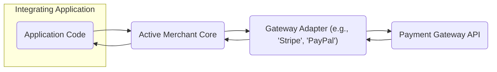
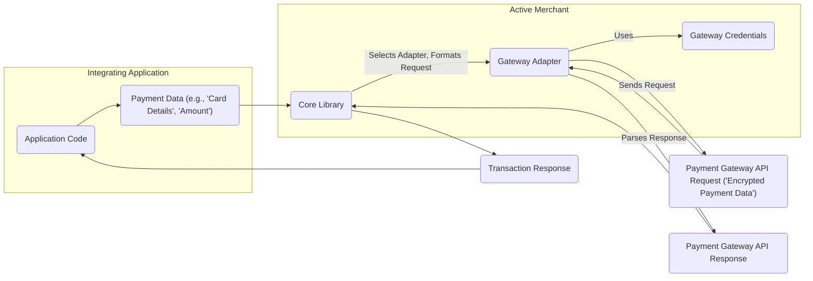

## Project Design Document: Active Merchant (Improved)

**1. Introduction**

This document provides an enhanced design overview of the Active Merchant Ruby gem, focusing on aspects relevant to security and threat modeling. It details the architecture, key components, and data flow within the system to facilitate the identification of potential vulnerabilities.

**2. Project Overview**

Active Merchant is a Ruby library designed to simplify integration with various payment gateway APIs. It offers a unified interface, abstracting the specific implementation details of each gateway. This abstraction allows developers to interact with different payment processors using a consistent set of methods, reducing the complexity of payment integration.

**3. Goals**

*   To offer a consistent and developer-friendly API for interacting with diverse payment gateways.
*   To abstract the complexities and specificities of individual gateway implementations, promoting code reusability and maintainability.
*   To support a broad spectrum of payment gateways and payment methods, catering to various business needs.
*   To facilitate common payment processing operations, including authorizations, captures, purchases, refunds, and voids, through a unified interface.
*   To provide a reliable and well-tested foundation for payment processing integrations.

**4. Non-Goals**

*   Designing or implementing user interface elements for payment forms or checkout processes.
*   Directly storing sensitive payment information within the Active Merchant library itself.
*   Providing a complete, standalone PCI DSS compliance solution (Active Merchant aids in achieving compliance but doesn't guarantee it independently).
*   Managing user authentication or authorization for accessing the Active Merchant library (this is the responsibility of the integrating application).
*   Offering direct fraud detection or prevention services (it integrates with gateways that may provide these features).

**5. High-Level Architecture**

**Description:**

*   **Integrating Application:** Represents the software application that utilizes the Active Merchant library to handle payment processing. This is where the business logic for initiating payment transactions resides.
*   **Active Merchant Core:** The central component of the library, providing the common API and managing the interaction with specific gateway adapters. It acts as a mediator between the application and the various payment gateways.
*   **Gateway Adapter:**  Individual modules responsible for translating Active Merchant's generic API calls into the specific API calls required by each payment gateway. Each adapter is tailored to a particular payment processor (e.g., Stripe, PayPal, Authorize.Net).
*   **Payment Gateway API:** The external API provided by the payment processor for handling payment transactions. This is the actual service that processes the financial transactions.

**Threat Modeling Relevance:** Understanding the high-level architecture helps identify the boundaries of the system and the key interaction points, which are potential areas for threats.

**6. Component Details**

*   **Core Library:**
    *   Provides the foundational `ActiveMerchant::Billing::Base` class, which serves as the parent class for all gateway adapters.
    *   Defines common data structures and methods for representing payment-related information (e.g., credit card details, billing addresses, transaction amounts).
    *   Includes modules for common tasks such as generating request parameters, parsing responses from gateway APIs, and handling errors.
    *   Manages the selection and instantiation of the appropriate gateway adapter based on the configuration provided by the integrating application.
    *   **Threat Modeling Relevance:**  Vulnerabilities in the core library could affect all integrations. Consider threats related to insecure data handling or logic flaws.

*   **Gateway Adapters:**
    *   Each adapter is a distinct module or class inheriting from `ActiveMerchant::Billing::Base`.
    *   Implements methods corresponding to standard payment actions (e.g., `authorize`, `purchase`, `capture`, `refund`) by translating them into the specific API calls of the target payment gateway.
    *   Handles the transformation of Active Merchant's generic data structures into the format expected by the specific gateway API.
    *   Parses responses received from the gateway API and converts them into a consistent format for the core library.
    *   Typically includes configuration settings specific to the gateway, such as API keys, merchant IDs, and API endpoints.
    *   **Threat Modeling Relevance:** Gateway adapters are a critical point of interaction with external systems. Threats include vulnerabilities in the adapter code itself, insecure handling of gateway credentials, and exposure to vulnerabilities in the third-party gateway API.

*   **Common API:**
    *   Offers a consistent set of methods and data structures that developers use regardless of the underlying payment gateway. This promotes ease of use and reduces the learning curve for integrating with different processors.
    *   Abstracts away the differences in API endpoints, request formats, and response structures between various gateways, simplifying the integration process.
    *   Facilitates easier switching between payment gateways if business needs change.
    *   **Threat Modeling Relevance:**  While providing convenience, the common API needs to be designed securely to prevent vulnerabilities that could be exploited across multiple gateway integrations.

*   **Configuration Management:**
    *   Allows developers to configure sensitive gateway credentials (API keys, merchant IDs, secrets) required for authenticating with payment gateway APIs.
    *   Typically involves reading configuration values from environment variables, configuration files, or secure vault solutions.
    *   The library itself does not enforce specific secure storage mechanisms; this is the responsibility of the integrating application.
    *   **Threat Modeling Relevance:**  Insecure storage or handling of configuration data, especially API keys, is a major security risk. Threats include exposure of credentials leading to unauthorized access and financial loss.

*   **Utility Modules:**
    *   Includes helper modules for tasks such as formatting monetary amounts, validating data inputs, and handling common error scenarios.
    *   May provide support for specific payment methods or features that are shared across multiple gateways.
    *   **Threat Modeling Relevance:**  Even utility modules can introduce vulnerabilities if not implemented securely. Consider threats related to data manipulation or unexpected behavior.

**7. Data Flow**

The typical data flow for a payment transaction using Active Merchant involves the following steps:

**Description:**

1. The **Integrating Application** gathers necessary **Payment Data** from the user or its internal systems (e.g., credit card details, transaction amount).
2. The application invokes methods in the **Active Merchant Core**, passing the **Payment Data**.
3. The **Core Library** selects the appropriate **Gateway Adapter** based on the configured payment gateway.
4. The **Core Library** or the **Gateway Adapter** formats the **Payment Data** into a request specific to the chosen gateway's API.
5. The **Gateway Adapter** retrieves the necessary **Gateway Credentials** for authentication.
6. The **Gateway Adapter** sends a **Payment Gateway API Request** (containing potentially sensitive data, ideally encrypted) to the payment processor's API endpoint.
7. The **Payment Gateway API** processes the request and sends back a **Payment Gateway API Response**.
8. The **Gateway Adapter** parses the response from the payment gateway.
9. The **Core Library** receives the parsed response from the adapter.
10. The **Core Library** creates a standardized **Transaction Response** object, indicating the outcome of the transaction.
11. The **Transaction Response** is returned to the **Integrating Application**.

**Threat Modeling Relevance:**  Mapping the data flow helps identify where sensitive data is processed, transmitted, and stored (even temporarily). This highlights potential points of interception, modification, or leakage. Consider threats to data in transit and data at rest (even if Active Merchant doesn't persist it).

**8. Security Considerations**

This section details security considerations relevant to Active Merchant, providing a basis for threat modeling activities.

*   **Sensitive Data Handling:** Active Merchant processes sensitive payment information.
    *   **Threats:** Exposure of credit card numbers, CVV/CVC codes, and other sensitive data during processing or transmission.
    *   **Mitigation:** Ensure the integrating application transmits sensitive data over HTTPS. Minimize the time sensitive data resides in memory. Adhere to PCI DSS guidelines where applicable. Utilize tokenization where possible.
    *   **Threat Modeling Relevance:** Identify points in the data flow where sensitive data is present and assess the controls in place to protect it.

*   **API Key Management:** Gateway credentials are highly sensitive.
    *   **Threats:** Unauthorized access to payment gateway accounts, leading to fraudulent transactions or data breaches.
    *   **Mitigation:** The integrating application must store and manage these credentials securely (e.g., using environment variables, secure vault solutions, or encrypted configuration files). Avoid hardcoding credentials. Implement access controls.
    *   **Threat Modeling Relevance:** Analyze how credentials are stored, accessed, and used. Identify potential vulnerabilities in the credential management process.

*   **Dependency Management:** Active Merchant relies on other Ruby gems.
    *   **Threats:** Introduction of vulnerabilities through compromised or outdated dependencies.
    *   **Mitigation:** Regularly update dependencies to patch security vulnerabilities. Use tools like `bundler-audit` or `snyk` to scan dependencies for known vulnerabilities. Implement Software Composition Analysis (SCA).
    *   **Threat Modeling Relevance:** Consider the attack surface introduced by third-party dependencies and the potential impact of vulnerabilities in those components.

*   **Error Handling and Logging:** Error messages and logs might inadvertently expose sensitive information.
    *   **Threats:** Information leakage through overly verbose error messages or logs, potentially revealing sensitive data or system internals.
    *   **Mitigation:** Implement secure logging practices that avoid logging sensitive data. Ensure error messages returned to the user are generic and do not reveal internal system details.
    *   **Threat Modeling Relevance:** Review logging configurations and error handling logic to identify potential information disclosure vulnerabilities.

*   **Input Validation:** While Active Merchant handles some data formatting, the integrating application is primarily responsible for validating user input.
    *   **Threats:** Injection attacks (e.g., SQL injection, cross-site scripting) if input is not properly validated before being passed to Active Merchant or the gateway.
    *   **Mitigation:** The integrating application must implement robust input validation on all data received from users or external sources.
    *   **Threat Modeling Relevance:** Assess the input validation mechanisms in the integrating application and how they interact with Active Merchant.

*   **Secure Communication:** Communication between the integrating application and Active Merchant, and between Active Merchant and the payment gateways, should be encrypted.
    *   **Threats:** Man-in-the-middle attacks, allowing attackers to intercept and potentially modify sensitive data in transit.
    *   **Mitigation:** Ensure HTTPS is used for all external API communication. Verify SSL/TLS certificate validity.
    *   **Threat Modeling Relevance:** Verify that secure communication protocols are enforced at all relevant interaction points.

*   **Gateway Adapter Security:** The security of individual gateway adapters is critical.
    *   **Threats:** Vulnerabilities in adapter code could be exploited to bypass security controls or compromise transactions.
    *   **Mitigation:** Ensure that gateway adapters are developed and maintained securely, following secure coding practices. Regularly review and update gateway adapters to address any security vulnerabilities in the underlying gateway APIs.
    *   **Threat Modeling Relevance:**  Treat gateway adapters as potential attack surfaces. Analyze their code and dependencies for vulnerabilities.

**9. Future Considerations**

*   **Improved Credential Management:** Explore options for more secure credential management within the library, potentially through integration with secure vault solutions or standardized credential providers (while respecting the non-goal of direct management).
*   **Standardized Error Handling:** Further standardize error handling across different gateway adapters to provide more consistent and informative error messages to the integrating application, while avoiding sensitive information disclosure.
*   **Enhanced Testing and Security Audits:** Implement more rigorous testing procedures, including security-focused tests, and conduct regular security audits (including penetration testing) to proactively identify and address potential vulnerabilities.
*   **Consideration of Security Headers:**  Provide guidance or mechanisms for integrating applications to implement security headers (e.g., Content Security Policy, HTTP Strict Transport Security) to enhance overall security.

This improved design document provides a more detailed and security-focused overview of the Active Merchant project. The enhanced descriptions of components, data flows, and security considerations are intended to facilitate a more comprehensive and effective threat modeling process.