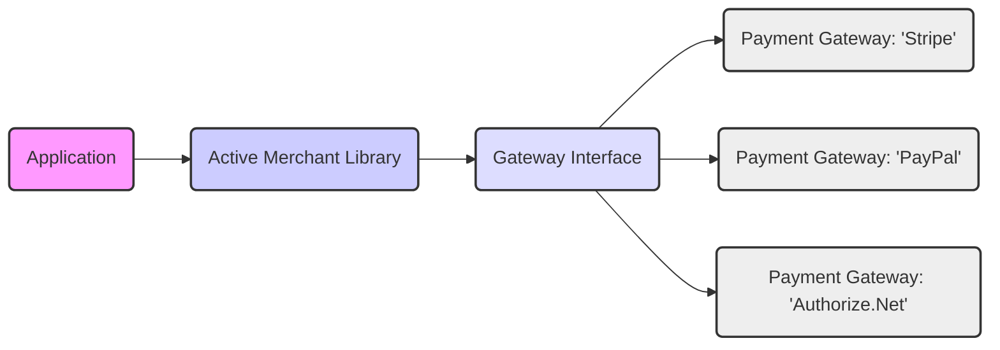
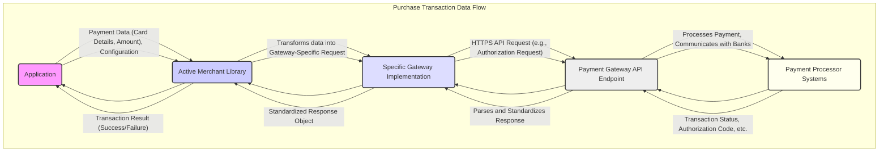

# Project Design Document: Active Merchant

**Version:** 1.1
**Date:** October 26, 2023
**Author:** Gemini (AI Language Model)

## 1. Project Overview

Active Merchant is a well-established Ruby library that provides a clean and consistent interface for integrating with numerous payment gateway APIs. Its primary goal is to abstract away the complexities and inconsistencies of individual payment processor integrations, offering developers a unified way to handle payment processing tasks. This abstraction significantly reduces the effort required to support multiple payment gateways within a Ruby application, promoting code reusability and simplifying maintenance. Active Merchant focuses on facilitating communication with payment gateways and does not directly handle or store sensitive payment information within the library itself.

## 2. Goals and Objectives

*   **Enhanced Abstraction:** To provide an even more robust and intuitive API that shields developers from the nuances of different payment gateway implementations.
*   **Broad Gateway Support:**  To continually expand the number of supported payment gateways, catering to a wider range of business needs and geographic locations.
*   **Simplified Integration:** To make the process of integrating payment processing into Ruby applications as straightforward and developer-friendly as possible.
*   **Improved Maintainability:** To maintain a well-organized, modular, and thoroughly tested codebase that is easy to understand, extend with new gateways, and maintain over time.
*   **Security Best Practices:** To guide and facilitate secure payment processing by offering clear patterns and tools, while emphasizing the responsibility of the integrating application in handling sensitive data securely.

## 3. Target Audience

*   Ruby on Rails developers and other Ruby developers who need to integrate payment processing capabilities into their applications.
*   Software architects and technical leaders who are responsible for designing and overseeing the implementation of payment systems.
*   Security engineers and auditors who need to assess the security posture of applications that utilize payment processing.
*   Maintainers and contributors to the Active Merchant project itself.

## 4. System Architecture

Active Merchant's architecture is centered around the concept of "Gateways." Each gateway acts as an adapter for a specific payment processor. The library defines a common interface that all gateways implement, allowing the application to interact with different payment processors using the same set of methods.

*   **Application:** The Ruby application that utilizes Active Merchant to interact with payment gateways. This application is responsible for collecting sensitive payment information securely (outside of Active Merchant's scope) and passing it to Active Merchant for processing.
*   **Active Merchant Library:** The core Ruby gem that provides the common API and the infrastructure for managing different gateway implementations.
*   **Gateway Interface:** A set of abstract classes and modules that define the standard methods and data structures for interacting with any payment gateway. This ensures a consistent programming model.
*   **Payment Gateway: 'Stripe', 'PayPal', 'Authorize.Net', etc.:** Concrete implementations of the Gateway Interface for specific payment processors. Each gateway handles the unique API interactions, authentication, and data formatting required by its respective payment processor.

## 5. Key Components

*   **Gateway Implementations:**
    *   These are the individual Ruby classes located within the `ActiveMerchant::Billing::Gateways` namespace.
    *   Each class is responsible for translating Active Merchant's generic API calls into the specific API requests required by a particular payment gateway (e.g., creating the correct HTTP requests, handling authentication headers, and parsing responses).
    *   Careful implementation of these gateways is crucial for security and correctness, ensuring that sensitive data is handled appropriately according to the payment gateway's specifications.
*   **Common API:**
    *   This provides a standardized set of methods for performing typical payment operations. Examples include:
        *   `authorize(amount, payment_method, options)`: To authorize a payment for a given amount using a provided payment method.
        *   `purchase(amount, payment_method, options)`: To authorize and capture a payment in a single step.
        *   `capture(authorization, options)`: To capture funds that were previously authorized.
        *   `refund(amount, transaction_id, options)`: To issue a refund for a completed transaction.
        *   `void(authorization, options)`: To cancel a previously authorized transaction before it is captured.
        *   `create_profile(payment_method, options)`: To create a customer payment profile for recurring payments (if supported by the gateway).
        *   `store(payment_method, options)`: To store payment method details for future use (tokenization).
    *   These methods are defined in the `ActiveMerchant::Billing::Gateway` base class and are implemented by each specific gateway.
*   **Data Objects:**
    *   These are Ruby classes that represent common payment-related data structures, promoting consistency and type safety. Examples include:
        *   `CreditCard`: Encapsulates credit card information (number, expiry date, CVV, etc.). Note that applications should handle the secure collection of this data.
        *   `BillingAddress`: Represents the customer's billing address.
        *   `Money`: Represents monetary amounts, including the currency.
        *   `Response`: A standardized object that encapsulates the response received from a payment gateway, including success status, transaction ID, authorization code, and error messages.
*   **Configuration:**
    *   Active Merchant provides mechanisms for configuring gateway-specific credentials and settings. This typically involves setting attributes on the gateway instance, such as API keys, merchant IDs, and passwords.
    *   Securely managing these configuration values is paramount.
*   **Notification Handling:**
    *   The library includes components for handling asynchronous notifications (webhooks or callbacks) sent by payment gateways.
    *   This allows applications to be notified of events like successful payments, failed payments, subscription updates, etc.
    *   Security considerations for notification handling include verifying the authenticity of the notifications.
*   **Testing Infrastructure:**
    *   Active Merchant has a comprehensive suite of unit and integration tests to ensure the reliability and correctness of the library and its gateway implementations.
    *   This includes testing against mock payment gateway responses and, in some cases, against sandbox environments provided by the payment processors.
*   **Utility Functions:**
    *   Helper functions for common tasks such as validating credit card numbers (using Luhn algorithm), checking CVV presence requirements, and formatting data for gateway requests.

## 6. Data Flow

A typical purchase transaction using Active Merchant involves the following sequence of data exchange:

*   **Application Initiates Transaction:** The application securely collects payment details (e.g., credit card number, expiry date, CVV, amount) and any necessary configuration information.
*   **Active Merchant Receives Request:** The application invokes a method on an Active Merchant gateway instance (e.g., `purchase`).
*   **Gateway Implementation Processing:** Active Merchant selects the correct gateway implementation based on the configured gateway. This implementation transforms the generic request into the specific API request format required by the chosen payment gateway.
*   **Secure API Request:** The gateway implementation sends an API request to the payment gateway's API endpoint over HTTPS. This request typically includes sensitive payment data.
*   **Payment Processor Interaction:** The payment gateway's systems process the payment request, which may involve communication with card networks and issuing banks for authorization.
*   **API Response:** The payment gateway sends back an API response indicating the outcome of the transaction (success or failure) and other relevant details.
*   **Response Handling:** The Active Merchant gateway implementation parses the API response and converts it into a standardized `ActiveMerchant::Billing::Response` object.
*   **Result Returned to Application:** The `Response` object is returned to the application, allowing it to determine the transaction status and take appropriate actions.

**Key Security Considerations in Data Flow:**

*   **Sensitive Data in Transit:**  Ensure all communication involving sensitive payment data (like credit card details) occurs over HTTPS to protect against eavesdropping.
*   **Tokenization:**  Utilize tokenization features provided by payment gateways where possible. This involves replacing sensitive card details with non-sensitive tokens, reducing the risk of data breaches. Active Merchant facilitates the use of tokens when supported by the underlying gateway.
*   **PCI DSS Scope:** Understand that while Active Merchant simplifies integration, the application using it is still responsible for meeting relevant PCI DSS requirements for handling sensitive cardholder data.

## 7. Security Considerations

*   **Exposure of Payment Gateway Credentials:**
    *   **Threat:** If API keys, merchant IDs, or other authentication credentials for payment gateways are exposed, attackers could potentially perform unauthorized transactions or access sensitive account information.
    *   **Mitigation:** Store credentials securely using environment variables, secure configuration management tools (like HashiCorp Vault), or encrypted configuration files. Avoid hardcoding credentials in the application code. Implement proper access controls to limit who can access these credentials.
*   **Man-in-the-Middle (MITM) Attacks:**
    *   **Threat:** Attackers could intercept communication between the application and Active Merchant or between Active Merchant and the payment gateway API to steal sensitive data.
    *   **Mitigation:** Enforce HTTPS for all communication channels. Ensure TLS certificates are valid and properly configured.
*   **Insecure Handling of Sensitive Data by Integrating Application:**
    *   **Threat:** Even though Active Merchant aims to minimize direct handling of sensitive data, the integrating application is responsible for its secure collection and transmission. Vulnerabilities in the application's handling of cardholder data could lead to breaches.
    *   **Mitigation:** Follow PCI DSS guidelines for handling cardholder data. Implement strong input validation to prevent injection attacks. Sanitize data before passing it to Active Merchant. Avoid storing sensitive data unnecessarily. Consider using Payment Card Industry Data Security Standard (PCI DSS) compliant hosting and infrastructure.
*   **Vulnerabilities in Gateway Implementations:**
    *   **Threat:** Bugs or security flaws in the specific gateway implementation within Active Merchant could be exploited to bypass security measures or cause unexpected behavior.
    *   **Mitigation:** Ensure that Active Merchant and its gateway implementations are regularly updated to the latest versions to patch known vulnerabilities. Follow secure coding practices when contributing to or extending gateway implementations.
*   **Insecure Handling of Asynchronous Notifications (Webhooks):**
    *   **Threat:** If webhook notifications from payment gateways are not properly verified, attackers could potentially send malicious notifications to manipulate the application's state or trigger unintended actions.
    *   **Mitigation:** Implement robust webhook verification mechanisms provided by the payment gateway (e.g., verifying signatures or shared secrets). Do not rely solely on the source IP address for verification.
*   **Dependency Vulnerabilities:**
    *   **Threat:** Vulnerabilities in Active Merchant's dependencies (e.g., HTTP libraries) could introduce security risks.
    *   **Mitigation:** Regularly audit and update Active Merchant's dependencies. Use tools like `bundler-audit` to identify and address known vulnerabilities.
*   **Insufficient Logging and Auditing:**
    *   **Threat:** Lack of proper logging can hinder incident response and forensic analysis in case of a security breach.
    *   **Mitigation:** Implement comprehensive logging of relevant events, including API requests, responses, and errors. Ensure that sensitive data is not logged. Securely store and monitor logs.
*   **Replay Attacks:**
    *   **Threat:** Attackers could intercept and replay valid payment authorization requests to make unauthorized purchases.
    *   **Mitigation:** Implement mechanisms to prevent replay attacks, such as using unique transaction IDs or timestamps and ensuring that authorizations have a limited validity period.

## 8. Deployment Considerations

*   Active Merchant is typically deployed as a Ruby gem within the application's deployment environment.
*   No specific infrastructure is required solely for Active Merchant, as it is a library integrated into the application.
*   The security and reliability of the payment processing system are heavily influenced by the deployment environment of the application using Active Merchant.
*   Consider the following during deployment:
    *   **Secure Hosting Environment:** Deploy the application in a secure hosting environment that adheres to security best practices.
    *   **Network Security:** Implement appropriate network security measures, such as firewalls and intrusion detection systems.
    *   **Regular Security Audits:** Conduct regular security audits and penetration testing of the application and its infrastructure.
    *   **Monitoring and Alerting:** Implement monitoring and alerting systems to detect suspicious activity.
    *   **Dependency Management:** Use a reliable dependency management tool (like Bundler) and keep dependencies up to date.

## 9. Dependencies

*   Ruby (check the `Gemfile` for supported versions).
*   An HTTP client library (e.g., `net/http`, `faraday`, `httparty`) for making API requests to payment gateways. The specific dependency might vary based on the gateway implementation.
*   Potentially other gems for specific gateway implementations or utility functions (refer to the `Gemfile`).

## 10. Future Considerations

*   **Enhanced Security Abstractions:** Explore opportunities to provide higher-level security abstractions within the library to further assist developers in building secure payment integrations.
*   **Improved Support for Emerging Payment Methods:**  Continuously adapt to and support new and evolving payment methods (e.g., digital wallets, cryptocurrencies).
*   **More Granular Error Handling:** Provide more detailed and specific error information to aid developers in debugging and resolving integration issues.
*   **Standardized Testing for New Gateways:**  Develop a more streamlined and standardized process for testing and validating new gateway implementations.
*   **Community Engagement and Contributions:** Foster a strong and active community to encourage contributions and maintain the library's quality and relevance.