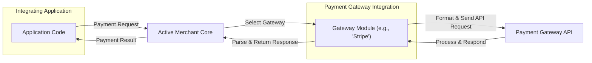
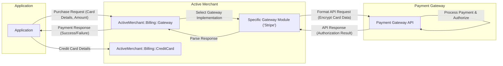

## Project Design Document: Active Merchant (Improved)

**1. Introduction**

This document provides a detailed design overview of the Active Merchant library, specifically tailored for threat modeling purposes. It aims to clearly articulate the architectural components, data flows involving sensitive information, and inherent security considerations. This document serves as a foundational resource for identifying potential vulnerabilities and informing security mitigation strategies.

**2. Project Goals and Scope**

* **Goal:** To offer a consistent and extensible framework for applications to interact with diverse payment gateways and financial service providers, abstracting away gateway-specific complexities.
* **Scope:** This document focuses on the core functionalities of the Active Merchant library relevant to security, including:
    * Abstraction layer for interacting with payment gateway APIs.
    * Implementation of common payment processing actions (authorization, purchase, capture, void, refund, etc.).
    * Support for various payment methods (credit cards, direct debit/ACH, alternative payment methods).
    * Mechanisms for handling synchronous and asynchronous responses from payment gateways.
    * Core data structures for representing payment information (e.g., credit card details, addresses).
    * Extension points for integrating new payment gateways.
* **Out of Scope:** This document explicitly excludes:
    * The internal implementation details of individual payment gateway integrations (beyond their interaction with the core library).
    * The user interface or business logic of applications that utilize Active Merchant.
    * Infrastructure and deployment specifics of applications integrating Active Merchant.
    * Detailed code-level analysis of the Active Merchant library itself.

**3. System Architecture**

Active Merchant employs a plugin-based architecture, enabling integration with a wide array of payment gateways. The core library defines a common interface, while individual gateway implementations handle the specifics of each gateway's API.

* **Key Components:**
    * **`ActiveMerchant::Billing::Gateway` (Abstract Class):** The foundational abstract class for all gateway implementations. It defines the standard methods for payment actions (e.g., `authorize`, `purchase`, `capture`).
    * **Gateway Modules (Concrete Implementations):**  Individual modules residing under `ActiveMerchant::Billing` (e.g., `ActiveMerchant::Billing::Stripe`, `ActiveMerchant::Billing::AuthorizeNet`). Each module implements the `Gateway` interface for a specific payment gateway, handling API request formatting, response parsing, and error mapping.
    * **Payment Method Modules:** Modules representing specific payment methods (e.g., `ActiveMerchant::Billing::CreditCard`, `ActiveMerchant::Billing::Check`). These encapsulate the data associated with each payment method.
    * **`ActiveMerchant::Billing::Response`:** A standardized object representing the response received from a payment gateway, indicating success or failure and providing relevant details.
    * **`ActiveMerchant::Billing::Money`:** A value object for representing monetary amounts with associated currency information, helping to prevent currency conversion errors.
    * **`ActiveMerchant::Billing::Notification`:**  Handles and verifies asynchronous notifications (e.g., webhooks) sent by payment gateways to inform the application about transaction status changes.
    * **`ActiveMerchant::Billing::Recurring::Profile` (and related classes):** Provides abstractions for managing recurring payment profiles.

* **High-Level Architecture Diagram:**

* **Key Interactions (Detailed Purchase Flow):**
    * The integrating application initiates a purchase request, providing payment details (e.g., credit card information or a token), amount, and currency.
    * Active Merchant's core logic determines the appropriate gateway module to use based on the application's configuration.
    * The chosen gateway module receives the payment details. If raw credit card data is provided, the module might facilitate tokenization with the gateway (if supported).
    * The gateway module formats an API request according to the specific requirements of the target payment gateway. This often involves encrypting sensitive data.
    * The formatted API request is transmitted to the payment gateway's API endpoint over a secure HTTPS connection.
    * The payment gateway processes the request, performing fraud checks and authorization.
    * The payment gateway sends a response back to Active Merchant.
    * The gateway module parses the response and creates an `ActiveMerchant::Billing::Response` object, standardizing the response information.
    * Active Merchant returns the `Response` object to the integrating application, indicating the success or failure of the transaction and providing relevant details like transaction IDs or error messages.

* **Data Flow Diagram (Purchase with Credit Card):**

**4. Security Considerations**

Security is a critical aspect of Active Merchant's design and usage. While the library aims to simplify secure interactions, the responsibility for overall security lies with the integrating application.

* **Authentication and Authorization:**
    * **Gateway Credentials:** Active Merchant relies on API keys, tokens, usernames, and passwords provided by the payment gateway for authentication. The security of these credentials is paramount. Applications must employ secure storage mechanisms (e.g., environment variables, secrets management systems, encrypted configuration files) and adhere to the principle of least privilege when granting access.
    * **Authorization Flows:** Active Merchant facilitates the transmission of necessary information for authorization, but the actual authorization logic resides within the payment gateway.

* **Data Protection:**
    * **Sensitive Data Handling:** Active Merchant handles sensitive data, particularly credit card details. It's crucial that this data is processed and transmitted securely.
    * **Encryption in Transit:** All communication between Active Merchant and payment gateway APIs *must* occur over HTTPS to ensure data confidentiality and integrity during transmission. Active Merchant itself enforces this by making requests to HTTPS endpoints.
    * **Tokenization Support:** Active Merchant strongly encourages and supports tokenization. This involves replacing sensitive card details with non-sensitive tokens provided by the payment gateway. This significantly reduces the application's PCI scope and the risk of data breaches. Different tokenization methods might be supported by various gateways.
    * **Data at Rest (Application Responsibility):** Active Merchant itself does not typically persist sensitive payment data. However, integrating applications might store transaction details or gateway-provided tokens. Secure storage practices, including encryption at rest, are essential for these applications.
    * **PCI DSS Compliance:** Applications using Active Merchant that handle cardholder data must comply with the Payment Card Industry Data Security Standard (PCI DSS). Active Merchant can assist with certain aspects of compliance, particularly by facilitating tokenization and secure communication.

* **Input Validation and Sanitization:**
    * Active Merchant performs some basic input validation (e.g., checking for valid credit card numbers). However, the integrating application must implement comprehensive input validation and sanitization to prevent injection attacks and ensure data integrity before passing data to Active Merchant.

* **Error Handling and Logging:**
    * Active Merchant provides mechanisms for handling errors returned by payment gateways. Applications should implement robust error handling to prevent the leakage of sensitive information in error messages and to gracefully handle transaction failures.
    * Logging of API requests and responses can be valuable for debugging and auditing. However, care must be taken to avoid logging sensitive data (e.g., full credit card numbers). Consider logging only transaction IDs or masked data.

* **Dependency Management:**
    * Active Merchant relies on various third-party libraries (gems). Regularly updating these dependencies is crucial to patch known security vulnerabilities. Utilize dependency management tools and security scanning to identify and address potential risks.

* **Asynchronous Notifications (Webhooks):**
    * Verifying the authenticity and integrity of webhook notifications is critical to prevent malicious actors from manipulating transaction statuses. Active Merchant provides mechanisms for verifying webhook signatures using shared secrets provided by the payment gateway. Applications must implement this verification logic.

**5. Deployment Considerations**

The way an application using Active Merchant is deployed significantly impacts its security posture.

* **Secure Credential Management:** API keys, secrets, and other gateway credentials must be securely managed in the deployment environment. Avoid hardcoding credentials in code or configuration files. Utilize environment variables, dedicated secrets management services (e.g., HashiCorp Vault, AWS Secrets Manager), or encrypted configuration.
* **HTTPS Configuration:** Ensure the application and any endpoints receiving webhook notifications are served exclusively over HTTPS with a valid TLS certificate.
* **Network Security:** Implement appropriate network security measures, such as firewalls and network segmentation, to restrict access to the application and payment gateway endpoints. Limit outbound traffic to only necessary services.
* **Regular Updates and Patching:** Keep the Active Merchant library, its dependencies, and the underlying operating system and runtime environment up-to-date with the latest security patches.
* **Secure Logging and Monitoring:** Implement secure logging practices and monitoring to detect and respond to potential security incidents. Ensure logs are stored securely and access is restricted.

**6. Dependencies**

Active Merchant relies on several Ruby gems. Key dependencies include:

* **`activesupport`:** Provides core utilities for Ruby on Rails applications, including data structures and utility methods.
* **`nokogiri`:** A fast and reliable XML and HTML parser, often used for processing responses from certain payment gateways.
* **`json`:**  Used for parsing JSON responses from payment gateways.
* **`net/http` (Standard Ruby Library):** Used for making HTTP requests to payment gateway APIs.

Security vulnerabilities in these dependencies could potentially impact the security of applications using Active Merchant. Regularly review and update these dependencies.

**7. Potential Security Risks (Detailed)**

This section outlines potential security risks, categorized for clarity, that should be thoroughly considered during threat modeling exercises:

* **Credential Exposure (Spoofing):**
    * **Risk:** Leakage of API keys, tokens, or other gateway credentials through insecure storage, accidental commits to version control, or server compromise.
    * **Impact:** Attackers could impersonate the application and perform unauthorized actions on the payment gateway, potentially leading to financial loss or reputational damage.
* **Man-in-the-Middle Attacks (Tampering, Information Disclosure):**
    * **Risk:** If communication between the application and the payment gateway API is not exclusively over HTTPS, attackers could intercept and potentially modify sensitive data in transit.
    * **Impact:**  Exposure of credit card details, manipulation of transaction amounts, or injection of malicious data.
* **Data Breaches (Information Disclosure):**
    * **Risk:** Compromise of the application's database or storage mechanisms where transaction data or gateway-provided tokens are stored.
    * **Impact:** Exposure of sensitive customer data, leading to financial fraud, identity theft, and regulatory penalties.
* **Webhook Manipulation (Spoofing, Tampering):**
    * **Risk:** If webhook notifications from the payment gateway are not properly verified, attackers could send forged notifications to manipulate transaction statuses in the application's system.
    * **Impact:**  Incorrect order fulfillment, fraudulent refunds, or denial of service.
* **Injection Attacks (Tampering):**
    * **Risk:** Vulnerabilities in the application logic using Active Merchant could allow attackers to inject malicious code or data into API requests, potentially bypassing security controls on the payment gateway.
    * **Impact:** Unauthorized transactions or manipulation of payment gateway data.
* **Dependency Vulnerabilities (Information Disclosure, Denial of Service, Remote Code Execution):**
    * **Risk:** Exploitation of known vulnerabilities in Active Merchant's dependencies.
    * **Impact:**  Wide range of potential impacts, from data breaches to complete system compromise.
* **Insecure Error Handling (Information Disclosure):**
    * **Risk:**  Error messages that reveal sensitive information about the system or transaction details to unauthorized users.
    * **Impact:**  Provides attackers with valuable information for further attacks.
* **Insufficient Input Validation (Tampering, Denial of Service):**
    * **Risk:** Failure to properly validate and sanitize input data before sending it to Active Merchant or the payment gateway.
    * **Impact:**  Can lead to unexpected errors, denial of service, or the ability to bypass security checks.

**8. Future Considerations**

* **Enhanced Security Defaults:** Explore opportunities to strengthen security defaults within the library, such as more stringent HTTPS enforcement or built-in mechanisms for secure credential handling.
* **Security Audits and Penetration Testing:**  Recommend regular security audits and penetration testing of applications using Active Merchant to proactively identify and address vulnerabilities.
* **Improved Security Documentation:**  Provide more detailed and accessible documentation on security best practices for integrating and using Active Merchant securely, including specific guidance on common pitfalls.
* **Consideration of Emerging Payment Technologies:** Evaluate and integrate support for new and emerging payment technologies and security standards.

This improved design document provides a more detailed and security-focused overview of the Active Merchant library, serving as a robust foundation for effective threat modeling activities.