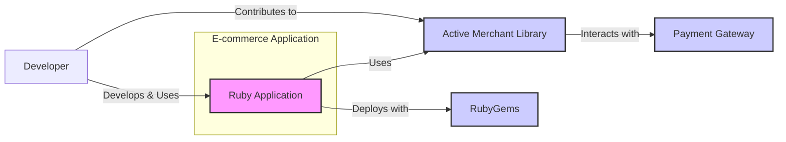
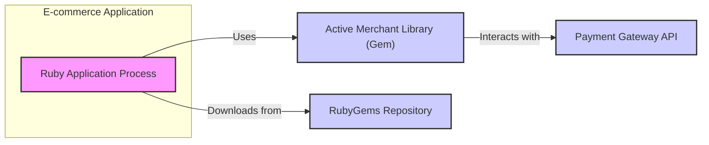
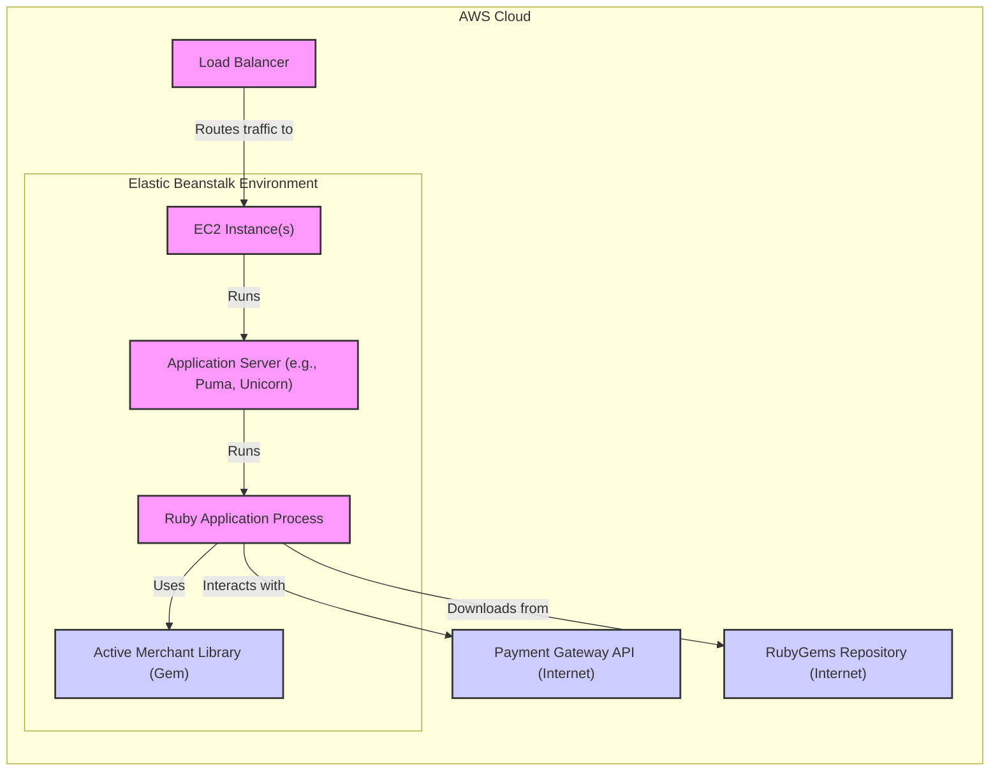

# BUSINESS POSTURE

- Business Priorities and Goals:
  - Simplify payment gateway integration for Ruby developers.
  - Provide a consistent and reliable interface to interact with various payment processors.
  - Reduce the complexity of handling different payment gateway APIs.
  - Enable faster development of e-commerce and payment processing features in Ruby applications.
  - Support a wide range of payment gateways to cater to diverse business needs.
- Business Risks:
  - Data breaches of sensitive payment information (credit card details, transaction data).
  - Financial fraud due to vulnerabilities in payment processing logic.
  - Service disruption caused by integration issues or library defects.
  - Compliance violations with payment industry standards (e.g., PCI DSS) if not handled securely.
  - Reputational damage and loss of customer trust in case of security incidents.

# SECURITY POSTURE

- Existing Security Controls:
  - security control: HTTPS for communication between applications using Active Merchant and payment gateways (assumption, generally expected for payment processing).
  - security control: Input validation within the Active Merchant library to sanitize and validate payment data before sending it to gateways (implementation details within the library code).
  - security control: Secure coding practices followed by the Active Merchant development team (based on community and project maturity).
  - security control: Dependency management using Bundler to manage and potentially audit gem dependencies (standard Ruby practice).
  - accepted risk: Reliance on the security of external payment gateways and their APIs.
  - accepted risk: Security vulnerabilities in underlying Ruby runtime environment and operating system.

- Recommended Security Controls:
  - security control: Regular security audits and penetration testing of Active Merchant library and applications using it.
  - security control: Automated dependency scanning to identify and address vulnerabilities in gem dependencies.
  - security control: Static Application Security Testing (SAST) and Dynamic Application Security Testing (DAST) integrated into the development and CI/CD pipeline.
  - security control: Implementation of a vulnerability disclosure and incident response plan for the Active Merchant project.
  - security control: Security training for developers contributing to Active Merchant to promote secure coding practices.

- Security Requirements:
  - Authentication:
    - Requirement: Applications using Active Merchant must implement secure authentication mechanisms to protect access to payment processing functionalities.
    - Requirement: Securely manage API keys and credentials required to authenticate with payment gateways.
  - Authorization:
    - Requirement: Applications using Active Merchant must implement proper authorization controls to ensure only authorized users and processes can initiate payment transactions.
    - Requirement: Limit access to sensitive payment processing functions based on roles and permissions.
  - Input Validation:
    - Requirement: Active Merchant must rigorously validate all input data, especially payment information, to prevent injection attacks and data manipulation.
    - Requirement: Applications using Active Merchant should also perform input validation before passing data to the library to ensure data integrity.
  - Cryptography:
    - Requirement: Active Merchant should utilize cryptography to protect sensitive data in transit and potentially at rest (if applicable within the library's scope, e.g., temporary storage of sensitive data).
    - Requirement: Ensure secure handling and storage of cryptographic keys if used within the library.
    - Requirement: Leverage HTTPS for all communication with payment gateways to ensure data confidentiality and integrity during transmission.

# DESIGN

## C4 CONTEXT

- Context Diagram Elements:
  - - Name: Ruby Application
    - Type: Software System
    - Description: The e-commerce or other application built using Ruby that integrates with Active Merchant to process payments.
    - Responsibilities: Initiates payment requests, handles user interactions, manages application logic, and integrates with Active Merchant.
    - Security controls: Application-level authentication and authorization, input validation before using Active Merchant, secure storage of API keys, HTTPS for application frontend.
  - - Name: Active Merchant Library
    - Type: Software System / Library
    - Description: The Ruby library that provides a unified interface to interact with various payment gateways.
    - Responsibilities: Abstracting payment gateway APIs, handling payment processing logic, data formatting, and communication with payment gateways.
    - Security controls: Input validation, secure coding practices, dependency management, potentially some internal data handling security measures.
  - - Name: Payment Gateway
    - Type: External System
    - Description: Third-party payment processing services (e.g., Stripe, PayPal, Authorize.net) that handle actual payment transactions.
    - Responsibilities: Processing payments, validating payment information, communicating with banks and financial institutions, and providing transaction status.
    - Security controls: Payment gateway security controls (PCI DSS compliance, encryption, fraud detection, etc.), API authentication and authorization.
  - - Name: RubyGems
    - Type: External System / Package Repository
    - Description: The Ruby community's package repository where Active Merchant library is published and distributed.
    - Responsibilities: Hosting and distributing Ruby libraries (gems), managing gem versions and dependencies.
    - Security controls: RubyGems security controls (package signing, malware scanning, account security).
  - - Name: Developer
    - Type: User
    - Description: Software developers who use Active Merchant to build Ruby applications.
    - Responsibilities: Integrating Active Merchant into applications, configuring payment gateways, writing code to handle payment processing, and potentially contributing to Active Merchant library.
    - Security controls: Secure development practices, secure handling of API keys and credentials, code review, and security testing.

## C4 CONTAINER

- Container Diagram Elements:
  - - Name: Ruby Application Process
    - Type: Container / Application Process
    - Description: The running instance of the Ruby application that utilizes the Active Merchant library.
    - Responsibilities: Executing application code, handling user requests, processing payment logic using Active Merchant, and managing application state.
    - Security controls: Application runtime environment security, process isolation, resource management, application-level security controls (authentication, authorization, input validation).
  - - Name: Active Merchant Library (Gem)
    - Type: Container / Library
    - Description: The Active Merchant library packaged as a Ruby gem, included within the Ruby application.
    - Responsibilities: Providing payment processing functionalities, abstracting gateway APIs, handling data formatting, and communicating with payment gateways.
    - Security controls: Library code security, input validation within the library, secure handling of sensitive data within the library's scope.
  - - Name: Payment Gateway API
    - Type: Container / External API
    - Description: The API exposed by the payment gateway for processing payment transactions.
    - Responsibilities: Receiving payment requests, processing payments, validating payment information, and returning transaction responses.
    - Security controls: Payment gateway API security (API authentication, authorization, rate limiting, input validation, HTTPS).
  - - Name: RubyGems Repository
    - Type: Container / Package Repository
    - Description: The repository hosting Ruby gems, from where Active Merchant gem is downloaded during application deployment or development.
    - Responsibilities: Storing and serving Ruby gems, managing gem versions and dependencies.
    - Security controls: RubyGems repository security (access control, package signing, malware scanning).

## DEPLOYMENT

- Deployment Architecture Options:
  - Option 1: Cloud Platform Deployment (e.g., AWS, Heroku, Google Cloud) - Ruby application deployed on a cloud platform.
  - Option 2: On-Premise Server Deployment - Ruby application deployed on company-managed servers.
  - Option 3: Containerized Deployment (e.g., Docker, Kubernetes) - Ruby application containerized and deployed using container orchestration.

- Detailed Deployment Architecture (Option 1: Cloud Platform Deployment - AWS Elastic Beanstalk example):

- Deployment Diagram Elements:
  - - Name: EC2 Instance(s)
    - Type: Infrastructure / Compute Instance
    - Description: Amazon EC2 instances providing the compute resources for the application.
    - Responsibilities: Running the application server and Ruby application process.
    - Security controls: Instance security hardening, security groups, operating system security, patching, access control (IAM roles).
  - - Name: Application Server (e.g., Puma, Unicorn)
    - Type: Software / Application Server
    - Description: The application server responsible for handling incoming requests and managing Ruby application processes.
    - Responsibilities: Serving the Ruby application, managing application processes, handling web requests.
    - Security controls: Application server configuration security, vulnerability patching, access control.
  - - Name: Ruby Application Process
    - Type: Software / Application Process
    - Description: The running Ruby application process that includes Active Merchant library.
    - Responsibilities: Executing application logic, processing payments using Active Merchant, interacting with payment gateways.
    - Security controls: Application-level security controls, secure coding practices, input validation, secure configuration.
  - - Name: Active Merchant Library (Gem)
    - Type: Software / Library
    - Description: The Active Merchant library gem deployed as part of the Ruby application.
    - Responsibilities: Providing payment processing functionalities.
    - Security controls: Library code security, dependency management.
  - - Name: Payment Gateway API (Internet)
    - Type: External System / API
    - Description: Payment gateway API accessed over the internet.
    - Responsibilities: Processing payments.
    - Security controls: Payment gateway API security.
  - - Name: RubyGems Repository (Internet)
    - Type: External System / Repository
    - Description: RubyGems repository accessed over the internet for gem downloads.
    - Responsibilities: Providing Ruby gems.
    - Security controls: RubyGems repository security.
  - - Name: Load Balancer
    - Type: Infrastructure / Load Balancer
    - Description: AWS Elastic Load Balancer distributing traffic across EC2 instances.
    - Responsibilities: Distributing incoming traffic, improving application availability and scalability.
    - Security controls: Load balancer security configuration, SSL termination, DDoS protection.

## BUILD

```mermaid
flowchart LR
    A["Developer (Code Changes)"]
    B["GitHub Repository (Source Code)"]
    C["GitHub Actions (CI/CD)"]
    D["Build Process (Tests, Linters, SAST)"]
    E["RubyGems (Package Registry)"]
    F["Built Gem (Active Merchant)"]

    A -- Pushes code to --> B
    B -- Triggers --> C
    C -- Executes --> D
    D -- Builds --> F
    F -- Publishes to --> E

    style A fill:#f9f,stroke:#333,stroke-width:2px
    style B fill:#f9f,stroke:#333,stroke-width:2px
    style C fill:#f9f,stroke:#333,stroke-width:2px
    style D fill:#f9f,stroke:#333,stroke-width:2px
    style E fill:#ccf,stroke:#333,stroke-width:2px
    style F fill:#f9f,stroke:#333,stroke-width:2px
```

- Build Process Description:
  - Developer makes code changes and pushes them to the GitHub repository.
  - GitHub Actions (or similar CI/CD system) is triggered by code changes.
  - Build process is executed, which typically includes:
    - Running unit and integration tests.
    - Performing code linting and style checks.
    - Executing Static Application Security Testing (SAST) scanners to identify potential vulnerabilities in the code.
    - Building the Ruby gem package.
  - If all checks pass, the built gem artifact (Active Merchant gem) is published to RubyGems repository.

- Build Diagram Elements:
  - - Name: Developer (Code Changes)
    - Type: User / Developer
    - Description: Software developers making changes to the Active Merchant codebase.
    - Responsibilities: Writing code, fixing bugs, adding features, and pushing code changes.
    - Security controls: Developer workstation security, secure coding practices, code review.
  - - Name: GitHub Repository (Source Code)
    - Type: Code Repository
    - Description: GitHub repository hosting the source code of Active Merchant.
    - Responsibilities: Version control, source code management, collaboration.
    - Security controls: Access control (permissions), branch protection, audit logs.
  - - Name: GitHub Actions (CI/CD)
    - Type: CI/CD System
    - Description: GitHub's CI/CD platform used for automating the build, test, and release process.
    - Responsibilities: Automating build pipeline, running tests, performing security checks, and publishing artifacts.
    - Security controls: CI/CD pipeline security, secure secrets management, access control, audit logs.
  - - Name: Build Process (Tests, Linters, SAST)
    - Type: Automated Process
    - Description: Automated build steps including testing, linting, and security scanning.
    - Responsibilities: Ensuring code quality, identifying bugs and vulnerabilities, and preparing release artifacts.
    - Security controls: Security checks within the build process (SAST), secure configuration of build tools.
  - - Name: RubyGems (Package Registry)
    - Type: Package Registry
    - Description: RubyGems repository where the built gem is published.
    - Responsibilities: Hosting and distributing Ruby gems.
    - Security controls: RubyGems security controls (package signing, malware scanning, access control).
  - - Name: Built Gem (Active Merchant)
    - Type: Artifact / Package
    - Description: The packaged Active Merchant Ruby gem ready for distribution.
    - Responsibilities: Providing the distributable form of the library.
    - Security controls: Gem signing (if implemented by RubyGems).

# RISK ASSESSMENT

- Critical Business Processes:
  - Secure payment processing for applications using Active Merchant.
  - Maintaining the integrity and availability of the Active Merchant library itself.
  - Protecting sensitive payment data handled by applications and the library.

- Data to Protect and Sensitivity:
  - Credit card numbers (PAN): Highly sensitive (PCI DSS).
  - Cardholder name: Sensitive (PCI DSS).
  - Expiration date: Sensitive (PCI DSS).
  - CVV/CVC: Highly sensitive (PCI DSS, not to be stored).
  - Transaction amounts: Sensitive.
  - Payment gateway API keys and credentials: Highly sensitive.
  - Application code and library code: Sensitive (intellectual property, potential vulnerabilities).

# QUESTIONS & ASSUMPTIONS

- Questions:
  - What are the specific PCI DSS compliance requirements for applications using Active Merchant?
  - What is the process for handling and reporting security vulnerabilities in Active Merchant?
  - Are there any specific security certifications or attestations for Active Merchant or the payment gateways it supports?
  - What is the intended scope of data at rest encryption within Active Merchant, if any?
  - What are the typical deployment environments for applications using Active Merchant (cloud, on-premise, etc.)?

- Assumptions:
  - HTTPS is used for all communication between applications using Active Merchant and payment gateways.
  - Secure coding practices are followed by the Active Merchant development team.
  - Payment gateways integrated with Active Merchant are PCI DSS compliant and maintain their own security.
  - Applications using Active Merchant are responsible for implementing their own application-level security controls (authentication, authorization, etc.).
  - The build and release process for Active Merchant includes basic security checks like testing and linting.