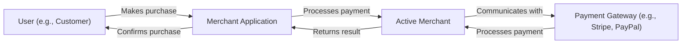
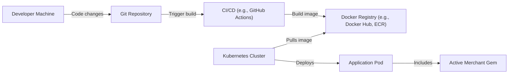
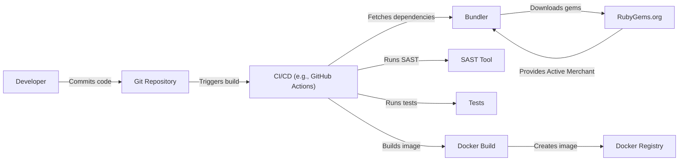

# BUSINESS POSTURE

Business Priorities and Goals:

*   Provide a unified interface for various payment gateways.
*   Simplify e-commerce payment processing for merchants.
*   Maintain compatibility with a wide range of payment service providers.
*   Ensure secure and reliable transaction handling.
*   Facilitate easy integration for developers.
*   Reduce the complexity of dealing with multiple payment gateway APIs.

Most Important Business Risks:

*   Financial losses due to security vulnerabilities or integration errors.
*   Reputational damage from security breaches or payment processing failures.
*   Loss of customer trust due to insecure handling of sensitive payment data.
*   Legal and compliance issues related to payment processing regulations (e.g., PCI DSS).
*   Business disruption due to incompatibility with payment gateway updates or changes.
*   Increased operational costs due to complex integration and maintenance efforts.

# SECURITY POSTURE

Existing Security Controls:

*   security control: Use of established cryptographic libraries for secure communication (HTTPS). (evident in the codebase and test suite)
*   security control: Regular updates to address security vulnerabilities in dependencies. (evident in the project's dependency management)
*   security control: Testing against various payment gateway integrations to ensure compatibility and security. (evident in the extensive test suite)
*   security control: Adherence to secure coding practices (though this needs further verification and enforcement). (inferred from the project's maturity and community involvement)
*   security control: Input validation to prevent common injection vulnerabilities. (partially evident in the codebase, needs more comprehensive review)

Accepted Risks:

*   accepted risk: Reliance on third-party payment gateways for the actual processing of sensitive payment data. Active Merchant does not directly handle cardholder data in most cases, reducing its PCI DSS scope but introducing a dependency on the security of the chosen gateway.
*   accepted risk: Potential for integration errors due to the complexity of interacting with multiple payment gateway APIs.
*   accepted risk: The library's security is ultimately dependent on the correct implementation and configuration by the integrating application.

Recommended Security Controls:

*   security control: Implement a comprehensive security linter and static analysis tool (SAST) in the CI/CD pipeline to enforce secure coding practices and identify potential vulnerabilities early.
*   security control: Conduct regular penetration testing and security audits to identify and address any weaknesses in the library and its integrations.
*   security control: Provide clear and detailed security documentation, including best practices for secure integration and configuration.
*   security control: Implement a robust vulnerability disclosure program to encourage responsible reporting of security issues.
*   security control: Consider implementing dynamic application security testing (DAST) to complement SAST.

Security Requirements:

*   Authentication:
    *   The library must authenticate with payment gateways using secure credentials (API keys, certificates, etc.).
    *   Credentials must be stored and handled securely, avoiding hardcoding or exposure in logs.
*   Authorization:
    *   The library should only access the necessary payment gateway APIs and resources based on the configured credentials.
    *   Access control mechanisms should be in place to prevent unauthorized actions.
*   Input Validation:
    *   All input received from external sources (e.g., user input, payment gateway responses) must be strictly validated to prevent injection attacks, cross-site scripting (XSS), and other vulnerabilities.
    *   Validation should be based on a whitelist approach, allowing only known-good data.
*   Cryptography:
    *   All communication with payment gateways must be encrypted using TLS/SSL with strong ciphers.
    *   Sensitive data, such as API keys, should be encrypted at rest.
    *   Cryptographic operations should use well-established and vetted libraries.

# DESIGN

## C4 CONTEXT

Element Descriptions:

*   Element:
    *   Name: User (e.g., Customer)
    *   Type: Person
    *   Description: The end-user initiating a purchase through the merchant's application.
    *   Responsibilities: Initiates payment, provides payment information (indirectly, through the merchant application).
    *   Security controls: Relies on the security of the merchant application and the payment gateway.

*   Element:
    *   Name: Merchant Application
    *   Type: Software System
    *   Description: The application integrating Active Merchant to process payments.
    *   Responsibilities: Handles user interaction, manages orders, integrates with Active Merchant, displays payment results.
    *   Security controls: Must implement secure coding practices, protect user data, and securely integrate with Active Merchant.

*   Element:
    *   Name: Active Merchant
    *   Type: Software System (Library)
    *   Description: The payment processing library providing a unified interface for various payment gateways.
    *   Responsibilities: Provides a consistent API for payment processing, handles communication with payment gateways, abstracts away gateway-specific details.
    *   Security controls: Input validation, secure communication with payment gateways, secure handling of credentials.

*   Element:
    *   Name: Payment Gateway (e.g., Stripe, PayPal)
    *   Type: External System
    *   Description: The third-party service that processes the actual payment transaction.
    *   Responsibilities: Securely handles payment information, processes transactions, communicates with banks and card networks.
    *   Security controls: Must comply with PCI DSS and other relevant security standards.

## C4 CONTAINER

Since Active Merchant is a library, the container diagram is essentially an extension of the context diagram. The "containers" are logical components within the library itself.

```mermaid
graph LR
    MerchantApp["Merchant Application"]
    ActiveMerchant["Active Merchant"]
    GatewayInterface["Gateway Interface"]
    SpecificGateway["Specific Gateway Implementation (e.g., Stripe, PayPal)"]
    PaymentGateway["Payment Gateway (e.g., Stripe, PayPal)"]

    MerchantApp -- "Processes payment" --> ActiveMerchant
    ActiveMerchant -- "Uses" --> GatewayInterface
    GatewayInterface -- "Implemented by" --> SpecificGateway
    SpecificGateway -- "Communicates with" --> PaymentGateway
    PaymentGateway -- "Processes payment" --> SpecificGateway
    SpecificGateway -- "Returns result" --> GatewayInterface
    GatewayInterface -- "Returns result" --> ActiveMerchant
    ActiveMerchant -- "Returns result" --> MerchantApp
```

Element Descriptions:

*   Element:
    *   Name: Merchant Application
    *   Type: Software System
    *   Description: The application integrating Active Merchant to process payments.
    *   Responsibilities: Handles user interaction, manages orders, integrates with Active Merchant, displays payment results.
    *   Security controls: Must implement secure coding practices, protect user data, and securely integrate with Active Merchant.

*   Element:
    *   Name: Active Merchant
    *   Type: Software System (Library)
    *   Description: The main entry point for the library.
    *   Responsibilities: Provides the core API, manages gateway selection, handles common functionality.
    *   Security controls: Input validation, secure handling of credentials.

*   Element:
    *   Name: Gateway Interface
    *   Type: Abstract Interface
    *   Description: Defines the common interface for all payment gateway integrations.
    *   Responsibilities: Specifies the methods that all gateway implementations must provide.
    *   Security controls: Enforces a consistent interface for secure communication.

*   Element:
    *   Name: Specific Gateway Implementation (e.g., Stripe, PayPal)
    *   Type: Concrete Class
    *   Description: Implements the Gateway Interface for a particular payment gateway.
    *   Responsibilities: Handles communication with the specific payment gateway, translates requests and responses.
    *   Security controls: Secure communication with the payment gateway, secure handling of gateway-specific credentials.

*   Element:
    *   Name: Payment Gateway (e.g., Stripe, PayPal)
    *   Type: External System
    *   Description: The third-party service that processes the actual payment transaction.
    *   Responsibilities: Securely handles payment information, processes transactions, communicates with banks and card networks.
    *   Security controls: Must comply with PCI DSS and other relevant security standards.

## DEPLOYMENT

Active Merchant is a Ruby gem, and its deployment is typically managed through Bundler, a dependency management tool for Ruby.  There are several deployment options:

1.  **Directly on a Server (e.g., using Capistrano):** The application, including Active Merchant as a gem, is deployed directly to a server (physical or virtual).
2.  **Containerized (e.g., using Docker):** The application and its dependencies, including Active Merchant, are packaged into a Docker container, which can be deployed to various environments (e.g., Kubernetes, AWS ECS).
3.  **Platform as a Service (PaaS) (e.g., Heroku):** The application is deployed to a PaaS provider, which handles the underlying infrastructure and deployment process. Active Merchant is included as a gem in the application's Gemfile.

We'll describe the **Containerized (Docker)** approach in detail:

Element Descriptions:

*   Element:
    *   Name: Developer Machine
    *   Type: Workstation
    *   Description: The developer's local machine where code is written and tested.
    *   Responsibilities: Code development, testing, committing changes.
    *   Security controls: Secure coding practices, local security tools.

*   Element:
    *   Name: Git Repository
    *   Type: Version Control System
    *   Description: Stores the application's source code, including the Gemfile specifying Active Merchant as a dependency.
    *   Responsibilities: Version control, collaboration, code review.
    *   Security controls: Access control, branch protection rules, code review policies.

*   Element:
    *   Name: CI/CD (e.g., GitHub Actions)
    *   Type: Automation Server
    *   Description: Automates the build, test, and deployment process.
    *   Responsibilities: Runs tests, builds Docker images, pushes images to the registry.
    *   Security controls: Secure configuration, access control, vulnerability scanning.

*   Element:
    *   Name: Docker Registry (e.g., Docker Hub, ECR)
    *   Type: Container Registry
    *   Description: Stores Docker images.
    *   Responsibilities: Image storage, access control.
    *   Security controls: Authentication, authorization, image scanning.

*   Element:
    *   Name: Kubernetes Cluster
    *   Type: Container Orchestration Platform
    *   Description: Manages the deployment and scaling of containerized applications.
    *   Responsibilities: Orchestrates containers, manages resources, provides networking.
    *   Security controls: Network policies, role-based access control (RBAC), pod security policies.

*   Element:
    *   Name: Application Pod
    *   Type: Kubernetes Pod
    *   Description: A running instance of the application container.
    *   Responsibilities: Runs the application code, including Active Merchant.
    *   Security controls: Container security best practices, network isolation.

*   Element:
    *   Name: Active Merchant Gem
    *   Type: Ruby Gem
    *   Description: The Active Merchant library, included as a dependency in the application.
    *   Responsibilities: Provides payment processing functionality.
    *   Security controls: Inherits security controls from the container and application.

## BUILD

The build process for an application using Active Merchant typically involves the following steps:

1.  **Code Checkout:** The CI/CD system checks out the application code from the Git repository.
2.  **Dependency Installation:** Bundler installs the required gems, including Active Merchant, based on the Gemfile and Gemfile.lock.
3.  **Testing:** The test suite is executed, including unit tests, integration tests, and potentially security tests (SAST, DAST).
4.  **Docker Image Build:** A Docker image is built, containing the application code, dependencies (including Active Merchant), and the Ruby runtime.
5.  **Image Push:** The Docker image is pushed to a container registry.

Security Controls in the Build Process:

*   **Dependency Management (Bundler):** Bundler ensures that the correct versions of dependencies, including Active Merchant, are installed.  Gemfile.lock provides a reproducible build.
*   **SAST (Static Application Security Testing):** A SAST tool (e.g., Brakeman, RuboCop with security extensions) analyzes the application code for potential security vulnerabilities. This should be integrated into the CI/CD pipeline.
*   **Dependency Vulnerability Scanning:** Tools like Bundler-audit or Dependabot can check for known vulnerabilities in the project's dependencies, including Active Merchant.
*   **Secure Build Environment:** The CI/CD environment should be configured securely, with limited access and appropriate security controls.
*   **Image Scanning:** The Docker image should be scanned for vulnerabilities before being pushed to the registry.

# RISK ASSESSMENT

Critical Business Processes:

*   **Payment Processing:** The core functionality of accepting and processing payments from customers. This is the most critical process, as any failure or security breach can lead to financial losses and reputational damage.
*   **Order Management:** The process of managing orders, including creating, updating, and fulfilling orders. This is closely tied to payment processing.
*   **Customer Data Management:** Handling customer data, including potentially sensitive information (although Active Merchant itself aims to minimize direct handling of cardholder data).

Data Sensitivity:

*   **Payment Gateway Credentials (API Keys, Secrets):**  Highest sensitivity. These credentials must be protected at all costs, as their compromise would allow unauthorized access to the merchant's payment gateway account.
*   **Transaction Data (Amount, Currency, Order ID):** Medium sensitivity. This data is less sensitive than cardholder data but still needs to be protected to prevent fraud and ensure data integrity.
*   **Customer Data (Name, Address, Email):** Medium to low sensitivity, depending on the specific data collected and applicable privacy regulations.  Active Merchant itself doesn't directly handle this data, but the integrating application does.
*   **Cardholder Data (PAN, Expiry Date, CVV):**  Highest sensitivity. Active Merchant is designed to *avoid* directly handling this data, delegating it to the payment gateway.  The integrating application *must not* store this data unless it is fully PCI DSS compliant.

# QUESTIONS & ASSUMPTIONS

Questions:

*   What specific payment gateways are intended to be used with Active Merchant in this particular implementation?
*   What is the expected transaction volume and value?
*   What are the specific compliance requirements (e.g., PCI DSS, GDPR) that apply to the merchant application?
*   What is the existing security infrastructure and tooling in place for the merchant application?
*   What level of security expertise is available within the development team?
*   Are there any existing security policies or guidelines that need to be followed?
*   What is the deployment environment (cloud provider, on-premise, etc.)?
*   Is there a formal vulnerability disclosure program in place?

Assumptions:

*   BUSINESS POSTURE: The merchant application integrating Active Merchant is an e-commerce platform or a similar system that requires payment processing capabilities. The business prioritizes security and reliability to protect customer data and maintain trust.
*   SECURITY POSTURE: The development team has a basic understanding of secure coding practices. There is some level of security awareness, but there may be gaps in the implementation of specific security controls. The merchant application is responsible for securely handling any customer data it collects.
*   DESIGN: Active Merchant will be used as intended, primarily as a library to interface with payment gateways, and will not be modified extensively. The integrating application will handle the user interface and overall application logic. The chosen payment gateways are reputable and comply with relevant security standards. The deployment environment is reasonably secure, with basic security measures in place.