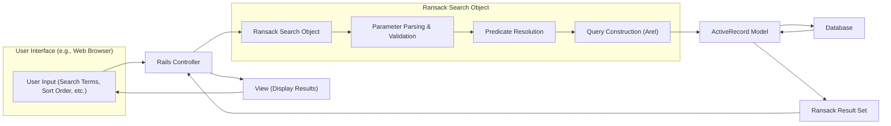

# Project Design Document: Ransack Search Library

**Version:** 1.1
**Date:** October 26, 2023
**Author:** AI Software Architect

## 1. Introduction

This document provides an enhanced and more detailed design overview of the Ransack search library for Ruby on Rails applications using ActiveRecord. It elaborates on the architecture, data flow, and key components of the library, with a stronger focus on aspects relevant to security threat modeling.

## 2. Goals

*   Provide a clear, comprehensive, and more granular understanding of Ransack's architecture and functionality.
*   Identify key components and their interactions with greater detail.
*   Document the data flow within the library, including specific steps within the Ransack processing.
*   Highlight potential areas of security concern with more specific examples for future threat modeling.

## 3. Target Audience

This document is intended for:

*   Security engineers performing detailed threat modeling and security assessments.
*   Developers working with, extending, or debugging Ransack.
*   System architects requiring an in-depth understanding of Ransack's role and internal workings within a larger application.

## 4. System Overview

Ransack acts as an intermediary layer within a Ruby on Rails application, facilitating the translation of user-defined search criteria into executable database queries against ActiveRecord models. It simplifies the creation of both basic and complex search functionalities.

## 5. Architectural Design

Ransack sits logically between the user interface, where search requests originate, and the ActiveRecord models responsible for database interaction.

### 5.1. Key Components

*   **User Interface:** The presentation layer where users define their search parameters. This is typically implemented using HTML forms with input fields corresponding to model attributes and Ransack's predicate syntax.
*   **Rails Controller:** The application component that receives the user's search request, initializes the Ransack search object, and orchestrates the search process.
*   **Ransack Search Object:** The core engine of the library, responsible for parsing, validating, and translating user input into database queries.
    *   **Parameter Parsing & Validation:**  The initial stage where raw user input is processed and checked for basic validity according to Ransack's expected format.
    *   **Predicate Resolution:**  The process of mapping user-provided search terms (using Ransack's predicate syntax like `_cont`, `_eq`, etc.) to the corresponding database columns and comparison operators.
    *   **Query Construction (Arel):**  The step where Ransack utilizes Arel, ActiveRecord's query interface, to build the actual SQL query based on the resolved predicates and values.
*   **ActiveRecord Model:** The representation of the database table in the application, responsible for executing the generated query and interacting with the database.
*   **Database:** The persistent storage system holding the application's data, which is queried based on Ransack's output.
*   **Ransack Result Set:** The collection of ActiveRecord objects returned by the database query, representing the search results.
*   **View:** The presentation component responsible for rendering the search results to the user, typically displaying the attributes of the retrieved ActiveRecord objects.

### 5.2. Data Flow

1. **User Input:** A user interacts with the user interface, providing search criteria such as keywords, date ranges, and sorting preferences.
2. **Request to Controller:** Upon submission of the search form, the browser sends an HTTP request to the designated Rails controller. This request includes parameters representing the user's search input, often following Ransack's naming conventions.
3. **Ransack Object Creation:** The Rails controller receives the request and instantiates a `Ransack::Search` object. The search parameters from the HTTP request are passed to this object.
4. **Parameter Parsing & Validation:** The Ransack object begins by parsing the input parameters, extracting the search values and the associated predicates. Basic validation might occur at this stage to ensure the parameters conform to expected types and formats.
5. **Predicate Resolution:** Ransack then resolves the provided predicates (e.g., `name_cont`) to the corresponding database column (`name`) and the intended comparison operator (`LIKE` or `ILIKE` for `_cont`). This step relies on Ransack's internal mapping and the model's schema.
6. **Query Construction (Arel):** Using the parsed parameters and resolved predicates, Ransack constructs an ActiveRecord query using Arel. This involves building the `WHERE` clause with the appropriate conditions and operators, as well as handling sorting and pagination if specified.
7. **Database Query Execution:** The constructed ActiveRecord query is passed to the relevant ActiveRecord model. The model then executes this query against the configured database.
8. **Data Retrieval:** The database processes the query and returns the matching records to the ActiveRecord model.
9. **Result Set Creation:** The ActiveRecord model packages the retrieved data into a collection of ActiveRecord objects, forming the Ransack result set.
10. **Response to Controller:** The ActiveRecord model returns the result set to the originating Rails controller.
11. **Rendering the View:** The controller receives the result set and passes it to the appropriate view.
12. **Displaying Results:** The view iterates through the result set and renders the search results to the user's browser, typically displaying relevant attributes of the found records.

## 6. Detailed Component Description

### 6.1. User Interface

*   Typically built using HTML forms, often generated with Rails form helpers.
*   Input field names adhere to Ransack's predicate syntax (e.g., `q[name_cont]`, `q[created_at_gteq]`).
*   May incorporate JavaScript for enhanced user experience, such as dynamic filtering or autocomplete suggestions.

### 6.2. Rails Controller

*   Handles the incoming HTTP request containing search parameters, usually within the `params[:q]` hash.
*   Instantiates the `Ransack::Search` object using `Model.ransack(params[:q])`.
*   Can apply additional scopes or conditions to the search before executing it.
*   Often handles pagination of the search results using gems like `kaminari` or `will_paginate`.

### 6.3. Ransack Search Object

*   The core logic resides within this object.
*   **Configuration:** Ransack allows configuration options such as whitelisting allowed search attributes and predicates, which is crucial for security.
*   **Parameter Parsing:** Extracts search values and predicates from the input hash.
*   **Predicate Resolution:** Maps predicates to database columns and operators, handling associations and custom predicates.
*   **Sanitization:** Ransack provides some basic sanitization to prevent simple injection attacks, but this should not be considered a comprehensive security measure.
*   **Query Building:** Constructs the SQL query using Arel, ensuring proper escaping and quoting of values.
*   **Error Handling:** Handles invalid search parameters or predicates, typically by ignoring them or raising exceptions.

### 6.4. ActiveRecord Model

*   Receives the Arel query generated by Ransack.
*   Interacts with the database adapter to execute the SQL query.
*   Returns a `ActiveRecord::Relation` object representing the search results.

### 6.5. Database

*   The underlying data store, which can be any database supported by ActiveRecord (e.g., PostgreSQL, MySQL, SQLite).
*   Performance can be impacted by complex Ransack queries, especially on large datasets.

### 6.6. Ransack Result Set

*   An `ActiveRecord::Relation` object, allowing for further chaining of ActiveRecord methods (e.g., ordering, limiting).
*   Represents the collection of records matching the search criteria.

### 6.7. View

*   Responsible for presenting the `Ransack Result Set` to the user.
*   Iterates through the results and displays the relevant data.
*   Should properly escape any user-provided data (including search terms) to prevent Cross-Site Scripting (XSS) vulnerabilities.

## 7. Security Considerations (Pre-Threat Modeling)

This section provides more specific security considerations relevant to Ransack, which will be the focus of subsequent threat modeling activities.

*   **SQL Injection:**  Improperly configured or overly permissive Ransack setups could potentially lead to SQL injection vulnerabilities. For example, if custom predicates are not carefully validated or if raw SQL is used within custom predicates, attackers might inject malicious SQL code. Consider scenarios where user input directly influences the construction of complex `WHERE` clauses.
*   **Mass Assignment Vulnerabilities:** If attribute whitelisting is not strictly enforced in Ransack's configuration, attackers might be able to manipulate unintended model attributes through crafted search parameters. For instance, an attacker might try to set an `is_admin` flag to `true` if it's not properly protected.
*   **Denial of Service (DoS) through Complex Queries:**  Malicious users could craft extremely complex search queries that consume excessive database resources, leading to performance degradation or a denial of service. This could involve using many `OR` conditions, complex associations, or inefficient predicates. For example, a search with numerous deeply nested `OR` conditions across multiple associated tables could strain the database.
*   **Information Disclosure through Attribute Access:** If Ransack is configured to allow searching on sensitive attributes without proper authorization checks, unauthorized users might be able to access confidential information by crafting specific search queries. For example, searching for users with a specific salary range if salary information should be restricted.
*   **Cross-Site Scripting (XSS) via Search Terms:** While the primary responsibility for preventing XSS lies in the view layer, the data flow originates from user input through Ransack. If search terms containing malicious scripts are not properly sanitized or escaped when displayed in the view, it can lead to XSS vulnerabilities.
*   **Authorization Bypass:** Ensure that Ransack search results respect existing authorization rules within the application. Users should only be able to retrieve data they are authorized to access. This requires careful integration of Ransack with the application's authorization framework (e.g., Pundit, CanCanCan).

## 8. Assumptions and Constraints

*   The application is built using Ruby on Rails and relies on ActiveRecord for database interactions.
*   The database is a relational database system compatible with ActiveRecord.
*   User input for search parameters is primarily received through standard web forms.
*   The application implements general security best practices, such as input validation outside of Ransack for non-search-related data and proper output encoding in the view layer.
*   Specific versions of Ruby on Rails and Ransack are assumed to be within currently supported ranges (to be specified in project-specific documentation).

## 9. Future Considerations

*   Integration with more sophisticated search engines like Elasticsearch for improved performance and advanced search capabilities.
*   Implementation of more fine-grained control over allowed search predicates and attributes, potentially using a declarative approach.
*   Enhanced logging and monitoring of search queries for security auditing and anomaly detection.
*   Consideration of rate limiting for search requests to mitigate potential DoS attacks.

This improved design document provides a more detailed and security-focused overview of the Ransack search library. It serves as a solid foundation for conducting thorough threat modeling and identifying potential security vulnerabilities.
