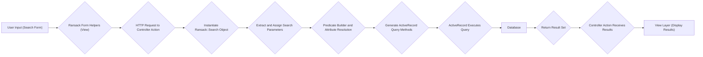

# Project Design Document: Ransack Search Functionality

**Version:** 1.1
**Date:** October 26, 2023
**Author:** AI Software Architect

## 1. Introduction

This document outlines the design of the Ransack gem, a powerful and flexible search library for Ruby on Rails applications. This document provides a comprehensive overview of the gem's architecture, components, and data flow, intended to facilitate future threat modeling activities by providing a detailed understanding of the system's inner workings.

## 2. Goals and Objectives

The primary goal of Ransack is to provide a user-friendly and extensible way to build complex search queries against ActiveRecord models in Rails applications. Key objectives include:

*   Enabling users to search based on various attributes of a model and its associated models through a simple and intuitive syntax.
*   Providing a declarative approach for defining search parameters directly within Rails views.
*   Generating optimized and efficient database queries based on user-provided input, minimizing performance overhead.
*   Supporting a wide range of search predicates (e.g., equals, contains, greater than, starts with, ends with) and logical operators.
*   Offering a high degree of customization and extensibility to accommodate custom search logic, predicates, and attribute types.

## 3. System Architecture

Ransack operates as a middleware component within the context of a Ruby on Rails application, tightly integrated with the Model-View-Controller (MVC) architecture. The core components of Ransack and their interactions are detailed below:

*   **Search Form (View Layer):** This represents the user interface elements (HTML forms) where users input their search criteria. Ransack provides form helpers that simplify the process of binding form fields to Ransack's search parameters. These helpers generate HTML input fields with specific naming conventions that Ransack understands.
*   **Ransack Gem (Controller/Model Layer):** This is the core library, implemented as a Ruby gem, responsible for processing the search parameters received from the controller and translating them into executable database queries. It acts as an intermediary between the user input and the database.
*   **Search Object (`Ransack::Search`):** An instance of `Ransack::Search` is typically instantiated within a controller action. This object serves as a container for the search parameters extracted from the user's input. It holds information about the attributes to search on, the predicates to use, and any sorting criteria.
*   **Predicate Builder:** This internal component within the `Ransack::Search` object is responsible for interpreting the user-provided search terms and associated predicates. It analyzes the search parameters and constructs the corresponding conditions for the database query. This involves mapping Ransack's predicate syntax (e.g., `_eq`, `_cont`) to the appropriate database operators.
*   **Attribute and Predicate Resolution:** Ransack dynamically resolves attribute names and predicates based on the model being searched. It introspects the model's attributes and associations to determine valid search targets.
*   **ActiveRecord Integration:** Ransack leverages the power of ActiveRecord, the Object-Relational Mapper (ORM) in Rails, to interact with the database. The predicate builder generates ActiveRecord query methods (e.g., `where`, `order`, `joins`) that are then executed by ActiveRecord.
*   **Database:** The underlying relational database system (e.g., PostgreSQL, MySQL, SQLite) where the application's persistent data is stored. Ransack generates standard SQL queries that are compatible with the configured database.
*   **Result Set (Model Layer):** The collection of ActiveRecord model instances returned by the database after executing the query generated by Ransack. This represents the search results that match the user's criteria.
*   **View Layer (Display):** The user interface components responsible for rendering and presenting the search results to the user. This typically involves iterating through the result set and displaying the relevant information.

## 4. Data Flow

The following diagram illustrates the typical data flow when a user performs a search using Ransack:

**Detailed Data Flow Steps:**

1. **User Input (Search Form):** The user interacts with the search form embedded in the application's view, entering their search criteria into the provided input fields (e.g., keywords, date ranges, selections from dropdowns).
2. **Ransack Form Helpers (View):** Ransack's form helpers, such as `search_form_for`, generate HTML form elements with specific naming conventions (e.g., `q[title_cont]`, `q[author_name_eq]`). These names are crucial for Ransack to correctly interpret the submitted search parameters.
3. **HTTP Request to Controller Action:** When the user submits the search form, an HTTP request (typically a GET or POST request) is sent to the designated controller action. The request includes the search parameters as part of the request parameters.
4. **Instantiate `Ransack::Search` Object:** Inside the controller action, a new instance of `Ransack::Search` is created, usually associated with the ActiveRecord model that needs to be searched. This object will manage the search process.
5. **Extract and Assign Search Parameters:** The controller extracts the search parameters from the HTTP request parameters (e.g., `params[:q]`) and assigns them to the newly created `Ransack::Search` object. Ransack handles the mapping of the form field names to its internal representation of search criteria.
6. **Predicate Builder and Attribute Resolution:** The `Ransack::Search` object utilizes its internal predicate builder to interpret the assigned search parameters. This involves resolving the attribute names (e.g., `title`, `author_name`) and the specified predicates (e.g., `_cont` for "contains", `_eq` for "equals"). Ransack introspects the associated model to validate the attribute names and ensure they exist.
7. **Generate ActiveRecord Query Methods:** Based on the resolved attributes and predicates, the predicate builder constructs a chain of ActiveRecord query methods (e.g., `where("title LIKE ?", "%keyword%")`, `where(author_id: 123)`, `order(created_at: :desc)`). These methods define the conditions and sorting for the database query.
8. **ActiveRecord Executes Query:** The generated ActiveRecord query methods are executed by ActiveRecord, which translates them into a raw SQL query specific to the configured database.
9. **Database:** The database receives and processes the SQL query, retrieving the records that match the specified criteria.
10. **Return Result Set:** The database returns a collection of matching records to ActiveRecord.
11. **Controller Action Receives Results:** The controller action receives the result set (a collection of ActiveRecord model instances) from ActiveRecord.
12. **View Layer (Display Results):** The controller passes the result set to the appropriate view. The view then iterates through the results and renders them for the user, typically displaying the relevant attributes of each matching record.

## 5. Components and their Functionality

*   **`Ransack::Search`:** The core class responsible for managing the search state. It holds the search parameters, performs attribute and predicate resolution, and orchestrates the query building process.
*   **`Ransack::Search::Context`:** Provides the context for the search, primarily the ActiveRecord model being searched and its associated models. This context is used for attribute and association resolution.
*   **`Ransack::Nodes::Attribute`:** Represents a specific attribute of the model being targeted in the search (e.g., `title`, `created_at`, `user.email`).
*   **`Ransack::Nodes::Predicate`:** Represents the type of comparison or operation to be performed on the attribute (e.g., `eq` (equals), `cont` (contains), `gt` (greater than), `lt` (less than)).
*   **`Ransack::Nodes::Value`:** Represents the value being used in the comparison defined by the predicate (e.g., the keyword being searched for, the date range).
*   **`Ransack::Adapters::ActiveRecord::Search`:** The specific adapter for ActiveRecord that handles the translation of Ransack's internal representation into ActiveRecord query methods.
*   **`Ransack::Configuration`:** Allows developers to customize Ransack's behavior, such as adding custom predicates, custom attribute types, or modifying the default search logic.
*   **Form Helpers (e.g., `search_form_for`, `attribute_field`):** View helpers that simplify the creation of search forms by automatically generating the necessary HTML input fields with the correct naming conventions for Ransack.
*   **Predicates (Built-in and Custom):** Ransack provides a set of built-in predicates and allows developers to define their own custom predicates to support specific search requirements.

## 6. Security Considerations (Specific to Ransack)

This section outlines security considerations specific to the Ransack gem that should be addressed during threat modeling:

*   **SQL Injection via Custom Predicates:** If custom predicates are implemented without proper input sanitization or by directly embedding user input into raw SQL, they can introduce SQL injection vulnerabilities.
*   **Mass Assignment Vulnerabilities:** While Ransack itself doesn't directly interact with mass assignment in the same way as model attributes, improper handling of search parameters could potentially allow users to manipulate unintended attributes if not carefully controlled in the controller.
*   **Denial of Service (DoS) through Complex Queries:** Malicious users could craft extremely complex search queries with numerous conditions and joins, potentially causing the database to perform resource-intensive operations, leading to performance degradation or denial of service.
*   **Information Disclosure through Unintended Associations:** If search forms expose attributes from related models without proper authorization checks, users might be able to access information they are not authorized to see. Careful consideration should be given to which associated attributes are made searchable.
*   **Bypass of Business Logic through Search:**  It's crucial to ensure that search functionality respects the application's business logic and validation rules. For example, search parameters should not allow users to bypass required steps or access data in unintended ways.
*   **Regular Expression Denial of Service (ReDoS) in String Predicates:** If using regular expression-based predicates (e.g., `_matches`), ensure that user-provided patterns are validated to prevent ReDoS attacks, where maliciously crafted regular expressions can cause excessive CPU consumption.
*   **Parameter Tampering:**  Users might attempt to manipulate the search parameters in the URL or request body to bypass intended search logic or gain access to unauthorized data. Server-side validation of search parameters is essential.

## 7. Dependencies

Ransack has the following primary dependencies:

*   **Ruby on Rails:** The web application framework that provides the environment for Ransack to operate.
*   **ActiveRecord:** The Object-Relational Mapper (ORM) component of Rails that Ransack relies on for database interaction.

## 8. Deployment

Ransack is deployed as a standard Ruby gem within a Ruby on Rails application. The deployment process typically involves:

*   Adding the `ransack` gem to the application's `Gemfile`.
*   Running `bundle install` to install the gem and its dependencies.
*   No specific deployment configurations are usually required beyond those of the Rails application itself.

## 9. Future Considerations

*   **Integration with Full-Text Search Engines:** Exploring tighter integration with full-text search engines like Elasticsearch or Solr for improved performance and advanced search capabilities.
*   **Enhanced Security Features:**  Potentially adding built-in mechanisms for sanitizing search inputs or limiting the complexity of generated queries.
*   **Improved Documentation and Examples:** Continuously improving the documentation and providing more comprehensive examples to illustrate advanced usage scenarios and best practices.
*   **GraphQL Integration:** Investigating possibilities for integrating Ransack's search capabilities with GraphQL APIs.

This document provides a detailed and improved overview of the Ransack gem's design, focusing on aspects relevant to security considerations and threat modeling. It outlines the architecture, data flow, and key components, providing a solid foundation for identifying and mitigating potential security risks.