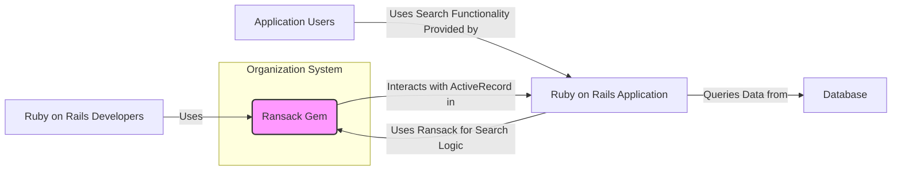
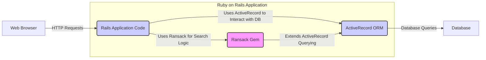
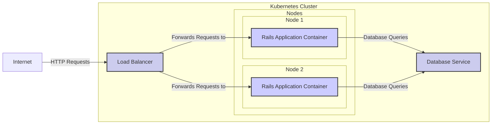

# BUSINESS POSTURE

- Business Priorities and Goals:
  - Provide advanced search and filtering capabilities for Ruby on Rails applications.
  - Enhance user experience by enabling users to easily find and filter data within applications.
  - Simplify the development of complex search interfaces in Rails applications.
  - Reduce development time and effort for implementing search functionality.

- Most Important Business Risks:
  - Risk of insecure search queries leading to unauthorized data access or manipulation if Ransack is misused or misconfigured.
  - Risk of performance issues and denial of service if complex or unoptimized search queries are executed.
  - Risk of application instability if Ransack introduces bugs or conflicts with other components of the Rails application.
  - Risk of developer misuse leading to unexpected application behavior or security vulnerabilities.

# SECURITY POSTURE

- Existing Security Controls:
  - security control: Ruby on Rails Security Framework - The application using Ransack likely benefits from the security features provided by the Ruby on Rails framework, such as protection against common web vulnerabilities. Implemented by: Ruby on Rails framework.
  - security control: Database Security - The underlying database system will have its own security controls for access management and data protection. Implemented by: Database system (e.g., PostgreSQL, MySQL).
  - security control: Input Sanitization (Application Level) - It is expected that the application using Ransack will implement input sanitization and validation to protect against injection attacks. Implemented by: Application code using Ransack.
  - security control: Authorization (Application Level) -  Authorization logic within the application should control which users can access and search specific data. Implemented by: Application code using Ransack.

- Accepted Risks:
  - accepted risk: Vulnerabilities in Ransack Gem - There is an inherent risk of security vulnerabilities being present in the Ransack gem itself, which could be exploited if discovered.
  - accepted risk: Misuse of Ransack by Developers - Developers might misuse Ransack in a way that introduces security vulnerabilities, such as constructing insecure search queries or bypassing authorization checks.
  - accepted risk: Dependency Vulnerabilities - Ransack depends on other Ruby gems, and vulnerabilities in these dependencies could indirectly affect applications using Ransack.

- Recommended Security Controls:
  - security control: Regular Security Audits - Conduct periodic security audits of the Ransack gem code to identify and address potential vulnerabilities.
  - security control: Static Application Security Testing (SAST) - Integrate SAST tools into the development process to automatically scan the Ransack codebase for security flaws.
  - security control: Dependency Scanning - Implement dependency scanning to monitor for known vulnerabilities in Ransack's dependencies and update them promptly.
  - security control: Secure Coding Guidelines and Training - Provide developers with secure coding guidelines and training specific to using Ransack securely, emphasizing input validation and authorization.
  - security control: Example and Documentation Review - Review documentation and examples for security best practices and ensure they clearly demonstrate secure usage patterns.

- Security Requirements:
  - Authentication:
    - Requirement: Authentication is the responsibility of the application using Ransack. Ransack itself does not handle authentication.
    - Details: The application must authenticate users before allowing them to perform searches using Ransack.
  - Authorization:
    - Requirement: Authorization must be implemented at the application level to control access to data being searched by Ransack.
    - Details: Ransack should be used in conjunction with application-level authorization mechanisms to ensure users can only search data they are authorized to access.
  - Input Validation:
    - Requirement: All user inputs used in Ransack search queries must be thoroughly validated and sanitized by the application to prevent injection attacks (e.g., SQL injection, NoSQL injection).
    - Details: The application must sanitize user-provided search parameters before passing them to Ransack to construct database queries.
  - Cryptography:
    - Requirement: Cryptography is not directly a requirement for Ransack itself, but the application using Ransack should use cryptography to protect sensitive data at rest and in transit.
    - Details:  If sensitive data is being searched, the application should ensure that data is encrypted in the database and transmitted securely over HTTPS.

# DESIGN

## C4 CONTEXT

- Context Diagram Elements:
  - - Name: Ransack Gem
    - Type: Software System
    - Description: A Ruby gem that provides advanced search and filtering capabilities for Ruby on Rails applications using ActiveRecord.
    - Responsibilities:
      - Parse search parameters provided by the Rails application.
      - Generate ActiveRecord queries based on search parameters.
      - Provide a domain-specific language (DSL) for defining search criteria.
    - Security controls:
      - Security control: Input validation and sanitization (responsibility of the using application).
      - Security control: Relies on ActiveRecord and database security for query execution.

  - - Name: Ruby on Rails Developers
    - Type: Person
    - Description: Software developers who use the Ransack gem to implement search functionality in their Ruby on Rails applications.
    - Responsibilities:
      - Integrate Ransack into Ruby on Rails applications.
      - Configure Ransack to define search attributes and logic.
      - Ensure secure usage of Ransack, including input validation and authorization.
    - Security controls:
      - Security control: Secure coding practices when using Ransack.
      - Security control: Implementing application-level security controls around search functionality.

  - - Name: Application Users
    - Type: Person
    - Description: End-users who interact with the Ruby on Rails application and utilize the search functionality powered by Ransack.
    - Responsibilities:
      - Provide search queries through the application's user interface.
      - Expect accurate and efficient search results.
    - Security controls:
      - Security control: Limited to the security controls implemented by the application they are using.

  - - Name: Ruby on Rails Application
    - Type: Software System
    - Description: The web application built using the Ruby on Rails framework that integrates and utilizes the Ransack gem for search functionality.
    - Responsibilities:
      - Handle user requests and interactions.
      - Integrate Ransack to process search queries.
      - Interact with the database to retrieve data.
      - Implement authentication and authorization.
      - Perform input validation and sanitization.
    - Security controls:
      - Security control: Ruby on Rails Security Framework.
      - Security control: Application-level authentication and authorization.
      - Security control: Input validation and sanitization.

  - - Name: Database
    - Type: Software System
    - Description: The database system (e.g., PostgreSQL, MySQL) that stores the application's data and is queried by the Ruby on Rails application using ActiveRecord and Ransack.
    - Responsibilities:
      - Store application data securely.
      - Execute database queries efficiently.
      - Enforce database-level security controls.
    - Security controls:
      - Security control: Database access controls and authentication.
      - Security control: Data encryption at rest (if configured).
      - Security control: Database auditing and logging.

## C4 CONTAINER

- Container Diagram Elements:
  - - Name: Ransack Gem
    - Type: Library
    - Description: A Ruby gem library that is integrated into the Ruby on Rails application to provide advanced search capabilities.
    - Responsibilities:
      - Provide classes and methods for defining search logic.
      - Translate search parameters into ActiveRecord query conditions.
      - Integrate seamlessly with ActiveRecord.
    - Security controls:
      - Security control: Code review and security audits of the gem codebase.
      - Security control: Relies on the security of the Ruby runtime environment.

  - - Name: Rails Application Code
    - Type: Application
    - Description: The custom Ruby code of the Rails application, including controllers, models, and views, which utilizes the Ransack gem.
    - Responsibilities:
      - Handle user requests and responses.
      - Integrate Ransack into application logic.
      - Implement authentication and authorization.
      - Perform input validation and sanitization before using Ransack.
      - Interact with the view layer to display search results.
    - Security controls:
      - Security control: Application-level authentication and authorization mechanisms.
      - Security control: Input validation and sanitization routines.
      - Security control: Secure coding practices in application development.

  - - Name: ActiveRecord ORM
    - Type: Library
    - Description: The Object-Relational Mapping (ORM) library within Ruby on Rails that Ransack extends to build database queries.
    - Responsibilities:
      - Provide an interface for interacting with the database.
      - Translate Ruby objects and operations into database queries.
      - Manage database connections and transactions.
    - Security controls:
      - Security control: Part of the Ruby on Rails security framework.
      - Security control: Database connection security (e.g., using secure connection strings).

  - - Name: Web Browser
    - Type: Client Application
    - Description: The web browser used by application users to access the Ruby on Rails application and interact with the search functionality.
    - Responsibilities:
      - Render the user interface of the application.
      - Send HTTP requests to the Rails application.
      - Display search results to the user.
    - Security controls:
      - Security control: Browser security features (e.g., Content Security Policy, XSS protection).
      - Security control: User awareness of phishing and other web-based attacks.

  - - Name: Database
    - Type: Database System
    - Description: The persistent data store for the application, accessed via ActiveRecord and queried based on Ransack search logic.
    - Responsibilities:
      - Store and retrieve application data.
      - Execute database queries efficiently and securely.
      - Maintain data integrity and availability.
    - Security controls:
      - Security control: Database access control lists (ACLs).
      - Security control: Database user authentication and authorization.
      - Security control: Database auditing and logging.
      - Security control: Data encryption at rest and in transit (if configured).

## DEPLOYMENT

- Deployment Options:
  - Option 1: Traditional Server Deployment - Deploying the Ruby on Rails application (including Ransack) to a traditional server environment (e.g., on-premises servers, cloud VMs).
  - Option 2: Containerized Deployment - Deploying the Ruby on Rails application (including Ransack) within containers (e.g., Docker) orchestrated by a container platform (e.g., Kubernetes, ECS).
  - Option 3: Platform-as-a-Service (PaaS) Deployment - Deploying the Ruby on Rails application (including Ransack) to a PaaS provider (e.g., Heroku, AWS Elastic Beanstalk).

- Detailed Deployment Architecture (Option 2: Containerized Deployment with Kubernetes):

- Deployment Diagram Elements:
  - - Name: Kubernetes Cluster
    - Type: Infrastructure
    - Description: A Kubernetes cluster provides the container orchestration platform for deploying and managing the Ruby on Rails application.
    - Responsibilities:
      - Orchestrate container deployment and scaling.
      - Manage networking and service discovery for containers.
      - Provide infrastructure for running the application.
    - Security controls:
      - Security control: Kubernetes Role-Based Access Control (RBAC).
      - Security control: Network policies to control container communication.
      - Security control: Secrets management for sensitive data.
      - Security control: Regular security updates and patching of the Kubernetes cluster.

  - - Name: Nodes (Node 1, Node 2)
    - Type: Infrastructure (Compute)
    - Description: Worker nodes within the Kubernetes cluster that run the Rails Application Containers.
    - Responsibilities:
      - Provide compute resources for running containers.
      - Execute container workloads.
    - Security controls:
      - Security control: Operating system security hardening.
      - Security control: Container runtime security (e.g., Docker, containerd).
      - Security control: Regular security updates and patching of the node OS.

  - - Name: Rails Application Container
    - Type: Container
    - Description: A Docker container image packaging the Ruby on Rails application, including the Ransack gem and all necessary dependencies.
    - Responsibilities:
      - Run the Ruby on Rails application code.
      - Handle HTTP requests and responses.
      - Execute Ransack search logic.
      - Interact with the database.
    - Security controls:
      - Security control: Container image scanning for vulnerabilities.
      - Security control: Principle of least privilege for container processes.
      - Security control: Regular rebuilding of container images with updated dependencies.

  - - Name: Load Balancer
    - Type: Infrastructure (Networking)
    - Description: A load balancer distributes incoming HTTP requests across multiple instances of the Rails Application Containers for high availability and scalability.
    - Responsibilities:
      - Distribute traffic evenly across application instances.
      - Provide a single entry point for the application.
      - Handle SSL/TLS termination (optional).
    - Security controls:
      - Security control: DDoS protection.
      - Security control: Web Application Firewall (WAF) integration (optional).
      - Security control: Secure configuration of load balancer rules.

  - - Name: Database Service
    - Type: Managed Service
    - Description: A managed database service (e.g., AWS RDS, Google Cloud SQL) providing a scalable and reliable database backend for the application.
    - Responsibilities:
      - Store and manage application data.
      - Provide database access to the Rails Application Containers.
      - Handle database backups and recovery.
    - Security controls:
      - Security control: Database access controls and authentication.
      - Security control: Data encryption at rest and in transit.
      - Security control: Database security patching and updates managed by the service provider.

  - - Name: Internet
    - Type: External Network
    - Description: The public internet from which users access the Ruby on Rails application.
    - Responsibilities:
      - Provide network connectivity for users to access the application.
    - Security controls:
      - Security control: Beyond the direct control of the application, but relies on standard internet security protocols (e.g., HTTPS).

## BUILD

```mermaid
flowchart LR
    A["Developer"] -->|Code Changes, Gem Updates| B("Version Control System (e.g., GitHub)")
    B -->|Webhook, Scheduled Build| C("CI/CD System (e.g., GitHub Actions)")
    C -->|Checkout Code, Install Dependencies| D("Build Environment")
    D -->|Run Tests, Linters, SAST Scanners| E("Quality & Security Checks")
    E -->|Build Gem Package| F("Build Artifacts (Gem File)")
    F -->|Publish Gem| G("Gem Repository (e.g., RubyGems.org)")

    style B fill:#cce,stroke:#333,stroke-width:2px
    style C fill:#cce,stroke:#333,stroke-width:2px
    style D fill:#cce,stroke:#333,stroke-width:2px
    style E fill:#cce,stroke:#333,stroke-width:2px
    style F fill:#cce,stroke:#333,stroke-width:2px
    style G fill:#cce,stroke:#333,stroke-width:2px
```

- Build Process Description:
  - Developer commits code changes and gem updates to a Version Control System (e.g., GitHub).
  - A CI/CD system (e.g., GitHub Actions) is triggered by a webhook or a scheduled build.
  - The CI/CD system checks out the code from the repository and sets up a build environment with necessary dependencies (e.g., Ruby, Bundler).
  - Quality and security checks are performed, including running unit tests, linters, and Static Application Security Testing (SAST) scanners to identify potential code quality issues and security vulnerabilities.
  - If all checks pass, the CI/CD system builds the gem package (e.g., a .gem file).
  - The build artifacts (gem file) are published to a gem repository (e.g., RubyGems.org) making the new version of the Ransack gem available for users.

- Build Process Security Controls:
  - security control: Version Control System Security - Secure access control and auditing of the version control system (e.g., GitHub) to protect the source code. Implemented by: GitHub.
  - security control: CI/CD System Security - Secure configuration and access control of the CI/CD system (e.g., GitHub Actions) to prevent unauthorized modifications to the build process. Implemented by: GitHub Actions configuration.
  - security control: Build Environment Isolation - Use isolated and ephemeral build environments to minimize the risk of build environment contamination or persistent vulnerabilities. Implemented by: CI/CD system configuration.
  - security control: Dependency Management - Use dependency management tools (e.g., Bundler) to ensure consistent and reproducible builds and to manage dependency security. Implemented by: Bundler and Gemfile.lock.
  - security control: Automated Security Checks - Integrate automated security checks like SAST scanners and dependency vulnerability scanning into the build pipeline to identify and address security issues early in the development lifecycle. Implemented by: CI/CD pipeline configuration, SAST tools.
  - security control: Code Signing (Optional) - Consider code signing the gem package to ensure its integrity and authenticity. Implemented by: Gem signing process.
  - security control: Access Control to Gem Repository - Secure access control to the gem repository (e.g., RubyGems.org) to prevent unauthorized publishing of gem versions. Implemented by: RubyGems.org access control.

# RISK ASSESSMENT

- Critical Business Processes:
  - Providing search functionality within Ruby on Rails applications is a critical business process for applications that rely on users being able to efficiently find and filter data. The availability and security of this search functionality directly impacts user experience and the ability to access information.

- Data Sensitivity:
  - The sensitivity of the data being searched depends entirely on the application using Ransack. Ransack itself does not handle or store data. If the application is searching sensitive data (e.g., personal information, financial data, health records), then the search functionality becomes a critical component for protecting this sensitive data. The risk associated with insecure search queries or vulnerabilities in Ransack increases significantly when sensitive data is involved.

# QUESTIONS & ASSUMPTIONS

- BUSINESS POSTURE:
  - Question: What is the primary business goal for developing and maintaining Ransack? Is it community contribution, commercial product support, or something else?
  - Assumption: The primary goal is to provide a valuable and widely used open-source library for the Ruby on Rails community.

- SECURITY POSTURE:
  - Question: Are there any specific compliance requirements (e.g., GDPR, HIPAA, PCI DSS) that applications using Ransack might need to adhere to?
  - Assumption: Applications using Ransack may need to comply with various security and privacy regulations depending on the data they handle and their target audience. Ransack itself should be developed with security best practices in mind to facilitate compliance for its users.
  - Question: Is there a dedicated security team or process for handling security vulnerabilities reported in Ransack?
  - Assumption: Security vulnerabilities are addressed by the maintainers and contributors of the Ransack project, likely through community reporting and patching processes.

- DESIGN:
  - Question: Are there any specific performance requirements or scalability considerations for Ransack?
  - Assumption: Performance and scalability are important considerations for Ransack to ensure it can handle complex search queries efficiently in high-traffic applications.
  - Question: What is the intended deployment environment for applications using Ransack (e.g., cloud, on-premises, containerized)?
  - Assumption: Ransack is designed to be deployable in a variety of environments where Ruby on Rails applications are typically deployed, including cloud, on-premises, and containerized environments.