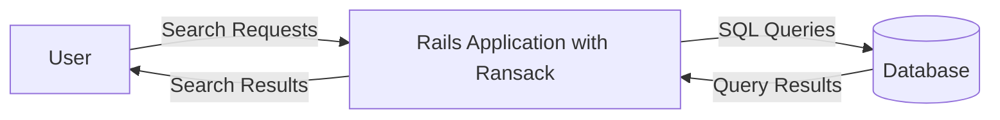
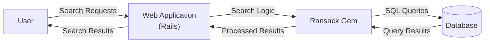
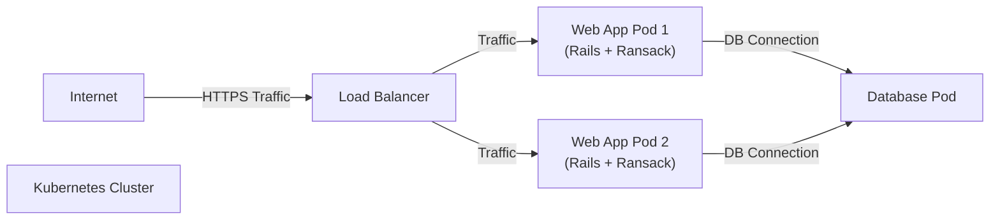
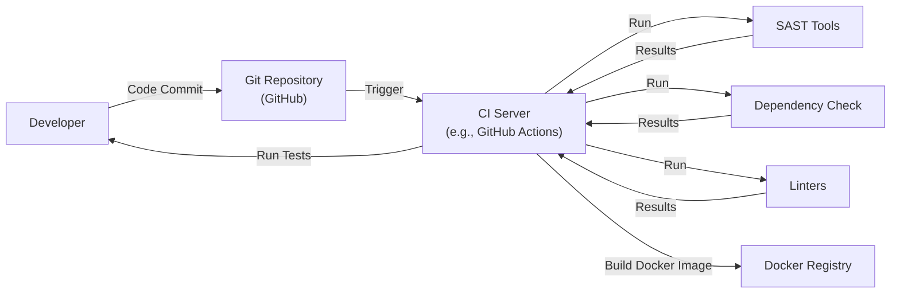

Okay, let's create a design document for the Ransack project, focusing on aspects relevant for threat modeling.

# BUSINESS POSTURE

Ransack is a Ruby gem that provides a simple and powerful way to create search forms for Ruby on Rails applications.  It simplifies the process of building complex search queries against a database.

Priorities:

-   Ease of Use:  Make it easy for developers to add search functionality to their applications.
-   Flexibility:  Support a wide range of search conditions and options.
-   Performance:  Generate efficient database queries.
-   Maintainability:  Keep the codebase clean, well-tested, and easy to update.
-   Compatibility: Maintain compatibility with supported versions of Rails and Ruby.

Goals:

-   Provide a user-friendly interface for building search forms.
-   Abstract away the complexities of constructing SQL queries.
-   Enable developers to quickly implement search features.

Business Risks:

-   Data Exposure:  Improperly configured or used Ransack could lead to unintended data exposure, allowing users to access data they shouldn't.
-   Performance Degradation:  Complex or poorly constructed searches could lead to slow database queries, impacting application performance.
-   Denial of Service:  Specially crafted search requests could potentially be used to overload the database, leading to a denial of service.
-   SQL Injection: Although Ransack aims to prevent it, vulnerabilities or misconfigurations could potentially open up SQL injection attack vectors.
-   Dependency Issues: Vulnerabilities in Ransack's dependencies could introduce security risks.

# SECURITY POSTURE

Existing Security Controls:

-   security control: Parameter Sanitization: Ransack sanitizes search parameters to help prevent SQL injection. (Implemented within the Ransack gem's code.)
-   security control: Whitelisting Attributes:  Developers are encouraged to whitelist the attributes that can be searched, limiting the scope of potential attacks. (Described in Ransack's documentation and best practices.)
-   security control: Predicate Definitions: Ransack uses predefined predicates (e.g., `_eq`, `_cont`, `_gt`) which helps control the types of queries that can be constructed. (Implemented within the Ransack gem's code.)
-   security control: Regular Updates: The Ransack project is actively maintained, and security updates are released as needed. (Managed through the RubyGems platform and GitHub.)

Accepted Risks:

-   accepted risk: Developer Misconfiguration:  The primary responsibility for secure usage of Ransack lies with the developers implementing it.  Ransack provides tools, but incorrect usage can still lead to vulnerabilities.
-   accepted risk: Limited Control over Underlying Database: Ransack generates SQL queries, but the ultimate security of the database relies on the database's own configuration and security measures.
-   accepted risk: Dependency Vulnerabilities: While Ransack itself may be secure, vulnerabilities in its dependencies (e.g., ActiveRecord) could introduce risks.

Recommended Security Controls:

-   security control: Input Validation: Implement robust input validation on the application level, *before* data reaches Ransack, to further restrict the types of searches allowed.
-   security control: Rate Limiting: Implement rate limiting on search requests to mitigate denial-of-service attacks.
-   security control: Regular Security Audits: Conduct regular security audits of the application code, including how Ransack is used, to identify potential vulnerabilities.
-   security control: Monitoring and Alerting: Implement monitoring and alerting to detect unusual search patterns or potential attacks.

Security Requirements:

-   Authentication: Ransack itself does not handle authentication. The application using Ransack *must* implement proper authentication to ensure only authorized users can perform searches.
-   Authorization: The application using Ransack *must* implement authorization to control which data each user can access through search. Ransack's whitelisting features can assist with this, but application-level authorization is crucial.
-   Input Validation: As mentioned above, strict input validation is required *before* data is passed to Ransack. This should include validating data types, lengths, and allowed characters.
-   Cryptography: Ransack does not directly handle cryptography. If sensitive data is being searched, the application should ensure this data is encrypted at rest and in transit, independent of Ransack.

# DESIGN

## C4 CONTEXT

Elements Description:

-   Element:
    -   Name: User
    -   Type: Person
    -   Description: A user of the Rails application who interacts with search forms.
    -   Responsibilities: Initiates search requests by submitting forms.
    -   Security controls: Authentication and authorization are handled by the Rails application, not Ransack itself.

-   Element:
    -   Name: Rails Application with Ransack
    -   Type: Software System
    -   Description: A Ruby on Rails application that utilizes the Ransack gem for search functionality.
    -   Responsibilities: Handles user requests, processes search parameters using Ransack, interacts with the database, and renders search results.
    -   Security controls: Parameter sanitization, attribute whitelisting, predicate definitions (all provided by Ransack). Application-level input validation, authentication, and authorization.

-   Element:
    -   Name: Database
    -   Type: Database
    -   Description: The database that stores the data being searched.
    -   Responsibilities: Stores and retrieves data based on SQL queries generated by Ransack.
    -   Security controls: Database-level security controls (e.g., access control, encryption), independent of Ransack.

## C4 CONTAINER

Elements Description:

-   Element:
    -   Name: User
    -   Type: Person
    -   Description: A user of the Rails application.
    -   Responsibilities: Initiates search requests.
    -   Security controls: Authentication and authorization (handled by the Web Application).

-   Element:
    -   Name: Web Application (Rails)
    -   Type: Web Application
    -   Description: The Ruby on Rails application that handles user interactions and business logic.
    -   Responsibilities: Handles HTTP requests, renders views, interacts with models and the Ransack gem.
    -   Security controls: Input validation, authentication, authorization, session management.

-   Element:
    -   Name: Ransack Gem
    -   Type: Library/Gem
    -   Description: The Ransack gem, providing search functionality.
    -   Responsibilities: Translates search parameters into SQL queries.
    -   Security controls: Parameter sanitization, attribute whitelisting, predicate definitions.

-   Element:
    -   Name: Database
    -   Type: Database
    -   Description: The database storing the application data.
    -   Responsibilities: Stores and retrieves data.
    -   Security controls: Database-level security controls (access control, encryption).

## DEPLOYMENT

Possible deployment solutions:

1.  Traditional Server Deployment (e.g., using Capistrano, Passenger, and a server like Nginx or Apache).
2.  Containerized Deployment (e.g., using Docker, Kubernetes, and a cloud provider like AWS, GCP, or Azure).
3.  Platform-as-a-Service (PaaS) Deployment (e.g., using Heroku).

Chosen solution (for detailed description): Containerized Deployment using Docker and Kubernetes.

Elements Description:

-   Element:
    -   Name: Internet
    -   Type: External
    -   Description: The public internet.
    -   Responsibilities: Routes traffic to the application.
    -   Security controls: TLS/HTTPS encryption.

-   Element:
    -   Name: Load Balancer
    -   Type: Load Balancer
    -   Description: Distributes incoming traffic across multiple web application pods.
    -   Responsibilities: Load balancing, SSL termination.
    -   Security controls: SSL/TLS certificates, potentially a Web Application Firewall (WAF).

-   Element:
    -   Name: Kubernetes Cluster
    -   Type: Container Orchestrator
    -   Description: Manages the deployment and scaling of the application containers.
    -   Responsibilities: Orchestrates containers, manages networking, provides service discovery.
    -   Security controls: Kubernetes RBAC (Role-Based Access Control), network policies, pod security policies.

-   Element:
    -   Name: Web App Pod 1 / Web App Pod 2
    -   Type: Container (Pod)
    -   Description: Instances of the Rails application running within Docker containers.
    -   Responsibilities: Handles user requests, interacts with the database.
    -   Security controls: Container image security scanning, least privilege principles for container processes.

-   Element:
    -   Name: Database Pod
    -   Type: Container (Pod)
    -   Description: The database server running within a Docker container.
    -   Responsibilities: Stores and retrieves data.
    -   Security controls: Database-level security controls, network policies to restrict access to the database pod.

## BUILD

Build Process Description:

1.  Developer commits code to the Git repository (GitHub).
2.  A commit to the main branch triggers the CI server (e.g., GitHub Actions).
3.  The CI server runs automated tests.
4.  The CI server runs SAST (Static Application Security Testing) tools (e.g., Brakeman for Rails) to identify potential security vulnerabilities in the code.
5.  The CI server runs dependency checks (e.g., bundler-audit) to identify known vulnerabilities in project dependencies.
6.  The CI server runs linters (e.g., RuboCop) to enforce code style and identify potential code quality issues.
7.  If all tests and checks pass, the CI server builds a Docker image containing the Rails application and its dependencies (including Ransack).
8.  The Docker image is pushed to a Docker registry (e.g., Docker Hub, AWS ECR).

Security Controls:

-   security control: SAST: Static Application Security Testing tools are used to analyze the codebase for potential vulnerabilities.
-   security control: Dependency Checking: Tools like bundler-audit are used to identify known vulnerabilities in project dependencies.
-   security control: Code Review: All code changes should be reviewed by another developer before being merged.
-   security control: Least Privilege: The CI server should have only the necessary permissions to build and push the Docker image.
-   security control: Image Scanning: The Docker image should be scanned for vulnerabilities before being deployed.

# RISK ASSESSMENT

Critical Business Processes:

-   User Search: Allowing users to efficiently search for data within the application.
-   Data Retrieval: Providing accurate and timely search results.
-   Application Availability: Ensuring the application remains available and responsive, even under heavy search load.

Data Sensitivity:

-   The sensitivity of the data being searched depends entirely on the specific application using Ransack. Ransack itself does not handle data sensitivity; this is the responsibility of the application.
-   Data sensitivity levels could range from public (e.g., searching a catalog of products) to highly confidential (e.g., searching medical records or financial data). The application *must* implement appropriate security controls based on the sensitivity of the data.

# QUESTIONS & ASSUMPTIONS

Questions:

-   What specific database is being used? (Different databases have different security considerations.)
-   What is the expected search load? (This impacts performance and denial-of-service concerns.)
-   What are the specific data sensitivity levels for the applications using Ransack?
-   Are there any existing security policies or compliance requirements that need to be considered?
-   What is the team's experience level with secure coding practices?

Assumptions:

-   BUSINESS POSTURE: The development team is aware of the potential security risks associated with search functionality and is committed to implementing secure coding practices.
-   SECURITY POSTURE: The application using Ransack will implement proper authentication and authorization.
-   DESIGN: The database is configured securely, with appropriate access controls and encryption.
-   DESIGN: The deployment environment (e.g., Kubernetes cluster) is configured securely.
-   DESIGN: The CI/CD pipeline includes security checks.
-   DESIGN: Developers will follow Ransack's documentation and best practices for secure usage.