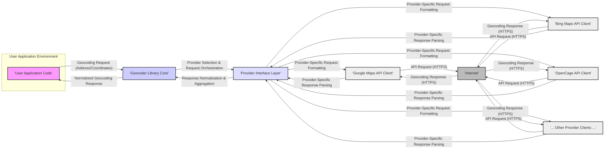

# Project Design Document: Geocoder Library

**Version:** 1.1
**Date:** October 26, 2023
**Author:** AI Software Architect

## 1. Project Overview

The `geocoder` library, as found at [https://github.com/alexreisner/geocoder](https://github.com/alexreisner/geocoder), is a Python library providing a simplified and consistent interface for geocoding (converting addresses to geographic coordinates) and reverse geocoding (converting coordinates to addresses). It acts as an abstraction layer, shielding developers from the intricacies of interacting with diverse online geocoding service providers. This allows for easier integration of geocoding functionality into Python applications by offering a uniform API regardless of the underlying provider.

This document details the architectural design, core components, and data flow of the `geocoder` library. Its primary purpose is to serve as a foundation for subsequent threat modeling exercises.

## 2. Goals

* Offer a developer-friendly Python API for geocoding and reverse geocoding tasks.
* Support integration with a variety of geocoding providers (e.g., Google Maps Platform, Bing Maps, OpenCage Geocoder, Mapbox).
* Abstract the implementation details and specific API requirements of each supported provider.
* Provide a standardized format for geocoding responses, ensuring consistency across different providers.
* Enable configuration of provider-specific parameters and authentication credentials.

## 3. Target Audience

This document is intended for:

* Security engineers and architects responsible for identifying and mitigating potential security threats.
* Software developers contributing to the development, maintenance, or integration of the `geocoder` library.
* Technical stakeholders requiring a comprehensive understanding of the library's internal workings and external interactions.

## 4. System Architecture

The `geocoder` library functions as a client-side library, facilitating communication between a user's Python application and external geocoding services via the internet. It does not maintain its own persistent data storage or backend infrastructure.

### 4.1. Key Components

* **User Application Code:** The Python application that utilizes the `geocoder` library to perform geocoding or reverse geocoding operations. This is the entry point for all geocoding requests.
* **Geocoder Library Core:** This is the central part of the library, responsible for:
    * Receiving geocoding requests from the user application.
    * Determining the appropriate geocoding provider to use based on configuration or default settings.
    * Orchestrating the request process through the Provider Interface Layer.
    * Receiving and normalizing responses from different providers.
    * Returning the standardized geocoding results to the user application.
* **Provider Interface Layer:** This layer acts as an intermediary between the Geocoder Library Core and the specific API clients for each geocoding provider. It handles:
    * Selecting the correct provider-specific client.
    * Formatting the geocoding request according to the chosen provider's API specifications. This includes handling parameter names, data types, and required headers.
    * Parsing the raw responses received from the external providers.
    * Performing initial error handling specific to each provider's API.
* **Provider-Specific API Clients:** These are modules or classes dedicated to interacting with the API of a particular geocoding service provider (e.g., Google Maps, Bing Maps). Each client is responsible for:
    * Managing API endpoint URLs.
    * Handling authentication mechanisms (e.g., API keys, OAuth tokens).
    * Constructing and sending HTTP requests to the provider's API.
    * Receiving and performing basic parsing of the provider's responses.
* **Internet:** The public network infrastructure facilitating communication between the user's application environment and the external geocoding service providers.

## 5. Data Flow

The typical data flow for a geocoding request initiated by the user application is as follows:

* The user application code invokes a geocoding function within the `geocoder` library, providing either an address string for geocoding or geographic coordinates for reverse geocoding.
* The `Geocoder Library Core` receives the request and, based on its configuration, selects a geocoding provider to handle the request. This selection might be based on explicitly configured preferences or default settings.
* The `Geocoder Library Core` passes the request to the `Provider Interface Layer`.
* The `Provider Interface Layer` selects the appropriate `Provider-Specific API Client` for the chosen provider.
* The selected API client formats the request according to the specific requirements of the provider's API. This includes structuring the request parameters, adding necessary headers, and incorporating authentication credentials (e.g., API keys).
* The API client sends an HTTPS request containing the formatted geocoding request over the internet to the designated endpoint of the external geocoding provider.
* The external geocoding provider receives the request, processes it, and generates a response containing the requested geocoding data (coordinates for an address, or address details for coordinates).
* The geocoding provider sends an HTTPS response back to the user's environment.
* The `Provider-Specific API Client` receives the HTTPS response.
* The API client parses the raw response data according to the provider's specific response format (e.g., JSON, XML).
* The parsed response is passed back to the `Provider Interface Layer`.
* The `Provider Interface Layer` normalizes the provider-specific response data into a standardized format, making the data consistent regardless of the originating provider.
* The normalized geocoding results are returned to the `Geocoder Library Core`.
* The `Geocoder Library Core` finally returns the standardized geocoding results to the user application code.

## 6. Key Components in Detail

### 6.1. Geocoder Library Core

* **Request Routing:**  Directs incoming geocoding requests to the appropriate provider based on configuration.
* **Configuration Management:** Handles the loading and management of library settings, including default providers, API keys, timeouts, and other parameters. This might involve reading from environment variables, configuration files, or programmatic settings.
* **Response Aggregation and Error Handling:**  Manages responses from different providers, potentially handling retries or fallback mechanisms if a provider fails. It also provides a consistent way to handle errors and exceptions.
* **Caching Mechanisms (Optional):** May implement caching to store previous geocoding results to reduce the number of external API calls, improving performance and potentially reducing costs. This could involve in-memory caching or integration with external caching systems.

### 6.2. Provider Interface Layer

* **Provider Registration:**  Maintains a registry of available and configured geocoding providers.
* **Request Transformation:**  Transforms generic geocoding requests into provider-specific API calls. This involves mapping parameters and ensuring data types are compatible.
* **Response Transformation:**  Transforms provider-specific responses into a common data model. This is crucial for providing a consistent experience to the user application.
* **Authentication Handling:**  Manages the retrieval and application of authentication credentials (API keys, tokens) for each provider, potentially interacting with secure storage mechanisms.

### 6.3. Provider-Specific API Clients

* **Endpoint Definitions:**  Stores the URLs for the specific API endpoints of the provider (e.g., geocoding, reverse geocoding).
* **Authentication Implementation:**  Implements the specific authentication methods required by the provider, such as adding API keys to requests or handling OAuth flows.
* **Request Construction Logic:**  Builds the HTTP requests according to the provider's API documentation, including setting headers, parameters, and request bodies.
* **Response Parsing Logic:**  Parses the provider's response format (JSON, XML, etc.) and extracts the relevant geocoding information. This often involves handling different data structures and field names.
* **Provider-Specific Error Handling:**  Handles errors returned by the provider's API, potentially translating them into more generic error codes or messages.

## 7. Security Considerations

This section outlines potential security considerations relevant to the `geocoder` library. These points will be further explored during a dedicated threat modeling exercise.

* **API Key Security:**
    * **Storage:** API keys for accessing external geocoding services are sensitive credentials. Improper storage (e.g., directly in code, insecure configuration files) can lead to unauthorized access and usage, resulting in financial costs or service disruption.
    * **Transmission:** API keys should only be transmitted over secure channels (HTTPS) to prevent interception.
    * **Exposure:** Error messages or logging should not inadvertently expose API keys.
* **Data Transmission Security:** All communication with external geocoding providers should occur over HTTPS to ensure the confidentiality and integrity of the data being transmitted (addresses, coordinates, API keys).
* **Input Validation:**
    * **Injection Attacks:** The library should sanitize and validate user-provided addresses and coordinates to prevent injection attacks (e.g., SQL injection if data is logged or stored, although this library primarily interacts with external APIs).
    * **Denial of Service:** Maliciously crafted input could potentially cause excessive resource consumption on the external provider's side or within the library itself.
* **Rate Limiting and Abuse Prevention:**
    * **Respecting Provider Limits:** The library should adhere to the rate limits imposed by the external geocoding providers to avoid being blocked or incurring extra charges.
    * **Preventing Abuse:** Mechanisms might be needed to prevent malicious users from using the library to excessively query geocoding services.
* **Dependency Management:**
    * **Vulnerable Dependencies:** The library's dependencies should be regularly updated to patch any known security vulnerabilities. Using outdated or vulnerable dependencies can introduce security risks.
    * **Supply Chain Attacks:**  Care should be taken to ensure the integrity of dependencies and prevent the introduction of malicious code through compromised packages.
* **Error Handling and Information Disclosure:** Error messages should be carefully crafted to avoid revealing sensitive information about the system's internal workings, API keys, or other confidential data.
* **Provider Security Posture:** While not directly controllable, the security practices of the external geocoding providers are relevant. Data breaches or vulnerabilities on their end could potentially impact users of the `geocoder` library.
* **Data Privacy:**  Consider the privacy implications of sending location data to third-party services. Users should be informed about the data being transmitted and the privacy policies of the providers. The library itself should not store or log sensitive location data unnecessarily.
* **Configuration Security:** If configuration files are used to store API keys or other sensitive information, appropriate file permissions and access controls should be enforced.

## 8. Future Considerations

* **Support for Batch Geocoding:** Implementing functionality to handle geocoding of multiple addresses in a single request, potentially improving efficiency.
* **Advanced Geocoding Options:**  Adding support for more advanced geocoding parameters offered by various providers (e.g., bounding boxes, language preferences).
* **Improved Caching Strategies:** Implementing more sophisticated caching mechanisms, such as using external caching services or implementing time-to-live (TTL) settings for cached results.
* **Asynchronous Operations:**  Introducing asynchronous API calls to improve performance and responsiveness in applications that require non-blocking operations.
* **Pluggable Authentication:**  Allowing users to implement custom authentication mechanisms for providers that are not directly supported.

This improved design document provides a more detailed and nuanced understanding of the `geocoder` library's architecture and potential security considerations. It serves as a more robust foundation for conducting thorough threat modeling activities.