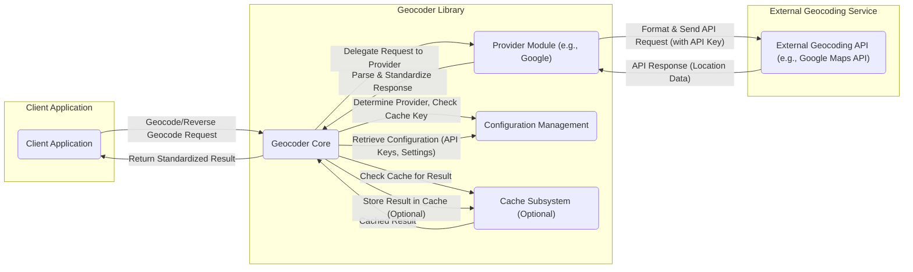

# Project Design Document: Geocoder Library

**Version:** 1.1
**Date:** October 26, 2023
**Author:** Gemini (AI Language Model)

## 1. Introduction

This document provides an enhanced design overview of the `geocoder` Python library (referenced from [https://github.com/alexreisner/geocoder](https://github.com/alexreisner/geocoder)). Building upon the initial design, this version offers greater detail and focus on aspects relevant to threat modeling. The aim is to clearly articulate the library's architecture, components, and data flow, specifically highlighting potential vulnerabilities and security considerations.

## 2. Project Overview

The `geocoder` library is a Python package designed to simplify geocoding and reverse geocoding tasks. Its core value lies in providing an abstraction layer over diverse third-party geocoding service providers (e.g., Google Maps, Bing Maps, OpenStreetMap's Nominatim). This abstraction enables developers to seamlessly switch between providers with minimal code changes, managing the underlying API complexities such as request formatting, response parsing, and error handling. The library targets developers who require location-based services in their applications but prefer not to directly interact with multiple, disparate APIs.

## 3. System Architecture

The `geocoder` library employs a modular architecture centered around the concept of interchangeable "providers."

- **Client Application:** The external software application, script, or service that utilizes the `geocoder` library to perform geocoding or reverse geocoding operations. This is the initiator of all location-based queries.
- **Geocoder Core:** The central orchestrator within the library. It receives requests from the client, determines the appropriate provider to use (based on explicit specification or default configuration), manages interactions with the selected provider, and handles optional caching.
- **Provider Modules:** Independent modules dedicated to interacting with specific geocoding service providers. Each module encapsulates the provider-specific logic for:
    - Constructing API requests according to the provider's API specifications, including necessary authentication details.
    - Transmitting HTTP requests to the provider's API endpoints over the network.
    - Processing and parsing the provider's API responses, handling various response formats (e.g., JSON, XML).
    - Managing provider-specific error conditions, rate limits, and authentication failures.
- **Configuration Management:**  The mechanism through which the library's behavior is customized. This includes settings for default providers, API keys (sensitive information), request timeouts, and caching strategies. Configuration can be sourced from environment variables, configuration files, or programmatic settings.
- **Cache Subsystem (Optional):** An optional component responsible for storing geocoding results to reduce redundant external API calls, thereby improving performance and potentially reducing costs. The cache can be implemented in various ways (in-memory, file-based, external cache).

## 4. Detailed Component Design

### 4.1. Client Application

- **Functionality:** Initiates geocoding or reverse geocoding requests to the `geocoder` library.
- **Attack Surface Considerations:**
    - **Data Injection:** If the client application doesn't sanitize input before passing it to the `geocoder` library, it could potentially lead to issues within the library or the external API.
    - **Exposure of Sensitive Data:** If the client application handles the returned geocoding data insecurely, it could expose location information.
- **Inputs:**
    - Address string (for geocoding).
    - Latitude and longitude coordinates (for reverse geocoding).
    - Optional parameters: provider name, API keys (if overriding global configuration), timeout values, and other provider-specific parameters.
- **Outputs:**
    - Geocoding results: latitude, longitude, formatted address, accuracy, and other relevant details.
    - Reverse geocoding results: address components (street, city, state, postal code, country), and potentially administrative areas.
    - Error information indicating failures in the geocoding process.

### 4.2. Geocoder Core

- **Functionality:**  Receives client requests, selects the appropriate provider, interacts with the cache, delegates requests to provider modules, standardizes responses, and returns results.
- **Attack Surface Considerations:**
    - **Provider Forcing/Manipulation:**  If the client can arbitrarily specify the provider, it might be possible to target providers with known vulnerabilities or different security postures.
    - **Cache Poisoning:** If the caching mechanism is not properly secured, malicious actors might be able to inject incorrect data into the cache.
    - **Configuration Vulnerabilities:** If the configuration loading mechanism is flawed, attackers might be able to inject malicious configurations (e.g., using their own API keys).
- **Inputs:**
    - Address string or coordinates from the client.
    - Explicit provider name (optional).
    - API keys (passed internally or retrieved from configuration).
    - Configuration settings loaded at initialization.
- **Outputs:**
    - Standardized geocoding/reverse geocoding results.
    - Error indications, potentially including information about the failing provider.

### 4.3. Provider Modules (Example: Google, Nominatim)

- **Functionality:**  Formats requests, handles authentication, sends HTTP requests to external APIs, parses responses, and handles provider-specific errors.
- **Attack Surface Considerations:**
    - **API Key Exposure:**  Improper handling or logging of API keys within the provider module could lead to their compromise.
    - **Request Tampering:** Although less likely within the library itself, vulnerabilities in how requests are constructed could potentially be exploited.
    - **Response Parsing Vulnerabilities:**  Bugs in the parsing logic could lead to denial-of-service or other issues if malicious or unexpected responses are received.
    - **Insecure Communication:** If the module doesn't enforce HTTPS for API communication, it's vulnerable to man-in-the-middle attacks.
- **Inputs:**
    - Address string or coordinates.
    - API keys (retrieved from configuration).
    - Provider-specific parameters.
- **Outputs:**
    - Raw response from the external provider's API.
    - Parsed and standardized geocoding/reverse geocoding results.
    - Provider-specific error details (e.g., authentication failures, rate limit exceeded).

### 4.4. Configuration Management

- **Functionality:** Loads, stores, and provides access to configuration settings, including sensitive API keys.
- **Attack Surface Considerations:**
    - **Exposure of API Keys:** If configuration files are stored insecurely or environment variables are exposed, API keys can be compromised.
    - **Configuration Injection:**  If the configuration loading process is vulnerable, attackers might be able to inject malicious configuration values.
- **Inputs:**
    - Environment variables.
    - Configuration files (e.g., `.ini`, `.yaml`, `.json`).
    - Programmatic configuration settings.
- **Outputs:**
    - API keys for various providers.
    - Default provider selection.
    - Timeout settings for API requests.
    - Cache configuration parameters.

### 4.5. Cache Subsystem (Optional)

- **Functionality:** Stores and retrieves geocoding results based on request parameters.
- **Attack Surface Considerations:**
    - **Cache Poisoning:**  An attacker might be able to insert false or misleading geocoding data into the cache.
    - **Cache Exfiltration:** If the cache storage is not properly secured, an attacker might be able to access and steal cached location data.
    - **Denial of Service:**  An attacker might be able to fill the cache with invalid entries, potentially impacting performance.
- **Inputs:**
    - Geocoding/reverse geocoding request parameters (used as cache keys).
    - Standardized geocoding/reverse geocoding results.
- **Outputs:**
    - Cached geocoding/reverse geocoding results.

## 5. Data Flow

**Data Flow Description:**

1. The **Client Application** initiates a geocoding or reverse geocoding request to the **Geocoder Core**.
2. The **Geocoder Core** interacts with **Configuration Management** to determine the appropriate provider and retrieve necessary API keys and settings. It also checks the **Cache Subsystem** using the request parameters as a key.
3. If a matching result exists in the **Cache Subsystem**, it returns the cached result to the **Geocoder Core**, bypassing the external API call.
4. If no cached result is found, the **Geocoder Core** delegates the request to the selected **Provider Module**.
5. The **Provider Module** formats the request according to the **External Geocoding API's** specifications, including the API key obtained from the **Configuration Management**, and sends the API request.
6. The **External Geocoding API** processes the request and returns a response containing location data.
7. The **Provider Module** parses and standardizes the API response.
8. The **Geocoder Core** optionally stores the standardized result in the **Cache Subsystem**.
9. The **Geocoder Core** returns the standardized geocoding or reverse geocoding result to the **Client Application**.

## 6. Security Considerations

This section details potential security considerations relevant to the `geocoder` library, categorized by component and data flow.

- **Client Application:**
    - **Input Sanitization:** Ensure the client application properly sanitizes address strings and coordinates before passing them to the library to prevent potential injection vulnerabilities in downstream components or external APIs.
    - **Secure Handling of Results:** The client application should handle the returned location data securely, considering its sensitivity.

- **Geocoder Core:**
    - **Provider Validation:**  Implement checks to ensure that only configured and trusted providers can be selected.
    - **Cache Security:** If caching is enabled, ensure the cache implementation is secure against poisoning and exfiltration. Use appropriate access controls and consider encryption for sensitive cached data.
    - **Configuration Loading Security:**  Implement secure mechanisms for loading configuration to prevent injection of malicious settings. Avoid storing sensitive information directly in code.

- **Provider Modules:**
    - **Secure API Key Management:**  Retrieve API keys securely from the configuration and avoid logging or storing them unnecessarily. Consider using secrets management solutions.
    - **Enforce HTTPS:**  Ensure that all communication with external geocoding APIs is conducted over HTTPS to protect against man-in-the-middle attacks.
    - **Response Validation:**  Implement robust validation of responses received from external APIs to prevent parsing vulnerabilities.
    - **Error Handling:**  Handle API errors gracefully without exposing sensitive information about the API interaction or internal workings.

- **Configuration Management:**
    - **Secure Storage:** Store configuration files containing API keys securely with appropriate file system permissions. Avoid committing sensitive information to version control.
    - **Environment Variable Security:**  Be mindful of how environment variables are managed and ensure they are not inadvertently exposed.
    - **Principle of Least Privilege:** Grant only necessary permissions to access configuration data.

- **Cache Subsystem:**
    - **Access Control:** Implement access controls to restrict who can read from and write to the cache.
    - **Data Encryption:** Consider encrypting sensitive data stored in the cache.
    - **Cache Invalidation:** Implement mechanisms to invalidate cached data when necessary.

- **Data Flow:**
    - **API Key Transmission:** Ensure API keys are transmitted securely to external APIs (typically within HTTPS headers).
    - **Data Sensitivity:** Recognize that location data can be sensitive and implement appropriate security measures throughout the data flow.

## 7. Assumptions and Constraints

- The client application is assumed to be a trusted entity, although it should still practice secure coding principles.
- The security of the external geocoding APIs is the responsibility of the respective providers. This library focuses on securing its interaction with these APIs.
- This design document assumes that the primary security concerns revolve around confidentiality and integrity of data and preventing unauthorized access or usage of API keys.
- The focus is on the security of the `geocoder` library itself and its direct dependencies. Security considerations for the client application's environment are outside the scope of this document.

## 8. Glossary

- **Geocoding:** The process of converting human-readable addresses into geographic coordinates (latitude and longitude).
- **Reverse Geocoding:** The process of converting geographic coordinates into a human-readable address or location description.
- **API (Application Programming Interface):** A defined set of rules and specifications that software components can use to communicate with each other.
- **Provider:** In the context of this library, a specific third-party geocoding service (e.g., Google Maps Geocoding API, OpenStreetMap Nominatim).
- **API Key:** A secret key used to authenticate requests to an external API.
- **HTTPS (Hypertext Transfer Protocol Secure):** A secure version of HTTP that encrypts communication between a client and a server.
- **Man-in-the-Middle Attack:** A type of cyberattack where the attacker secretly relays and potentially alters the communication between two parties who believe they are directly communicating with each other.
- **Cache Poisoning:** A type of attack where an attacker injects false or malicious data into a cache.
- **Cache Exfiltration:** The unauthorized removal of data from a cache.
