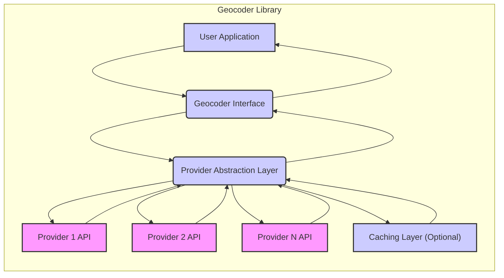
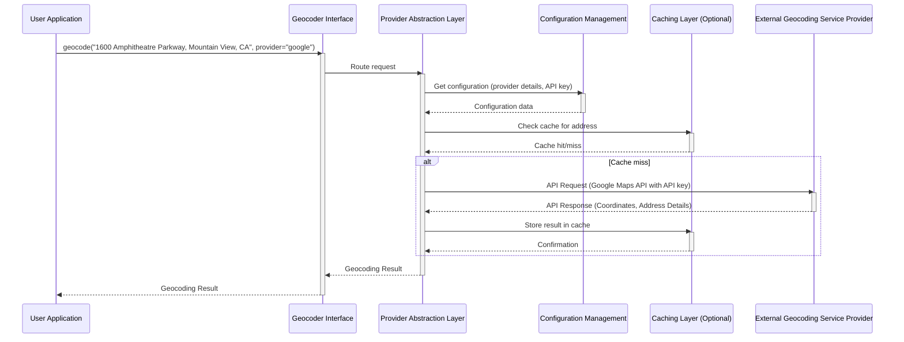

# Project Design Document: Geocoder Library

**Version:** 1.1
**Date:** October 26, 2023
**Author:** Gemini (AI Language Model)

## 1. Introduction

This document provides an enhanced and more detailed design overview of the `geocoder` Python library (available at [https://github.com/alexreisner/geocoder](https://github.com/alexreisner/geocoder)). This revised document aims to provide a stronger foundation for future threat modeling activities by offering a clearer and more comprehensive understanding of the library's architecture, components, and data flow. We have expanded on key areas and provided more specific examples to aid in identifying potential security vulnerabilities.

## 2. Goals

*   Provide a comprehensive and detailed description of the `geocoder` library's design.
*   Clearly identify key components, their specific responsibilities, and their interactions.
*   Illustrate the data flow within the library with greater clarity and detail.
*   Highlight potential areas of interest for security analysis and threat modeling with more specific examples and categorization.

## 3. Overview

The `geocoder` library is a Python package designed to simplify the process of geocoding (converting addresses to geographic coordinates) and reverse geocoding (converting geographic coordinates to addresses). It acts as an abstraction layer over various third-party geocoding service providers (e.g., Google Maps, Bing Maps, OpenCage, Mapbox, etc.). This abstraction allows developers to switch between providers with minimal code changes, offering flexibility and resilience.

The library's core functionality involves taking an address string or a latitude/longitude tuple as input and returning the corresponding geographic coordinates or address information, respectively. It manages the complexities of API communication with external services, including request formatting, response parsing, handling API keys (where required), and providing a consistent and user-friendly interface for accessing geocoding data. The library may also incorporate features like caching to improve performance and reduce unnecessary API calls.

## 4. Detailed Design

### 4.1. Components

*   **User Application:** The external application, script, or service that utilizes the `geocoder` library to perform geocoding or reverse geocoding operations. This is the client of the library.
*   **Geocoder Interface:** The public API of the library, serving as the primary entry point for developers. It provides user-friendly functions for initiating geocoding and reverse geocoding requests. This component is responsible for:
    *   Receiving address strings or coordinate tuples from the User Application.
    *   Performing basic input validation (e.g., checking for empty strings or invalid coordinate formats).
    *   Potentially offering options for specifying the preferred provider or other request parameters.
    *   Returning standardized geocoding results to the User Application, regardless of the underlying provider.
    *   Key functions:
        *   `geocode(address, provider=None, **kwargs)`: Converts an address string to geographic coordinates.
        *   `reverse_geocode(latlng, provider=None, **kwargs)`: Converts a latitude/longitude tuple to address information.
*   **Provider Abstraction Layer:** The core of the library's architecture. This component acts as an intermediary between the Geocoder Interface and the various External Geocoding Service Providers. Its responsibilities include:
    *   Determining the appropriate provider to use for a given request, based on configuration or user-specified parameters.
    *   Constructing provider-specific API requests, including formatting the input data according to the provider's API specifications.
    *   Managing API keys and authentication credentials for different providers, securely accessing them from configuration.
    *   Handling communication with the External Geocoding Service Providers over the network (typically using HTTP/HTTPS).
    *   Implementing retry logic and error handling for API calls to external providers.
    *   Parsing and normalizing the responses received from different providers into a consistent data format.
    *   Interacting with the optional Caching Layer to retrieve or store geocoding results.
*   **External Geocoding Service Providers:** These are the third-party APIs that perform the actual geocoding and reverse geocoding. Each provider has its own API endpoints, request formats, response structures, and terms of service. Examples include:
    *   Google Maps Geocoding API (requires API key).
    *   Bing Maps Location API (requires API key).
    *   OpenCage Geocoder (requires API key).
    *   Nominatim (OpenStreetMap - often rate-limited or requiring specific usage policies).
    *   Mapbox Geocoding API (requires API key).
    *   Here (requires API key).
*   **Caching Layer (Optional):** A component responsible for storing previously fetched geocoding results to improve performance and reduce the number of calls to external APIs. This can significantly reduce latency and cost.
    *   Potential implementations:
        *   In-memory caching (simple but volatile).
        *   File-based caching.
        *   Integration with external caching systems like Redis or Memcached.
    *   Key considerations: cache invalidation strategies, cache eviction policies, and the potential for stale data.
*   **Configuration Management:** Handles the loading and management of the library's configuration settings. This component is crucial for flexibility and security.
    *   Configuration parameters may include:
        *   The default geocoding provider.
        *   API keys and other authentication credentials for different providers.
        *   Timeout settings for API requests.
        *   Proxy settings for network communication.
        *   Caching behavior (enabled/disabled, cache duration, etc.).
    *   Configuration sources might include:
        *   Environment variables.
        *   Configuration files (e.g., JSON, YAML).
        *   Programmatic configuration through code.
*   **Error Handling and Logging:**  Manages errors encountered during the geocoding process, such as network issues, API errors from external providers, or invalid input. This component also handles logging of important events for debugging and monitoring.
    *   Responsibilities include:
        *   Catching exceptions and handling errors gracefully.
        *   Providing informative error messages to the User Application.
        *   Logging errors, warnings, and informational messages.
        *   Potentially implementing retry mechanisms for transient errors.

### 4.2. Data Flow

The following outlines a more detailed data flow for a geocoding request:

1. The **User Application** initiates a geocoding request by calling the `geocode()` function in the **Geocoder Interface**, providing an address string and potentially specifying a preferred provider or other options.
2. The **Geocoder Interface** receives the request, performs initial input validation (e.g., checks if the address is a non-empty string), and prepares the request for processing.
3. The **Geocoder Interface** passes the request to the **Provider Abstraction Layer**.
4. The **Provider Abstraction Layer** consults the **Configuration Management** component to determine the appropriate **External Geocoding Service Provider** to use for this request (either the default provider or a provider specified in the request).
5. The **Provider Abstraction Layer** checks the **Caching Layer (Optional)** to see if a valid cached result exists for the given address.
    *   If a valid cached result is found, the **Caching Layer** returns the result to the **Provider Abstraction Layer**, which then returns it to the **Geocoder Interface**, bypassing the external API call.
    *   If no valid cached result is found, the process continues.
6. The **Provider Abstraction Layer** retrieves the necessary API key or credentials for the selected provider from the **Configuration Management** component.
7. The **Provider Abstraction Layer** constructs the API request according to the selected provider's API specifications, including formatting the address and adding authentication credentials.
8. The **Provider Abstraction Layer** sends the API request over the network (typically HTTPS) to the **External Geocoding Service Provider**.
9. The **External Geocoding Service Provider** processes the request and returns an API response containing geographic coordinates and potentially other relevant information (e.g., address components, accuracy, place ID).
10. The **Provider Abstraction Layer** receives the API response. The **Error Handling and Logging** component may be involved here to handle potential network errors or API errors.
11. The **Provider Abstraction Layer** parses the response, extracting the relevant geocoding data. It may also normalize the data into a consistent format, regardless of the provider's response structure.
12. If the request was successful and caching is enabled, the **Provider Abstraction Layer** (or a dedicated function within it) stores the geocoding result in the **Caching Layer**, along with appropriate metadata (e.g., timestamp, provider used).
13. The **Provider Abstraction Layer** returns the standardized geocoding result to the **Geocoder Interface**.
14. The **Geocoder Interface** returns the result to the **User Application**.

A similar data flow occurs for reverse geocoding requests, with the input being latitude and longitude coordinates.

### 4.3. Configuration Details

Configuration of the `geocoder` library is crucial for its functionality and security. Key aspects include:

*   **Provider Selection:** Specifying the default geocoding provider to be used when no provider is explicitly specified in the request.
*   **API Key Management:** Securely storing and accessing API keys or other authentication credentials required by different providers. This should ideally avoid hardcoding keys directly in the code.
    *   Recommended practices:
        *   Using environment variables.
        *   Storing keys in secure configuration files with restricted access.
        *   Utilizing dedicated secret management services.
*   **Request Parameters:** Setting default values for request parameters such as timeouts, proxies, and language preferences.
*   **Caching Configuration:** Enabling or disabling caching, setting the cache duration (TTL - Time To Live), and configuring the caching backend (e.g., in-memory, Redis).
*   **Logging Configuration:** Configuring the level of logging detail and the destination for log messages.

## 5. Security Considerations (For Threat Modeling)

This section provides a more detailed breakdown of potential security considerations, categorized for clarity during threat modeling.

### 5.1. API Key and Credential Management

*   **Threat:** Exposure of API keys.
    *   **Description:** API keys, if exposed (e.g., hardcoded in code, committed to version control, insecurely stored in configuration files), can be misused by malicious actors to make unauthorized requests, potentially incurring costs or exceeding usage limits.
    *   **Mitigation Considerations:** Utilize environment variables, secure configuration files with restricted permissions, or dedicated secret management solutions. Avoid hardcoding keys.
*   **Threat:** Unauthorized access to configuration.
    *   **Description:** If configuration files containing API keys are not properly protected, unauthorized users or processes could gain access to sensitive credentials.
    *   **Mitigation Considerations:** Implement appropriate file system permissions, encryption for sensitive configuration data.

### 5.2. Input Validation and Data Handling

*   **Threat:** Injection attacks (e.g., through address strings).
    *   **Description:** While less likely in direct geocoding, if the library were to process or store address data without proper sanitization, it could be vulnerable to injection attacks in other parts of an application.
    *   **Mitigation Considerations:** Implement robust input validation on address strings and coordinates. Sanitize data before storing or processing it further.
*   **Threat:** Exposure of sensitive location data.
    *   **Description:** If the library is used to geocode or reverse geocode sensitive locations, ensuring the privacy and security of this data is crucial.
    *   **Mitigation Considerations:** Understand the data handling policies of the chosen geocoding providers. Consider encryption for sensitive data in transit and at rest within the application using the library.

### 5.3. Network Communication and External Dependencies

*   **Threat:** Man-in-the-Middle (MITM) attacks.
    *   **Description:** Communication with external geocoding providers occurs over the network. If HTTPS is not enforced, attackers could intercept and potentially modify requests or responses.
    *   **Mitigation Considerations:** Ensure that the library always uses HTTPS for communication with external providers. Verify SSL/TLS certificates.
*   **Threat:** Dependency vulnerabilities.
    *   **Description:** The `geocoder` library likely relies on other Python packages. Vulnerabilities in these dependencies could introduce security risks.
    *   **Mitigation Considerations:** Regularly update dependencies and use tools to scan for known vulnerabilities.
*   **Threat:** Reliance on third-party provider security.
    *   **Description:** The security of the geocoding process is partially dependent on the security of the external providers.
    *   **Mitigation Considerations:** Choose reputable providers with strong security practices. Be aware of their security policies and any reported incidents.

### 5.4. Rate Limiting and Denial of Service

*   **Threat:** Exceeding API rate limits.
    *   **Description:**  Making excessive requests to external providers can lead to temporary blocking or suspension of service.
    *   **Mitigation Considerations:** Implement appropriate retry mechanisms with exponential backoff. Utilize caching to reduce the number of external API calls.
*   **Threat:** Denial-of-Service (DoS) attacks.
    *   **Description:** Malicious actors could attempt to overload the library by sending a large number of geocoding requests.
    *   **Mitigation Considerations:** Implement rate limiting within the application using the library. Monitor API usage and set up alerts for unusual activity.

### 5.5. Caching Security

*   **Threat:** Cache poisoning.
    *   **Description:** If the caching mechanism is not properly secured, attackers could potentially inject malicious data into the cache, leading to incorrect geocoding results.
    *   **Mitigation Considerations:** Ensure the integrity of the cached data. Use secure caching mechanisms and validate data retrieved from the cache.
*   **Threat:** Exposure of cached data.
    *   **Description:** Depending on the caching implementation, cached data might be stored in a way that is accessible to unauthorized users or processes.
    *   **Mitigation Considerations:** Secure the caching layer appropriately, considering the sensitivity of the cached data.

### 5.6. Error Handling and Logging

*   **Threat:** Information leakage through error messages.
    *   **Description:** Verbose error messages could reveal sensitive information about the library's internal workings or configuration.
    *   **Mitigation Considerations:** Ensure error messages are informative for debugging but do not expose sensitive details.
*   **Threat:** Insufficient logging.
    *   **Description:** Lack of adequate logging can hinder security monitoring and incident response.
    *   **Mitigation Considerations:** Implement comprehensive logging of important events, including API requests, errors, and configuration changes.

## 6. Deployment

The `geocoder` library is typically deployed as a dependency within a larger Python application. Security considerations for deployment include:

*   **Secure Environment:** Deploying the application in a secure environment with appropriate access controls.
*   **Dependency Management:** Ensuring that all dependencies are up-to-date and free from vulnerabilities in the deployment environment.
*   **Configuration Management:** Securely managing configuration settings, including API keys, in the deployed environment.

## 7. Future Considerations

*   **Asynchronous Requests:** Implementing asynchronous API calls could improve performance but might introduce new complexities for error handling and security.
*   **Batch Geocoding:** Supporting batch processing could increase the potential impact of vulnerabilities if not handled carefully.
*   **More Provider Integrations:** Adding more providers increases the attack surface if not done with security in mind.
*   **Advanced Error Handling and Retries:** More sophisticated error handling should be implemented securely to avoid unintended consequences.

This enhanced design document provides a more detailed and structured overview of the `geocoder` library, specifically focusing on aspects relevant to threat modeling. The categorized security considerations offer a more comprehensive starting point for identifying and mitigating potential risks.