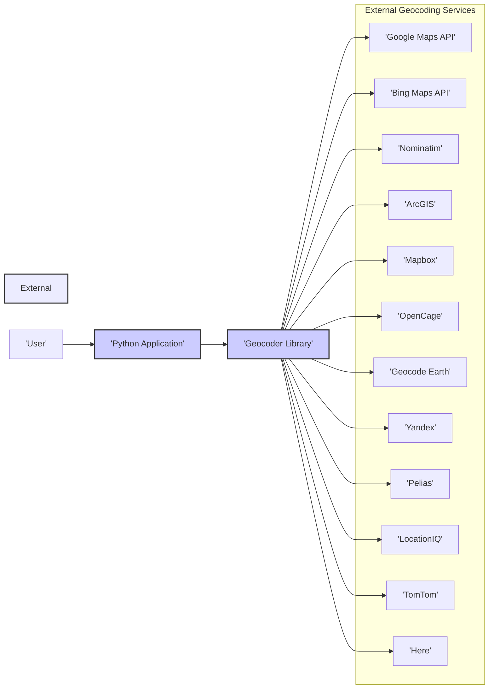

# BUSINESS POSTURE

- Business Priorities and Goals:
  - Provide a user-friendly and versatile Python library for geocoding and reverse geocoding.
  - Simplify the integration of location-based services into Python applications.
  - Support multiple geocoding providers to offer flexibility and redundancy.
- Business Risks:
  - Risk of inaccurate geocoding results leading to errors in applications relying on location data.
  - Risk of dependency on external geocoding services, which may introduce availability, performance, or cost variability.
  - Risk of security vulnerabilities within the library that could be exploited by applications using it.
  - Risk of improper handling of location data, potentially leading to privacy violations or compliance issues depending on the application context.

# SECURITY POSTURE

- Existing Security Controls:
  - security control: Open Source Code - The library is publicly available on GitHub, allowing for community review and scrutiny. (Implemented: GitHub repository)
  - security control: Dependency Management - Dependencies are listed in `requirements.txt`, facilitating dependency tracking and management. (Implemented: `requirements.txt`)
- Accepted Risks:
  - accepted risk: Reliance on Third-Party Geocoding Services - The library depends on external geocoding services for its core functionality, inheriting their security and availability risks.
- Recommended Security Controls:
  - security control: Input Validation - Implement robust input validation to sanitize address inputs and prevent injection attacks or data corruption.
  - security control: Dependency Scanning - Regularly scan dependencies for known vulnerabilities and update them promptly.
  - security control: Rate Limiting/Usage Quotas - Consider implementing rate limiting or usage quotas within applications using this library to prevent abuse of geocoding services and potential denial-of-service scenarios.
- Security Requirements:
  - Authentication: Not directly applicable to the library itself, but applications using the library will need to handle authentication for accessing geocoding services if required by the provider.
  - Authorization: Not directly applicable to the library itself, but applications using the library will need to manage authorization for accessing geocoding services based on the provider's requirements and user permissions.
  - Input Validation: Essential for all input parameters, especially address strings, to prevent injection vulnerabilities and ensure data integrity. Validation should be performed on both the client and server side (if applicable in the context of the application using the library).
  - Cryptography: May be relevant if applications using this library handle sensitive location data. Encryption in transit (HTTPS) and at rest should be considered for sensitive location information depending on the application's data protection requirements.

# DESIGN

## C4 CONTEXT



- Context Diagram Elements:
  - - Name: User
    - Type: Person
    - Description: End-user interacting with the Python Application.
    - Responsibilities: Initiates requests to the Python Application that may require geocoding or reverse geocoding services.
    - Security controls: User authentication and authorization are typically handled by the Python Application, not directly by the Geocoder Library.
  - - Name: Python Application
    - Type: Software System
    - Description: A Python-based application that utilizes the Geocoder Library to provide location-based features to users.
    - Responsibilities: Handles user requests, integrates with the Geocoder Library for geocoding and reverse geocoding, processes results, and presents information to the user. Manages API keys and access to geocoding services.
    - Security controls: Input validation, output encoding, session management, authentication, authorization, error handling, logging and monitoring.
  - - Name: Geocoder Library
    - Type: Software System
    - Description: A Python library that provides an interface for geocoding and reverse geocoding using various external geocoding services.
    - Responsibilities: Accepts address strings or coordinates as input, interacts with configured geocoding services, parses responses, and returns geocoding results to the Python Application.
    - Security controls: Input validation within the library to handle malformed requests, dependency management, error handling, and documentation on secure usage.
  - - Name: External Geocoding Services (Google Maps API, Bing Maps API, etc.)
    - Type: External System
    - Description: Third-party APIs that provide geocoding and reverse geocoding services over the internet.
    - Responsibilities: Receive geocoding requests from the Geocoder Library, perform geocoding or reverse geocoding operations, and return results. Manage API keys, usage quotas, and service availability.
    - Security controls: API key management, rate limiting, access controls, and their own internal security measures. Security posture is managed by the respective service providers.

## C4 CONTAINER

```mermaid
flowchart LR
    subgraph Python Application
        direction TB
        P["'Python Application'"]
        style Python Application fill:#f9f,stroke:#333,stroke-width:2px
    end
    subgraph Geocoder Library
        direction TB
        O["'Geocoder Library'"]
        subgraph Providers
            direction TB
            A["'Google Provider'"]
            B["'Bing Provider'"]
            C["'Nominatim Provider'"]
            D["'ArcGIS Provider'"]
            E["'Mapbox Provider'"]
            F["'OpenCage Provider'"]
            G["'Geocode Earth Provider'"]
            H["'Yandex Provider'"]
            I["'Pelias Provider'"]
            J["'LocationIQ Provider'"]
            K["'TomTom Provider'"]
            L["'Here Provider'"]
            style Providers fill:#eee,stroke:#333,stroke-width:2px
        end
        subgraph Core
            direction TB
            M["'Geocoding Module'"]
            N["'Reverse Geocoding Module'"]
            Q["'Configuration Module'"]
            style Core fill:#eee,stroke:#333,stroke-width:2px
        end
        O --> Providers
        O --> Core
        style Geocoder Library fill:#ccf,stroke:#333,stroke-width:2px
    end
    P --> O
    Providers --> ExternalGeocodingServices["'External Geocoding Services'"]
    style P fill:#ccf,stroke:#333,stroke-width:2px
```



- Container Diagram Elements:
  - - Name: Python Application
    - Type: Application
    - Description: The Python application that integrates and uses the Geocoder Library to provide location-based functionalities.
    - Responsibilities: User interaction, business logic, managing API keys, handling geocoding results, and overall application security.
    - Security controls: Application-level security controls including authentication, authorization, session management, input validation, output encoding, secure configuration management, logging, and monitoring.
  - - Name: Geocoder Library
    - Type: Library
    - Description: The Python library providing geocoding and reverse geocoding functionalities. It is composed of core modules and provider-specific modules.
    - Responsibilities: Encapsulates geocoding logic, provides a consistent API for the Python Application, handles interactions with different geocoding providers, and parses responses.
    - Security controls: Input validation within the library, secure handling of API requests (though API key management is external), dependency management, and clear documentation on secure usage.
  - - Name: Core Modules (Geocoding Module, Reverse Geocoding Module, Configuration Module)
    - Type: Module
    - Description: Internal modules within the Geocoder Library responsible for core functionalities like processing geocoding and reverse geocoding requests, and managing library configuration.
    - Responsibilities: Implementing the core logic of geocoding and reverse geocoding, managing configuration options, and providing internal APIs for provider modules.
    - Security controls: Internal code reviews, unit testing, and input validation within modules.
  - - Name: Provider Modules (Google Provider, Bing Provider, etc.)
    - Type: Module
    - Description: Modules within the Geocoder Library that handle interactions with specific external geocoding services. Each provider module is responsible for communicating with a particular geocoding API.
    - Responsibilities: Constructing API requests for specific geocoding services, sending requests, handling API responses, error handling specific to each service, and adapting data formats.
    - Security controls: Secure handling of API requests, error handling, and potentially some input sanitization specific to the requirements of each external API.
  - - Name: External Geocoding Services
    - Type: External System
    - Description: Third-party geocoding APIs used by the Provider Modules to perform actual geocoding and reverse geocoding.
    - Responsibilities: Providing geocoding and reverse geocoding services, managing API infrastructure, and ensuring service availability and security.
    - Security controls: Managed by the respective third-party service providers. Applications using the Geocoder Library rely on the security controls of these external services.

## DEPLOYMENT

For a Python library, deployment is typically about making it available for use in Python environments. A common deployment scenario is using PyPI (Python Package Index).

```mermaid
flowchart LR
    subgraph Developer Machine
        direction TB
        Dev["'Developer'"]
        Code["'Geocoder Library Code'"]
        Dev --> Code
        style Developer Machine fill:#f9f,stroke:#333,stroke-width:2px
    end
    subgraph Build System
        direction TB
        CI["'CI/CD System'"]
        Build["'Build Process'"]
        Package["'Python Package (Wheel, sdist)'"]
        CI --> Build
        Build --> Package
        style Build System fill:#f9f,stroke:#333,stroke-width:2px
    end
    subgraph Package Repository
        direction TB
        PyPI["'PyPI'"]
        Repo["'Package Repository'"]
        PyPI --> Repo
        style Package Repository fill:#f9f,stroke:#333,stroke-width:2px
    end
    subgraph User Environment
        direction TB
        UserApp["'User Application Environment'"]
        InstalledLib["'Installed Geocoder Library'"]
        UserApp --> InstalledLib
        style User Environment fill:#f9f,stroke:#333,stroke-width:2px
    end
    Code --> CI
    Package --> PyPI
    PyPI --> UserApp
    Dev -- Push Code --> Build System
    Build System -- Publish Package --> Package Repository
    Package Repository -- Install Package --> User Environment
```

- Deployment Diagram Elements:
  - - Name: Developer Machine
    - Type: Environment
    - Description: The local development environment where developers write and test the Geocoder Library code.
    - Responsibilities: Code development, local testing, and committing code changes.
    - Security controls: Developer workstation security practices, code review processes, and version control.
  - - Name: Build System (CI/CD System)
    - Type: Environment
    - Description: An automated system (e.g., GitHub Actions, Jenkins) that builds, tests, and packages the Geocoder Library.
    - Responsibilities: Automated building, testing, linting, security scanning, and packaging of the library.
    - Security controls: Secure CI/CD pipeline configuration, access controls to the CI/CD system, secrets management for publishing credentials, and build process security checks.
  - - Name: Package Repository (PyPI)
    - Type: Environment
    - Description: Python Package Index (PyPI) or a private package repository where the compiled Geocoder Library package is stored and distributed.
    - Responsibilities: Hosting and distributing the Python package, managing package versions, and providing access for users to download and install the library.
    - Security controls: PyPI's security measures (if using PyPI), access controls to private repositories, and package integrity checks (e.g., package signing).
  - - Name: User Application Environment
    - Type: Environment
    - Description: The environment where a user's Python application is running and where the Geocoder Library is installed and used.
    - Responsibilities: Running the Python application, installing and using the Geocoder Library, and managing application dependencies.
    - Security controls: Security controls of the user's application environment, including dependency management, runtime environment security, and application-level security measures.

## BUILD

```mermaid
flowchart LR
    subgraph Developer
        direction TB
        Dev["'Developer'"]
        DevCode["'Code Changes'"]
        Dev --> DevCode
        style Developer fill:#f9f,stroke:#333,stroke-width:2px
    end
    subgraph Version Control
        direction TB
        VC["'Version Control System (e.g., Git)'"]
        Repo["'Code Repository'"]
        VC --> Repo
        style Version Control fill:#f9f,stroke:#333,stroke-width:2px
    end
    subgraph CI/CD Pipeline
        direction TB
        CI["'CI/CD System (e.g., GitHub Actions)'"]
        BuildJob["'Build Job'"]
        TestJob["'Test Job'"]
        SecurityScan["'Security Scan Job (SAST, Dependency Scan)'"]
        PackageJob["'Package Job'"]
        PublishJob["'Publish Job'"]
        CI --> BuildJob
        BuildJob --> TestJob
        TestJob --> SecurityScan
        SecurityScan --> PackageJob
        PackageJob --> PublishJob
        style CI/CD Pipeline fill:#f9f,stroke:#333,stroke-width:2px
    end
    subgraph Artifact Repository
        direction TB
        ArtifactRepo["'Artifact Repository (e.g., PyPI)'"]
        PackageArtifact["'Package Artifact (Wheel, sdist)'"]
        ArtifactRepo --> PackageArtifact
        style Artifact Repository fill:#f9f,stroke:#333,stroke-width:2px
    end
    DevCode --> VC
    Repo --> CI
    PublishJob --> ArtifactRepo
    CI -- Trigger Build --> BuildJob
    BuildJob -- Build Artifacts --> TestJob
    TestJob -- Test Results --> SecurityScan
    SecurityScan -- Scan Results --> PackageJob
    PackageJob -- Package Artifact --> PublishJob
    PublishJob -- Publish Artifact --> ArtifactRepo
```



- Build Process Description:
  - Developer commits code changes to a Version Control System (e.g., Git/GitHub).
  - The CI/CD system is triggered by code changes (e.g., push to repository).
  - Build Job: Compiles the code and prepares build artifacts.
  - Test Job: Executes automated tests (unit tests, integration tests) to ensure code quality and functionality.
  - Security Scan Job: Performs security scans, including:
    - Static Application Security Testing (SAST) to identify potential vulnerabilities in the code.
    - Dependency scanning to check for known vulnerabilities in third-party dependencies.
  - Package Job: Packages the build artifacts into distributable formats (e.g., wheel, sdist for Python).
  - Publish Job: Publishes the packaged artifacts to an Artifact Repository (e.g., PyPI for public release, or a private repository for internal use).
- Build Process Security Controls:
  - security control: Automated Build Process - Using a CI/CD system ensures a consistent and repeatable build process, reducing the risk of manual errors and unauthorized modifications.
  - security control: Version Control - Code changes are tracked and managed using version control, providing auditability and rollback capabilities.
  - security control: Automated Testing - Automated tests help ensure code quality and reduce the likelihood of introducing vulnerabilities.
  - security control: Static Application Security Testing (SAST) - SAST tools analyze the source code to identify potential security vulnerabilities early in the development lifecycle.
  - security control: Dependency Scanning - Regularly scanning dependencies for known vulnerabilities and updating them helps mitigate risks associated with vulnerable third-party libraries.
  - security control: Secure CI/CD Pipeline - Securing the CI/CD pipeline itself, including access controls, secrets management, and pipeline configuration, is crucial to prevent supply chain attacks.
  - security control: Code Signing (optional) - Signing the published packages can provide assurance of package integrity and authenticity.

# RISK ASSESSMENT

- Critical Business Processes:
  - Applications relying on accurate location data for core functionalities such as mapping, navigation, location-based services, address verification, and geographic analysis.
  - Business processes that depend on the availability and reliability of geocoding services integrated through the library.
- Data to Protect and Sensitivity:
  - Address Data: Input addresses provided to the library may contain Personally Identifiable Information (PII) depending on the context. Sensitivity varies based on application and regulatory requirements (e.g., GDPR, CCPA).
  - Location Coordinates (Latitude/Longitude): Geocoding results (coordinates) can also be considered sensitive, especially when linked to individuals or specific locations. Sensitivity depends on the application and how this data is used and stored.
  - API Keys: API keys for accessing geocoding services are sensitive credentials that must be protected to prevent unauthorized access and usage of these services.

# QUESTIONS & ASSUMPTIONS

- Questions:
  - What are the primary use cases and applications for the Geocoder Library? Understanding the context of use will help tailor security recommendations and threat modeling efforts.
  - Are there specific regulatory compliance requirements (e.g., GDPR, CCPA, HIPAA) that applications using this library must adhere to? This will influence data protection and privacy considerations.
  - What is the expected scale and performance requirements for applications using this library? This can impact design choices and security controls related to availability and rate limiting.
  - Are there any specific security concerns or past incidents related to geocoding libraries or services that should be considered?
- Assumptions:
  - BUSINESS POSTURE:
    - The primary business goal is to provide a useful and reliable geocoding library for the Python community.
    - Users of the library prioritize ease of use and integration with various geocoding services.
    - Performance and accuracy of geocoding are important business priorities.
  - SECURITY POSTURE:
    - Users of the library are responsible for managing API keys and access to geocoding services securely.
    - Applications using the library will implement their own authentication and authorization mechanisms.
    - The library itself is not intended to store sensitive data persistently.
  - DESIGN:
    - The library is designed to be modular and extensible, allowing for easy addition of new geocoding providers.
    - The library is intended to be used in a wide range of Python applications, from small scripts to large-scale systems.
    - Deployment is primarily through PyPI or similar Python package repositories.