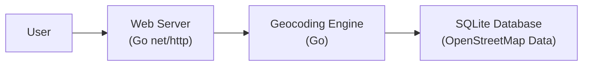

Okay, let's create a design document for the `geocoder` project.

# BUSINESS POSTURE

Business Priorities and Goals:

*   Provide a simple, self-hostable geocoding service.
*   Offer an alternative to commercial geocoding APIs.
*   Enable offline geocoding capabilities.
*   Minimize external dependencies.
*   Ensure ease of deployment and maintenance.

Most Important Business Risks:

*   Data Accuracy: Inaccurate geocoding results could lead to incorrect decisions based on location data.
*   Service Availability: Downtime or performance issues could disrupt applications relying on the service.
*   Data Privacy (if user-provided data is stored): Depending on how the service is used, there might be privacy concerns if user queries or results are logged or stored.
*   Resource Exhaustion: The service might be vulnerable to denial-of-service attacks or excessive resource consumption if not properly configured and protected.
*   Maintenance Overhead: If the underlying data becomes outdated, the service will require updates to maintain accuracy.

# SECURITY POSTURE

Existing Security Controls:

*   security control: The project uses a simple HTTP API without any built-in authentication or authorization mechanisms (as seen in `main.go`). This is a significant security gap.
*   security control: The project is written in Go, which offers some memory safety features compared to languages like C/C++.
*   security control: The project uses structured logging (using `log.Printf`), which can be helpful for monitoring and auditing.
*   security control: The project has a `Dockerfile` for containerization, which can improve isolation and portability.
*   security control: The project uses `flag` package to parse command-line arguments, which is a standard and generally safe way to handle user inputs.

Accepted Risks:

*   accepted risk: Lack of authentication and authorization. The project, in its current state, is not suitable for deployment in environments where access control is required.
*   accepted risk: Potential for denial-of-service. The project does not appear to have any built-in rate limiting or resource management mechanisms.
*   accepted risk: No input validation beyond basic type checking provided by the `flag` package.

Recommended Security Controls:

*   Implement API authentication (e.g., API keys, OAuth 2.0).
*   Implement authorization to control access to specific resources or functionalities.
*   Add input validation to ensure that user-provided data conforms to expected formats and constraints.
*   Implement rate limiting to prevent abuse and denial-of-service attacks.
*   Consider adding a web application firewall (WAF) in front of the service to provide additional protection.
*   Implement robust error handling and logging to facilitate troubleshooting and security auditing.
*   Regularly update dependencies to address security vulnerabilities.
*   Use a linter like `golangci-lint` to identify potential code quality and security issues.
*   Implement a mechanism for securely updating the geocoding data.

Security Requirements:

*   Authentication: The system should authenticate API requests, potentially using API keys or a more sophisticated mechanism like OAuth 2.0.
*   Authorization: The system should control access to resources based on the authenticated user's identity or role.  For a simple geocoding service, this might be a simple allow/deny based on the presence of a valid API key.
*   Input Validation: The system should validate all user-provided input, including latitude, longitude, and any query parameters. This should include checks for data type, range, and format.
*   Cryptography: If sensitive data is stored or transmitted, appropriate cryptographic mechanisms should be used (e.g., HTTPS for transport security).  At a minimum, API keys should be stored securely (e.g., hashed and salted).
*   Rate Limiting: The system should implement rate limiting to prevent abuse and ensure fair usage.

# DESIGN

## C4 CONTEXT

Element Descriptions:

*   Element:
    *   Name: User
    *   Type: Person
    *   Description: A user of the geocoding service, typically an application or another system.
    *   Responsibilities: Sends geocoding requests to the Geocoder service. Receives geocoding responses.
    *   Security controls: None (external to the system).

*   Element:
    *   Name: Geocoder
    *   Type: Software System
    *   Description: The geocoding service itself, implemented in Go and using SQLite.
    *   Responsibilities: Receives geocoding requests. Queries the OpenStreetMap data. Returns geocoding results.
    *   Security controls: API authentication (recommended), Authorization (recommended), Input validation (recommended), Rate limiting (recommended).

*   Element:
    *   Name: OpenStreetMap Data
    *   Type: Data Store
    *   Description: The OpenStreetMap data, stored in an SQLite database.
    *   Responsibilities: Stores geographic data. Provides data to the Geocoder service.
    *   Security controls: File system permissions (recommended), Data integrity checks (recommended).

## C4 CONTAINER

Element Descriptions:

*   Element:
    *   Name: User
    *   Type: Person
    *   Description: A user of the geocoding service.
    *   Responsibilities: Sends geocoding requests. Receives geocoding responses.
    *   Security controls: None (external to the system).

*   Element:
    *   Name: Web Server
    *   Type: Container (Go net/http)
    *   Description: Handles incoming HTTP requests.
    *   Responsibilities: Receives requests. Routes requests to the Geocoding Engine. Returns responses.
    *   Security controls: API authentication (recommended), Input validation (recommended), Rate limiting (recommended).

*   Element:
    *   Name: Geocoding Engine
    *   Type: Container (Go)
    *   Description: Contains the core geocoding logic.
    *   Responsibilities: Processes geocoding requests. Queries the database. Formats responses.
    *   Security controls: Input validation (recommended).

*   Element:
    *   Name: Database
    *   Type: Container (SQLite Database)
    *   Description: Stores the OpenStreetMap data.
    *   Responsibilities: Stores geographic data. Provides data to the Geocoding Engine.
    *   Security controls: File system permissions (recommended), Data integrity checks (recommended).

## DEPLOYMENT

Possible Deployment Solutions:

1.  Standalone Server: Deploy the Go binary directly on a server (physical or virtual).
2.  Docker Container: Package the application and its dependencies into a Docker container and deploy it on a container orchestration platform (e.g., Docker Swarm, Kubernetes).
3.  Serverless Function: Deploy the application as a serverless function (e.g., AWS Lambda, Google Cloud Functions). This is less suitable given the need for a persistent SQLite database.

Chosen Solution (Docker Container on Kubernetes):

Element Descriptions:

*   Element:
    *   Name: Internet
    *   Type: External
    *   Description: The public internet.
    *   Responsibilities: Routes traffic to the Load Balancer.
    *   Security controls: None (external to the system).

*   Element:
    *   Name: Load Balancer
    *   Type: Infrastructure
    *   Description: Distributes incoming traffic across multiple instances of the Geocoder service.
    *   Responsibilities: Receives traffic from the internet. Forwards traffic to healthy Geocoder Pods.
    *   Security controls: TLS termination (recommended), DDoS protection (recommended).

*   Element:
    *   Name: Kubernetes Cluster
    *   Type: Infrastructure
    *   Description: A Kubernetes cluster for container orchestration.
    *   Responsibilities: Manages the deployment and scaling of the Geocoder Pods.
    *   Security controls: Network policies (recommended), Role-based access control (RBAC) (recommended).

*   Element:
    *   Name: Geocoder Pod
    *   Type: Kubernetes Pod
    *   Description: A Kubernetes Pod running the Geocoder container.
    *   Responsibilities: Hosts the Geocoder container.
    *   Security controls: Pod security policies (recommended).

*   Element:
    *   Name: Geocoder Container
    *   Type: Docker Container
    *   Description: The Docker container containing the Geocoder application.
    *   Responsibilities: Runs the Geocoder application.
    *   Security controls: Container security context (recommended).

*   Element:
      * Name: SQLiteDB
      * Type: Persistent Volume
      * Description: Persistent storage for SQLite database.
      * Responsibilities: Provides persistent storage for OpenStreetMap data.
      * Security controls: Access control to persistent volume.

## BUILD

The build process can be automated using GitHub Actions.

Build Process Description:

1.  Developer pushes code changes to the GitHub repository.
2.  A webhook triggers a GitHub Actions workflow.
3.  The workflow checks out the code.
4.  The workflow builds the Go binary (`go build`).
5.  The workflow runs unit tests (`go test`).
6.  The workflow runs a linter (`golangci-lint`).
7.  The workflow performs a security scan using a tool like Snyk.
8.  The workflow builds a Docker image (`docker build`).
9.  The workflow pushes the Docker image to a container registry (e.g., Docker Hub, GitHub Container Registry).

Security Controls:

*   security control: Code review (manual process, enforced through pull requests).
*   security control: Automated testing (unit tests).
*   security control: Static code analysis (linter).
*   security control: Dependency vulnerability scanning (Snyk or similar).
*   security control: Container image signing (recommended).
*   security control: Use of a minimal base image for the Docker container (recommended).

# RISK ASSESSMENT

Critical Business Processes:

*   Providing accurate geocoding results.
*   Maintaining service availability.

Data to Protect:

*   OpenStreetMap Data (Low sensitivity, publicly available).
*   API Keys (High sensitivity, if implemented).
*   User Queries (Potentially sensitive, depending on usage and logging).
*   Geocoding Results (Potentially sensitive, depending on usage and logging).

# QUESTIONS & ASSUMPTIONS

Questions:

*   What is the expected request volume and latency requirements?
*   What is the process for updating the OpenStreetMap data?
*   Will the service be exposed directly to the internet or behind a proxy/gateway?
*   Are there any specific compliance requirements (e.g., GDPR)?
*   Is there a budget for security tools and services?

Assumptions:

*   BUSINESS POSTURE: The primary goal is to provide a functional, self-hostable geocoding service. Cost and ease of use are prioritized over enterprise-grade security features.
*   SECURITY POSTURE: The current implementation lacks basic security controls, and significant improvements are needed.
*   DESIGN: The design assumes a relatively low request volume and a simple deployment model. The design can be scaled out using Kubernetes if needed. The OpenStreetMap data is assumed to be relatively static and updated infrequently.