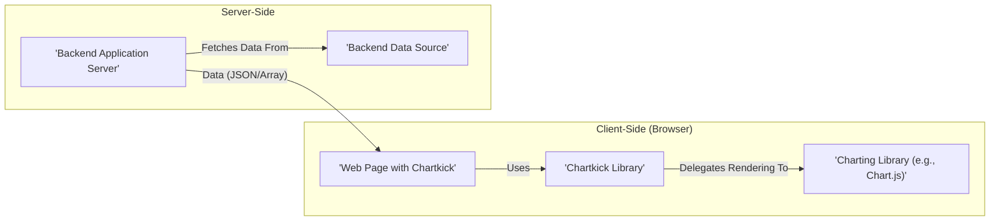
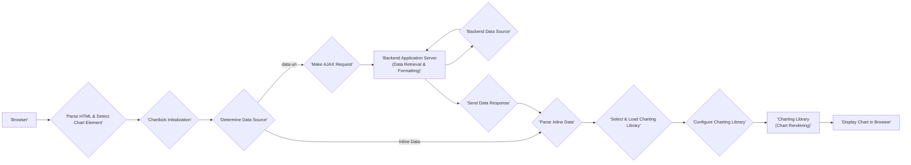

# Project Design Document: Chartkick

**Version:** 1.1
**Date:** October 26, 2023
**Author:** AI Software Architect

## 1. Introduction

This document provides an enhanced design overview of the Chartkick project, a JavaScript library designed to simplify the creation of visually appealing charts with minimal coding effort. This detailed design aims to clearly articulate the architecture, components, and data flow within the Chartkick ecosystem, serving as a robust foundation for subsequent threat modeling activities.

Chartkick's core strength lies in its ability to abstract the complexities of various JavaScript charting libraries, offering a unified and intuitive API for developers across different backend frameworks. This document delves into the intricacies of Chartkick's operation, highlighting key interactions and potential security considerations.

## 2. Goals

The fundamental goals of the Chartkick project are:

* **Extreme Simplicity:** To offer an exceptionally easy-to-use API, enabling developers to generate charts with minimal configuration.
* **Backend Framework Independence:** To ensure seamless integration with a wide array of backend frameworks, including Ruby on Rails, Python (Django, Flask), PHP (Laravel, Symfony), and others.
* **Charting Library Abstraction:** To shield developers from the specific implementation details of underlying JavaScript charting libraries such as Chart.js, Highcharts, and Google Charts, providing a consistent interface.
* **Extensive Customization:** To provide ample opportunities for customizing chart appearance, behavior, and interactivity to meet specific application requirements.
* **Responsive Design:** To automatically generate charts that adapt fluidly to different screen sizes and devices, ensuring optimal viewing experiences.

## 3. High-Level Architecture

Chartkick's architecture is characterized by a clear separation of concerns between the client-side rendering logic and the server-side data provision. The primary architectural elements are:

* **Backend Data Source:** The origin of the data to be visualized, which could be a database, an API endpoint, or any other data storage or retrieval mechanism.
* **Backend Application Server:** The server-side application responsible for fetching, processing, and formatting the data from the data source into a format suitable for Chartkick (typically JSON or a JavaScript array).
* **Chartkick Library (JavaScript):** The core client-side JavaScript library that interprets the data and configuration, and orchestrates the rendering of the chart using the selected charting library.
* **JavaScript Charting Library:** An external JavaScript library (e.g., Chart.js, Highcharts) responsible for the actual graphical rendering of the chart elements within the browser. Chartkick acts as an intermediary, translating its API calls into the specific API of the chosen charting library.
* **Web Browser:** The user's web browser, which executes the JavaScript code, fetches data (if necessary), and ultimately renders the interactive chart.

## 4. Components

This section provides a more detailed breakdown of the key components within the Chartkick ecosystem and their respective responsibilities.

* **Chartkick JavaScript Library (`chartkick.js`):**
    * **API Abstraction:** Provides a high-level, consistent API for creating various chart types (line, bar, pie, etc.), regardless of the underlying charting library.
    * **Data Handling:**  Parses and processes data received from the backend, whether embedded directly in the HTML or fetched via AJAX.
    * **Charting Library Management:** Dynamically loads the specified or default charting library, ensuring only the necessary code is loaded.
    * **Configuration Mapping:** Translates Chartkick's configuration options into the specific configuration format required by the chosen charting library.
    * **DOM Manipulation:**  Renders the chart within the designated HTML element, creating or utilizing the necessary canvas or SVG elements.

* **Backend Integration Helpers:**
    * **Templating Helpers:** Framework-specific helpers (e.g., Ruby on Rails helpers, Django template tags) that simplify the generation of HTML elements with the required data attributes for Chartkick. These helpers often handle the serialization of data from backend models into the appropriate JSON or array format.
    * **Data Endpoint Generation:**  Facilitate the creation of API endpoints that serve the chart data in the format expected by Chartkick.

* **JavaScript Charting Libraries (e.g., Chart.js, Highcharts, Google Charts):**
    * **Core Rendering Engine:**  Responsible for the low-level drawing of chart elements, including axes, labels, data points, tooltips, and animations.
    * **Chart Type Implementations:** Provide the specific logic for rendering different chart types (line, bar, pie, scatter, etc.).
    * **Customization Options:** Offer a wide range of options for customizing the visual appearance and behavior of the charts.
    * **Event Handling:**  Provide mechanisms for handling user interactions with the charts (e.g., click events, hover effects).

* **HTML Container Element:**
    * **Target Element:** A designated HTML element (typically a `
` or `<canvas>`) within the web page where Chartkick will render the chart.
    * **Data Attributes:**  May contain `data-*` attributes that provide Chartkick with instructions on how to fetch data (`data-url`), what type of chart to render (`data-chart`), and other configuration options.

## 5. Data Flow

The process of rendering a chart using Chartkick involves a well-defined data flow, starting from the initial page load to the final chart rendering:

1. **Initial Page Load:** The user's browser requests and loads the HTML page containing the Chartkick integration.
2. **HTML Parsing and Chart Element Detection:** The browser parses the HTML and identifies elements designated for chart rendering based on specific selectors or the presence of relevant `data-*` attributes.
3. **Chartkick Library Initialization:** The Chartkick JavaScript library is loaded and initialized. It scans the DOM for chart elements.
4. **Data Source Determination:** For each chart element, Chartkick determines the source of the chart data:
    * **Inline Data:** If the data is directly embedded within the HTML element (e.g., using the `data-series` or `data-categories` attributes), Chartkick parses it immediately.
    * **External Data via AJAX:** If a `data-url` attribute is present, Chartkick initiates an asynchronous HTTP request (typically a GET request) to the specified URL on the backend server.
5. **Backend Data Retrieval and Processing (If AJAX):**
    * The backend application server receives the request for chart data.
    * It retrieves the necessary data from the backend data source (e.g., database query, API call).
    * The data is processed and formatted into a JSON or JavaScript array structure that Chartkick understands.
6. **Data Response (If AJAX):** The backend application server sends the formatted data back to the browser in the HTTP response body, typically with a `Content-Type` of `application/json`.
7. **Data Parsing and Preparation:** Chartkick parses the received data (either inline or from the AJAX response) and prepares it for the chosen charting library.
8. **Charting Library Selection and Loading:** Chartkick determines which charting library to use based on explicit configuration or default settings. If the library is not already loaded, Chartkick may dynamically load it.
9. **Chart Configuration and Rendering:** Chartkick translates its internal representation of the chart configuration and data into the specific options and data structures required by the selected charting library. It then calls the charting library's API to render the chart within the designated HTML element.
10. **Chart Display:** The charting library renders the interactive chart within the browser, making it visible to the user.

## 6. Security Considerations

Security is a crucial aspect of any web application, and while Chartkick primarily operates on the client-side, several security considerations are relevant:

* **Cross-Site Scripting (XSS) Vulnerabilities:**
    * **Unsanitized Backend Data:** If the backend application fails to properly sanitize data before sending it to the client, malicious scripts embedded within the chart data can be executed in the user's browser, leading to XSS attacks. This is a primary concern when data is dynamically generated or sourced from user input.
    * **Configuration Injection:**  Allowing user-controlled input to directly influence Chartkick's configuration options (e.g., through URL parameters or form data) can potentially be exploited to inject malicious JavaScript code or manipulate chart behavior in unintended ways.

* **Data Integrity and Confidentiality:**
    * **Man-in-the-Middle Attacks:** If chart data is transmitted over an unencrypted connection (HTTP), it is susceptible to interception and modification by attackers. Using HTTPS is essential to protect the integrity and confidentiality of the data.
    * **Sensitive Data Exposure:**  Care should be taken to avoid displaying highly sensitive or confidential information directly in client-side charts, especially if the application has broader security concerns. Consider data aggregation, anonymization, or server-side rendering for sensitive data.

* **Dependency Management:**
    * **Vulnerable Charting Libraries:** The underlying JavaScript charting libraries are external dependencies and may contain security vulnerabilities. Regularly updating these libraries to their latest versions is crucial to patch known security flaws.
    * **Chartkick Vulnerabilities:**  Similarly, the Chartkick library itself should be kept up-to-date to benefit from security patches and improvements.

* **Server-Side Security (Backend Data Endpoints):**
    * **Authentication and Authorization:** Backend endpoints that provide chart data must be properly secured with authentication and authorization mechanisms to prevent unauthorized access to sensitive information.
    * **Input Validation:**  The backend should rigorously validate any input received from the client (even if it's just a request for chart data) to prevent injection attacks and other security vulnerabilities.

* **Client-Side Data Handling:**
    * **Data Validation:** While the primary responsibility lies with the backend, implementing basic client-side validation of the received chart data can help prevent unexpected errors or behavior.

## 7. Deployment

Deploying Chartkick involves integrating the library into a web application. Common deployment strategies include:

* **Direct Inclusion via CDN:**  Including the Chartkick JavaScript file and the chosen charting library's file directly in the HTML using `<script>` tags that point to a Content Delivery Network (CDN). This is often the simplest approach for initial setup.
* **Package Managers (npm, Yarn):** Installing Chartkick and the desired charting library as dependencies using package managers like npm or Yarn. This allows for better dependency management and integration with build processes.
* **Asset Pipelines (e.g., Rails Asset Pipeline, Webpack):** Integrating Chartkick and charting libraries into the application's asset pipeline, which handles bundling, minification, and versioning of assets.
* **Backend Framework Integration:** Utilizing backend-specific helpers or libraries that simplify the process of including Chartkick and generating the necessary HTML and data attributes.

The specific deployment method will depend on the technology stack and development workflow of the project. Regardless of the method, ensuring that both Chartkick and the underlying charting libraries are accessible to the browser is essential.

## 8. Future Considerations

Potential future enhancements and considerations for Chartkick include:

* **Enhanced Security Features:** Exploring options for client-side data sanitization or mechanisms to mitigate potential XSS risks associated with dynamically generated chart data.
* **Improved Accessibility:**  Further enhancing the accessibility of generated charts to comply with accessibility standards (e.g., WCAG) and ensure usability for users with disabilities.
* **More Granular Control over Charting Library Options:** Providing more fine-grained control over the configuration options of the underlying charting libraries, allowing developers to leverage the full capabilities of those libraries.
* **Expanded Chart Type Support:**  Adding support for a wider range of chart types and visualizations.
* **Plugin Architecture:**  Developing a plugin architecture to allow for extending Chartkick's functionality and adding support for new charting libraries or features more easily.

This improved design document provides a more detailed and nuanced understanding of the Chartkick project, offering a solid foundation for effective threat modeling and further development.