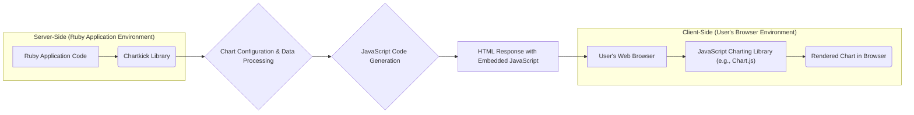

# Project Design Document: Chartkick

**Version:** 1.1
**Date:** October 26, 2023
**Author:** Gemini (AI Language Model)

## 1. Introduction

This document provides an enhanced and detailed design overview of the Chartkick project, a Ruby library designed to simplify the creation of visually appealing JavaScript charts within web applications. The primary goal of this document is to provide a clear understanding of Chartkick's architecture, components, and data flow, specifically for the purpose of conducting thorough threat modeling. This document will serve as the foundation for identifying potential security vulnerabilities and developing appropriate mitigation strategies.

## 2. Project Overview

Chartkick acts as a bridge between Ruby backend applications and client-side JavaScript charting libraries. It abstracts the complexities of directly interacting with libraries like Chart.js, Highcharts, and Google Charts, enabling developers to generate charts using concise and intuitive Ruby code. This abstraction simplifies the chart creation process and promotes code maintainability.

## 3. System Architecture

The Chartkick architecture revolves around the interaction between the server-side Ruby application and the client-side browser, facilitated by the Chartkick library.

### 3.1. Key Components

*   **Ruby Application Code:** The developer's Ruby code, typically within a web framework like Rails, that utilizes Chartkick's methods to define the specifications for charts.
*   **Chartkick Library:** The core Ruby gem responsible for receiving chart specifications, processing data, and generating the necessary JavaScript code.
*   **Chart Configuration & Data Processing:** This component within the Chartkick library handles the transformation of Ruby data structures and configuration options into a format consumable by the target JavaScript charting library.
*   **JavaScript Code Generation:**  The component that dynamically constructs the JavaScript code required to instantiate and configure the chosen charting library on the client-side.
*   **HTML Response with Embedded JavaScript:** The HTML document generated by the server, containing the embedded JavaScript code produced by Chartkick. This is sent to the user's browser.
*   **User's Web Browser:** The client-side environment where the HTML is rendered and the embedded JavaScript is executed.
*   **JavaScript Charting Library (e.g., Chart.js):** A client-side JavaScript library that interprets the generated JavaScript code and renders the visual chart.
*   **Rendered Chart in Browser:** The final visual representation of the data, displayed within the user's web browser.

## 4. Component Details

### 4.1. Ruby Integration Layer

*   Provides a user-friendly Ruby API (methods, helper tags) for seamless integration with Ruby web frameworks like Rails, Sinatra, etc.
*   Offers methods to easily define chart data, chart type (line, bar, pie, etc.), and various customization options directly within Ruby views or controllers.
*   Handles the marshaling of Ruby data structures (arrays, hashes, ActiveRecord relations) into formats suitable for JavaScript consumption.
*   Allows developers to specify options for chart appearance, such as colors, labels, axes, and tooltips, using Ruby syntax.

### 4.2. Chart Generation Logic

*   The central processing unit of the Chartkick library.
*   Receives chart data and configuration parameters as input from the Ruby integration layer.
*   Dynamically generates the JavaScript code tailored to the specific charting library selected (or the default). This involves mapping Chartkick's abstract options to the specific API of the chosen library.
*   Implements logic to handle different chart types and their unique configuration requirements.
*   May include logic for data formatting, such as date/time formatting or number formatting, based on user-defined options or defaults.

### 4.3. JavaScript Output Generation

*   The output of the chart generation logic is a string containing valid JavaScript code.
*   This generated JavaScript typically includes:
    *   Code to select the HTML element where the chart will be rendered (usually a `
` with a specific ID).
    *   Instantiation of the chosen JavaScript charting library's chart object.
    *   The chart data, formatted according to the requirements of the charting library.
    *   Configuration options for the chart's appearance and behavior, also formatted according to the charting library's API.
*   This JavaScript code is embedded within the HTML response sent to the browser, usually within `<script>` tags.

### 4.4. Charting Library Abstraction Layer

*   Chartkick's core value proposition lies in its ability to abstract away the differences between various JavaScript charting libraries.
*   It provides a consistent Ruby API for defining charts, regardless of whether Chart.js, Highcharts, or Google Charts is being used.
*   This abstraction involves internal mappings and logic to translate Chartkick's generic options into the specific configuration syntax of each supported charting library.
*   Allows developers to potentially switch between charting libraries with minimal changes to their Ruby code.

## 5. Data Flow

The process of rendering a chart using Chartkick follows this data flow:

1. **Data Acquisition:** The Ruby application retrieves the data intended for visualization. This data might come from databases, external APIs, or be generated dynamically.
2. **Chart Definition in Ruby:** The developer utilizes Chartkick's Ruby API (e.g., `line_chart`, `bar_chart`) within their views or controllers, passing the data and desired configuration options.
3. **Chartkick Processing:** The Chartkick library receives the data and configuration. It processes this information, translating the Ruby data structures and options into the specific format required by the target JavaScript charting library.
4. **JavaScript Code Generation:** Chartkick generates the necessary JavaScript code to render the chart on the client-side. This code includes the data and configuration in the format expected by the chosen library.
5. **HTML Embedding:** The generated JavaScript code is embedded directly into the HTML response. This is typically done using `<script>` tags within the HTML structure.
6. **Server Response:** The web server sends the generated HTML, containing the embedded JavaScript, to the user's web browser.
7. **Browser Rendering:** The user's browser receives the HTML and begins rendering the page.
8. **JavaScript Execution:** As the browser parses the HTML, it encounters the embedded JavaScript code and executes it.
9. **Charting Library Initialization:** The executed JavaScript code initializes the specified JavaScript charting library.
10. **Chart Rendering:** The charting library uses the provided data and configuration to draw the chart within the designated HTML element on the page.
11. **Display to User:** The fully rendered chart is displayed to the user within their web browser.

## 6. Security Considerations for Threat Modeling

This section expands on potential security considerations relevant to Chartkick and provides specific areas to focus on during threat modeling.

*   **Cross-Site Scripting (XSS) Vulnerabilities:**
    *   **Risk:** If user-provided data (e.g., labels, tooltips, data point values) is not properly sanitized or encoded before being embedded into the generated JavaScript, it can create opportunities for XSS attacks. Malicious scripts injected into the chart data could be executed in the user's browser, potentially leading to session hijacking, data theft, or other malicious activities.
    *   **Considerations:**
        *   How does Chartkick handle HTML encoding of user-provided data within chart labels, tooltips, and data points?
        *   Are there any scenarios where unsanitized user input could be directly included in the generated JavaScript?
        *   What mechanisms are in place to prevent the injection of malicious JavaScript code through chart configuration options?
*   **Client-Side Dependency Vulnerabilities:**
    *   **Risk:** Chartkick relies on external client-side JavaScript charting libraries. Vulnerabilities discovered in these libraries (e.g., Chart.js, Highcharts) could be exploited if Chartkick is using an outdated or vulnerable version.
    *   **Considerations:**
        *   How does Chartkick manage its dependencies on client-side charting libraries?
        *   Is there a process for regularly updating these dependencies to address known security vulnerabilities?
        *   Are there mechanisms to allow users to specify or update the versions of the charting libraries being used?
*   **Exposure of Sensitive Data:**
    *   **Risk:** If sensitive data is being visualized in charts, there is a risk of unauthorized disclosure if appropriate security measures are not in place. This includes the transmission of data from the server to the client and the potential for interception or access to the rendered chart data.
    *   **Considerations:**
        *   How is the chart data transmitted from the server to the client? Is it encrypted (e.g., using HTTPS)?
        *   Are there options within Chartkick to control access to charts or to mask or aggregate sensitive data before rendering?
        *   What security considerations are relevant if Chartkick is used to display data that is subject to compliance regulations (e.g., GDPR, HIPAA)?
*   **Server-Side Rendering (SSR) Security:**
    *   **Risk:** When using Chartkick in conjunction with server-side rendering, there are additional security considerations related to the rendering process and potential exposure of data or logic on the server.
    *   **Considerations:**
        *   How does Chartkick handle the generation of JavaScript code in an SSR environment?
        *   Are there any potential vulnerabilities related to the server-side execution of JavaScript or the handling of user input during the rendering process?
*   **Input Validation and Configuration Security:**
    *   **Risk:** Improper validation of chart configuration options provided by the developer could lead to unexpected behavior or potential security vulnerabilities. Maliciously crafted configuration options might be able to bypass security checks or cause errors.
    *   **Considerations:**
        *   What validation is performed on the chart options and data provided to Chartkick?
        *   Are there any restrictions on the types of data or configuration values that are accepted?
        *   Could excessively large or malformed data inputs lead to denial-of-service (DoS) conditions?

## 7. Future Considerations

*   Enhanced support for accessibility standards to ensure charts are usable by individuals with disabilities.
*   More granular control over the customization of chart elements and interactions.
*   Improved error handling and debugging tools for developers.
*   Potential integration with backend charting libraries for server-side image generation.
*   Exploration of more advanced charting types and data visualization techniques.

This improved design document provides a more detailed and nuanced understanding of the Chartkick project's architecture and potential security considerations. This information is crucial for conducting a comprehensive threat modeling exercise and implementing appropriate security measures.