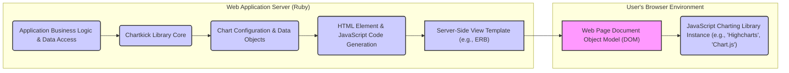

# Project Design Document: Chartkick

**Version:** 1.1
**Date:** October 26, 2023
**Author:** AI Software Architect

## 1. Introduction

This document provides an enhanced design overview of the Chartkick project, a Ruby library designed to simplify the creation of visually appealing JavaScript charts with minimal coding effort. This document serves as a foundational resource for subsequent threat modeling exercises. It comprehensively outlines the architecture, individual components, the flow of data, and crucial security considerations pertinent to the Chartkick library and its integration within a web application environment.

## 2. Goals and Non-Goals

**Goals:**

*   Clearly and comprehensively define the architectural structure and constituent components of Chartkick.
*   Thoroughly describe the data flow involved in the process of generating charts.
*   Precisely identify key integration points and external dependencies.
*   Provide a level of detail sufficient for conducting effective and targeted threat modeling.

**Non-Goals:**

*   Detailed, line-by-line code-level implementation specifics within the Chartkick library or its adapters.
*   Performance benchmarking analysis or specific optimization strategies for chart rendering.
*   Specific deployment configurations or infrastructure setup details for applications using Chartkick.
*   In-depth explanations of the internal workings of the underlying JavaScript charting libraries (Highcharts, Chart.js, etc.).

## 3. Architectural Overview

Chartkick functions as an intermediary layer, facilitating communication between a server-side Ruby application and client-side JavaScript charting libraries. It offers a Ruby-based API to generate the necessary HTML structure and JavaScript code required to render charts directly within a user's web browser. The core operational flow involves:

*   Receiving structured data and configuration options from the encompassing Ruby application.
*   Dynamically generating JavaScript code snippets tailored to initialize and configure the user-selected JavaScript charting library.
*   Seamlessly embedding this generated JavaScript, along with the necessary HTML container, into the web page's structure.
*   Delegating the final chart rendering process to the client-side JavaScript library executing within the user's browser.

## 4. Components

*   **Chartkick Ruby Library Core:** This is the central Ruby gem providing the primary API for chart generation.
    *   Responsible for processing input data and user-defined chart options.
    *   Generates the fundamental HTML element (typically a `
` tag) that acts as the placeholder for the chart.
    *   Dynamically constructs the JavaScript code necessary to instantiate and configure the chosen client-side charting library, incorporating the provided data and options.
*   **JavaScript Adapter Layer:** Chartkick incorporates a set of JavaScript adapters designed to facilitate seamless interaction with various third-party charting libraries (e.g., Highcharts, Chart.js, Google Charts).
    *   These adapters play a crucial role in ensuring compatibility and providing a consistent interface abstraction for the Chartkick core.
    *   They handle the specific initialization procedures, data formatting conventions, and API nuances of each supported charting library.
*   **External JavaScript Charting Libraries:** These represent the independent, third-party JavaScript libraries (e.g., Highcharts, Chart.js) that are ultimately responsible for the visual rendering of the charts within the user's browser.
    *   Chartkick relies on these external libraries being accessible within the web page's environment, typically through inclusion via Content Delivery Networks (CDNs) or bundled application assets.
*   **Integrating Web Application:** This refers to the encompassing Ruby on Rails application (or other Ruby-based framework application) that utilizes the Chartkick library.
    *   The web application is responsible for providing the raw data intended for visualization.
    *   It leverages Chartkick's API within its view layer to trigger the generation and embedding of charts.
*   **Server-Side View Templates:** These are the templating files (e.g., ERB files in Ruby on Rails) where developers invoke Chartkick's helper methods to embed the generated chart-related HTML and JavaScript code into the final HTML response.

## 5. Data Flow

The process of generating and displaying a chart using Chartkick involves a sequence of distinct steps:

1. **Data Acquisition:** The web application retrieves the dataset intended for charting from its designated data sources. This could involve querying databases, fetching data from external APIs, or processing locally stored data.
2. **Chartkick API Invocation:** Within a server-side view template, the developer utilizes Chartkick's helper methods (e.g., `line_chart`, `bar_chart`, `pie_chart`). These methods are invoked with the data to be visualized and any desired chart-specific configuration options.
3. **Data Transformation and Option Processing:** The Chartkick library receives the provided data and configuration options. It then transforms the raw data into a structured format that is compatible with the syntax and data structures expected by the selected JavaScript charting library.
4. **HTML and JavaScript Code Generation:** Based on the processed data and options, Chartkick dynamically generates the necessary HTML markup (primarily a `
` element serving as the chart container) and the corresponding JavaScript code. This generated JavaScript typically includes:
    *   The initialization call for the specific charting library being used.
    *   Configuration settings for the chart's appearance and behavior, based on the provided options.
    *   The chart data, formatted according to the charting library's requirements.
5. **Embedding into the HTML Response:** The generated HTML and JavaScript code are seamlessly embedded into the HTML response that the server sends back to the user's web browser. This embedding typically occurs within the context of the server-side view template.
6. **Client-Side Execution and Rendering:** The user's web browser receives the HTML response. Upon parsing the HTML, the embedded JavaScript code is executed. This execution triggers the initialization of the specified JavaScript charting library. The charting library then uses the provided data and configuration to render the visual chart within the designated `
` element in the browser's Document Object Model (DOM).
7. **Chart Visualization:** The user ultimately views the fully rendered chart displayed within their web browser.

## 6. Security Considerations

This section highlights potential security considerations relevant to the Chartkick library and its integration within a web application:

*   **Cross-Site Scripting (XSS) via Data Injection:** If the data supplied to Chartkick originates from untrusted user input and is not properly sanitized on the server-side, it can introduce Cross-Site Scripting (XSS) vulnerabilities. Malicious JavaScript code could be injected through chart labels, tooltip content, data point values, or other data-driven elements, potentially leading to the execution of arbitrary scripts within other users' browsers.
*   **Client-Side Dependency Vulnerabilities:** Chartkick relies on external, third-party JavaScript charting libraries. Security vulnerabilities discovered within these underlying libraries could be exploited if they are not regularly updated to their latest, patched versions. This underscores the importance of diligent dependency management.
*   **Server-Side Template Injection Risks:** Although less common with the typical usage patterns of Chartkick, improper handling of user-controlled input within the Ruby view templates where Chartkick's helper methods are invoked could theoretically lead to server-side template injection vulnerabilities. Attackers might be able to inject malicious code that executes on the server.
*   **Exposure of Sensitive Data:** The data being visualized in charts might contain sensitive information. It is crucial to implement appropriate access controls and data handling practices within the encompassing web application to prevent unauthorized access, disclosure, or modification of this sensitive data. Ensure that only authorized users can view pages containing these charts.
*   **Client-Side Security Posture of Charting Libraries:** The overall security of the client-side chart rendering process is inherently dependent on the security practices and robustness of the chosen JavaScript charting library itself. Selecting reputable and actively maintained libraries is essential. Regularly review security advisories for the chosen charting library.
*   **Importance of Content Security Policy (CSP):** Implementing a strong Content Security Policy (CSP) is highly recommended to mitigate the risks of XSS attacks. This involves configuring CSP directives to explicitly control the sources from which the browser is permitted to load resources, including JavaScript files. This might require careful configuration to allow the loading of the necessary JavaScript charting library files (e.g., from CDNs).
*   **Supply Chain Security for Chartkick and Dependencies:**  Maintain awareness of the security posture of the Chartkick gem itself and all of its direct and transitive dependencies. Regularly audit and update these dependencies to address any known security vulnerabilities. Utilize tools that can help identify and manage dependency vulnerabilities.

## 7. Integration Points

*   **Ruby on Rails View Layer (or equivalent in other Ruby frameworks):** Chartkick is primarily integrated within the view layer of a Ruby web application, where chart rendering is typically initiated.
*   **Asset Pipeline or Asset Management System:** The necessary JavaScript charting libraries must be included within the application's asset pipeline or a similar asset management system to ensure they are available to the client-side. This can involve using gems that package these libraries or referencing them via CDNs.
*   **Configuration Initializers (Optional):** Chartkick offers optional configuration through initializer files, allowing developers to set global default options for charts or specify the preferred charting library to be used across the application.

## 8. Future Considerations (Beyond the Scope of Immediate Threat Modeling)

*   Expansion of support to encompass a wider range of JavaScript charting libraries.
*   Introduction of more advanced and granular customization options for chart aesthetics and behavior.
*   Implementation of server-side rendering capabilities to enhance SEO performance and improve initial page load times, particularly for complex charts.
*   Enhancements focused on accessibility, including improved ARIA attribute support to make charts more usable for individuals with disabilities.

This revised document provides a more detailed and comprehensive design overview of the Chartkick project, intended to serve as a robust foundation for subsequent threat modeling activities. A thorough understanding of the architecture, individual components, and the flow of data is crucial for effectively identifying and mitigating potential security vulnerabilities within systems utilizing Chartkick.