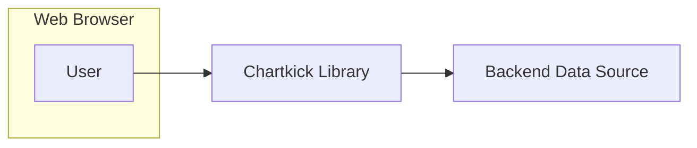
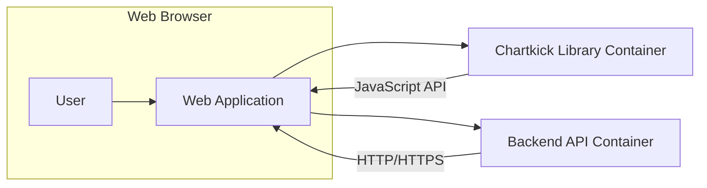
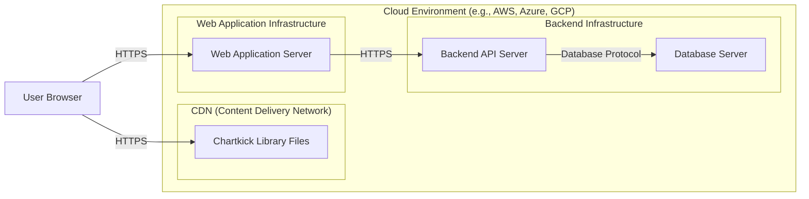

# BUSINESS POSTURE

- Business Priorities and Goals:
  - Provide a simple and intuitive JavaScript charting library for web developers.
  - Enable developers to quickly create visually appealing charts with minimal code.
  - Support a wide range of chart types and data sources.
  - Offer a lightweight and performant charting solution.
  - Maintain an open-source and community-driven project.
- Business Risks:
  - Security vulnerabilities in the library could be exploited in applications that use it, potentially leading to data breaches or other security incidents.
  - Poor performance or instability of the library could negatively impact user experience in applications that rely on it.
  - Lack of maintenance or community support could lead to the library becoming outdated or unusable over time.
  - Incorrect or misleading data visualization due to bugs in the library could lead to flawed business decisions.

# SECURITY POSTURE

- Existing Security Controls:
  - security control: Open Source Code - The source code is publicly available on GitHub, allowing for community review and scrutiny. Implemented: GitHub Repository.
  - security control: Dependency Management - Relies on standard JavaScript package managers (npm, yarn) for dependency management. Implemented: package.json.
- Accepted Risks:
  - accepted risk: Dependency Vulnerabilities - Third-party dependencies may contain security vulnerabilities that could affect Chartkick.
  - accepted risk: Misuse by Developers - Developers using Chartkick might implement it insecurely in their applications, leading to vulnerabilities.
  - accepted risk: Lack of Formal Security Audits - As an open-source project, formal security audits might not be regularly conducted.
- Recommended Security Controls:
  - security control: Dependency Scanning - Implement automated dependency scanning to identify and address vulnerabilities in third-party libraries.
  - security control: Static Analysis Security Testing (SAST) - Integrate SAST tools into the development process to automatically detect potential security flaws in the codebase.
  - security control: Security Code Reviews - Conduct regular security-focused code reviews, especially for critical components and contributions.
  - security control: Vulnerability Disclosure Policy - Establish a clear vulnerability disclosure policy to allow security researchers to report issues responsibly.
- Security Requirements:
  - Authentication:
    - Not directly applicable to the Chartkick library itself, as it is a front-end charting library. Authentication is the responsibility of the applications using Chartkick to secure their data sources and APIs.
  - Authorization:
    - Not directly applicable to the Chartkick library itself. Authorization is the responsibility of the applications using Chartkick to control access to the data being visualized.
  - Input Validation:
    - Important for applications using Chartkick to validate and sanitize data before passing it to Chartkick for rendering, especially if the data originates from user input or external sources. This helps prevent Cross-Site Scripting (XSS) vulnerabilities if chart labels or tooltips display unsanitized data.
  - Cryptography:
    - Not directly applicable to the core Chartkick library functionality. Cryptography might be relevant in the context of data transmission and storage in the applications that use Chartkick, but this is outside the scope of the library itself.

# DESIGN

## C4 CONTEXT



- Context Diagram Elements:
  - Element:
    - Name: User
    - Type: Person
    - Description: End-user viewing web applications that incorporate charts generated by Chartkick.
    - Responsibilities: Interacting with web applications and viewing charts.
    - Security controls: Browser security controls, user device security.
  - Element:
    - Name: Chartkick Library
    - Type: Software System
    - Description: JavaScript library embedded within web applications to render charts based on data provided by the application.
    - Responsibilities: Generating and displaying charts in web browsers.
    - Security controls: Input validation (within applications using Chartkick), adherence to secure coding practices in library development.
  - Element:
    - Name: Backend Data Source
    - Type: Software System
    - Description: External system or database providing data to the web application, which is then used by Chartkick to generate charts.
    - Responsibilities: Providing data for visualization.
    - Security controls: Authentication, authorization, data encryption in transit and at rest, input validation, API security controls.

## C4 CONTAINER



- Container Diagram Elements:
  - Element:
    - Name: Web Application
    - Type: Software System
    - Description: The web application that embeds and utilizes the Chartkick library to display charts. This application is responsible for fetching data from backend services and passing it to Chartkick.
    - Responsibilities: Hosting the Chartkick library, fetching data from backend APIs, integrating Chartkick into the application's user interface, handling user interactions.
    - Security controls: Authentication, authorization, session management, input validation, output encoding, secure communication (HTTPS), web application firewall (WAF).
  - Element:
    - Name: Chartkick Library Container
    - Type: Container (JavaScript Library)
    - Description: The Chartkick JavaScript library itself, responsible for rendering charts within the web browser. It receives data from the web application and manipulates the DOM to display charts.
    - Responsibilities: Chart rendering, handling chart configurations, providing a JavaScript API for web applications to interact with.
    - Security controls: Adherence to secure coding practices, protection against XSS vulnerabilities (handled by applications using the library through input validation and output encoding).
  - Element:
    - Name: Backend API Container
    - Type: Container (API Server)
    - Description: The backend API server that provides data to the web application. This could be a REST API, GraphQL API, or any other type of data service.
    - Responsibilities: Data retrieval, data processing, data storage, API endpoint management, authentication and authorization for data access.
    - Security controls: API authentication and authorization (OAuth 2.0, API keys), input validation, output encoding, rate limiting, API gateway, secure communication (HTTPS), database security controls, intrusion detection and prevention systems (IDS/IPS).

## DEPLOYMENT



- Deployment Diagram Elements:
  - Element:
    - Name: CDN (Content Delivery Network)
    - Type: Infrastructure
    - Description: A Content Delivery Network used to host and distribute the Chartkick library files (JavaScript, CSS, images) for faster loading times and reduced latency for users globally.
    - Responsibilities: Hosting and delivering static files, caching content, improving website performance.
    - Security controls: HTTPS for content delivery, DDoS protection, access controls for CDN management, regular security updates of CDN infrastructure.
  - Element:
    - Name: Web Application Server
    - Type: Infrastructure (Compute Instance, Container)
    - Description: Server instances or containers hosting the web application code. These servers handle user requests, serve the web application, and interact with the backend API.
    - Responsibilities: Running the web application, handling user requests, serving dynamic content, application logic execution.
    - Security controls: Operating system security hardening, web server configuration security, application security controls (authentication, authorization, input validation), intrusion detection and prevention systems (IDS/IPS), security monitoring and logging.
  - Element:
    - Name: Backend API Server
    - Type: Infrastructure (Compute Instance, Container)
    - Description: Server instances or containers hosting the backend API application. These servers handle data requests from the web application and interact with the database.
    - Responsibilities: Data access, data processing, API endpoint management, business logic execution.
    - Security controls: API authentication and authorization, input validation, output encoding, database connection security, intrusion detection and prevention systems (IDS/IPS), security monitoring and logging.
  - Element:
    - Name: Database Server
    - Type: Infrastructure (Database Instance)
    - Description: Database server storing the application data.
    - Responsibilities: Data storage, data retrieval, data persistence, data integrity.
    - Security controls: Database access controls, database encryption at rest and in transit, regular database backups, database security hardening, database activity monitoring.
  - Element:
    - Name: User Browser
    - Type: Client
    - Description: User's web browser accessing the web application.
    - Responsibilities: Rendering web pages, executing JavaScript code, displaying charts.
    - Security controls: Browser security features, user awareness of phishing and malware, browser extensions security.

## BUILD

```mermaid
flowchart LR
    A[Developer] --> B{Code Changes};
    B --> C[Version Control System (e.g., GitHub)];
    C --> D[CI/CD Pipeline (e.g., GitHub Actions)];
    D --> E{Build Process\n(npm install, build scripts, etc.)};
    E --> F{Security Checks\n(SAST, Dependency Scan, Linters)};
    F --> G{Artifacts\n(chartkick.js, CSS)};
    G --> H[Package Registry (e.g., npmjs.com) / CDN];
```

- Build Process Description:
  - Element:
    - Name: Developer
    - Type: Person
    - Description: Software developer making changes to the Chartkick library codebase.
    - Responsibilities: Writing code, committing changes, creating pull requests.
    - Security controls: Secure development environment, code review participation, security awareness training.
  - Element:
    - Name: Version Control System (e.g., GitHub)
    - Type: Tool
    - Description: Repository for storing and managing the source code of Chartkick.
    - Responsibilities: Source code management, version control, collaboration, code review workflows.
    - Security controls: Access controls, branch protection, audit logging, two-factor authentication for developers.
  - Element:
    - Name: CI/CD Pipeline (e.g., GitHub Actions)
    - Type: Tool
    - Description: Automated pipeline for building, testing, and publishing the Chartkick library.
    - Responsibilities: Build automation, testing automation, deployment automation, continuous integration and continuous delivery.
    - Security controls: Secure pipeline configuration, access controls, secret management, audit logging.
  - Element:
    - Name: Build Process
    - Type: Process
    - Description: Steps involved in compiling, packaging, and preparing the Chartkick library for distribution. Includes tasks like dependency installation (npm install), running build scripts, and generating distribution files.
    - Responsibilities: Code compilation, dependency management, artifact creation.
    - Security controls: Use of trusted build environments, dependency integrity checks (e.g., using package-lock.json or yarn.lock), secure build scripts.
  - Element:
    - Name: Security Checks
    - Type: Process
    - Description: Automated security checks integrated into the CI/CD pipeline to identify potential vulnerabilities. Includes SAST tools, dependency vulnerability scanning, and linters.
    - Responsibilities: Static code analysis, dependency vulnerability detection, code quality checks.
    - Security controls: Regularly updated security scanning tools, configured security rules and policies, automated reporting of security findings.
  - Element:
    - Name: Artifacts
    - Type: Data
    - Description: The build outputs, such as JavaScript files (chartkick.js), CSS files, and distribution packages, ready for publishing.
    - Responsibilities: Representing the built and tested library.
    - Security controls: Artifact signing, integrity checks, secure storage of build artifacts.
  - Element:
    - Name: Package Registry (e.g., npmjs.com) / CDN
    - Type: Infrastructure
    - Description: Platforms for distributing the Chartkick library to developers. Package registries like npmjs.com for npm packages and CDNs for direct file access.
    - Responsibilities: Library distribution, version management, package hosting.
    - Security controls: Package signing, malware scanning, access controls, secure package publishing process.

# RISK ASSESSMENT

- Critical Business Processes:
  - Data Visualization: The primary business process is enabling users to visualize data effectively and accurately within web applications. Failure in this process can lead to misinterpretation of data and flawed decision-making.
  - Application Functionality: Applications relying on Chartkick for charting functionality may experience disruptions or errors if the library is compromised or malfunctions.
- Data Sensitivity:
  - Data sensitivity depends entirely on the applications using Chartkick. Chartkick itself does not handle or store data persistently. The sensitivity of data visualized by Chartkick is determined by the context of the application and the nature of the data being displayed. If applications use Chartkick to visualize sensitive business data, customer information, or financial data, then the potential impact of a security breach related to Chartkick could be significant. However, if Chartkick is used for non-sensitive public data, the risk is lower.

# QUESTIONS & ASSUMPTIONS

- Questions:
  - What are the typical use cases and industries for applications using Chartkick? Understanding the context of use will help prioritize security concerns.
  - Are there any specific compliance requirements (e.g., GDPR, HIPAA, PCI DSS) that applications using Chartkick might need to adhere to? This will influence the required security controls.
  - What is the expected lifespan and maintenance plan for the Chartkick library? Long-term support and updates are crucial for security.
- Assumptions:
  - BUSINESS POSTURE:
    - The primary business goal is to provide a user-friendly and widely adopted charting library.
    - Security is important for maintaining trust and preventing misuse of the library in vulnerable applications.
  - SECURITY POSTURE:
    - Security responsibility is shared between the Chartkick library developers and the developers using the library in their applications.
    - Applications using Chartkick are expected to implement their own security controls for authentication, authorization, and data handling.
    - The open-source nature of Chartkick is considered a security benefit through community review, but also presents challenges in terms of formal security processes.
  - DESIGN:
    - Chartkick is primarily a client-side JavaScript library.
    - Data for charts is fetched and processed by the web application before being passed to Chartkick.
    - Deployment typically involves CDN distribution for the library files and integration into web applications deployed on standard web server infrastructure.
    - The build process utilizes common JavaScript build tools and CI/CD practices.