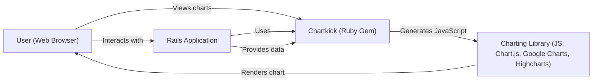
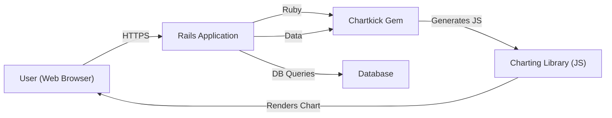
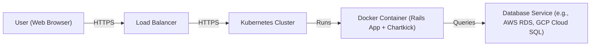
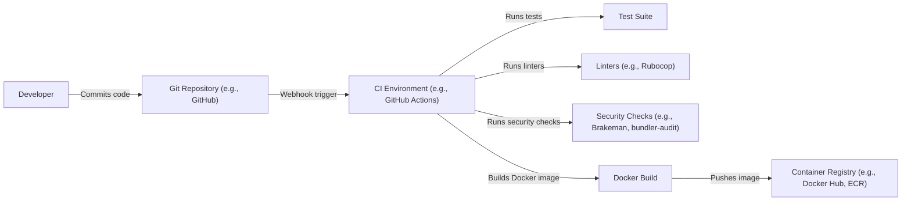

# BUSINESS POSTURE

Business Priorities and Goals:

*   Provide a simple, user-friendly way to create interactive JavaScript charts within Ruby on Rails applications.
*   Minimize the complexity of integrating charting libraries into Rails projects.
*   Offer a variety of chart types to meet common data visualization needs.
*   Maintain a lightweight and performant solution.
*   Ensure compatibility with popular JavaScript charting libraries (Chart.js, Google Charts, Highcharts).
*   Provide good documentation and examples to facilitate easy adoption.

Most Important Business Risks:

*   Data breaches or leaks if user-provided data is mishandled during chart generation or rendering.
*   Cross-site scripting (XSS) vulnerabilities if user input is not properly sanitized, potentially allowing attackers to inject malicious scripts.
*   Denial of service (DoS) if the library or its dependencies are vulnerable to attacks that consume excessive resources.
*   Supply chain attacks if compromised dependencies are introduced.
*   Compatibility issues with future versions of Rails, Ruby, or the underlying JavaScript charting libraries, leading to broken functionality.
*   Reputational damage if security vulnerabilities are discovered and exploited.

# SECURITY POSTURE

Existing Security Controls:

*   security control: The library itself does not appear to handle sensitive data directly, as it primarily focuses on generating JavaScript code for charting libraries. The responsibility for data security largely rests with the application using Chartkick.
*   security control: Relies on the underlying charting libraries (Chart.js, Google Charts, Highcharts) for rendering and security features related to chart display. (Described in respective charting library documentation)
*   security control: Indirectly benefits from Rails' built-in security features, such as CSRF protection and sanitization helpers, when used within a Rails application. (Described in Rails documentation)

Accepted Risks:

*   accepted risk: The library's reliance on external JavaScript charting libraries introduces a dependency risk. Vulnerabilities in these libraries could impact applications using Chartkick.
*   accepted risk: The library does not perform explicit input validation or sanitization on the data passed to it. This responsibility is delegated to the user/application.

Recommended Security Controls:

*   security control: Implement robust input validation and sanitization in the Rails application using Chartkick to prevent XSS and other injection vulnerabilities. This is crucial for any user-supplied data used in charts.
*   security control: Regularly update Chartkick and its dependencies (including the JavaScript charting libraries) to patch any security vulnerabilities.
*   security control: Implement Content Security Policy (CSP) in the Rails application to mitigate the impact of XSS attacks.
*   security control: Consider using a dependency vulnerability scanner to identify and address known vulnerabilities in Chartkick and its dependencies.
*   security control: If Chartkick is used to display sensitive data, ensure that appropriate access controls and encryption are in place within the Rails application.

Security Requirements:

*   Authentication: Not directly applicable to Chartkick itself, as it's a presentation-layer library. Authentication should be handled by the Rails application.
*   Authorization: Not directly applicable to Chartkick. Authorization (access control to data displayed in charts) should be handled by the Rails application.
*   Input Validation: The Rails application using Chartkick *must* validate and sanitize all data used in charts, especially if it comes from user input. This is the primary security concern for Chartkick users.
*   Cryptography: Not directly applicable to Chartkick itself. If sensitive data is displayed, the Rails application should handle encryption at rest and in transit. Chartkick relies on the underlying charting libraries and the browser's capabilities for secure rendering (e.g., HTTPS).

# DESIGN

## C4 CONTEXT

C4 Context Element List:

*   User (Web Browser)
    *   Name: User (Web Browser)
    *   Type: Person
    *   Description: A person interacting with the Rails application and viewing charts.
    *   Responsibilities: Views and interacts with charts rendered in the browser.
    *   Security controls: Relies on browser security features and HTTPS for secure communication.

*   Chartkick (Ruby Gem)
    *   Name: Chartkick (Ruby Gem)
    *   Type: Software System
    *   Description: The Chartkick Ruby gem, used within a Rails application.
    *   Responsibilities: Generates JavaScript code to create charts using a specified charting library.
    *   Security controls: Relies on the security of the Rails application and the chosen charting library.

*   Charting Library (JS: Chart.js, Google Charts, Highcharts)
    *   Name: Charting Library (JS: Chart.js, Google Charts, Highcharts)
    *   Type: Software System
    *   Description: A JavaScript charting library (Chart.js, Google Charts, or Highcharts).
    *   Responsibilities: Renders charts in the user's web browser based on the JavaScript generated by Chartkick.
    *   Security controls: Relies on the library's own security features and best practices.

*   Rails Application
    *   Name: Rails Application
    *   Type: Software System
    *   Description: The Ruby on Rails application that uses Chartkick to display charts.
    *   Responsibilities: Provides data to Chartkick, handles user authentication and authorization, and manages overall application logic.
    *   Security controls: Implements input validation, sanitization, CSRF protection, and other Rails security features.

## C4 CONTAINER

C4 Container Element List:

*   User (Web Browser)
    *   Name: User (Web Browser)
    *   Type: Person
    *   Description: A person interacting with the Rails application and viewing charts.
    *   Responsibilities: Views and interacts with charts rendered in the browser. Makes requests to the Rails application.
    *   Security controls: Relies on browser security features and HTTPS for secure communication.

*   Rails Application
    *   Name: Rails Application
    *   Type: Web Application
    *   Description: The Ruby on Rails application that uses Chartkick.
    *   Responsibilities: Handles user requests, interacts with the database, uses Chartkick to generate charts, and renders views.
    *   Security controls: Implements input validation, sanitization, CSRF protection, authentication, and authorization.

*   Chartkick Gem
    *   Name: Chartkick Gem
    *   Type: Library
    *   Description: The Chartkick Ruby gem, a component within the Rails application.
    *   Responsibilities: Provides a Ruby interface for generating JavaScript code for charting libraries.
    *   Security controls: Relies on the security of the Rails application and the chosen charting library.

*   Charting Library (JS)
    *   Name: Charting Library (JS)
    *   Type: Library
    *   Description: The JavaScript charting library (Chart.js, Google Charts, or Highcharts) running in the user's browser.
    *   Responsibilities: Renders charts based on the JavaScript generated by Chartkick.
    *   Security controls: Relies on the library's own security features and the browser's security mechanisms.

*   Database
    *   Name: Database
    *   Type: Database
    *   Description: The database used by the Rails application to store data.
    *   Responsibilities: Stores and retrieves data used by the Rails application, including data that may be displayed in charts.
    *   Security controls: Database access controls, encryption at rest, and other database security measures.

## DEPLOYMENT

Possible Deployment Solutions:

1.  Traditional Server Deployment (e.g., using Capistrano, Passenger, Puma, and Nginx/Apache).
2.  Containerized Deployment (e.g., using Docker, Kubernetes, and a cloud provider like AWS, GCP, or Azure).
3.  Platform as a Service (PaaS) Deployment (e.g., using Heroku).

Chosen Deployment Solution (Containerized Deployment):

Deployment Element List:

*   User (Web Browser)
    *   Name: User (Web Browser)
    *   Type: Person
    *   Description: A person accessing the application through a web browser.
    *   Responsibilities: Sends requests to the application and receives responses.
    *   Security controls: Relies on browser security features and HTTPS.

*   Load Balancer
    *   Name: Load Balancer
    *   Type: Infrastructure
    *   Description: Distributes incoming traffic across multiple instances of the application.
    *   Responsibilities: Directs traffic to healthy application instances.
    *   Security controls: SSL/TLS termination, DDoS protection.

*   Kubernetes Cluster
    *   Name: Kubernetes Cluster
    *   Type: Infrastructure
    *   Description: Orchestrates the deployment and management of containerized applications.
    *   Responsibilities: Manages the lifecycle of application containers, provides networking, and ensures high availability.
    *   Security controls: Network policies, role-based access control (RBAC), pod security policies.

*   Docker Container (Rails App + Chartkick)
    *   Name: Docker Container (Rails App + Chartkick)
    *   Type: Container
    *   Description: Contains the Rails application, including Chartkick and its dependencies.
    *   Responsibilities: Runs the application code and serves user requests.
    *   Security controls: Minimal base image, regular security updates, least privilege principle.

*   Database Service (e.g., AWS RDS, GCP Cloud SQL)
    *   Name: Database Service
    *   Type: Database
    *   Description: A managed database service provided by a cloud provider.
    *   Responsibilities: Stores and manages application data.
    *   Security controls: Access controls, encryption at rest and in transit, regular backups, automated patching.

## BUILD

Build Process Description:

1.  A developer commits code changes to the Git repository (e.g., GitHub).
2.  A webhook triggers the CI environment (e.g., GitHub Actions).
3.  The CI environment runs the test suite to ensure code quality and functionality.
4.  The CI environment runs linters (e.g., Rubocop) to enforce code style and identify potential issues.
5.  The CI environment runs security checks (e.g., Brakeman for static analysis of Rails code, bundler-audit for checking vulnerable gem dependencies).
6.  If all checks pass, the CI environment builds a Docker image containing the Rails application and its dependencies.
7.  The Docker image is pushed to a container registry (e.g., Docker Hub, Amazon ECR).

Security Controls in Build Process:

*   security control: Code review process before merging code changes.
*   security control: Automated testing (unit tests, integration tests) to catch bugs and regressions.
*   security control: Static analysis security testing (SAST) using tools like Brakeman to identify potential security vulnerabilities in the Rails code.
*   security control: Dependency vulnerability scanning using tools like bundler-audit to detect known vulnerabilities in gem dependencies.
*   security control: Linting to enforce code style and identify potential errors.
*   security control: Use of a minimal base image for the Docker container to reduce the attack surface.
*   security control: Securely managing secrets and credentials used during the build process.

# RISK ASSESSMENT

Critical Business Processes to Protect:

*   User data management (if applicable): If the Rails application using Chartkick handles user data, protecting this data is critical.
*   Application availability: Ensuring the application remains accessible to users.
*   Data integrity: Maintaining the accuracy and consistency of data displayed in charts.

Data to Protect and Sensitivity:

*   User-provided data: If the application allows users to input data that is used in charts, this data needs to be protected. The sensitivity depends on the nature of the data (e.g., personal information, financial data, etc.).
*   Application data: Data stored in the database that is used to generate charts. The sensitivity depends on the nature of the data.
*   Session data: User session data, which may contain authentication tokens or other sensitive information.

# QUESTIONS & ASSUMPTIONS

Questions:

*   What specific types of data will be used in the charts?
*   Will users be able to input data that directly affects the charts?
*   What are the specific security requirements of the organization using Chartkick?
*   What is the expected traffic volume and load on the application?
*   Are there any specific compliance requirements (e.g., GDPR, HIPAA)?
*   Which charting library (Chart.js, Google Charts, or Highcharts) will be used primarily?
*   What is deployment environment?

Assumptions:

*   BUSINESS POSTURE: The primary goal is to create interactive charts easily within a Rails application. The organization has a moderate risk appetite.
*   SECURITY POSTURE: The Rails application using Chartkick will handle the majority of security concerns, including input validation, authentication, and authorization. Chartkick itself is primarily a presentation-layer library.
*   DESIGN: The application will be deployed using a containerized approach (e.g., Docker and Kubernetes). The build process will include automated testing and security checks. The application will use a managed database service.