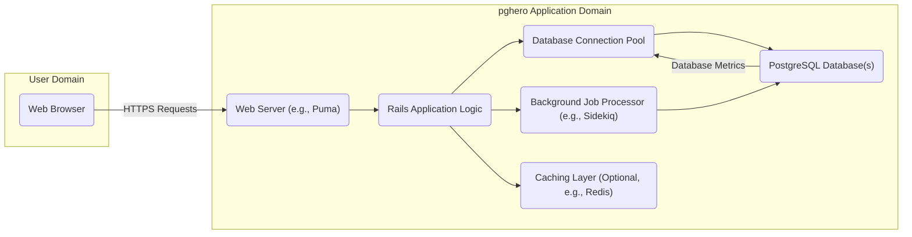
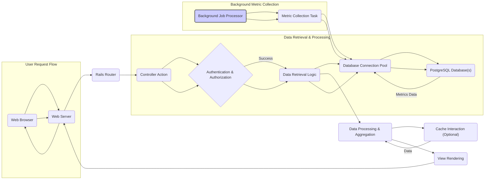

# Project Design Document: pghero

**Version:** 1.1
**Date:** October 26, 2023
**Author:** AI Software Architect

## 1. Introduction

This document provides a comprehensive design overview of the pghero project, an open-source web application designed for monitoring PostgreSQL database performance. The primary purpose of this document is to clearly articulate the system's architecture, its constituent components, and the flow of data within it. This detailed design serves as a foundational resource for subsequent threat modeling activities, enabling security engineers to identify potential vulnerabilities and design appropriate mitigations.

## 2. Goals and Objectives

The overarching goals of pghero are to:

* **Provide Real-time Performance Insights:** Offer a user-friendly web interface displaying up-to-date metrics on PostgreSQL database performance.
* **Enable Proactive Issue Identification:**  Present key performance indicators (KPIs) such as query execution times, resource utilization (CPU, memory, disk I/O), and database health metrics to facilitate early detection of performance bottlenecks.
* **Support Performance Optimization:** Equip database administrators and developers with the necessary information to diagnose performance issues and implement optimization strategies.
* **Facilitate Historical Trend Analysis:**  Store and visualize historical performance data to identify trends and patterns over time.

## 3. Target Audience

This document is primarily intended for:

* **Security Engineers:** Responsible for conducting threat modeling exercises, security assessments, and penetration testing of the pghero application.
* **Software Developers:**  Contributing to the development, maintenance, and enhancement of the pghero project.
* **Operations and Infrastructure Teams:**  Responsible for deploying, configuring, and maintaining the pghero application and its underlying infrastructure.
* **Database Administrators (DBAs):** Utilizing pghero to monitor and manage the performance of their PostgreSQL databases.
* **Technical Stakeholders:**  Requiring a detailed understanding of pghero's architecture and functionality.

## 4. System Architecture

pghero is implemented as a Ruby on Rails web application. It operates by establishing connections to one or more target PostgreSQL databases to collect and subsequently visualize performance-related metrics.

### 4.1. High-Level Architecture

### 4.2. Detailed Architecture

The pghero application comprises the following key logical components:

* **Web Browser:** The client-side interface through which users interact with pghero, typically a standard web browser.
* **Web Server:**  Responsible for receiving and processing incoming HTTP requests from user browsers and serving the pghero application. Common examples include Puma, Unicorn, or Passenger.
* **Rails Application Logic:** The core of the pghero application, built using the Ruby on Rails framework. This component encompasses:
    * **Controllers:**  Handle incoming user requests, orchestrate data retrieval and processing, and determine the appropriate view to render.
    * **Models:** Represent database tables and encapsulate the business logic for accessing and manipulating data related to performance metrics.
    * **Views:** Generate the HTML, CSS, and JavaScript that constitute the user interface displayed in the web browser.
    * **Routes:** Define the mapping between URLs and specific controller actions within the application.
    * **Middleware:**  Handle cross-cutting concerns such as user authentication, request logging, and security headers.
* **Database Connection Pool:**  Manages a pool of connections to the target PostgreSQL database(s), optimizing resource utilization and connection management.
* **PostgreSQL Database(s):** The target PostgreSQL database instances being monitored by pghero. pghero connects to these databases to retrieve performance metrics.
* **Background Job Processor (Optional):**  An asynchronous job processing system (e.g., Sidekiq, Delayed Job) used for executing tasks that do not need to be performed in the main request-response cycle, such as periodic metric collection.
* **Caching Layer (Optional):**  An in-memory data store (e.g., Redis, Memcached) used to cache frequently accessed data, thereby improving application performance and reducing load on the database.

## 5. Data Flow

The typical flow of data within pghero can be described as follows:

1. **User Initiates Request:** A user interacts with the pghero web interface through their web browser, triggering an HTTP request (e.g., to view the "Slow Queries" dashboard).
2. **Web Server Receives Request:** The web server receives the incoming HTTP request.
3. **Rails Routing:** The Rails router analyzes the URL and determines the appropriate controller action to handle the request.
4. **Controller Processing:** The designated controller action executes, which may involve:
    * **Authentication and Authorization:** Verifying the user's identity and ensuring they have the necessary permissions to access the requested data.
    * **Data Retrieval:**  Constructing and executing SQL queries against the target PostgreSQL database(s) via the database connection pool to fetch the required performance metrics. These queries often target PostgreSQL system tables and views like `pg_stat_statements`, `pg_locks`, `pg_stat_database`, etc.
    * **Data Transformation and Aggregation:** Processing and aggregating the raw data retrieved from the database into a format suitable for display.
    * **Cache Lookup (Optional):** Checking the caching layer for previously fetched data to avoid redundant database queries.
5. **Database Interaction:** The Rails application utilizes an Object-Relational Mapper (ORM), typically ActiveRecord, to interact with the PostgreSQL database, abstracting away the complexities of direct SQL interaction.
6. **View Rendering:** The controller passes the processed data to a view template. The view engine renders the HTML, incorporating the data to generate the user interface.
7. **Response Delivery:** The web server sends the generated HTML response back to the user's web browser.
8. **Background Metric Collection (Optional):**  If configured, background jobs periodically connect to the PostgreSQL database(s) to collect and store performance metrics for historical analysis. This process operates independently of user requests.

## 6. Components

This section provides a more detailed description of the key components within the pghero system.

* **Web Browser:**
    * **Purpose:**  Provides the user interface for interacting with pghero, allowing users to view performance dashboards and reports.
    * **Technology:** Standard web technologies including HTML, CSS, and JavaScript.
    * **Security Considerations:**  Potential attack surface for client-side vulnerabilities such as Cross-Site Scripting (XSS).

* **Web Server (e.g., Puma):**
    * **Purpose:**  Listens for incoming HTTP requests and serves the pghero application.
    * **Technology:**  A Ruby web server application (e.g., Puma, Unicorn, Passenger).
    * **Security Considerations:**  Requires secure configuration to prevent vulnerabilities like denial-of-service attacks, information disclosure, and HTTP request smuggling.

* **Rails Application Logic:**
    * **Purpose:**  Implements the core functionality of pghero, including data retrieval, processing, and presentation logic.
    * **Technology:**  Ruby on Rails framework.
    * **Security Considerations:**  Susceptible to common web application vulnerabilities such as SQL Injection, Cross-Site Scripting (XSS), Cross-Site Request Forgery (CSRF), Insecure Direct Object References (IDOR), and broken authentication/authorization mechanisms.

* **Database Connection Pool:**
    * **Purpose:**  Manages and reuses connections to the PostgreSQL database(s), improving performance and resource utilization.
    * **Technology:**  Typically provided by the database adapter within the Rails framework (e.g., `activerecord-jdbcpostgresql-adapter` or `pg`).
    * **Security Considerations:**  Requires secure storage and management of database credentials. Improper configuration can lead to connection leaks or resource exhaustion.

* **PostgreSQL Database(s):**
    * **Purpose:**  Stores the performance metrics being monitored and provides the data source for pghero.
    * **Technology:**  PostgreSQL relational database management system.
    * **Security Considerations:**  Requires robust security measures including strong authentication, authorization, network security (firewalls), and regular security updates to protect against unauthorized access and data breaches.

* **Background Job Processor (Optional, e.g., Sidekiq):**
    * **Purpose:**  Executes asynchronous tasks, such as periodically collecting performance metrics from the PostgreSQL database(s).
    * **Technology:**  A background job processing library (e.g., Sidekiq, Delayed Job, Resque).
    * **Security Considerations:**  Ensure that background jobs are processed securely and do not introduce vulnerabilities. Securely manage any credentials or sensitive data used by background jobs.

* **Caching Layer (Optional, e.g., Redis):**
    * **Purpose:**  Stores frequently accessed data in memory to reduce database load and improve application response times.
    * **Technology:**  An in-memory data store (e.g., Redis, Memcached).
    * **Security Considerations:**  Requires secure configuration to prevent unauthorized access to cached data. Consider potential data sensitivity when caching information.

## 7. Security Considerations

This section expands on the preliminary security considerations, providing more specific examples and recommendations.

* **Authentication and Authorization:**
    * **Considerations:**  Ensure strong authentication mechanisms are in place to verify user identities (e.g., password-based authentication with hashing and salting, multi-factor authentication). Implement granular authorization controls to restrict access to sensitive data and functionalities based on user roles and permissions.
    * **Recommendations:**  Utilize established authentication libraries (e.g., Devise for Rails), enforce strong password policies, and regularly review and update authorization rules.

* **Input Validation and Output Encoding:**
    * **Considerations:**  Prevent injection attacks (e.g., SQL injection, command injection, XSS) by rigorously validating all user inputs on the server-side. Encode output data appropriately before rendering it in the browser to mitigate XSS vulnerabilities.
    * **Recommendations:**  Employ parameterized queries or ORM features to prevent SQL injection. Use output encoding libraries provided by the framework to sanitize data before rendering.

* **Data Protection (In Transit and At Rest):**
    * **Considerations:**  Protect sensitive data both while it's being transmitted between the browser and the server and when it's stored persistently.
    * **Recommendations:**  Enforce HTTPS for all communication using TLS certificates. Consider encrypting sensitive data at rest in the database or cache.

* **Database Security:**
    * **Considerations:**  Secure the underlying PostgreSQL database(s) to prevent unauthorized access and data breaches.
    * **Recommendations:**  Use strong, unique passwords for database users. Implement the principle of least privilege for database access. Restrict network access to the database server using firewalls. Regularly apply security patches and updates to the PostgreSQL server.

* **Dependency Management:**
    * **Considerations:**  Vulnerabilities in third-party libraries and gems can introduce security risks.
    * **Recommendations:**  Use a dependency management tool (e.g., Bundler for Ruby) to track and manage dependencies. Regularly audit dependencies for known vulnerabilities using tools like `bundle audit` and update them promptly.

* **Error Handling and Logging:**
    * **Considerations:**  Improper error handling can expose sensitive information. Insufficient logging can hinder security incident investigation.
    * **Recommendations:**  Implement robust error handling that prevents the disclosure of sensitive details in error messages. Implement comprehensive logging of security-relevant events (e.g., login attempts, authorization failures).

* **Session Management:**
    * **Considerations:**  Insecure session management can lead to session hijacking.
    * **Recommendations:**  Use secure session cookies with the `HttpOnly` and `Secure` flags. Implement session timeouts and consider using mechanisms to prevent session fixation.

* **Cross-Site Request Forgery (CSRF) Protection:**
    * **Considerations:**  Protect against CSRF attacks, where malicious websites can trick authenticated users into performing unintended actions.
    * **Recommendations:**  Utilize built-in CSRF protection mechanisms provided by the Rails framework (e.g., authenticity tokens).

* **Clickjacking Protection:**
    * **Considerations:**  Prevent clickjacking attacks, where malicious websites embed the pghero interface within an iframe to trick users into performing unintended actions.
    * **Recommendations:**  Implement HTTP headers like `X-Frame-Options` or `Content-Security-Policy` to control where the pghero application can be embedded.

## 8. Deployment Considerations

The deployment environment and configuration significantly impact the security posture of pghero.

* **Environment Isolation:**  Isolate the pghero application and its dependencies from other applications and systems to limit the impact of potential security breaches.
* **Network Security:**  Implement appropriate network security measures, such as firewalls and intrusion detection/prevention systems, to protect the pghero application and its underlying infrastructure.
* **Secure Configuration:**  Follow security best practices when configuring the web server, application server, and database server. Disable unnecessary services and features.
* **Regular Updates and Patching:**  Keep the operating system, web server, application server, database server, and all dependencies up-to-date with the latest security patches.
* **Secrets Management:**  Securely manage sensitive credentials, such as database passwords and API keys, using dedicated secrets management tools or environment variables. Avoid hardcoding secrets in the application code.

## 9. Future Considerations

* **Enhanced Audit Logging:**  Implementing more detailed audit logging for user actions and data access.
* **Security Scanning Integration:**  Integrating with automated security scanning tools for regular vulnerability assessments.
* **Role-Based Access Control (RBAC):**  Further refining access control mechanisms with more granular role definitions.

This revised design document provides a more detailed and comprehensive overview of the pghero project, enhancing its value as a foundation for thorough threat modeling and security analysis.
