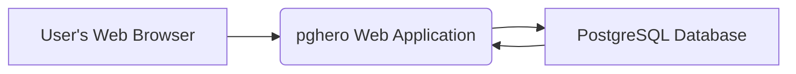
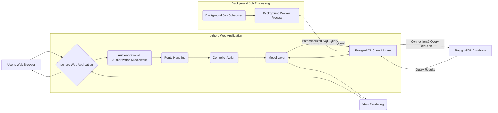

## Project Design Document: pghero (Improved)

**1. Project Overview**

pghero is an open-source Ruby application designed to provide performance insights for PostgreSQL databases. It offers a web-based interface to visualize key metrics, identify slow queries, analyze index usage, and monitor various aspects of database health and performance. This document outlines the architectural design of pghero, with a specific focus on detailing aspects relevant for threat modeling and security analysis.

**2. Goals and Objectives**

*   Provide a detailed and accurate representation of the pghero application's architecture, components, and data flow, emphasizing security-relevant aspects.
*   Clearly identify key interaction points and data pathways within the system that are potential targets for security threats.
*   Serve as a comprehensive and actionable foundation for conducting thorough threat modeling exercises, enabling the identification of vulnerabilities and the development of mitigation strategies.
*   Document the system in a manner that is easily understandable by security professionals, developers, and operations teams involved in the security lifecycle of the application.

**3. Target Audience**

This document is primarily intended for:

*   Security engineers and architects responsible for performing threat modeling, security assessments, and penetration testing.
*   Development team members involved in the design, development, and maintenance of the pghero application, enabling them to build with security in mind.
*   Operations teams responsible for the secure deployment, configuration, and management of pghero instances.

**4. Architecture Overview**

pghero is fundamentally a web application that interacts with one or more target PostgreSQL databases to collect and display performance metrics.

*   **User's Web Browser:** The client application used by an administrator or authorized user to access and interact with the pghero web interface.
*   **pghero Web Application:** The core Ruby on Rails application responsible for handling user requests, authenticating users, executing queries against the target PostgreSQL database(s), processing the results, and rendering the web interface.
*   **PostgreSQL Database:** The target PostgreSQL database instance being monitored by pghero.

**5. Component Details**

*   **Web Application (Ruby on Rails):**
    *   **Framework:** Built using the Ruby on Rails framework (version details are important for identifying known vulnerabilities).
    *   **User Interface:**  Utilizes HTML, CSS, and JavaScript. Specific JavaScript libraries and frameworks used should be noted for potential client-side vulnerabilities.
    *   **Authentication:**  Handles user authentication. The specific mechanism used (e.g., username/password with bcrypt, OAuth) is crucial for security analysis. Session management details (e.g., cookies, session storage) are also relevant.
    *   **Authorization:**  Manages user permissions and access control to different features and data within the application. The implementation of authorization logic needs careful scrutiny.
    *   **Controllers:**  Handle incoming HTTP requests, interact with models, and render views. Input validation and output encoding within controllers are critical security controls.
    *   **Models:** Represent data structures and interact with the PostgreSQL database using an Object-Relational Mapper (ORM) like ActiveRecord. The ORM usage can introduce potential vulnerabilities if not used securely.
    *   **Views:**  Generate the HTML content displayed to the user. Proper output encoding in views is essential to prevent XSS vulnerabilities.
    *   **Routing:**  Maps incoming URLs to specific controller actions. Misconfigured routes can expose unintended functionality.
    *   **Background Jobs (Likely using Active Job with a queuing backend like Sidekiq or Redis):** Handles periodic tasks such as collecting statistics from the PostgreSQL database. These jobs require secure storage and handling of database credentials. The queuing backend itself can be a target.
    *   **Configuration Management:** Stores sensitive configuration data, including database connection strings. The method of storing and accessing this configuration (e.g., environment variables, configuration files) is a key security consideration.
    *   **Logging:**  The application likely uses a logging framework. The level of detail logged and where logs are stored are important for security monitoring and incident response. Ensure sensitive data is not logged.

*   **PostgreSQL Client Library (e.g., `pg` gem in Ruby):**
    *   Used by the pghero application to establish secure connections and execute parameterized SQL queries against the target PostgreSQL database. The version of the client library is relevant for known vulnerabilities.
    *   Manages connection pooling. Improperly configured connection pooling can lead to credential exposure.

*   **Web Server (e.g., Puma, Unicorn):**
    *   Serves the pghero application and handles incoming HTTP/HTTPS requests. The web server configuration (e.g., TLS settings, header security) is crucial.
    *   Responsible for managing application processes. Vulnerabilities in the web server itself can compromise the application.

*   **Database Connection Configuration:**
    *   Contains sensitive information required to connect to the PostgreSQL database (hostname, port, username, password, database name). The storage mechanism for these credentials (e.g., environment variables, encrypted configuration files) is a critical security concern.

**6. Data Flow (Detailed)**

1. **User Initiates Request:** A user interacts with the pghero web interface via their web browser, sending an HTTP request to the application (e.g., requesting to view slow queries).
2. **Authentication and Authorization:** The request first passes through authentication and authorization middleware. This verifies the user's identity and checks if they have the necessary permissions to access the requested resource.
3. **Route Handling:** The application's routing mechanism determines which controller action should handle the incoming request based on the URL.
4. **Controller Action Execution:** The appropriate controller action is invoked. This action is responsible for orchestrating the logic to fulfill the request. This often involves interacting with the model layer.
5. **Model Layer Interaction:** The controller action interacts with one or more models to retrieve or manipulate data. This interaction typically involves constructing and executing database queries.
6. **Parameterized SQL Query Construction:** The model layer, often using an ORM, constructs parameterized SQL queries to interact with the PostgreSQL database. Parameterization is crucial to prevent SQL injection vulnerabilities.
7. **PostgreSQL Client Library Interaction:** The parameterized SQL query is passed to the PostgreSQL client library.
8. **Connection and Query Execution:** The client library establishes a connection to the PostgreSQL database (using the configured credentials) and executes the query.
9. **Query Results Retrieval:** The PostgreSQL database processes the query and returns the results to the client library.
10. **Data Transfer to Model:** The client library passes the query results back to the model layer.
11. **Data Processing and Transformation:** The model layer may perform further processing or transformation of the data.
12. **View Rendering:** The controller action passes the processed data to the appropriate view. The view renders the data into HTML, ensuring proper output encoding to prevent XSS.
13. **Response Transmission:** The rendered HTML response is sent back to the user's web browser.
14. **Background Job Scheduling:**  A background job scheduler (e.g., triggered by a cron job or a similar mechanism) initiates background tasks.
15. **Background Worker Execution:** A background worker process picks up the scheduled job.
16. **Background Job Data Collection:** The background worker executes parameterized SQL queries (similar to the user request flow) to collect performance statistics from the PostgreSQL database.

**7. Security Considerations (Detailed)**

*   **Authentication and Authorization Vulnerabilities:**
    *   **Weak Password Policies:**  If the application allows weak passwords, it becomes susceptible to brute-force attacks.
    *   **Lack of Multi-Factor Authentication (MFA):** Absence of MFA increases the risk of account compromise.
    *   **Session Hijacking:** Vulnerabilities in session management (e.g., insecure cookies, lack of HTTPOnly/Secure flags) can allow attackers to hijack user sessions.
    *   **Insecure Direct Object References (IDOR):** If authorization checks are not properly implemented, users might be able to access resources they shouldn't.
    *   **Privilege Escalation:**  Flaws in authorization logic could allow users to gain elevated privileges.
*   **Database Credential Management:**
    *   **Plaintext Storage:** Storing database credentials in plaintext in configuration files or environment variables is a critical vulnerability.
    *   **Exposure through Logs or Errors:**  Accidentally logging or displaying database credentials in error messages.
    *   **Insufficient Access Controls:**  If the configuration files containing credentials are not properly protected.
*   **SQL Injection Vulnerabilities:**
    *   **Lack of Parameterized Queries:** Constructing SQL queries by directly concatenating user input.
    *   **Improper ORM Usage:**  Using ORM features in a way that bypasses parameterization.
*   **Cross-Site Scripting (XSS) Vulnerabilities:**
    *   **Unsanitized User Input:** Displaying user-provided data without proper encoding, allowing attackers to inject malicious scripts.
    *   **DOM-Based XSS:** Vulnerabilities in client-side JavaScript that allow attackers to inject scripts.
*   **Cross-Site Request Forgery (CSRF) Vulnerabilities:**
    *   **Lack of CSRF Tokens:**  Not using anti-CSRF tokens to protect against unauthorized actions performed on behalf of authenticated users.
*   **Data in Transit Security:**
    *   **Lack of HTTPS:**  Communication between the user's browser and the pghero application is not encrypted, exposing sensitive data.
    *   **Weak TLS Configuration:**  Using outdated TLS versions or weak cipher suites.
    *   **Unencrypted Database Connections:** Communication between the pghero application and the PostgreSQL database is not encrypted.
*   **Access Control to pghero Instance:**
    *   **Open Ports:** Unnecessary network ports are exposed, increasing the attack surface.
    *   **Default Credentials:** Using default credentials for the operating system or other services.
    *   **Insufficient Firewall Rules:**  Lack of proper firewall rules to restrict access to the pghero instance.
*   **Dependency Vulnerabilities:**
    *   **Outdated Framework and Libraries:** Using outdated versions of Ruby on Rails or other dependencies with known security vulnerabilities.
    *   **Unmanaged Dependencies:** Not regularly scanning and updating dependencies for vulnerabilities.
*   **Information Disclosure:**
    *   **Verbose Error Messages:** Displaying detailed error messages that reveal sensitive information about the application or database.
    *   **Exposure of Internal Paths:**  Revealing internal file paths or directory structures.
    *   **Insecure Logging Practices:** Logging sensitive data or storing logs in an insecure location.
*   **Background Job Security:**
    *   **Credential Exposure:**  Storing database credentials used by background jobs insecurely.
    *   **Job Queue Manipulation:** If the job queue is not properly secured, attackers might be able to manipulate or inject malicious jobs.

**8. Deployment Considerations (Security Focused)**

*   **Secure Deployment Environment:**
    *   **Hardened Operating System:** Deploying pghero on a securely configured and hardened operating system.
    *   **Principle of Least Privilege:** Running the application with the minimum necessary privileges.
    *   **Regular Security Patches:** Ensuring the operating system and underlying infrastructure are regularly patched.
*   **Network Security:**
    *   **Network Segmentation:** Isolating the pghero application and the PostgreSQL database on separate network segments.
    *   **Firewall Configuration:** Implementing strict firewall rules to allow only necessary traffic to the pghero instance and the database.
    *   **Intrusion Detection/Prevention Systems (IDS/IPS):** Deploying IDS/IPS to monitor for malicious activity.
*   **Access Control:**
    *   **Role-Based Access Control (RBAC) for Infrastructure:** Limiting access to the servers and infrastructure hosting pghero based on roles.
    *   **Strong Password Policies for Infrastructure:** Enforcing strong password policies for all accounts with access to the infrastructure.
*   **Secure Configuration Management:**
    *   **Infrastructure as Code (IaC):** Using IaC tools to manage and provision infrastructure securely and consistently.
    *   **Secrets Management:** Utilizing dedicated secrets management tools (e.g., HashiCorp Vault, AWS Secrets Manager) to securely store and manage database credentials and other sensitive information.
*   **Monitoring and Logging:**
    *   **Centralized Logging:**  Aggregating logs from the pghero application, web server, and operating system in a central location for security monitoring.
    *   **Security Information and Event Management (SIEM):** Integrating with a SIEM system to detect and respond to security incidents.
    *   **Regular Security Audits:** Conducting periodic security audits and penetration testing to identify vulnerabilities.

**9. Future Considerations (Security Enhancements)**

*   **Implement Multi-Factor Authentication (MFA):**  Adding an extra layer of security for user logins.
*   **Enforce Stronger Password Policies:**  Requiring users to create strong and unique passwords.
*   **Implement Role-Based Access Control (RBAC) within the Application:**  Providing more granular control over user permissions within pghero.
*   **Implement Content Security Policy (CSP):**  Mitigating XSS vulnerabilities by defining a whitelist of trusted sources for content.
*   **Implement Subresource Integrity (SRI):**  Ensuring that files fetched from CDNs haven't been tampered with.
*   **Regular Dependency Scanning and Updates:**  Automating the process of scanning dependencies for vulnerabilities and updating them promptly.
*   **Implement Rate Limiting:** Protecting against brute-force attacks by limiting the number of login attempts.
*   **Implement Input Validation and Output Encoding Frameworks:**  Standardizing and enforcing secure input validation and output encoding practices throughout the application.
*   **Consider Static Application Security Testing (SAST) and Dynamic Application Security Testing (DAST):**  Integrating SAST and DAST tools into the development pipeline to identify vulnerabilities early.

This improved design document provides a more detailed and security-focused overview of the pghero project's architecture. It highlights key areas and potential vulnerabilities that should be considered during threat modeling and security assessments. This enhanced understanding will enable more effective identification and mitigation of security risks.