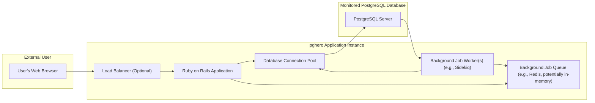

## Project Design Document: pghero (Improved)

**1. Project Overview**

pghero is a Ruby on Rails application designed to provide real-time monitoring and insights into the performance of PostgreSQL databases. It collects and visualizes key metrics related to database health, query performance, resource utilization, and potential issues. The application aims to be a lightweight, self-hosted solution for PostgreSQL monitoring, offering a user-friendly web interface for analysis. This document outlines the architecture of pghero to facilitate threat modeling.

**2. Goals**

* Provide a detailed and clear description of the pghero application's architecture, focusing on components relevant to security.
* Clearly identify the key components, their functionalities, and their interactions within the system.
* Document the flow of data, including sensitive information, within the application.
* Outline various deployment considerations and their potential security implications.
* Provide a comprehensive list of security considerations to guide the threat modeling process.

**3. Non-Goals**

* In-depth analysis of the pghero codebase.
* Step-by-step deployment instructions for specific platforms.
* Detailed performance benchmarks or optimization strategies.
* A complete inventory of all configuration options and their nuances.
* Detailed mockups or specifications of the user interface design.

**4. Architecture**

**4.1. High-Level Architecture Diagram**

**4.2. Component Descriptions**

* **User's Web Browser:** The client application used by an administrator or operator to access and interact with the pghero web interface. This is the primary point of interaction for viewing monitoring data.
* **Load Balancer (Optional):**  In deployments with multiple pghero instances, a load balancer distributes incoming user requests across the available instances. This enhances availability and scalability.
* **Ruby on Rails Application:** The core of pghero, responsible for:
    * **Web Interface:** Handling user authentication (if configured), authorization, request routing, session management, and rendering the user interface. This component presents the collected metrics and allows users to navigate and analyze the data.
    * **API Endpoints:** Providing endpoints for the web interface to fetch data and potentially for external integrations (though less common in pghero's core).
    * **Job Scheduling:**  Initiating background jobs for periodic metric collection.
* **Background Job Queue (e.g., Redis, potentially in-memory):** A message queue used to manage and persist background tasks. When the Rails application needs to collect metrics, it enqueues a job in this queue.
* **Background Job Worker(s) (e.g., Sidekiq):**  Processes the background jobs from the queue. These workers are responsible for connecting to the PostgreSQL database, executing queries to collect metrics, and potentially processing or storing this data (though pghero primarily focuses on real-time display).
* **Database Connection Pool:** Manages a pool of connections to the target PostgreSQL database. This optimizes performance by reusing connections, reducing the overhead of establishing new connections for each request or background job.
* **PostgreSQL Server:** The target PostgreSQL database instance being monitored by pghero. This is where the actual data resides and from which pghero collects performance metrics through SQL queries.

**4.3. Data Flow Diagram**

```mermaid
graph LR
    subgraph "User Interaction"
        UI_REQ["User HTTP Request"]
        UI_RESP["HTTP Response (HTML/JSON)"]
    end
    subgraph "pghero Application"
        RA_RECV["Rails App Receives Request"]
        RA_AUTHZ["Authentication/Authorization Check"]
        RA_PROC["Rails App Processes Request"]
        RA_QUERY_CP["Rails App Requests DB Connection"]
        CP_CONN["Connection from Pool"]
        RA_SEND_SQL["Rails App Sends SQL Query"]
        RA_RECV_DATA["Rails App Receives Data"]
        RA_RENDER["Rails App Renders Response"]
        BJ_ENQUEUE["Rails App Enqueues Metric Collection Job"]
        BQ_STORE["Job Stored in Queue"]
        BJ_FETCH["Background Job Worker Fetches Job"]
        BJ_QUERY_CP["Background Job Requests DB Connection"]
        CP_CONN_BJ["Connection from Pool"]
        BJ_SEND_SQL["Background Job Sends SQL Query"]
        BJ_RECV_METRICS["Background Job Receives Metrics"]
        BJ_PROCESS["Background Job Processes/Stores Metrics (in-memory or transiently)"]
    end
    subgraph "PostgreSQL Database"
        PG_EXEC["PostgreSQL Executes Query"]
        PG_RETURN["PostgreSQL Returns Data"]
    end
    subgraph "Background Job Queue"
        BQ["Background Job Queue"]
    end

    UI_REQ --> RA_RECV
    RA_RECV --> RA_AUTHZ
    RA_AUTHZ --> RA_PROC
    RA_PROC --> RA_QUERY_CP
    RA_QUERY_CP --> CP_CONN
    CP_CONN --> RA_SEND_SQL
    RA_SEND_SQL --> PG_EXEC
    PG_EXEC --> PG_RETURN
    PG_RETURN --> RA_RECV_DATA
    RA_RECV_DATA --> RA_RENDER
    RA_RENDER --> UI_RESP

    RA_PROC --> BJ_ENQUEUE
    BJ_ENQUEUE --> BQ_STORE
    BQ_STORE --> BJ_FETCH
    BJ_FETCH --> BJ_QUERY_CP
    BJ_QUERY_CP --> CP_CONN_BJ
    CP_CONN_BJ --> BJ_SEND_SQL
    BJ_SEND_SQL --> PG_EXEC
    PG_EXEC --> PG_RETURN
    PG_RETURN --> BJ_RECV_METRICS
    BJ_RECV_METRICS --> BJ_PROCESS
```

**4.4. Data Storage**

* pghero primarily operates on data retrieved directly from the monitored PostgreSQL database.
* The Rails application might use its own database (separate from the monitored one) for user accounts, settings, or internal state, though this is not a core requirement of pghero itself.
* The background job queue (e.g., Redis) acts as temporary storage for pending metric collection tasks.
* Collected metrics are generally not persistently stored by pghero. The focus is on real-time visualization. However, users might integrate pghero with external monitoring systems to persist this data.

**5. Deployment Considerations**

* **Deployment Environment:**
    * **Direct Server Deployment:** Running pghero directly on a server requires manual configuration and management of dependencies and the application process. Security considerations include securing the server OS, managing user access, and protecting the application files.
    * **Containerization (Docker):** Deploying pghero within a Docker container provides isolation and simplifies deployment. Security considerations include securing the Docker image, managing container access, and ensuring secure communication between containers.
    * **Platform as a Service (PaaS):** Platforms like Heroku or AWS Elastic Beanstalk abstract away much of the infrastructure management. Security considerations involve understanding the PaaS provider's security model and configuring the application securely within that environment.
* **Network Configuration:**
    * **Network Segmentation:** Isolating the pghero application and the PostgreSQL database on separate network segments can limit the impact of a security breach.
    * **Firewall Rules:** Properly configured firewalls are crucial to restrict network access to the pghero application and the PostgreSQL database to only authorized sources.
* **Authentication and Authorization:**
    * **pghero Web Interface:** Implementing robust authentication (e.g., username/password, OAuth) and authorization mechanisms is essential to control access to the monitoring data. Consider the risk of unauthorized access to sensitive database performance information.
    * **PostgreSQL Database Credentials:** Securely storing and managing the credentials used by pghero to connect to the PostgreSQL database is paramount. Avoid storing credentials in plain text configuration files. Consider using environment variables or dedicated secret management solutions.
* **TLS/SSL Encryption:**
    * **HTTPS:** Enabling HTTPS for the pghero web interface is crucial to protect user credentials and monitoring data transmitted between the browser and the application.
    * **PostgreSQL Connection Encryption:** Configuring pghero to connect to the PostgreSQL database using SSL/TLS encryption protects the confidentiality and integrity of the communication between the two systems.
* **Resource Management:**
    * **Resource Limits:** Setting appropriate resource limits (CPU, memory) for the pghero application can prevent denial-of-service scenarios.
* **Logging and Monitoring:**
    * **Application Logs:**  Comprehensive logging of application activity, including authentication attempts, errors, and significant events, is essential for security auditing and incident response.
    * **Security Monitoring:** Integrating pghero with security monitoring tools can help detect suspicious activity and potential attacks.

**6. Security Considerations (For Threat Modeling)**

* **Authentication and Authorization Vulnerabilities:**
    * **Broken Authentication:** Weak password policies, lack of multi-factor authentication, session fixation vulnerabilities.
    * **Broken Authorization:** Privilege escalation, insecure direct object references allowing unauthorized access to data or functionality.
* **Injection Attacks:**
    * **SQL Injection:**  If user input or data from other sources is not properly sanitized before being used in SQL queries, attackers could execute arbitrary SQL commands on the PostgreSQL database.
    * **Cross-Site Scripting (XSS):** If the application does not properly sanitize user-supplied data before displaying it in the web interface, attackers could inject malicious scripts that are executed in other users' browsers.
    * **Cross-Site Request Forgery (CSRF):**  If the application does not properly protect against CSRF attacks, attackers could trick authenticated users into performing unintended actions.
* **Data Confidentiality Breaches:**
    * **Exposure of Sensitive Information:**  Accidental or intentional exposure of database credentials, query data, or performance metrics through insecure channels or interfaces.
    * **Man-in-the-Middle Attacks:**  If communication channels are not properly encrypted (e.g., lack of HTTPS or SSL for database connections), attackers could intercept and eavesdrop on sensitive data.
* **Availability Attacks:**
    * **Denial of Service (DoS):**  Overwhelming the pghero application or the PostgreSQL database with requests, making them unavailable to legitimate users.
    * **Resource Exhaustion:**  Exploiting vulnerabilities to consume excessive resources (CPU, memory, database connections), leading to performance degradation or crashes.
* **Insecure Dependencies:**
    * Using outdated or vulnerable versions of libraries and frameworks (e.g., Ruby on Rails, gems) that contain known security flaws.
* **Insecure Configuration:**
    * Leaving default credentials in place.
    * Exposing unnecessary ports or services.
    * Misconfiguring security settings.
* **Insufficient Logging and Monitoring:**
    * Lack of adequate logging makes it difficult to detect and respond to security incidents.
    * Insufficient monitoring can lead to delayed detection of attacks.
* **Code Security Vulnerabilities:**
    * Buffer overflows, integer overflows, or other memory safety issues in the pghero codebase.
    * Logic flaws that can be exploited by attackers.
* **Third-Party Integrations:**
    * If pghero integrates with other systems, vulnerabilities in those integrations could be exploited.

**7. Technologies Used**

* **Programming Language:** Ruby
* **Web Framework:** Ruby on Rails
* **Background Job Processing:** Likely Sidekiq (or similar)
* **Background Job Queue:**  Potentially Redis or an in-memory queue.
* **Database:** PostgreSQL
* **Web Server:**  Likely Puma or a similar Rack server.
* **Templating Engine:**  ERB (Embedded Ruby) or a similar templating language.
* **Front-End Technologies:**  Likely a combination of HTML, CSS, and JavaScript, potentially using libraries like jQuery or modern JavaScript frameworks.

This improved design document provides a more detailed and security-focused overview of the pghero application's architecture. It highlights key components, data flows, deployment considerations, and a comprehensive list of security considerations to facilitate a thorough threat modeling process.