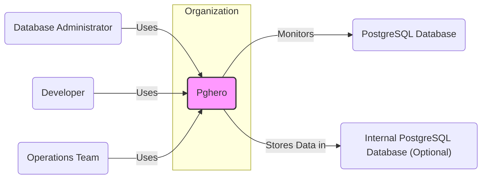
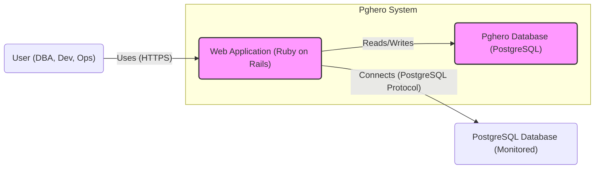
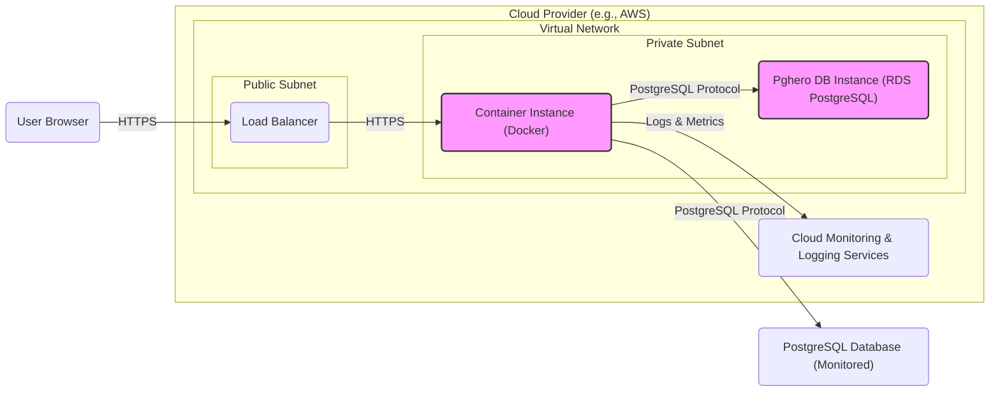
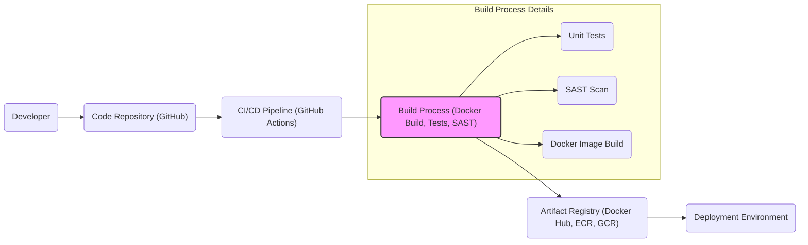

# BUSINESS POSTURE

This project, pghero, aims to provide a comprehensive performance monitoring solution for PostgreSQL databases. By offering insights into database performance metrics, pghero helps businesses achieve several key objectives:

- Proactive Performance Management: Identify and resolve performance bottlenecks before they impact applications and users.
- Resource Optimization: Optimize database resource utilization, leading to cost savings and improved efficiency.
- Informed Decision Making: Provide data-driven insights for database tuning, capacity planning, and infrastructure upgrades.
- Reduced Downtime: Minimize database-related incidents and downtime through early detection of performance issues.

The primary business goal is to ensure the reliable and efficient operation of PostgreSQL databases, which are critical infrastructure components for many businesses.

Key business risks associated with this project include:

- Data Breach: Unauthorized access to sensitive database performance data or database connection credentials stored by pghero.
- Service Disruption: Downtime of pghero itself, or performance degradation of the monitored PostgreSQL database due to pghero's operation.
- Misleading Data: Inaccurate or unreliable performance data leading to incorrect decisions and potentially worsening database performance.
- Availability Risk: Lack of access to performance monitoring data when needed, hindering incident response and performance troubleshooting.

# SECURITY POSTURE

Existing security controls for pghero are primarily inherited from the underlying PostgreSQL database and the deployment environment. Based on the project's documentation and common practices for similar tools, the following security controls and accepted risks can be identified:

- security control: PostgreSQL Authentication. pghero relies on PostgreSQL's built-in authentication mechanisms to connect to and monitor databases. Implemented in: PostgreSQL database configuration.
- accepted risk: Reliance on PostgreSQL security configuration. If PostgreSQL is misconfigured or vulnerable, pghero and the monitored database could be compromised.
- accepted risk: Lack of dedicated authentication and authorization for pghero web interface. Access control to pghero UI is not explicitly defined in the project itself, potentially relying on network-level security or reverse proxy authentication if implemented by the user.
- accepted risk: Potential for SQL injection vulnerabilities if pghero's queries are not properly parameterized or sanitized.

Recommended security controls to enhance pghero's security posture:

- recommended security control: Implement HTTPS for the pghero web interface to protect data in transit and prevent eavesdropping.
- recommended security control: Introduce authentication and authorization mechanisms for the pghero web interface to control access to performance data and administrative functions.
- recommended security control: Implement input validation and parameterized queries to mitigate SQL injection risks.
- recommended security control: Securely store database connection credentials, potentially using encryption or a secrets management solution.
- recommended security control: Regularly update pghero and its dependencies to patch known security vulnerabilities.
- recommended security control: Implement security scanning (SAST/DAST) in the development lifecycle to identify and address potential vulnerabilities early.

Security requirements for pghero:

- Authentication:
    - Requirement: Securely authenticate users accessing the pghero web interface.
    - Requirement: Support strong password policies and consider multi-factor authentication.
- Authorization:
    - Requirement: Implement role-based access control to restrict access to sensitive features and data based on user roles (e.g., view-only, administrator).
    - Requirement: Ensure only authorized users can modify pghero settings and database connections.
- Input Validation:
    - Requirement: Validate all user inputs to prevent injection attacks (e.g., SQL injection, command injection).
    - Requirement: Sanitize user inputs before using them in database queries or system commands.
- Cryptography:
    - Requirement: Encrypt sensitive data at rest, such as database connection credentials.
    - Requirement: Use HTTPS to encrypt communication between the user's browser and the pghero web interface.
    - Requirement: Consider encrypting communication between pghero and the monitored PostgreSQL databases if necessary and supported by the database configuration.

# DESIGN

## C4 CONTEXT

Context Diagram Elements:

- Element:
    - Name: Pghero
    - Type: Software System
    - Description: PostgreSQL performance monitoring tool providing insights into database metrics and performance.
    - Responsibilities: Collect, process, and visualize PostgreSQL performance data. Provide a user interface for accessing and analyzing performance metrics.
    - Security controls: HTTPS for web interface (recommended), Authentication and Authorization for web interface (recommended), Input validation (recommended), Secure credential storage (recommended).

- Element:
    - Name: Database Administrator
    - Type: User Role
    - Description: Responsible for managing and maintaining PostgreSQL databases, including performance monitoring and tuning.
    - Responsibilities: Use pghero to monitor database performance, identify issues, and optimize database configurations.
    - Security controls: Strong password for pghero access (if implemented), MFA for pghero access (if implemented), Role-Based Access Control within pghero (if implemented).

- Element:
    - Name: Developer
    - Type: User Role
    - Description: Develops and maintains applications that rely on PostgreSQL databases.
    - Responsibilities: Use pghero to understand the performance impact of their applications on the database and identify areas for optimization.
    - Security controls: Strong password for pghero access (if implemented), MFA for pghero access (if implemented), Role-Based Access Control within pghero (if implemented).

- Element:
    - Name: Operations Team
    - Type: User Role
    - Description: Responsible for the operational stability and performance of the IT infrastructure, including PostgreSQL databases.
    - Responsibilities: Use pghero for proactive monitoring, incident response, and capacity planning related to PostgreSQL databases.
    - Security controls: Strong password for pghero access (if implemented), MFA for pghero access (if implemented), Role-Based Access Control within pghero (if implemented).

- Element:
    - Name: PostgreSQL Database (Monitored)
    - Type: Software System
    - Description: The PostgreSQL database being monitored by pghero.
    - Responsibilities: Provide performance metrics to pghero. Process queries from applications. Store application data.
    - Security controls: PostgreSQL authentication, Network security (firewall rules), Regular security patching, Access control lists.

- Element:
    - Name: Internal PostgreSQL Database (Optional)
    - Type: Software System
    - Description: An optional internal PostgreSQL database used by pghero to store its own configuration and collected performance data. This might be the same as the monitored database or a separate instance.
    - Responsibilities: Store pghero configuration, store collected performance data.
    - Security controls: PostgreSQL authentication, Network security (firewall rules), Regular security patching, Access control lists, Encryption at rest (recommended).

## C4 CONTAINER

Container Diagram Elements:

- Element:
    - Name: Web Application (Ruby on Rails)
    - Type: Container - Web Application
    - Description: The user interface and backend logic of pghero, built using Ruby on Rails. Handles user requests, collects data from monitored databases, and stores data in the pghero database.
    - Responsibilities: Serve the pghero web interface, authenticate and authorize users (recommended), collect performance data from monitored PostgreSQL databases, process and store performance data, visualize performance metrics.
    - Security controls: HTTPS, Web application firewall (WAF) (recommended), Input validation, Output encoding, Authentication and Authorization, Secure session management, Regular security updates of Ruby on Rails and dependencies.

- Element:
    - Name: Pghero Database (PostgreSQL)
    - Type: Container - Database
    - Description: An internal PostgreSQL database used by pghero to store its configuration, collected performance data, and potentially user session data.
    - Responsibilities: Persistently store pghero configuration, store collected performance metrics, store user session data (if applicable).
    - Security controls: PostgreSQL authentication, Network security (firewall rules), Regular security patching, Access control lists, Encryption at rest (recommended), Database backups.

- Element:
    - Name: PostgreSQL Database (Monitored)
    - Type: External System - Database
    - Description: The external PostgreSQL database that pghero monitors.
    - Responsibilities: Provide performance metrics to pghero.
    - Security controls: PostgreSQL authentication, Network security (firewall rules), Regular security patching, Access control lists, Audit logging.

## DEPLOYMENT

Deployment Option: Docker Container on Cloud Infrastructure (e.g., AWS, Azure, GCP)

Deployment Diagram Elements:

- Element:
    - Name: Load Balancer
    - Type: Infrastructure - Load Balancer
    - Description: Distributes incoming HTTPS traffic across multiple container instances (if scaled horizontally). Provides SSL termination and potentially other security features like DDoS protection.
    - Responsibilities: Load balancing, SSL termination, DDoS protection (cloud provider managed).
    - Security controls: SSL/TLS configuration, DDoS protection, Access control lists, Security logging.

- Element:
    - Name: Container Instance (Docker)
    - Type: Infrastructure - Compute Instance
    - Description: A virtual machine or container service instance running the pghero Docker container.
    - Responsibilities: Run the pghero web application container, execute pghero code, connect to the pghero database and monitored databases.
    - Security controls: Container image security scanning, Host-level security hardening, Network security groups/firewall rules, Regular patching of the underlying OS and container runtime.

- Element:
    - Name: Pghero DB Instance (RDS PostgreSQL)
    - Type: Infrastructure - Managed Database Service
    - Description: A managed PostgreSQL database service (e.g., AWS RDS, Azure Database for PostgreSQL, GCP Cloud SQL for PostgreSQL) used for the pghero database.
    - Responsibilities: Host the pghero database, manage database backups, ensure database availability and performance.
    - Security controls: Managed database security features (encryption at rest, backups, patching), Access control lists, Network security groups/firewall rules, PostgreSQL authentication.

- Element:
    - Name: Cloud Monitoring & Logging Services
    - Type: Infrastructure - Monitoring and Logging
    - Description: Cloud provider's monitoring and logging services (e.g., AWS CloudWatch, Azure Monitor, GCP Cloud Logging) used to collect logs and metrics from pghero and the infrastructure.
    - Responsibilities: Centralized logging, performance monitoring, alerting, security event monitoring.
    - Security controls: Access control to logs and metrics, Data retention policies, Security information and event management (SIEM) integration (optional).

- Element:
    - Name: User Browser
    - Type: External - User Client
    - Description: User's web browser accessing the pghero web interface.
    - Responsibilities: Render the pghero UI, send user requests to pghero.
    - Security controls: Browser security features, User awareness of phishing and other web-based attacks.

- Element:
    - Name: PostgreSQL Database (Monitored)
    - Type: External System - Database
    - Description: The PostgreSQL database being monitored, potentially located in the same or different network environment.
    - Responsibilities: Provide performance metrics to pghero.
    - Security controls: PostgreSQL authentication, Network security (firewall rules), Regular security patching, Access control lists, Audit logging.

## BUILD

Build Process Description:

1. Developer commits code changes to the Code Repository (GitHub).
2. CI/CD Pipeline (GitHub Actions) is triggered by code changes.
3. Build Process executes:
    - Unit Tests: Run automated unit tests to ensure code quality and functionality.
    - SAST Scan: Perform Static Application Security Testing to identify potential vulnerabilities in the code.
    - Docker Image Build: Build a Docker image of the pghero application.
4. Build Artifacts (Docker image) are pushed to the Artifact Registry (e.g., Docker Hub, cloud provider's container registry).
5. Deployment Environment pulls the Docker image from the Artifact Registry for deployment.

Security Controls in Build Process:

- security control: Code Repository Security: Access control to the code repository, branch protection, code review process. Implemented in: GitHub repository settings.
- security control: CI/CD Pipeline Security: Secure pipeline configuration, access control to pipeline secrets and credentials, audit logging of pipeline activities. Implemented in: GitHub Actions configuration.
- security control: Unit Tests: Help ensure code quality and reduce the likelihood of bugs, including security vulnerabilities. Implemented in: Project codebase and CI pipeline.
- security control: SAST Scan: Identify potential security vulnerabilities in the source code before deployment. Implemented in: CI pipeline using SAST tools.
- security control: Docker Image Security: Base image vulnerability scanning, minimal image size, principle of least privilege within the container. Implemented in: Dockerfile and CI pipeline.
- security control: Artifact Registry Security: Access control to the artifact registry, vulnerability scanning of stored images, image signing (optional). Implemented in: Artifact registry settings.
- security control: Dependency Management: Use dependency scanning tools to identify and manage vulnerabilities in project dependencies. Implemented in: CI pipeline and dependency management tools (e.g., Bundler for Ruby).

# RISK ASSESSMENT

Critical Business Processes Protected by Pghero:

- Database Performance Monitoring: Ensuring continuous visibility into database performance to proactively identify and resolve issues.
- Database Incident Response: Providing data for diagnosing and resolving database performance incidents quickly and effectively.
- Database Capacity Planning: Supplying data for informed decisions about database infrastructure scaling and resource allocation.
- Database Optimization: Enabling data-driven database tuning and configuration adjustments to improve performance and efficiency.

Data Sensitivity:

- Database Performance Metrics: Medium sensitivity. While not directly containing application data, performance metrics can reveal information about application usage patterns, business activity, and potentially sensitive database configurations.
- Database Connection Credentials: High sensitivity. Credentials used by pghero to connect to monitored databases must be protected to prevent unauthorized database access.
- Pghero Configuration Data: Low to Medium sensitivity. Configuration data might include database connection details and user preferences, which should be protected from unauthorized modification.
- Pghero Logs: Low to Medium sensitivity. Logs may contain information about pghero's operation and user activity, which can be useful for auditing and troubleshooting but might also contain some sensitive information.

# QUESTIONS & ASSUMPTIONS

Questions:

- What is the intended deployment environment for pghero (cloud, on-premise, hybrid)?
- What are the specific security requirements and compliance standards that pghero needs to adhere to?
- What is the organization's risk tolerance regarding data breaches and service disruptions?
- Are there existing security tools and infrastructure that pghero should integrate with (e.g., SIEM, secrets management)?
- What is the expected scale of pghero deployment (number of monitored databases, users)?
- Is there a dedicated security team involved in reviewing and approving the design and deployment of pghero?

Assumptions:

- Pghero is intended for internal use within an organization, not for public-facing services.
- The organization has some existing security infrastructure and practices in place.
- The organization values the confidentiality, integrity, and availability of database performance data and the monitored databases.
- The deployment environment provides basic network security controls (firewalls, network segmentation).
- The organization is willing to invest in implementing recommended security controls to mitigate identified risks.