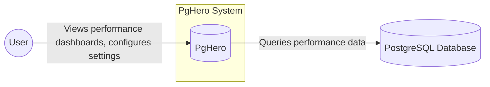
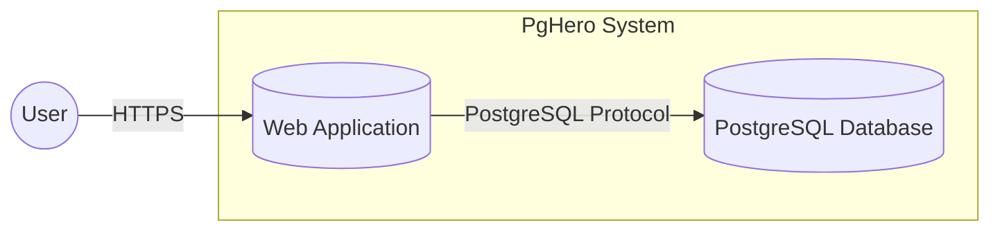
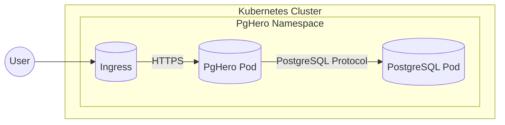
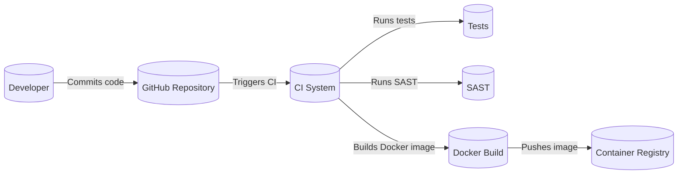

Okay, let's create a design document for the PgHero project, keeping in mind its purpose and potential security considerations.

# BUSINESS POSTURE

PgHero is a performance dashboard for PostgreSQL. It's designed to provide insights into database performance, helping users identify bottlenecks and optimize their queries. It's an open-source project, likely used by a wide range of organizations, from small startups to larger enterprises.

Priorities:

*   Provide clear and actionable performance insights.
*   Easy to install and use.
*   Minimal performance overhead on the monitored database.
*   Support a wide range of PostgreSQL versions.
*   Maintainability and extensibility of the codebase.

Goals:

*   Help users identify slow queries.
*   Provide information about database resource utilization (CPU, memory, disk I/O).
*   Help users understand database configuration and potential improvements.
*   Detect potential security issues related to database configuration.

Business Risks:

*   Data Breach: Unauthorized access to sensitive database performance data, potentially revealing information about the database structure, queries, or even data previews.
*   Data Modification: If an attacker gains write access to the PgHero instance, they could potentially modify settings or even execute arbitrary SQL commands if PgHero has elevated privileges.
*   Denial of Service: An attacker could potentially overload the PgHero instance, making it unavailable to legitimate users, or even impact the performance of the monitored database if PgHero consumes excessive resources.
*   Reputational Damage: Security vulnerabilities in PgHero could damage the reputation of the project and its maintainers.
*   Compliance Violations: Depending on the data stored and regulations applicable to the user, inadequate security controls in PgHero could lead to compliance violations (e.g., GDPR, HIPAA, PCI DSS).

# SECURITY POSTURE

Existing Security Controls:

*   security control: Authentication: PgHero supports basic authentication (username/password) as described in the README.
*   security control: Database User Permissions: The README recommends creating a dedicated PostgreSQL user with limited privileges for PgHero. This user should only have read-only access to the necessary system views and functions.
*   security control: Rails Security Features: PgHero is built with Ruby on Rails, which provides some built-in security features, such as protection against cross-site scripting (XSS) and cross-site request forgery (CSRF). These are implicitly present due to the framework choice.
*   security control: Input Sanitization: PgHero likely includes input sanitization to prevent SQL injection vulnerabilities, as it constructs SQL queries based on user input (e.g., selecting a database, time range). This is a standard practice in Rails applications.

Accepted Risks:

*   accepted risk: Limited Authorization: PgHero's built-in authentication is relatively basic. It doesn't offer granular authorization controls (e.g., restricting access to specific dashboards or features based on user roles).
*   accepted risk: No Built-in Encryption: PgHero doesn't appear to have built-in support for encrypting data in transit (HTTPS) or at rest. This is left to the user to configure at the infrastructure level.
*   accepted risk: Dependency Vulnerabilities: Like any software project, PgHero depends on third-party libraries (gems). These dependencies could have security vulnerabilities that could be exploited.
*   accepted risk: Limited Auditing: PgHero doesn't appear to have built-in auditing capabilities to track user actions or configuration changes.

Recommended Security Controls:

*   security control: Enforce HTTPS: Strongly recommend running PgHero behind a reverse proxy (e.g., Nginx, Apache) that handles TLS termination and enforces HTTPS.
*   security control: Implement Strong Password Policies: Enforce strong password policies for PgHero users, including minimum length, complexity requirements, and potentially password rotation.
*   security control: Regularly Update Dependencies: Implement a process for regularly updating PgHero and its dependencies to patch security vulnerabilities.  Consider using tools like Dependabot.
*   security control: Consider Enhanced Authentication: Explore options for integrating with existing authentication systems (e.g., LDAP, OAuth) to provide more robust authentication and potentially authorization.
*   security control: Implement Auditing: Add auditing capabilities to track user logins, configuration changes, and potentially queries executed through PgHero.
*   security control: Content Security Policy (CSP): Implement a strong CSP to mitigate the risk of XSS attacks.
*   security control: Network Segmentation: Deploy PgHero in a separate network segment from the production database to limit the impact of a potential compromise.

Security Requirements:

*   Authentication:
    *   Users must be authenticated before accessing PgHero dashboards.
    *   Support for strong passwords.
    *   Consider multi-factor authentication (MFA) if feasible.

*   Authorization:
    *   Implement role-based access control (RBAC) to restrict access to specific dashboards or features based on user roles (future enhancement).

*   Input Validation:
    *   All user input must be validated and sanitized to prevent SQL injection and other injection attacks.

*   Cryptography:
    *   All communication between the user's browser and PgHero must be encrypted using TLS (HTTPS).
    *   Sensitive data (e.g., database credentials) should be stored securely, preferably using environment variables or a dedicated secrets management solution.

*   Database Permissions:
    *   PgHero should connect to the PostgreSQL database using a dedicated user with the minimum required privileges (read-only access to system views).

# DESIGN

## C4 CONTEXT

Element Descriptions:

*   Element:
    *   Name: User
    *   Type: Person
    *   Description: A person who uses PgHero to monitor PostgreSQL database performance.
    *   Responsibilities: Views dashboards, configures settings, analyzes performance data.
    *   Security controls: Authentication (username/password, potentially MFA), authorization (future RBAC).

*   Element:
    *   Name: PgHero
    *   Type: Software System
    *   Description: The PgHero performance dashboard application.
    *   Responsibilities: Collects data from PostgreSQL, presents data to users, provides configuration options.
    *   Security controls: Input validation, authentication, database connection security, Rails security features (XSS, CSRF protection).

*   Element:
    *   Name: PostgreSQL Database
    *   Type: Software System
    *   Description: The PostgreSQL database being monitored by PgHero.
    *   Responsibilities: Stores data, executes queries, provides performance metrics.
    *   Security controls: Database user permissions (limited privileges for PgHero user), standard PostgreSQL security configuration.

## C4 CONTAINER

Element Descriptions:

*   Element:
    *   Name: User
    *   Type: Person
    *   Description: A person who uses PgHero to monitor PostgreSQL database performance.
    *   Responsibilities: Views dashboards, configures settings, analyzes performance data.
    *   Security controls: Authentication (username/password, potentially MFA), authorization (future RBAC).

*   Element:
    *   Name: Web Application
    *   Type: Container (Ruby on Rails Application)
    *   Description: The PgHero web application, built with Ruby on Rails.
    *   Responsibilities: Handles user requests, interacts with the database, renders dashboards.
    *   Security controls: Input validation, authentication, database connection security, Rails security features (XSS, CSRF protection), session management.

*   Element:
    *   Name: PostgreSQL Database
    *   Type: Container (PostgreSQL Database)
    *   Description: The PostgreSQL database being monitored.
    *   Responsibilities: Stores data, executes queries, provides performance metrics.
    *   Security controls: Database user permissions (limited privileges for PgHero user), standard PostgreSQL security configuration, network access controls.

## DEPLOYMENT

Possible Deployment Solutions:

1.  **Bare Metal/VM:** PgHero deployed directly on a server (physical or virtual).
2.  **Docker Container:** PgHero packaged as a Docker container and deployed on a container orchestration platform (e.g., Docker Compose, Kubernetes).
3.  **Cloud Platform (e.g., Heroku, AWS, GCP):** PgHero deployed using a Platform-as-a-Service (PaaS) offering.

Chosen Solution (for detailed description): Docker Container on Kubernetes

Element Descriptions:

*   Element:
    *   Name: User
    *   Type: Person
    *   Description: A person who uses PgHero to monitor PostgreSQL database performance.
    *   Responsibilities: Views dashboards, configures settings, analyzes performance data.
    *   Security controls: Authentication (username/password, potentially MFA), authorization (future RBAC).

*   Element:
    *   Name: Ingress
    *   Type: Kubernetes Ingress
    *   Description: Exposes PgHero to external traffic, handles TLS termination.
    *   Responsibilities: Routing traffic to the PgHero service, enforcing HTTPS.
    *   Security controls: TLS configuration, potentially web application firewall (WAF) integration.

*   Element:
    *   Name: PgHero Pod
    *   Type: Kubernetes Pod
    *   Description: Runs the PgHero web application container.
    *   Responsibilities: Serves user requests, interacts with the database.
    *   Security controls: Container security (minimal base image, vulnerability scanning), network policies.

*   Element:
    *   Name: PostgreSQL Pod
    *   Type: Kubernetes Pod
    *   Description: Runs the PostgreSQL database container.
    *   Responsibilities: Stores data, executes queries.
    *   Security controls: Container security, network policies, database user permissions, data encryption at rest (if supported by the PostgreSQL image).

*   Element:
      * Name: PgHero Namespace
      * Type: Kubernetes Namespace
      * Description: Logical grouping for PgHero resources.
      * Responsibilities: Provides isolation and resource management.
      * Security controls: RBAC for namespace access.

## BUILD

The build process for PgHero likely involves the following steps:

1.  **Developer:** Writes code and commits changes to the Git repository (GitHub).
2.  **Continuous Integration (CI):** A CI system (e.g., GitHub Actions, Travis CI) is triggered by the commit.
3.  **Dependency Management:** The CI system installs Ruby gems using Bundler.
4.  **Testing:** The CI system runs automated tests (unit tests, integration tests).
5.  **Static Analysis:**  Linters (e.g., RuboCop) and static analysis security testing (SAST) tools (e.g., Brakeman) are run to identify code quality and security issues.
6.  **Docker Build (Optional):** If PgHero is packaged as a Docker container, a Dockerfile is used to build the image. This involves copying the application code, installing dependencies, and configuring the runtime environment.
7.  **Artifact Publication:** The built Docker image (if applicable) is pushed to a container registry (e.g., Docker Hub, GitHub Container Registry).

Security Controls in Build Process:

*   security control: Dependency Scanning: Tools like Bundler-audit or Dependabot can be used to scan for known vulnerabilities in Ruby gems.
*   security control: SAST: Static analysis security testing tools (e.g., Brakeman) can identify potential security vulnerabilities in the application code.
*   security control: Code Review:  Require code reviews before merging changes to the main branch.
*   security control: Least Privilege: The CI system should have limited permissions, only those necessary to build and test the application.
*   security control: Docker Image Security: Use minimal base images, scan for vulnerabilities in the Docker image, and avoid including unnecessary tools or credentials in the image.

# RISK ASSESSMENT

Critical Business Processes:

*   Database Performance Monitoring: Ensuring the availability and performance of the PostgreSQL database is critical for the applications that rely on it. PgHero helps monitor this.
*   Database Optimization: Identifying and resolving performance bottlenecks is crucial for maintaining a responsive and efficient database.

Data We Are Trying to Protect:

*   Database Performance Metrics: CPU usage, memory usage, disk I/O, query execution times, etc. (Sensitivity: Medium - Could reveal information about database structure and workload).
*   Database Configuration: Settings, parameters, and extensions used by the database. (Sensitivity: Medium - Could reveal potential vulnerabilities or misconfigurations).
*   Query Examples (potentially): PgHero might display snippets of SQL queries, which could potentially contain sensitive data if not properly redacted. (Sensitivity: High - Depending on the query and data).
*   PgHero Configuration: Usernames, passwords, database connection strings. (Sensitivity: High - Direct access to credentials).

# QUESTIONS & ASSUMPTIONS

Questions:

*   What is the expected user base and scale of deployment for PgHero instances? (This impacts the importance of scalability and high availability).
*   Are there any specific compliance requirements (e.g., GDPR, HIPAA, PCI DSS) that apply to the users of PgHero?
*   What is the current process for handling security vulnerabilities reported in PgHero or its dependencies?
*   Is there any existing monitoring or alerting system in place for PgHero instances?
*   What level of access does PgHero require to the PostgreSQL database? (Ideally, read-only access to specific system views).
*   Are there plans to add support for other database systems besides PostgreSQL?

Assumptions:

*   BUSINESS POSTURE: PgHero is primarily used for monitoring, not for making direct changes to the database.
*   BUSINESS POSTURE: Users are generally technically proficient and understand the basics of database administration.
*   SECURITY POSTURE: The PostgreSQL database being monitored is already configured with basic security best practices.
*   SECURITY POSTURE: Users are responsible for securing the network environment where PgHero is deployed.
*   DESIGN: PgHero is typically deployed behind a reverse proxy that handles TLS termination.
*   DESIGN: The database connection string is stored securely (e.g., as an environment variable).
*   DESIGN: The build process is automated using a CI system.