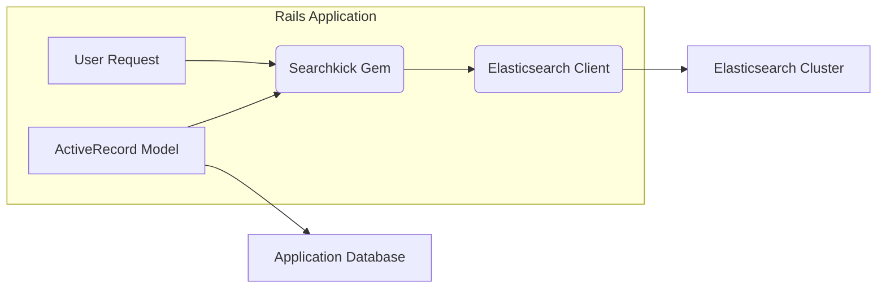
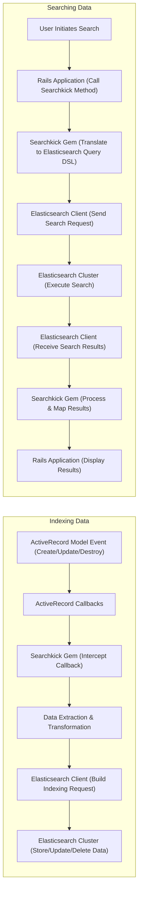
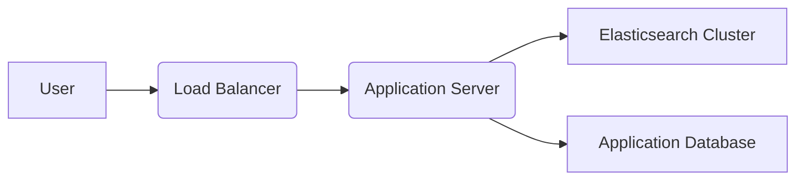
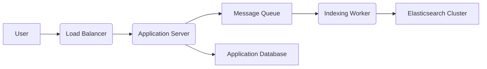

# Project Design Document: Searchkick Integration

**Version:** 2.0
**Date:** October 26, 2023
**Author:** Gemini (AI Architecture Expert)

## 1. Introduction

This document provides an enhanced and more detailed design overview of the Searchkick project, a Ruby gem facilitating the integration of Elasticsearch into Rails applications. Building upon the previous version, this iteration provides greater granularity in describing the system's architecture and data flows. The primary purpose remains to serve as a solid foundation for subsequent threat modeling activities, enabling a more in-depth analysis of potential security vulnerabilities.

## 2. Goals

* Provide a comprehensive and granular architectural description of Searchkick and its interactions.
* Clearly identify key components and detail their interactions within the system.
* Detail the flow of data during both indexing and searching operations with greater precision.
* Highlight potential security considerations with more specific examples for effective threat modeling.

## 3. Target Audience

This document is intended for:

* Security engineers and architects responsible for conducting thorough threat modeling and security assessments.
* Development teams actively working with or planning to integrate Searchkick into their Rails applications.
* Operations teams responsible for the deployment, maintenance, and monitoring of applications utilizing Searchkick.

## 4. System Overview

Searchkick simplifies the integration of Elasticsearch with Rails applications by providing a high-level, intuitive API. It abstracts away much of the complexity involved in interacting directly with Elasticsearch, focusing on synchronizing data from ActiveRecord models for efficient searching. The core strength of Searchkick lies in its ability to keep the Elasticsearch index consistent with the application's database.

### 4.1. Key Components

* **Rails Application:** The core application leveraging the Searchkick gem. This application houses the ActiveRecord models whose data requires indexing and searching capabilities.
* **Searchkick Gem:** The Ruby gem integrated into the Rails application. It offers the Domain Specific Language (DSL) and underlying logic for seamless interaction with Elasticsearch. This includes managing indexing, search queries, and synchronization.
* **ActiveRecord Models:** The specific data models within the Rails application designated as searchable through the use of Searchkick's `searchkick` method. These models are the source of truth for the data indexed in Elasticsearch.
* **Elasticsearch Cluster:** The external, distributed search and analytics engine responsible for storing, indexing, and efficiently searching the application's data.
* **Application Database (e.g., PostgreSQL, MySQL):** The primary persistent storage for the Rails application's data. This database is the authoritative source for the information indexed in Elasticsearch.
* **Elasticsearch Client (e.g., `elasticsearch-ruby`):** The Ruby client library used by the Searchkick gem to communicate with the Elasticsearch cluster via its REST API.

### 4.2. High-Level Architecture Diagram

## 5. Data Flow

This section provides a more detailed breakdown of the data flow during both indexing and searching operations.

### 5.1. Indexing Data

1. **Data Event in Application Database:** An event occurs in the Application Database involving an ActiveRecord model marked as searchable. This could be the creation of a new record, an update to an existing record, or the deletion of a record.
2. **ActiveRecord Callbacks Triggered:** ActiveRecord's built-in callback mechanism is triggered by the database event.
3. **Searchkick Intercepts Callbacks:** The Searchkick gem registers listeners for these ActiveRecord callbacks on the searchable models.
4. **Data Extraction and Transformation:** Upon intercepting a relevant callback, Searchkick extracts the necessary data from the ActiveRecord model instance. This might involve selecting specific attributes or applying defined transformations.
5. **Elasticsearch Indexing Request:** The Searchkick gem, utilizing the Elasticsearch Client, constructs an indexing request (or a delete request in case of record deletion) formatted according to the Elasticsearch Bulk API.
6. **Communication with Elasticsearch:** The Elasticsearch Client sends the indexing request over the network to the Elasticsearch Cluster's REST API.
7. **Data Storage and Indexing:** The Elasticsearch Cluster receives the request, processes it, and stores (or removes) the data in the designated index, making it searchable.

### 5.2. Searching Data

1. **User Initiates Search:** A user interacts with the Rails application, initiating a search action (e.g., submitting a search query via a form).
2. **Search Query via Searchkick API:** The Rails application code utilizes Searchkick's `search` method on the relevant ActiveRecord model, passing the user's search query and any associated options.
3. **Query Translation to Elasticsearch DSL:** The Searchkick gem translates the high-level search query and options into the Elasticsearch Query DSL (expressed in JSON). This involves mapping Searchkick's syntax to the more complex Elasticsearch query structure.
4. **Elasticsearch Search Request:** The Searchkick gem, through the Elasticsearch Client, sends a search request containing the translated query to the Elasticsearch Cluster's REST API.
5. **Search Execution in Elasticsearch:** The Elasticsearch Cluster receives the search request, executes the query against the specified index, and identifies matching documents based on its inverted index.
6. **Search Results Returned:** The Elasticsearch Cluster sends the search results back to the Rails application via the Elasticsearch Client. The results are typically returned as a JSON payload containing matching documents and metadata.
7. **Results Processing and Mapping:** Searchkick processes the raw search results. It often maps the returned documents back to corresponding ActiveRecord model instances, simplifying their use within the application.
8. **Results Display:** The processed search results are then presented to the user within the Rails application's user interface.

### 5.3. Data Flow Diagram

## 6. Security Considerations

This section expands on the potential security considerations, providing more specific examples and context for threat modeling.

* **Elasticsearch Access Control:**
    * **Threat:** Unauthorized access to the Elasticsearch cluster could lead to data breaches, manipulation, or denial of service.
    * **Mitigation:** Implement strong authentication (e.g., username/password, API keys, TLS client certificates) and authorization mechanisms (e.g., role-based access control) within Elasticsearch. Restrict network access to the Elasticsearch ports (9200, 9300) using firewalls or security groups. Securely configure Elasticsearch users and roles with the principle of least privilege.
* **Data Security in Transit:**
    * **Threat:** Interception of communication between the Rails application and Elasticsearch could expose sensitive data.
    * **Mitigation:** Enforce encryption of all communication between the Rails application and the Elasticsearch cluster using HTTPS (TLS/SSL). Ensure the Elasticsearch client is configured to use HTTPS.
* **Data Security at Rest:**
    * **Threat:** Unauthorized access to the underlying storage of the Elasticsearch cluster could compromise sensitive indexed data.
    * **Mitigation:** If sensitive data is indexed, consider enabling Elasticsearch's encryption at rest feature. Secure the physical infrastructure where Elasticsearch data is stored.
* **Input Validation and Sanitization:**
    * **Threat:** Maliciously crafted search queries could exploit vulnerabilities in Elasticsearch, leading to information disclosure or denial of service (Elasticsearch query injection).
    * **Mitigation:**  While Searchkick provides some abstraction, ensure proper input validation and sanitization of user-provided search queries within the Rails application *before* passing them to Searchkick. Be aware of the potential for complex Elasticsearch queries to introduce vulnerabilities.
* **Rate Limiting:**
    * **Threat:** An attacker could overwhelm the Elasticsearch cluster with excessive search requests, leading to denial of service.
    * **Mitigation:** Implement rate limiting on search requests at the application level or using a reverse proxy to protect the Elasticsearch cluster from being overloaded.
* **Logging and Auditing:**
    * **Threat:** Insufficient logging can hinder incident response and forensic analysis.
    * **Mitigation:** Implement comprehensive logging of search queries, indexing operations, and Elasticsearch cluster events. Regularly review logs for suspicious activity. Securely store and manage log data.
* **Dependency Management:**
    * **Threat:** Vulnerabilities in the Searchkick gem or its dependencies (including the Elasticsearch client) could be exploited.
    * **Mitigation:** Keep the Searchkick gem and all its dependencies up-to-date with the latest security patches. Regularly audit dependencies for known vulnerabilities using tools like `bundler-audit`.
* **Information Exposure:**
    * **Threat:** Indexing overly sensitive information in Elasticsearch could increase the risk of data breaches.
    * **Mitigation:** Carefully consider what data needs to be indexed for search functionality. Avoid indexing highly sensitive or regulated data unless absolutely necessary and appropriate security measures are in place. Securely manage Elasticsearch index mappings to prevent unintended exposure of data.
* **Configuration Management:**
    * **Threat:** Storing Elasticsearch connection credentials insecurely could lead to unauthorized access.
    * **Mitigation:** Securely store Elasticsearch connection credentials using environment variables, secrets management tools (e.g., HashiCorp Vault, AWS Secrets Manager), or encrypted configuration files. Avoid hardcoding credentials in the application code.
* **Error Handling:**
    * **Threat:** Verbose error messages could leak sensitive information about the application or the Elasticsearch cluster.
    * **Mitigation:** Implement robust error handling that prevents the exposure of sensitive information in error messages. Log detailed error information securely for debugging purposes, but present generic error messages to users.

## 7. Deployment Architecture (Common Scenarios)

This section illustrates common deployment architectures for applications utilizing Searchkick.

### 7.1. Basic Deployment

* The Rails application and the Elasticsearch cluster are deployed as separate services.
* The Rails application communicates directly with the Elasticsearch cluster over the network.

### 7.2. Deployment with Message Queue for Indexing

* A message queue (e.g., Sidekiq, RabbitMQ, Kafka) is introduced to handle indexing operations asynchronously.
* When data changes, the Rails application pushes a message to the queue.
* A worker process consumes the message and performs the indexing operation, reducing the load on the main application thread.

## 8. Assumptions and Dependencies

* **Reliable Network Connectivity:** The system relies on stable and secure network connectivity between the Rails application and the Elasticsearch cluster.
* **Elasticsearch Cluster Availability and Health:** Search functionality is directly dependent on the availability and operational health of the Elasticsearch cluster.
* **Secure Elasticsearch Configuration:** The security posture of the system heavily relies on the correct and secure configuration of the Elasticsearch cluster, including authentication, authorization, and network settings.
* **Up-to-date and Secure Dependencies:** The Rails application utilizes a supported and up-to-date version of the Searchkick gem and its dependencies, ensuring known vulnerabilities are addressed.
* **Secure Infrastructure:** The underlying infrastructure hosting both the Rails application and the Elasticsearch cluster is assumed to be securely configured and maintained.

## 9. Future Considerations

* **Advanced Security Features Exploration:** Investigate and potentially implement advanced Elasticsearch security features such as field-level security, document-level security, and audit logging.
* **Comprehensive Monitoring and Alerting:** Implement robust monitoring for both the Rails application's Searchkick interactions and the Elasticsearch cluster's performance and security metrics. Set up alerts for suspicious activity or performance degradation.
* **Regular Security Audits:** Conduct periodic security audits of the Elasticsearch cluster configuration, application code related to Searchkick, and the overall deployment architecture.
* **Disaster Recovery Planning:** Develop and test a comprehensive disaster recovery plan for the Elasticsearch cluster to ensure business continuity in case of failures.
* **Integration with Security Information and Event Management (SIEM) Systems:** Integrate logging from the Rails application and Elasticsearch with a SIEM system for centralized security monitoring and analysis.

This enhanced design document provides a more detailed and nuanced understanding of the Searchkick project's architecture and data flows. This deeper understanding is crucial for conducting a more effective threat model and identifying a wider range of potential security risks. The information presented here should serve as a valuable resource for security assessments and ongoing security efforts.
