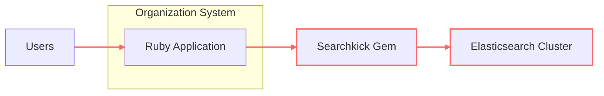
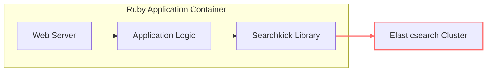

# BUSINESS POSTURE

- Business Priorities and Goals:
  - Enhance application search functionality to provide fast and relevant search results.
  - Improve user experience by enabling efficient information retrieval.
  - Increase user engagement and satisfaction through improved search capabilities.
  - Enable data-driven decision-making by providing powerful search and analytics features.
- Business Risks:
  - Data breaches through vulnerabilities in search functionality or underlying Elasticsearch.
  - Denial of service due to resource exhaustion from excessive or malicious search queries.
  - Inaccurate or manipulated search results leading to incorrect business decisions or poor user experience.
  - Compliance violations if sensitive data is improperly indexed or exposed through search.
  - Performance degradation of the application due to inefficient search queries or Elasticsearch configuration.

# SECURITY POSTURE

- Existing Security Controls:
  - security control: Secure software development lifecycle for Ruby gem development (general practice, not explicitly stated for this project).
  - security control: Reliance on Elasticsearch security features for data protection and access control (if Elasticsearch is configured securely).
  - security control: Dependency management for Ruby gems to address known vulnerabilities in dependencies (general practice).
- Accepted Risks:
  - accepted risk: Risks associated with using Elasticsearch as a third-party search backend, including potential vulnerabilities in Elasticsearch itself.
  - accepted risk: Reliance on the application developer to properly implement security best practices when using Searchkick.
- Recommended Security Controls:
  - recommended security control: Input validation and sanitization of search queries to prevent injection attacks.
  - recommended security control: Rate limiting and request throttling for search endpoints to mitigate denial of service attacks.
  - recommended security control: Monitoring and logging of search queries and Elasticsearch activity for security auditing and incident response.
  - recommended security control: Regular security vulnerability scanning and patching of Elasticsearch and Ruby dependencies.
  - recommended security control: Secure configuration of Elasticsearch, including access control, network security, and data encryption.
- Security Requirements:
  - Authentication:
    - Requirement: While Searchkick itself does not handle user authentication, the application using Searchkick must implement authentication to verify the identity of users performing searches.
    - Implementation: Application-level authentication mechanisms (e.g., session-based, token-based) should be used to authenticate users before allowing search operations.
  - Authorization:
    - Requirement: The application must implement authorization to control access to search functionality and the data that can be searched based on user roles and permissions.
    - Implementation: Application-level authorization checks should be performed before executing search queries to ensure users only access authorized data. Elasticsearch security features can also be used to enforce data-level access control.
  - Input Validation:
    - Requirement: All user-provided search queries must be thoroughly validated and sanitized to prevent injection attacks (e.g., Elasticsearch injection).
    - Implementation: Implement input validation on the application side before passing queries to Searchkick and Elasticsearch. Use parameterized queries or query builders provided by Searchkick to avoid raw query construction.
  - Cryptography:
    - Requirement: Sensitive data indexed and stored in Elasticsearch should be encrypted at rest and in transit to protect confidentiality.
    - Implementation: Configure Elasticsearch to use encryption at rest for indexed data. Ensure TLS/SSL is enabled for communication between the application, Searchkick, and Elasticsearch. Consider encrypting sensitive data fields before indexing if Elasticsearch encryption at rest is not sufficient.

# DESIGN

## C4 CONTEXT



- Context Diagram Elements:
  - - Name: Ruby Application
    - Type: Software System
    - Description: The main application built by the organization that requires search functionality. This application uses the Searchkick gem to interact with Elasticsearch.
    - Responsibilities:
      - Handles user requests, including search requests.
      - Authenticates and authorizes users.
      - Processes user input and prepares search queries.
      - Displays search results to users.
    - Security controls:
      - Input validation and sanitization.
      - Authentication and authorization mechanisms.
      - Application-level logging and monitoring.
  - - Name: Searchkick Gem
    - Type: Software System (External Dependency)
    - Description: A Ruby gem that simplifies integration with Elasticsearch for search functionality. It acts as a client library for Elasticsearch.
    - Responsibilities:
      - Provides a Ruby API for interacting with Elasticsearch.
      - Translates application-level search requests into Elasticsearch queries.
      - Manages indexing and searching operations in Elasticsearch.
    - Security controls:
      - Relies on secure coding practices in gem development.
      - Dependency management to address vulnerabilities in gem dependencies.
  - - Name: Elasticsearch Cluster
    - Type: Software System (External System)
    - Description: A distributed search and analytics engine that stores and indexes data, and performs search operations.
    - Responsibilities:
      - Stores and indexes data provided by the application via Searchkick.
      - Executes search queries and returns results.
      - Manages data persistence and replication.
    - Security controls:
      - Access control mechanisms (e.g., role-based access control).
      - Network security (e.g., firewalls, network segmentation).
      - Data encryption at rest and in transit.
      - Audit logging and monitoring.
  - - Name: Users
    - Type: Person
    - Description: End-users who interact with the Ruby Application and utilize the search functionality.
    - Responsibilities:
      - Initiate search requests through the application's user interface.
      - Consume search results provided by the application.
    - Security controls:
      - User authentication (handled by the Ruby Application).
      - User authorization (handled by the Ruby Application).

## C4 CONTAINER



- Container Diagram Elements:
  - - Name: Web Server
    - Type: Container (Web Application)
    - Description: Handles HTTP requests from users and serves the Ruby application. Examples include Puma, Unicorn, or Passenger.
    - Responsibilities:
      - Receives user requests over HTTP/HTTPS.
      - Routes requests to the Application Logic.
      - Serves static content and application views.
      - Manages user sessions and authentication context.
    - Security controls:
      - HTTPS configuration for secure communication.
      - Web server security hardening (e.g., disabling unnecessary modules, setting appropriate headers).
      - Protection against common web application vulnerabilities (e.g., OWASP Top 10).
  - - Name: Application Logic
    - Type: Container (Application Code)
    - Description: Contains the core business logic of the Ruby application, including handling search requests and interacting with the Searchkick library.
    - Responsibilities:
      - Implements application-specific search functionality.
      - Processes user search queries and interacts with Searchkick.
      - Retrieves and processes data from databases or other data sources.
      - Renders search results for the Web Server to display.
    - Security controls:
      - Input validation and sanitization of search queries.
      - Authorization checks before executing search operations.
      - Secure coding practices to prevent application-level vulnerabilities.
      - Logging and monitoring of application activity.
  - - Name: Searchkick Library
    - Type: Container (Library)
    - Description: The Searchkick Ruby gem integrated into the Application Logic. It provides an abstraction layer for interacting with Elasticsearch.
    - Responsibilities:
      - Provides a Ruby API for defining search indexes and performing search operations.
      - Translates Ruby code into Elasticsearch queries.
      - Manages communication with the Elasticsearch Cluster.
    - Security controls:
      - Relies on secure coding practices in gem development.
      - Dependency management to address vulnerabilities in gem dependencies.
  - - Name: Elasticsearch Cluster
    - Type: Container (Data Store)
    - Description: The Elasticsearch cluster responsible for indexing and searching data.
    - Responsibilities:
      - Stores and indexes data.
      - Executes search queries.
      - Manages data replication and high availability.
    - Security controls:
      - Access control mechanisms (e.g., role-based access control).
      - Network security (e.g., firewalls, network segmentation).
      - Data encryption at rest and in transit.
      - Audit logging and monitoring.

## DEPLOYMENT

Deployment Solution: Cloud-based Deployment on AWS (Example)

```mermaid
flowchart LR
    subgraph "AWS Cloud"
        subgraph "VPC"
            subgraph "Public Subnet"
                A["Load Balancer"]
            end
            subgraph "Private Subnet"
                B["Application Servers"]
                C["Elasticsearch Cluster"]
            end
        end
    end
    D["Users"]

    D --> A
    A --> B
    B --> C

    linkStyle 0,1,2 stroke:#f66,stroke-width:2px,dasharray: 5 5;
    classDef cloud fill:#f9f,stroke:#333,stroke-width:2px
    classDef internal fill:#ccf,stroke:#333,stroke-width:2px
    classDef external stroke:#f66,stroke-width:2px
    class A,B,C internal
    class D external
    class "AWS Cloud" cloud
    class "VPC" cloud
    class "Public Subnet" cloud
    class "Private Subnet" cloud
```

- Deployment Diagram Elements:
  - - Name: Load Balancer
    - Type: Infrastructure (AWS ELB/ALB)
    - Description: Distributes incoming user traffic across multiple Application Servers for scalability and high availability.
    - Responsibilities:
      - Load balancing incoming HTTP/HTTPS requests.
      - SSL termination.
      - Health checks for Application Servers.
    - Security controls:
      - DDoS protection (AWS Shield).
      - Web Application Firewall (AWS WAF).
      - Security groups to control inbound and outbound traffic.
  - - Name: Application Servers
    - Type: Infrastructure (AWS EC2 Instances)
    - Description: Virtual machines running the Web Server and Application Logic containers.
    - Responsibilities:
      - Hosting the Ruby application.
      - Processing user requests.
      - Interacting with Elasticsearch.
    - Security controls:
      - Security groups to restrict network access.
      - Instance hardening (OS and application level).
      - Regular patching and updates.
      - Access management (IAM roles).
  - - Name: Elasticsearch Cluster
    - Type: Infrastructure (AWS Elasticsearch Service or EC2 Instances)
    - Description: Managed Elasticsearch service or a cluster of EC2 instances running Elasticsearch.
    - Responsibilities:
      - Providing search and indexing capabilities.
      - Storing indexed data.
    - Security controls:
      - VPC network isolation.
      - Access policies and IAM roles.
      - Encryption at rest and in transit.
      - Security groups and network ACLs.
  - - Name: Users
    - Type: External User
    - Description: End-users accessing the application over the internet.
    - Responsibilities:
      - Initiating requests to the application.
    - Security controls:
      - User-side security practices (e.g., strong passwords, avoiding phishing).

## BUILD


- Build Process Elements:
  - - Name: Developer
    - Type: Person
    - Description: Software developer who writes and commits code changes for the Searchkick gem.
    - Responsibilities:
      - Writing and testing code.
      - Committing code changes to the repository.
      - Addressing security vulnerabilities in code.
    - Security controls:
      - Secure development environment.
      - Code review process.
      - Security awareness training.
  - - Name: Code Repository (GitHub)
    - Type: Tool (Version Control System)
    - Description: GitHub repository hosting the Searchkick gem source code.
    - Responsibilities:
      - Storing and versioning source code.
      - Managing code branches and pull requests.
      - Triggering CI/CD pipelines.
    - Security controls:
      - Access control and permissions management.
      - Branch protection rules.
      - Audit logging of repository activities.
  - - Name: CI/CD Pipeline (GitHub Actions)
    - Type: Tool (Automation)
    - Description: Automated CI/CD pipeline configured in GitHub Actions to build, test, and publish the Searchkick gem.
    - Responsibilities:
      - Automating the build process.
      - Running unit and integration tests.
      - Performing security scans (SAST, dependency checks).
      - Publishing build artifacts.
    - Security controls:
      - Secure pipeline configuration.
      - Secrets management for credentials.
      - Security scanning tools integration (e.g., linters, vulnerability scanners).
      - Build artifact signing and verification.
  - - Name: Build Artifacts (Gem Package)
    - Type: Artifact (Software Package)
    - Description: The packaged Ruby gem file (.gem) produced by the build process.
    - Responsibilities:
      - Containing the compiled and packaged code of the Searchkick gem.
      - Being distributed to users through the Gem Registry.
    - Security controls:
      - Signed gem package to ensure integrity and authenticity.
      - Vulnerability scanning of dependencies included in the gem.
  - - Name: Gem Registry (RubyGems.org)
    - Type: Tool (Package Repository)
    - Description: Public repository for Ruby gems (RubyGems.org) where Searchkick gem is published.
    - Responsibilities:
      - Hosting and distributing Ruby gems.
      - Providing gem installation and dependency management.
    - Security controls:
      - Gem signing and verification.
      - Malware scanning of uploaded gems.
      - Access control for gem publishing.
  - - Name: Application Deployment Process
    - Type: Process
    - Description: The process of deploying applications that depend on the Searchkick gem. This process will download the gem from the Gem Registry.
    - Responsibilities:
      - Integrating Searchkick gem into applications.
      - Deploying applications to target environments.
    - Security controls:
      - Verifying gem signature before installation.
      - Secure application deployment practices.

# RISK ASSESSMENT

- Critical Business Processes:
  - User search functionality is critical for user experience and information retrieval within applications using Searchkick.
  - Data indexing and search performance are important for application responsiveness and usability.
- Data Sensitivity:
  - The sensitivity of data protected by Searchkick depends on the data indexed in Elasticsearch by applications using Searchkick.
  - If applications index sensitive user data (e.g., PII, financial information), then this data becomes sensitive within the context of Searchkick and Elasticsearch.
  - The sensitivity level should be determined based on the specific application and the type of data being indexed.

# QUESTIONS & ASSUMPTIONS

- BUSINESS POSTURE:
  - Assumption: The primary business goal is to improve user experience and application functionality through enhanced search capabilities.
  - Question: What are the specific business KPIs that will be used to measure the success of implementing Searchkick?
  - Question: What is the acceptable level of risk for security vulnerabilities in the search functionality?
- SECURITY POSTURE:
  - Assumption: Security is a concern, but performance and ease of use are also high priorities.
  - Question: Are there any specific compliance requirements (e.g., GDPR, HIPAA, PCI DSS) that need to be considered for data indexed and searched using Searchkick?
  - Question: What is the current security maturity level of the organization using Searchkick?
- DESIGN:
  - Assumption: Elasticsearch is already deployed and managed separately from the application using Searchkick.
  - Question: What is the expected scale and performance requirements for the search functionality?
  - Question: What is the data retention policy for indexed data in Elasticsearch?
  - Question: Are there any specific non-functional requirements (e.g., high availability, disaster recovery) for the search infrastructure?