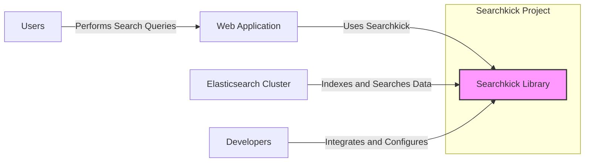
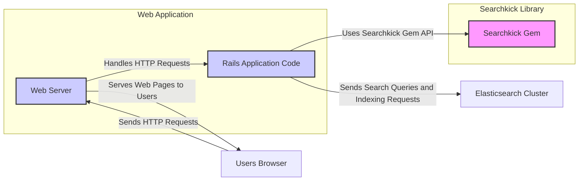
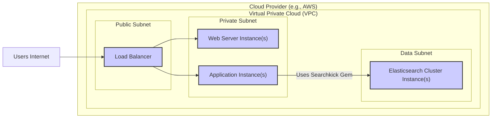
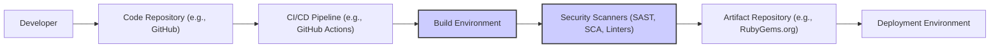

# BUSINESS POSTURE

This project, Searchkick, provides a search engine functionality for Ruby on Rails applications.

Business Priorities and Goals:
- Enhance user experience by providing fast and relevant search capabilities within applications.
- Improve data discoverability for users.
- Increase user engagement and satisfaction through effective search functionality.
- Enable businesses to offer advanced search features like auto-completion, suggestions, and faceted search.
- Potentially drive revenue by improving product or content discoverability.

Business Risks:
- Data breaches through search engine vulnerabilities could expose sensitive information.
- Search engine downtime can disrupt critical business processes relying on search functionality.
- Poor search performance or irrelevant results can negatively impact user experience and business goals.
- Security vulnerabilities in the search library itself could be exploited to compromise applications using it.
- Compliance risks related to data privacy if search functionality is not implemented securely and in accordance with regulations (e.g., GDPR, CCPA).

# SECURITY POSTURE

Existing Security Controls:
- security control: Dependency management - RubyGems.org is used for distributing the gem, which has its own security measures.
- security control: Code review - Open-source project, likely benefits from community code review.
- security control: Version control - Git and GitHub provide version history and traceability.

Accepted Risks:
- accepted risk: Reliance on Elasticsearch security - Searchkick depends on Elasticsearch for its core functionality, inheriting Elasticsearch's security posture and potential vulnerabilities.
- accepted risk: Open-source nature - While community review is a benefit, open-source projects can still have undiscovered vulnerabilities.
- accepted risk: Configuration errors - Misconfiguration of Searchkick or Elasticsearch by users can introduce security vulnerabilities.

Recommended Security Controls:
- security control: Static Application Security Testing (SAST) - Implement SAST tools in the development pipeline to automatically scan the Searchkick codebase for potential vulnerabilities.
- security control: Software Composition Analysis (SCA) - Use SCA tools to continuously monitor dependencies for known vulnerabilities.
- security control: Security awareness training for developers - Educate developers on secure coding practices and common search engine security vulnerabilities.
- security control: Penetration testing - Conduct regular penetration testing of applications using Searchkick to identify and address security weaknesses in integration and configuration.

Security Requirements:
- Authentication: Searchkick itself does not handle user authentication. Authentication is the responsibility of the application using Searchkick. Applications must ensure that only authorized users can access search functionality and sensitive data exposed through search.
- Authorization: Searchkick should respect the authorization policies of the application. Search results should be filtered based on the user's permissions to prevent unauthorized access to data. Applications must implement proper authorization checks before displaying search results.
- Input Validation: Searchkick needs to sanitize and validate search queries to prevent injection attacks (e.g., Elasticsearch query injection). Applications using Searchkick should also validate user inputs before passing them to Searchkick.
- Cryptography: Searchkick itself might not directly handle sensitive data encryption. However, if sensitive data is indexed and searchable, applications should ensure data is encrypted at rest in Elasticsearch and in transit between the application and Elasticsearch. Consider encrypting sensitive search queries if necessary.

# DESIGN

## C4 CONTEXT

Context Diagram Elements:

- Element:
    - Name: Searchkick Library
    - Type: Software System
    - Description: Ruby gem providing search functionality for Ruby on Rails applications. Acts as an interface between the application and Elasticsearch.
    - Responsibilities:
        - Simplifying integration with Elasticsearch.
        - Building and executing search queries against Elasticsearch.
        - Handling data indexing and updates in Elasticsearch.
        - Providing a Ruby-friendly API for search operations.
    - Security controls:
        - Input validation of search queries before sending to Elasticsearch.
        - Adherence to secure coding practices during development.

- Element:
    - Name: Web Application
    - Type: Software System
    - Description: Ruby on Rails application that integrates Searchkick to provide search functionality to users.
    - Responsibilities:
        - User authentication and authorization.
        - Handling user search requests.
        - Displaying search results to users.
        - Managing data to be indexed by Searchkick.
    - Security controls:
        - Authentication and authorization mechanisms to control access to search functionality and data.
        - Input validation of user search queries before passing to Searchkick.
        - Output encoding of search results to prevent XSS vulnerabilities.

- Element:
    - Name: Elasticsearch Cluster
    - Type: Software System
    - Description: Distributed search and analytics engine that stores and indexes data for Searchkick.
    - Responsibilities:
        - Indexing data provided by Searchkick.
        - Executing search queries efficiently.
        - Storing and managing indexed data.
    - Security controls:
        - Access control to the Elasticsearch cluster.
        - Network security to protect communication with Elasticsearch.
        - Data encryption at rest and in transit.
        - Regular security patching and updates.

- Element:
    - Name: Users
    - Type: Person
    - Description: End-users of the Web Application who perform search queries.
    - Responsibilities:
        - Providing valid search queries.
        - Using the search functionality as intended.
    - Security controls:
        - Strong password management (for authenticated users).
        - Awareness of phishing and social engineering attacks.

- Element:
    - Name: Developers
    - Type: Person
    - Description: Software developers who integrate and configure Searchkick within the Web Application.
    - Responsibilities:
        - Properly integrating and configuring Searchkick.
        - Implementing secure coding practices when using Searchkick.
        - Keeping Searchkick and its dependencies up to date.
    - Security controls:
        - Secure development environment.
        - Code review processes.
        - Security training and awareness.

## C4 CONTAINER

Container Diagram Elements:

- Element:
    - Name: Searchkick Gem
    - Type: Container (Library)
    - Description: Ruby gem containing the Searchkick library code. Provides the API for interacting with Elasticsearch.
    - Responsibilities:
        - Encapsulating Searchkick functionality.
        - Providing a Ruby API for search operations.
        - Translating application search requests into Elasticsearch queries.
    - Security controls:
        - Input validation within the gem code.
        - Secure coding practices in gem development.
        - Regular security updates of the gem.

- Element:
    - Name: Rails Application Code
    - Type: Container (Application Code)
    - Description: The custom Ruby on Rails application code that utilizes the Searchkick gem.
    - Responsibilities:
        - Implementing application-specific search logic.
        - Handling user authentication and authorization.
        - Preparing data for indexing by Searchkick.
        - Displaying search results to users.
    - Security controls:
        - Application-level authentication and authorization.
        - Input validation of user inputs.
        - Output encoding to prevent XSS.
        - Secure session management.

- Element:
    - Name: Web Server
    - Type: Container (Web Server)
    - Description: Web server (e.g., Puma, Unicorn) that hosts the Rails application and handles incoming HTTP requests.
    - Responsibilities:
        - Receiving and routing HTTP requests.
        - Serving web pages and application content.
        - Managing application processes.
    - Security controls:
        - Web server hardening and secure configuration.
        - HTTPS configuration for secure communication.
        - Rate limiting and DDoS protection.

- Element:
    - Name: Elasticsearch Cluster
    - Type: Container (Data Store)
    - Description: Elasticsearch cluster responsible for indexing and searching data.
    - Responsibilities:
        - Storing and indexing data.
        - Executing search queries.
        - Providing search results.
    - Security controls:
        - Elasticsearch security features (e.g., authentication, authorization, TLS).
        - Network security around the Elasticsearch cluster.
        - Regular security patching and updates.

- Element:
    - Name: Users Browser
    - Type: Container (Client Application)
    - Description: User's web browser used to access the Web Application.
    - Responsibilities:
        - Rendering web pages.
        - Sending HTTP requests to the Web Server.
        - Displaying search results to users.
    - Security controls:
        - Browser security features (e.g., Content Security Policy, XSS protection).
        - User awareness of browser security best practices.

## DEPLOYMENT

Deployment Architecture Option: Cloud-based Deployment (e.g., AWS, GCP, Azure)

Deployment Diagram Elements (Cloud-based Deployment):

- Element:
    - Name: Load Balancer
    - Type: Infrastructure (Load Balancer)
    - Description: Distributes incoming traffic across multiple Web/Application Instances for high availability and scalability.
    - Responsibilities:
        - Traffic distribution.
        - Health checks of backend instances.
        - SSL termination.
    - Security controls:
        - DDoS protection.
        - Web Application Firewall (WAF) integration.
        - Access control lists (ACLs).

- Element:
    - Name: Web Server Instance(s)
    - Type: Infrastructure (Virtual Machine/Container)
    - Description: Instances running the Web Server component (e.g., Nginx, Apache) to handle HTTP requests.
    - Responsibilities:
        - Serving static content.
        - Reverse proxy to Application Instances.
    - Security controls:
        - Instance hardening.
        - Security groups/firewall rules.
        - Regular patching and updates.

- Element:
    - Name: Application Instance(s)
    - Type: Infrastructure (Virtual Machine/Container)
    - Description: Instances running the Rails Application Code and Searchkick Gem.
    - Responsibilities:
        - Running the application logic.
        - Interacting with Elasticsearch.
        - Processing user requests.
    - Security controls:
        - Instance hardening.
        - Security groups/firewall rules.
        - Regular patching and updates.
        - Application-level security controls (as described in Container section).

- Element:
    - Name: Elasticsearch Cluster Instance(s)
    - Type: Infrastructure (Virtual Machine/Container)
    - Description: Instances forming the Elasticsearch cluster for data storage and search.
    - Responsibilities:
        - Data storage and indexing.
        - Search query processing.
    - Security controls:
        - Elasticsearch security configurations (authentication, authorization, TLS).
        - Network segmentation (Data Subnet).
        - Instance hardening.
        - Security groups/firewall rules.
        - Regular patching and updates.

- Element:
    - Name: Users Internet
    - Type: Environment (Network)
    - Description: Public internet network from which users access the application.
    - Responsibilities:
        - Providing network connectivity for users.
    - Security controls:
        - None directly controlled by the project, but relies on general internet security practices.

## BUILD

Build Process Description:

1. Developer: Developers write code for Searchkick and commit changes to a code repository.
2. Code Repository (e.g., GitHub): Source code is stored and version controlled in a repository like GitHub.
3. CI/CD Pipeline (e.g., GitHub Actions): Automated CI/CD pipeline is triggered on code changes (e.g., push, pull request).
4. Build Environment: A dedicated build environment is used to compile and package the Searchkick gem. This environment should be secured and isolated.
5. Security Scanners (SAST, SCA, Linters): Automated security scans are performed in the build pipeline:
    - Static Application Security Testing (SAST): Scans the codebase for potential security vulnerabilities.
    - Software Composition Analysis (SCA): Checks dependencies for known vulnerabilities.
    - Linters: Enforce code quality and coding standards, which can indirectly improve security.
6. Artifact Repository (e.g., RubyGems.org): If security checks pass, the built Searchkick gem is published to an artifact repository like RubyGems.org, making it available for consumption.
7. Deployment Environment: The gem from the artifact repository is then used in deployment environments as part of applications.

Build Security Controls:
- security control: Secure Build Environment - Use a hardened and isolated build environment to prevent tampering and unauthorized access.
- security control: Automated Security Scanning - Integrate SAST, SCA, and linters into the CI/CD pipeline to automatically detect vulnerabilities.
- security control: Dependency Management - Use dependency management tools to track and manage dependencies, and regularly update them.
- security control: Code Signing - Sign the built gem to ensure integrity and authenticity.
- security control: Access Control - Implement strict access control to the code repository, build environment, and artifact repository.
- security control: Build Pipeline Security - Secure the CI/CD pipeline itself to prevent unauthorized modifications and ensure integrity.

# RISK ASSESSMENT

Critical Business Processes:
- User search functionality - If search is unavailable or performs poorly, users may not be able to find products, information, or content, impacting user experience and business goals.
- Data indexing - Failure to index data correctly can lead to incomplete or inaccurate search results, affecting data discoverability.

Data Sensitivity:
- The sensitivity of data depends on what is indexed by Searchkick. It can range from publicly available product information to potentially sensitive user data or business-critical information.
- Sensitivity levels should be determined based on the specific application using Searchkick and the data being indexed.
- If sensitive data is indexed, it requires appropriate security controls to protect confidentiality, integrity, and availability.

# QUESTIONS & ASSUMPTIONS

Questions:
- What type of data will be indexed by Searchkick in the target application? (Sensitivity level?)
- What are the specific compliance requirements for the application using Searchkick (e.g., GDPR, CCPA, HIPAA)?
- What is the expected scale and performance requirements for the search functionality?
- What is the existing security infrastructure and security maturity level of the organization using Searchkick?
- What is the acceptable downtime for the search functionality?

Assumptions:
- BUSINESS POSTURE: The primary business goal is to enhance user experience through improved search functionality. Security is important but should enable business goals, not block them.
- SECURITY POSTURE: The application using Searchkick will implement its own authentication and authorization mechanisms. Searchkick's security focus is on preventing vulnerabilities within the library itself and ensuring secure integration with Elasticsearch.
- DESIGN: Searchkick will be deployed in a cloud environment using a typical three-tier architecture (Load Balancer, Web/Application Servers, Elasticsearch Cluster). The build process will utilize a CI/CD pipeline with automated security checks.