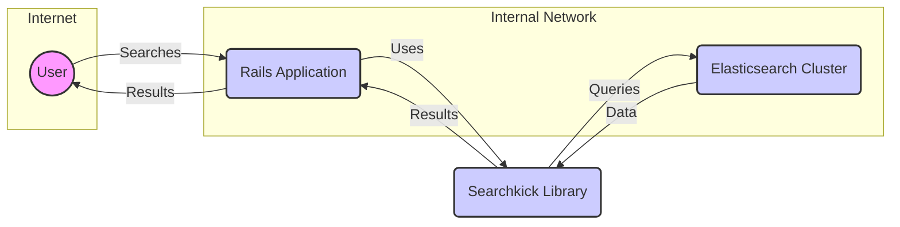
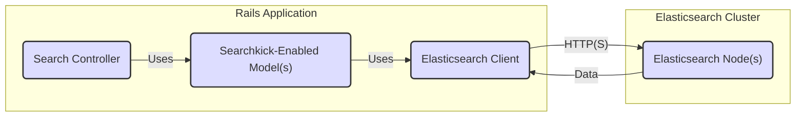
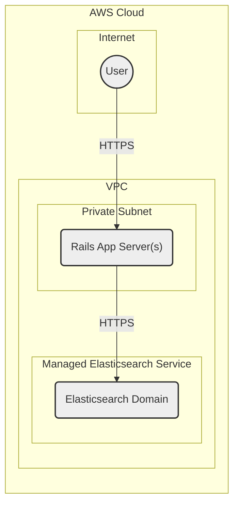
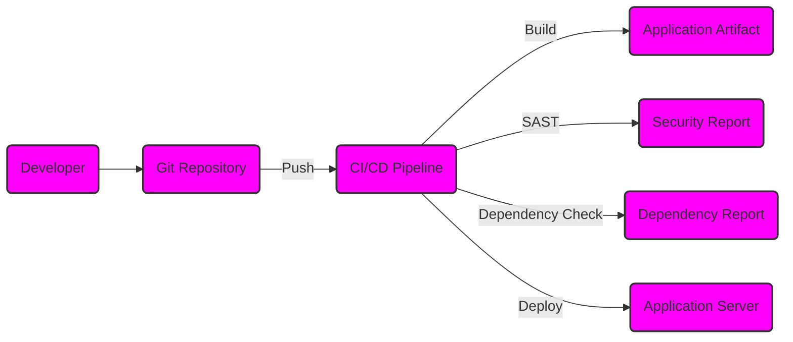

Okay, let's create a design document for Searchkick, based on the provided GitHub repository.

# BUSINESS POSTURE

Searchkick is a library designed to integrate with existing Ruby on Rails applications to provide intelligent search capabilities using Elasticsearch.

Priorities:

*   Ease of Integration: Minimize the effort required for developers to add advanced search to their applications.
*   Performance: Provide fast search results, even with large datasets.
*   Relevance: Deliver highly relevant search results, improving user experience.
*   Scalability: Handle increasing data volumes and search traffic without performance degradation.
*   Maintainability: Offer a clean and well-documented API for long-term maintainability.

Goals:

*   Enhance user experience within Rails applications by providing a powerful search feature.
*   Reduce the complexity of implementing and managing Elasticsearch directly.
*   Provide a flexible and customizable search solution.

Business Risks:

*   Data Exposure: Inadequate security controls could lead to unauthorized access to sensitive data indexed in Elasticsearch.
*   Performance Bottlenecks: Poorly configured Elasticsearch or inefficient queries could lead to slow search performance, impacting user experience.
*   Relevance Issues: Inaccurate search results could frustrate users and reduce the effectiveness of the application.
*   Dependency Management: Reliance on Elasticsearch and its updates introduces potential compatibility and maintenance challenges.
*   Operational Overhead: Managing Elasticsearch clusters, especially at scale, can be complex and resource-intensive.

# SECURITY POSTURE

Existing Security Controls:

*   security control: Relies on the underlying security of Elasticsearch. Searchkick itself does not implement authentication or authorization mechanisms directly. It assumes that the Elasticsearch cluster is properly secured. (Described in Searchkick and Elasticsearch documentation)
*   security control: Inherits security practices from the Ruby on Rails application it integrates with, including any existing authentication, authorization, and data validation mechanisms. (Described in Rails application's security configurations)
*   security control: Provides options for customizing queries, which can be used to implement data filtering based on user roles or permissions (though this is the responsibility of the integrating application). (Described in Searchkick documentation)
*   security control: Uses secured communication if underlying Elasticsearch client is configured to use it (e.g., HTTPS). (Described in Elasticsearch client configuration)

Accepted Risks:

*   accepted risk: Searchkick does not directly handle sensitive data encryption at rest; this is the responsibility of the Elasticsearch configuration.
*   accepted risk: The library's security is heavily dependent on the correct configuration and security practices of both the integrating Rails application and the Elasticsearch cluster.
*   accepted risk: Searchkick does not implement any specific protection against denial-of-service (DoS) attacks targeting the search functionality. This is left to the Elasticsearch cluster and the application's infrastructure.

Recommended Security Controls:

*   security control: Implement robust authentication and authorization within the Rails application to control access to search functionality and data.
*   security control: Use Elasticsearch's security features (e.g., X-Pack/Security) to secure the cluster, including authentication, authorization, encryption in transit (TLS/SSL), and encryption at rest.
*   security control: Implement input validation and sanitization within the Rails application to prevent injection attacks through search queries.
*   security control: Regularly update Searchkick, Elasticsearch, and all related dependencies to address security vulnerabilities.
*   security control: Monitor Elasticsearch logs and application logs for suspicious activity.
*   security control: Implement rate limiting and other DoS protection mechanisms at the application and infrastructure levels.

Security Requirements:

*   Authentication: The integrating application MUST authenticate users before allowing them to perform searches.
*   Authorization: The integrating application MUST implement authorization checks to ensure that users can only access data they are permitted to see. Search results MUST be filtered based on user permissions.
*   Input Validation: The integrating application MUST validate and sanitize all user-provided input used in search queries to prevent injection attacks.
*   Cryptography:
    *   Communication with Elasticsearch MUST use TLS/SSL (HTTPS).
    *   Sensitive data stored in Elasticsearch SHOULD be encrypted at rest.
    *   If Searchkick is used to handle any sensitive data directly (e.g., API keys), these MUST be stored securely, preferably using Rails' credentials management system.

# DESIGN

## C4 CONTEXT

Element Descriptions:

1.  Name: User
    *   Type: Person
    *   Description: A user of the Rails application who interacts with the search functionality.
    *   Responsibilities: Initiates search queries, views search results.
    *   Security Controls: Authenticated and authorized by the Rails application.

2.  Name: Rails Application
    *   Type: Software System
    *   Description: The existing Ruby on Rails application that integrates with Searchkick.
    *   Responsibilities: Handles user requests, interacts with Searchkick, renders search results, enforces application-level security.
    *   Security Controls: Authentication, authorization, input validation, session management, CSRF protection.

3.  Name: Searchkick Library
    *   Type: Software System (Library)
    *   Description: The Searchkick gem, providing a high-level interface for interacting with Elasticsearch.
    *   Responsibilities: Translates application requests into Elasticsearch queries, processes results.
    *   Security Controls: Relies on the security of the Rails application and Elasticsearch.

4.  Name: Elasticsearch Cluster
    *   Type: Software System
    *   Description: The Elasticsearch cluster that stores and indexes the data.
    *   Responsibilities: Stores data, processes search queries, returns results.
    *   Security Controls: Authentication, authorization, encryption in transit (TLS/SSL), encryption at rest, access control, auditing.

## C4 CONTAINER

Element Descriptions:

1.  Name: Search Controller
    *   Type: Container (Rails Controller)
    *   Description: Handles incoming search requests from users.
    *   Responsibilities: Receives user input, interacts with Searchkick-enabled models, renders search results.
    *   Security Controls: Authentication and authorization checks, input validation.

2.  Name: Searchkick-Enabled Model(s)
    *   Type: Container (Rails Model)
    *   Description: Rails models that have been extended with Searchkick functionality (e.g., `searchkick` call).
    *   Responsibilities: Defines the data to be indexed, interacts with the Elasticsearch client through Searchkick methods.
    *   Security Controls: Data validation, potentially data filtering based on user permissions.

3.  Name: Elasticsearch Client
    *   Type: Container (Library/Gem)
    *   Description: The underlying Elasticsearch client library used by Searchkick (e.g., `elasticsearch-ruby`).
    *   Responsibilities: Handles communication with the Elasticsearch cluster, sends queries, receives responses.
    *   Security Controls: Uses HTTPS if configured, relies on Elasticsearch cluster's security.

4.  Name: Elasticsearch Node(s)
    *   Type: Container (Elasticsearch Instance)
    *   Description: Individual nodes within the Elasticsearch cluster.
    *   Responsibilities: Stores data, processes search queries, participates in cluster operations.
    *   Security Controls: Authentication, authorization, encryption in transit (TLS/SSL), encryption at rest, access control, auditing.

## DEPLOYMENT

Possible Deployment Solutions:

1.  Self-Hosted Elasticsearch: The Elasticsearch cluster is deployed and managed by the organization itself, on-premises or in a cloud environment (e.g., AWS EC2, GCP Compute Engine).
2.  Managed Elasticsearch Service: A cloud provider's managed Elasticsearch service is used (e.g., AWS Elasticsearch Service, Elastic Cloud, Google Cloud Elasticsearch Service).
3.  Hybrid Approach: A combination of self-hosted and managed components.

Chosen Solution (for detailed description): Managed Elasticsearch Service (e.g., AWS Elasticsearch Service)

Element Descriptions:

1.  Name: User
    *   Type: Person
    *   Description: A user accessing the application.
    *   Responsibilities: Initiates requests to the application.
    *   Security Controls: Uses HTTPS for communication.

2.  Name: Rails App Server(s)
    *   Type: Node (Virtual Machine/Container)
    *   Description: Server(s) hosting the Ruby on Rails application.
    *   Responsibilities: Runs the Rails application, handles user requests, communicates with the Elasticsearch domain.
    *   Security Controls: Firewall rules, operating system security, application-level security.

3.  Name: Elasticsearch Domain
    *   Type: Node (Managed Service)
    *   Description: The managed Elasticsearch domain provided by the cloud provider.
    *   Responsibilities: Provides Elasticsearch cluster functionality, including data storage, indexing, and search.
    *   Security Controls: Managed by the cloud provider, including network security, access control, encryption, and patching. Configurable security settings (e.g., IAM roles, VPC endpoints).

## BUILD

The build process for Searchkick itself (as a gem) is relatively simple.  The build process for an application *using* Searchkick is more relevant from a security perspective.  We'll focus on the latter.

Build Process Description:

1.  Developer commits code to a Git repository.
2.  A push to the repository triggers a CI/CD pipeline (e.g., GitHub Actions, Jenkins, CircleCI).
3.  The CI pipeline performs the following steps:
    *   Checks out the code.
    *   Builds the application (e.g., compiles assets, packages dependencies).
    *   Runs automated tests (unit tests, integration tests).
    *   Performs static analysis security testing (SAST) using tools like Brakeman (for Rails) to identify potential security vulnerabilities in the code.
    *   Checks for vulnerable dependencies using tools like bundler-audit.
    *   If all checks pass, creates an application artifact (e.g., a Docker image, a deployment package).
    *   Deploys the artifact to the target environment (e.g., staging, production).

Security Controls in Build Process:

*   security control: Version control (Git) provides an audit trail of code changes.
*   security control: CI/CD pipeline automates the build and deployment process, ensuring consistency and reducing manual errors.
*   security control: Automated tests help ensure code quality and prevent regressions.
*   security control: SAST tools identify potential security vulnerabilities in the code.
*   security control: Dependency checking identifies known vulnerabilities in third-party libraries.
*   security control: Secure deployment practices (e.g., using infrastructure-as-code, minimizing privileges) reduce the risk of deployment-related security issues.

# RISK ASSESSMENT

Critical Business Processes:

*   User Search: The ability for users to quickly and efficiently find information within the application.
*   Data Integrity: Maintaining the accuracy and consistency of the data indexed in Elasticsearch.
*   Application Availability: Ensuring the application and its search functionality remain available to users.

Data Sensitivity:

The sensitivity of the data indexed by Searchkick depends entirely on the application using it.  It could range from:

*   Publicly available information (low sensitivity).
*   User-generated content (moderate sensitivity).
*   Personally Identifiable Information (PII) (high sensitivity).
*   Financial data or other highly sensitive information (very high sensitivity).

The application integrating Searchkick MUST classify the data being indexed and implement appropriate security controls based on this classification.

# QUESTIONS & ASSUMPTIONS

Questions:

*   What specific types of data will be indexed by Searchkick in the target application?
*   What are the performance requirements for search (e.g., expected query latency, data volume)?
*   What is the existing security posture of the Rails application that will integrate Searchkick?
*   What is the chosen deployment environment for the Rails application and Elasticsearch?
*   What are the specific compliance requirements (e.g., GDPR, HIPAA) that apply to the application and its data?
*   Are there any existing monitoring or logging systems in place?

Assumptions:

*   BUSINESS POSTURE: The organization has a moderate risk appetite, balancing the need for rapid development with the importance of security.
*   SECURITY POSTURE: The integrating Rails application has some basic security measures in place (e.g., authentication, authorization), but may require enhancements to meet the security requirements of Searchkick and Elasticsearch.
*   DESIGN: A managed Elasticsearch service will be used for ease of deployment and management. The Rails application will be deployed in a secure environment (e.g., a VPC) with appropriate network security controls. The build process will include automated security checks.