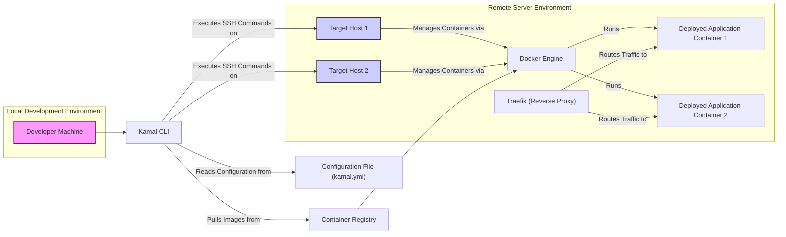
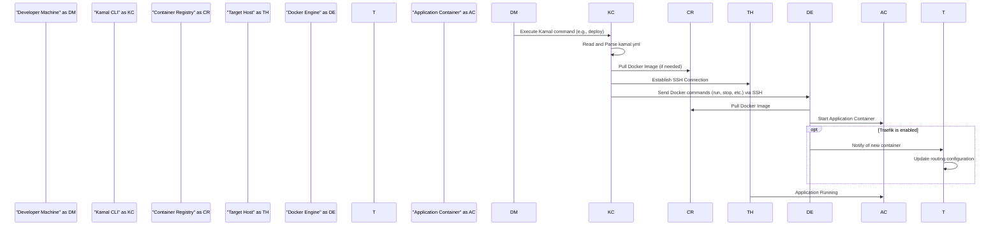

# Project Design Document: Kamal by Basecamp

**Project Link:** https://github.com/basecamp/kamal

**Version:** 1.1
**Date:** October 26, 2023
**Author:** AI Software Architect

## 1. Introduction

This document details the architectural design of Kamal, a deployment tool by Basecamp. Its purpose is to provide a clear understanding of Kamal's components, their interactions, and the overall system architecture. This design will serve as the foundation for subsequent threat modeling activities, enabling a focused analysis of potential security vulnerabilities.

## 2. Goals and Objectives

Kamal aims to:

- Simplify web application deployment to single or multiple servers.
- Offer a straightforward alternative to complex container orchestration for suitable applications.
- Utilize standard technologies like SSH and Docker for deployment processes.
- Enable infrastructure-as-code through a declarative configuration file.

This design document elucidates how Kamal achieves these objectives through its architectural design and constituent components.

## 3. High-Level Architecture

Kamal functions by executing commands from a local machine, interacting with remote servers (hosts) to manage application deployments. Secure communication is facilitated via SSH, and Docker is central to containerization.

**Core Components:**

- **Developer Machine:** The local environment where developers use the Kamal CLI.
- **Kamal CLI:** The command-line tool for initiating and managing deployments.
- **Configuration File (kamal.yml):** A YAML file defining application deployment settings.
- **Container Registry:** A repository (e.g., Docker Hub) storing Docker images.
- **Target Hosts:** The remote servers hosting the application containers.
- **Docker Engine:** The container runtime on the target hosts.
- **Traefik:** An optional reverse proxy for routing traffic to containers.
- **Deployed Application Containers:** Running instances of the application within Docker.

## 4. Component Details

This section provides a detailed breakdown of each component and its responsibilities.

### 4.1. Kamal CLI

- **Description:** The primary user interface for interacting with Kamal, translating commands into actions on remote servers.
- **Responsibilities:**
    - Parsing and validating the `kamal.yml` configuration.
    - Establishing secure SSH connections to target hosts.
    - Executing Docker commands on remote hosts (e.g., `pull`, `run`, `stop`).
    - Orchestrating the deployment lifecycle: image retrieval, container management, and cleanup.
    - Managing Traefik configuration when enabled.
    - Providing utilities for application management (restart, stop, logs).
- **Interactions:**
    - Reads configuration from `kamal.yml`.
    - Communicates with target hosts via SSH.
    - Interacts with the Container Registry to fetch Docker images.

### 4.2. Configuration File (kamal.yml)

- **Description:** A YAML file defining the application's deployment blueprint.
- **Responsibilities:**
    - Specifying target host details (IP addresses or hostnames).
    - Defining the Docker image to deploy.
    - Configuring environment variables for the application containers.
    - Defining Traefik settings (if used), including domains and TLS.
    - Specifying service definitions and health check configurations.
- **Interactions:**
    - Read by the Kamal CLI for deployment instructions.

### 4.3. Container Registry

- **Description:** A service for storing and distributing Docker images.
- **Responsibilities:**
    - Hosting Docker images of the application.
    - Providing access control for image retrieval.
- **Interactions:**
    - Target hosts pull images via the Docker Engine.
    - Kamal CLI might interact for authentication or image information.

### 4.4. Target Hosts

- **Description:** The remote servers where the application containers are deployed and executed.
- **Responsibilities:**
    - Running the Docker Engine.
    - Executing Docker commands received from the Kamal CLI.
    - Hosting and managing the application containers.
    - Running Traefik (if configured).
- **Interactions:**
    - Receives commands from the Kamal CLI via SSH.
    - Pulls Docker images from the Container Registry.
    - Manages the lifecycle of application containers.

### 4.5. Docker Engine

- **Description:** The container runtime environment on the target hosts.
- **Responsibilities:**
    - Pulling Docker images from the Container Registry.
    - Creating, starting, stopping, and managing Docker containers.
    - Providing resource isolation for containers.
- **Interactions:**
    - Receives instructions from the Kamal CLI.
    - Communicates with the Container Registry.

### 4.6. Traefik

- **Description:** An optional reverse proxy that handles incoming traffic and routes it to the appropriate containers.
- **Responsibilities:**
    - Load balancing traffic across application containers.
    - Providing TLS termination using SSL/TLS certificates.
    - Routing traffic based on hostnames or paths.
    - Dynamically configuring itself based on Docker container labels.
- **Interactions:**
    - Receives incoming HTTP/HTTPS requests.
    - Routes traffic to application containers.
    - Can be configured by the Kamal CLI.

### 4.7. Deployed Application Containers

- **Description:** The running instances of the web application within Docker containers.
- **Responsibilities:**
    - Serving the web application.
    - Processing user requests.
    - Potentially interacting with other backend services.
- **Interactions:**
    - Receives traffic routed by Traefik.
    - May communicate with other services (databases, APIs).

## 5. Data Flow

The primary data flow during a Kamal deployment is as follows:

1. **Initiation:** The developer executes a Kamal command (e.g., `kamal deploy`).
2. **Configuration Read:** The Kamal CLI reads and parses the `kamal.yml` configuration file.
3. **Image Retrieval:** The Kamal CLI (or the Docker Engine on the target host) fetches the specified Docker image from the Container Registry.
4. **Secure Connection:** The Kamal CLI establishes an encrypted SSH connection to the designated target hosts.
5. **Command Execution:** The Kamal CLI sends Docker commands over SSH to the Docker Engine on the target hosts to manage containers.
6. **Container Management:** The Docker Engine pulls the image (if necessary) and starts or updates the application containers.
7. **Traffic Routing (with Traefik):** If Traefik is enabled, it detects the new containers and updates its routing rules to direct traffic accordingly.

## 6. Security Considerations for Threat Modeling

This section highlights key security considerations relevant to Kamal's architecture, categorized to facilitate threat modeling.

**6.1. Authentication and Authorization:**

- **SSH Key Security:**  Compromise of SSH private keys grants full access to target hosts.
    - **Threats:** Unauthorized access, lateral movement.
- **Container Registry Credentials:**  Exposure of registry credentials allows unauthorized image manipulation.
    - **Threats:** Supply chain attacks, malicious image deployment.
- **Access Control for Kamal CLI:**  Restricting who can execute Kamal commands is essential.
    - **Threats:** Unauthorized deployments, service disruption.

**6.2. Network Security:**

- **SSH Exposure:**  Open SSH ports are potential attack vectors.
    - **Threats:** Brute-force attacks, vulnerability exploitation.
- **Network Segmentation:** Lack of network segmentation could allow attackers to pivot within the infrastructure.
    - **Threats:** Lateral movement, data breaches.
- **Traefik Exposure:**  Misconfigured Traefik can expose applications or management interfaces.
    - **Threats:** Web application attacks, unauthorized access.

**6.3. Secrets Management:**

- **Environment Variables:** Storing secrets directly in `kamal.yml` or as environment variables in Docker can lead to exposure.
    - **Threats:** Credential theft, data breaches.
- **Lack of Secure Secret Storage:** Kamal doesn't enforce secure secret management, relying on external solutions.
    - **Threats:** Exposure of sensitive information.

**6.4. Container Security:**

- **Vulnerable Base Images:** Using outdated or vulnerable base images introduces security risks.
    - **Threats:** Exploitation of known vulnerabilities.
- **Container Configuration:**  Insecure container configurations can create attack vectors.
    - **Threats:** Privilege escalation, container escapes.
- **Supply Chain Security:**  Compromised dependencies within the Docker image.
    - **Threats:** Backdoors, malware injection.

**6.5. Operational Security:**

- **Logging and Monitoring:** Insufficient logging and monitoring can hinder incident detection and response.
    - **Threats:** Delayed detection of breaches, difficulty in forensics.
- **Configuration Management:**  Inconsistent or poorly managed configurations can introduce vulnerabilities.
    - **Threats:** Misconfigurations leading to security flaws.
- **Software Updates:**  Failure to update Kamal, Docker, or the host OS can leave systems vulnerable.
    - **Threats:** Exploitation of known vulnerabilities.

## 7. Deployment Considerations

- **Prerequisites:** Docker and SSH must be installed and configured on both the local machine and target hosts.
- **Configuration Management:**  Careful management of the `kamal.yml` file is crucial for consistent and secure deployments.
- **Network Accessibility:** The local machine needs SSH access to the target hosts, and target hosts require access to the Container Registry.
- **User Permissions:**  The user running the Kamal CLI requires appropriate SSH privileges on the target hosts and access to necessary resources.

## 8. Future Considerations

- **Integration with Secrets Management Tools:**  Direct integration with tools like HashiCorp Vault or AWS Secrets Manager.
- **Enhanced Health Checks and Monitoring:**  More sophisticated health check mechanisms and integration with monitoring systems.
- **Automated Rollback Capabilities:**  Features to automatically revert to previous versions on deployment failures.
- **Improved CI/CD Integration:**  Streamlining integration with continuous integration and continuous deployment pipelines for automated deployments.
- **Support for More Complex Deployment Scenarios:**  Expanding capabilities for more intricate deployment patterns.

This document provides a detailed architectural overview of Kamal, specifically designed to facilitate thorough threat modeling. The detailed descriptions of components, data flows, and security considerations should enable a comprehensive analysis of potential vulnerabilities and associated risks.