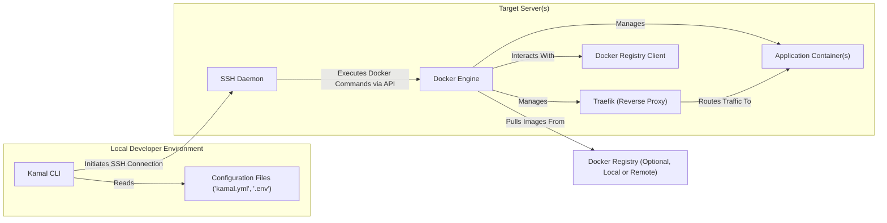
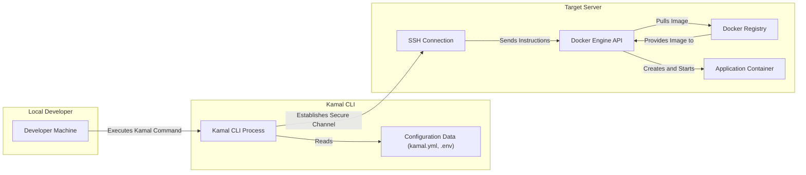

# Project Design Document: Kamal

**Version:** 1.1
**Date:** October 26, 2023
**Author:** AI Software Architect

## 1. Introduction

This document provides a detailed design overview of the Kamal project, an open-source deployment platform created by Basecamp. Kamal simplifies the deployment of web applications to one or more servers using Docker. This document outlines the system's architecture, key components, data flows, and security considerations, serving as a foundation for subsequent threat modeling activities. It aims to provide a comprehensive understanding of the system's workings for security analysis.

## 2. Goals and Non-Goals

**Goals:**

* Provide a clear and comprehensive overview of the Kamal system architecture, suitable for security analysis.
* Identify all key components and detail their interactions and responsibilities.
* Describe the complete data flow within the system, highlighting sensitive data paths.
* Thoroughly highlight security-relevant aspects of the design, including potential vulnerabilities.
* Serve as a robust basis for threat modeling exercises and security assessments.

**Non-Goals:**

* Provide a step-by-step implementation guide or tutorial for using Kamal.
* Cover every single configuration option or less frequently used feature.
* Analyze the performance characteristics, scalability benchmarks, or resource utilization of the system.

## 3. System Architecture

Kamal employs a client-server architecture where a local command-line interface (CLI) interacts with remote target servers to orchestrate application deployments using Docker.

**Key Components:**

* **Kamal CLI:**
    * Functionality: The command-line interface used by developers to manage deployments. It parses configuration, establishes SSH connections, and executes Docker commands remotely.
    * Responsibility: Orchestrating the deployment process based on user commands and configuration.
* **Configuration Files:**
    * `kamal.yml`: Defines the application's deployment configuration, including server details, Docker image information, environment variables, volume mounts, and Traefik settings.
    * `.env`: Stores sensitive environment variables and secrets required during deployment, such as API keys, database credentials, and other confidential information.
    * Responsibility: Providing the necessary parameters and secrets for deploying and running the application.
* **Target Server(s):**
    * Functionality: One or more remote servers where the application containers are deployed and run. These servers must have Docker and optionally Traefik installed.
    * Responsibility: Providing the runtime environment for the application containers.
* **SSH Daemon:**
    * Functionality: Listens for and manages secure shell (SSH) connections, authenticating the Kamal CLI for remote command execution.
    * Responsibility: Providing secure remote access for deployment management.
* **Docker Engine:**
    * Functionality: The core containerization runtime on the target server. It pulls Docker images, creates, starts, stops, and manages containers based on instructions from the Kamal CLI.
    * Responsibility: Managing the lifecycle of application containers.
* **Traefik (Reverse Proxy):**
    * Functionality: An optional but commonly used reverse proxy that handles routing incoming HTTP/HTTPS traffic to the appropriate application containers. Kamal can automate its configuration.
    * Responsibility:  Managing external access to the application and handling tasks like load balancing and TLS termination.
* **Application Container(s):**
    * Functionality: The Docker containers running the actual application code and its dependencies.
    * Responsibility: Executing the application logic and serving user requests.
* **Docker Registry:**
    * Functionality: A repository for storing and distributing Docker images. This can be a public registry (like Docker Hub) or a private registry hosted internally or by a third-party provider.
    * Responsibility: Storing and providing access to the application's Docker image.
* **Docker Registry Client:**
    * Functionality: Part of the Docker Engine, responsible for authenticating with and pulling images from the Docker Registry.
    * Responsibility: Retrieving the application's Docker image for deployment.

## 4. Data Flow

The deployment process with Kamal involves the following key data flows, highlighting the movement of configuration and application components:

**Detailed Data Flow Steps:**

1. **Command Initiation:** The developer executes a Kamal command (e.g., `kamal deploy`) on their local machine.
2. **Configuration Loading:** The Kamal CLI process reads the `kamal.yml` configuration file and the `.env` file to gather deployment parameters and secrets.
3. **Secure Connection Establishment:** The Kamal CLI establishes a secure SSH connection to the target server(s) using the credentials specified in the configuration or through SSH agent forwarding.
4. **Docker Command Transmission:** Over the established SSH connection, the Kamal CLI sends instructions to the Docker Engine API on the target server. These instructions are in the form of Docker commands.
5. **Image Retrieval:** The Docker Engine, upon receiving instructions, authenticates with the configured Docker Registry (if necessary) and pulls the specified Docker image.
6. **Container Creation and Startup:** The Docker Engine creates a new Docker container based on the pulled image and the configuration provided by the Kamal CLI (including environment variables, port mappings, volume mounts, etc.). The container is then started.
7. **Traefik Configuration (if enabled):** If Traefik integration is configured, Kamal generates and applies Traefik configuration. This might involve creating or updating Traefik's dynamic configuration files or interacting with its API to define routing rules for the newly deployed application container.
8. **Application Access:** Once the container is running and Traefik is configured (if applicable), external users can access the application through the configured domain name or IP address, with Traefik routing the traffic to the appropriate container.

## 5. Component Details

### 5.1. Kamal CLI

* **Functionality:** Parses user commands, reads configuration files, manages SSH connections, and orchestrates Docker command execution on remote servers.
* **Data Handled:** Reads `kamal.yml`, `.env`, SSH private keys (or uses SSH agent), and command-line arguments. Transmits Docker commands and configuration data (including potentially sensitive information from `.env`) over SSH.
* **Security Considerations:**  The security of the Kamal CLI relies on the secure handling of SSH credentials and the integrity of the code itself. Compromise of the CLI could lead to unauthorized access and control over deployed applications.

### 5.2. Configuration Files (`kamal.yml`, `.env`)

* **Functionality:** Define the deployment blueprint and store sensitive credentials.
* **Data Handled:** `kamal.yml` contains server addresses, Docker image names, environment variables (non-sensitive), port mappings, volume configurations, and Traefik settings. `.env` contains sensitive secrets like database passwords, API keys, and other confidential information.
* **Security Considerations:** The `.env` file is a high-value target and must be protected. It should never be committed to version control and should have restricted access. Improperly configured `kamal.yml` could lead to misconfigurations and security vulnerabilities.

### 5.3. Target Server(s)

* **Functionality:** Provides the infrastructure for running Docker containers.
* **Data Handled:** Hosts Docker images, container filesystems, and application data. Receives and executes Docker commands.
* **Security Considerations:**  Target servers must be hardened against unauthorized access. This includes strong SSH configurations, firewalls, and regular security updates. The security of the Docker daemon is paramount.

### 5.4. SSH Daemon

* **Functionality:** Provides secure remote access to the target server.
* **Data Handled:** Authenticates users based on SSH keys or passwords. Encrypts communication between the Kamal CLI and the target server.
* **Security Considerations:**  Proper SSH key management is crucial. Weak SSH configurations or compromised keys can grant attackers full control over the server.

### 5.5. Docker Engine

* **Functionality:** Manages the lifecycle of Docker containers.
* **Data Handled:** Pulls and stores Docker images, manages container filesystems and networking. Executes commands within containers.
* **Security Considerations:**  The Docker daemon itself can be a target for attacks. Proper configuration, including namespace isolation, resource limits (cgroups), and security profiles (AppArmor, SELinux), is essential. Regularly update Docker to patch vulnerabilities.

### 5.6. Traefik (Reverse Proxy)

* **Functionality:** Routes external traffic to application containers, handles TLS termination, and can provide load balancing.
* **Data Handled:** Handles incoming HTTP/HTTPS requests, TLS certificates, and routing configurations.
* **Security Considerations:** As a public-facing component, Traefik is a critical security point. Misconfigurations can expose applications to various web attacks. Secure TLS configuration, rate limiting, and appropriate security headers are essential.

### 5.7. Application Container(s)

* **Functionality:** Runs the application code.
* **Data Handled:** Handles application-specific data, which can include sensitive user information, business data, etc.
* **Security Considerations:**  Security within the application container is paramount. This includes secure coding practices, dependency management, proper handling of sensitive data, and minimizing the container's attack surface.

### 5.8. Docker Registry

* **Functionality:** Stores and distributes Docker images.
* **Data Handled:** Stores Docker image layers.
* **Security Considerations:** Access to the Docker Registry should be controlled through authentication and authorization. For private registries, ensure strong access controls are in place. Image integrity should be verified to prevent supply chain attacks (e.g., using image signing).

### 5.9. Docker Registry Client

* **Functionality:** Authenticates with and pulls images from the Docker Registry.
* **Data Handled:** Handles registry credentials (if required).
* **Security Considerations:** Secure storage and handling of Docker Registry credentials on the target server are important.

## 6. Security Considerations

The following are key security considerations for the Kamal project, categorized for clarity:

* **Authentication and Authorization:**
    * **SSH Key Management:** Emphasize the importance of strong, securely stored SSH private keys. Advocate for using SSH agents or hardware security modules.
    * **Docker Registry Credentials:** Securely manage credentials for private Docker registries. Avoid embedding credentials directly in configuration files.
    * **Target Server Access Control:** Restrict SSH access to target servers to only authorized users and IP addresses. Implement multi-factor authentication where possible.
* **Secrets Management:**
    * **Secure Storage of `.env`:**  Reinforce that `.env` files should never be committed to version control. Recommend using environment variables or dedicated secrets management solutions.
    * **Principle of Least Privilege:** Grant only necessary permissions to users and applications.
* **Network Security:**
    * **Firewall Configuration:** Implement strict firewall rules on target servers to limit network access to essential ports only.
    * **Secure Communication:** Ensure all communication, especially between the Kamal CLI and target servers, is encrypted (SSH). Consider using VPNs for added security.
* **Docker Security:**
    * **Docker Daemon Hardening:** Follow Docker security best practices, including enabling content trust, using resource limits, and regularly updating Docker.
    * **Container Security:**  Minimize the attack surface of containers by removing unnecessary packages and adhering to the principle of least privilege within containers. Use security scanning tools to identify vulnerabilities in container images.
* **Traefik Security:**
    * **TLS Configuration:** Enforce HTTPS and use strong TLS configurations. Regularly renew TLS certificates.
    * **Web Application Firewall (WAF):** Consider using a WAF in front of Traefik to protect against common web attacks.
    * **Rate Limiting and Security Headers:** Implement rate limiting and configure appropriate security headers in Traefik.
* **Supply Chain Security:**
    * **Base Image Selection:** Carefully choose base Docker images from trusted sources.
    * **Dependency Management:** Regularly update application dependencies and scan for vulnerabilities.
    * **Image Scanning:** Implement automated scanning of Docker images for vulnerabilities before deployment.
* **Kamal CLI Security:**
    * **Secure Installation:** Ensure the Kamal CLI is downloaded from a trusted source.
    * **Protection of Local Environment:** Secure the developer's machine to prevent unauthorized access to SSH keys and configuration files.

## 7. Deployment Process

The typical deployment process using Kamal involves these steps:

1. **Configuration:** Create or modify the `kamal.yml` file to define the application's deployment parameters and the `.env` file to store sensitive secrets.
2. **Docker Image Building:** Build the Docker image for the application, ensuring it includes all necessary dependencies and configurations.
3. **Docker Image Pushing:** Push the built Docker image to the configured Docker Registry. Ensure the registry is accessible from the target server.
4. **Kamal Command Execution:** Execute the appropriate Kamal command (e.g., `kamal deploy`) from the local developer machine. This triggers the deployment process.
5. **Remote Execution:** The Kamal CLI connects to the target server via SSH and instructs the Docker Engine to pull the image and create/start the container.
6. **Traefik Configuration (if applicable):** If configured, Kamal updates Traefik's configuration to route traffic to the newly deployed container.
7. **Verification and Monitoring:** Verify the successful deployment of the application by accessing it through the configured domain or IP address. Monitor application and server logs for any errors or issues.

## 8. Future Considerations

* **Enhanced Secrets Management Integration:** Explore deeper integration with dedicated secrets management solutions like HashiCorp Vault, AWS Secrets Manager, or Azure Key Vault for more robust secret handling.
* **Improved Monitoring and Logging Integration:**  Develop integrations with popular monitoring and logging platforms (e.g., Prometheus, Grafana, ELK stack) to provide better visibility into application health and performance.
* **Automated Rollback Mechanisms:** Implement automated rollback capabilities to revert to previous deployments in case of failures, improving resilience.
* **Multi-Tenancy Support:** Investigate features to support deploying and managing multiple independent applications or environments on the same infrastructure with proper isolation.
* **Health Checks and Automated Recovery:** Integrate health checks and automated recovery mechanisms to ensure application availability and automatically restart failing containers.
* **Support for More Complex Deployment Strategies:** Explore support for more advanced deployment strategies like blue/green deployments or canary releases.

This improved document provides a more detailed and structured overview of the Kamal project, specifically focusing on aspects relevant to security analysis and threat modeling. The enhanced descriptions of components, data flows, and security considerations aim to provide a solid foundation for identifying and mitigating potential security risks.