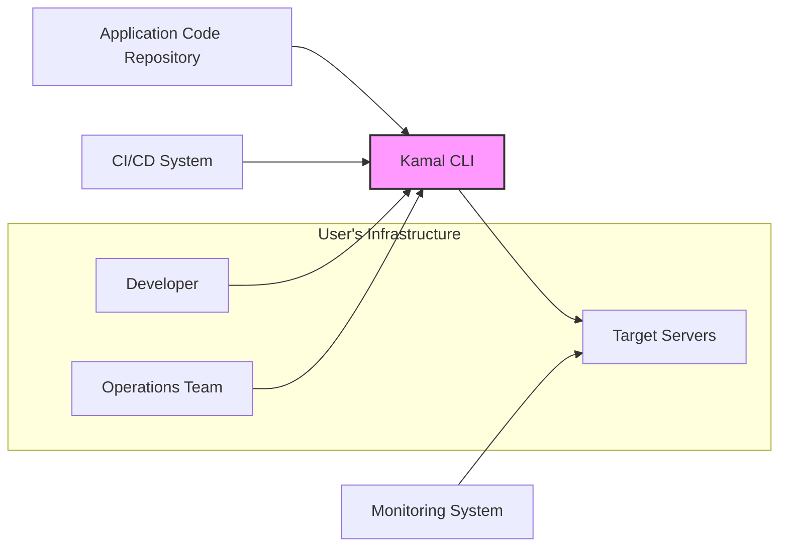

# BUSINESS POSTURE

Kamal, as a deployment tool, aims to simplify and streamline the process of deploying web applications to servers. This addresses several key business priorities:

- Faster time to market: By simplifying deployment, Kamal enables faster release cycles for new features and applications, allowing businesses to respond quickly to market demands and gain a competitive edge.
- Reduced operational costs: Automating and simplifying deployment reduces the manual effort and specialized expertise required, leading to lower operational costs associated with deployment and maintenance.
- Increased reliability and consistency:  Standardized deployment processes enforced by Kamal reduce human error and configuration drift, leading to more reliable and consistent application deployments and reduced downtime.
- Developer productivity: By abstracting away the complexities of server management and deployment, Kamal allows developers to focus on building and improving applications, increasing overall productivity.

Key business risks associated with these priorities include:

- Downtime due to deployment failures:  If Kamal malfunctions or is misconfigured, it could lead to deployment failures and application downtime, impacting revenue and customer satisfaction.
- Security breaches during deployment:  Vulnerabilities in Kamal or insecure deployment practices could expose sensitive data or systems during the deployment process.
- Vendor lock-in (if Kamal becomes a critical dependency):  Over-reliance on Kamal could create vendor lock-in and potential challenges if the project is discontinued or significantly changed in the future.
- Operational complexity if not properly managed: While aiming to simplify deployment, improper use or integration of Kamal could introduce new complexities if not well-managed and understood by operations teams.

# SECURITY POSTURE

Existing security controls:

- security control: Access control to the Kamal repository on GitHub, managed by GitHub permissions. Implemented in: GitHub repository settings.
- security control: Code review process for contributions to Kamal. Implemented in: Project contribution guidelines and pull request process.
- security control: Reliance on underlying infrastructure security (servers, networks) where applications are deployed. Implemented in: User's responsibility to secure their infrastructure.
- security control: Use of SSH for secure communication with servers. Implemented in: Kamal's core functionality.

Accepted risks:

- accepted risk: Security vulnerabilities in dependencies used by Kamal. Mitigation: Dependency scanning and updates.
- accepted risk: Misconfiguration of Kamal by users leading to insecure deployments. Mitigation: Documentation and best practices guidelines.
- accepted risk:  Compromise of user's SSH keys used for deployment. Mitigation: User's responsibility to secure their keys.

Recommended security controls:

- security control: Implement automated security scanning (SAST, DAST) in the Kamal CI/CD pipeline to detect vulnerabilities in the Kamal codebase.
- security control:  Introduce dependency vulnerability scanning and automated updates for Kamal's dependencies.
- security control: Provide guidance and tooling for secure secrets management within Kamal deployments.
- security control: Implement audit logging for Kamal operations to track deployment activities and potential security incidents.
- security control:  Offer options for integration with security information and event management (SIEM) systems for centralized security monitoring.

Security requirements:

- Authentication:
    - Requirement: Kamal itself does not require user authentication as it's a CLI tool executed in the user's environment. However, access to the Kamal repository and related infrastructure (e.g., CI/CD pipelines) should be authenticated.
    - Requirement:  Deployment to target servers relies on SSH key-based authentication. Kamal should securely manage and utilize SSH keys.
- Authorization:
    - Requirement: Authorization is primarily managed at the infrastructure level (server access control, network segmentation). Kamal should respect and integrate with existing authorization mechanisms.
    - Requirement:  Within Kamal, authorization might be relevant for managing deployment configurations and access to sensitive operations. This should be considered for future enhancements.
- Input validation:
    - Requirement: Kamal should validate user inputs, such as configuration files and command-line arguments, to prevent injection attacks and ensure data integrity.
    - Requirement:  Kamal should handle errors gracefully and avoid exposing sensitive information in error messages.
- Cryptography:
    - Requirement: Kamal uses SSH, which relies on cryptography for secure communication. Ensure proper configuration and secure key management practices.
    - Requirement:  For secrets management, Kamal should support or integrate with secure secret storage mechanisms and avoid storing secrets in plain text in configuration files or logs. Consider encryption for sensitive data at rest and in transit within Kamal's operations if applicable.

# DESIGN

## C4 CONTEXT



Context Diagram Elements:

- Element:
    - Name: Developer
    - Type: Person
    - Description: Software developers who use Kamal to deploy and manage applications.
    - Responsibilities: Writing application code, configuring deployments using Kamal, initiating deployments.
    - Security controls:  Local workstation security, access control to code repositories, authentication to CI/CD systems.

- Element:
    - Name: Operations Team
    - Type: Person
    - Description: Operations or DevOps engineers who manage the infrastructure and oversee application deployments using Kamal.
    - Responsibilities:  Managing target servers, configuring Kamal for deployment environments, monitoring application health, troubleshooting deployment issues.
    - Security controls: Access control to infrastructure, monitoring systems, and Kamal configurations.

- Element:
    - Name: Target Servers
    - Type: System
    - Description: The servers (virtual machines, containers, or bare metal) where the applications are deployed and run.
    - Responsibilities: Hosting and running deployed applications, providing runtime environment, serving application traffic.
    - Security controls: Operating system hardening, network security (firewalls, network segmentation), intrusion detection systems, access control, security monitoring.

- Element:
    - Name: Kamal CLI
    - Type: Software System
    - Description: The command-line interface tool that developers and operations teams use to interact with Kamal and manage deployments.
    - Responsibilities:  Orchestrating deployments, configuring servers, executing deployment commands, managing application lifecycle.
    - Security controls: Input validation, secure handling of credentials (SSH keys), logging, access control to configuration files.

- Element:
    - Name: Application Code Repository
    - Type: External System
    - Description:  Version control system (e.g., GitHub, GitLab) where the application source code is stored.
    - Responsibilities: Storing and versioning application code, managing code changes, triggering CI/CD pipelines.
    - Security controls: Access control, code review process, branch protection, vulnerability scanning.

- Element:
    - Name: CI/CD System
    - Type: External System
    - Description: Continuous Integration and Continuous Delivery system that automates the build, test, and potentially deployment process. Kamal can be integrated into CI/CD pipelines.
    - Responsibilities: Automating build and test processes, potentially triggering Kamal deployments, managing deployment pipelines.
    - Security controls: Access control, secure pipeline configuration, secrets management, audit logging.

- Element:
    - Name: Monitoring System
    - Type: External System
    - Description: System used to monitor the health and performance of deployed applications and infrastructure.
    - Responsibilities: Collecting metrics, logs, and traces from applications and servers, alerting on anomalies, providing observability into application behavior.
    - Security controls: Access control, secure data storage and transmission, alerting and incident response mechanisms.

## C4 CONTAINER

```mermaid
graph LR
    subgraph "User's Workstation"
        A["Kamal CLI Container"]
    end
    subgraph "Target Server Infrastructure"
        B["Deployment Agent (SSH)"]
    end
    A --> B: SSH Commands
    style A fill:#f9f,stroke:#333,stroke-width:2px
    style B fill:#f9f,stroke:#333,stroke-width:2px
```

Container Diagram Elements:

- Element:
    - Name: Kamal CLI Container
    - Type: Container (CLI Application)
    - Description:  The Kamal command-line interface application, packaged as a container for easier distribution and execution.  This runs on the developer's or operator's workstation.
    - Responsibilities:  Parsing user commands, reading configuration files, establishing SSH connections to target servers, executing deployment tasks, displaying output to the user.
    - Security controls: Input validation, secure handling of configuration files, secure SSH client implementation, logging of commands executed.

- Element:
    - Name: Deployment Agent (SSH)
    - Type: Container (Server Agent - Implicit)
    - Description:  While not explicitly a separate container in Kamal's architecture, the SSH service running on the target servers acts as an implicit "agent" that Kamal interacts with.  Kamal uses SSH to execute commands on the target servers.
    - Responsibilities:  Receiving and executing commands from the Kamal CLI over SSH, managing application processes, file system operations, system configuration on the target server.
    - Security controls: SSH server hardening, access control (SSH key management, user permissions), audit logging of SSH access and commands executed, intrusion detection on servers.

## DEPLOYMENT

Deployment Architecture: Single Server Deployment

```mermaid
graph LR
    subgraph "Deployment Environment"
        A["Load Balancer"]
        B["Application Server"]
        C["Database Server"]
        A --> B: HTTP/HTTPS
        B --> C: Database Protocol
    end
    D["Kamal CLI"] --> A: Configuration Updates, Deployment Commands
    style A fill:#ccf,stroke:#333,stroke-width:2px
    style B fill:#ccf,stroke:#333,stroke-width:2px
    style C fill:#ccf,stroke:#333,stroke-width:2px
    style D fill:#f9f,stroke:#333,stroke-width:2px
```

Deployment Diagram Elements:

- Element:
    - Name: Load Balancer
    - Type: Infrastructure Component
    - Description: Distributes incoming traffic across application servers, provides SSL termination, and enhances application availability and scalability. (Optional, but common in web application deployments).
    - Responsibilities:  Traffic distribution, load balancing, SSL termination, health checks, routing.
    - Security controls:  SSL/TLS configuration, web application firewall (WAF), DDoS protection, access control, security monitoring.

- Element:
    - Name: Application Server
    - Type: Infrastructure Component (Virtual Machine/Container)
    - Description:  Server instance where the application code is deployed and executed.  Kamal manages the deployment of application code and related configurations to this server.
    - Responsibilities:  Running the application, serving application requests, processing business logic, interacting with the database.
    - Security controls: Operating system hardening, application security best practices, input validation, output encoding, access control, security monitoring, intrusion detection.

- Element:
    - Name: Database Server
    - Type: Infrastructure Component (Virtual Machine/Managed Service)
    - Description:  Server hosting the application's database.  Application server connects to the database server to store and retrieve data.
    - Responsibilities:  Storing application data, managing data integrity and consistency, providing data access to the application server.
    - Security controls: Database hardening, access control, encryption at rest and in transit, regular backups, security monitoring, vulnerability management.

- Element:
    - Name: Kamal CLI
    - Type: Tool (Local Workstation)
    - Description:  Used from a developer or operator workstation to initiate and manage deployments to the deployment environment.
    - Responsibilities:  Sending deployment commands, configuring deployment parameters, managing application lifecycle.
    - Security controls: Secure workstation, access control to deployment credentials (SSH keys), secure communication channels (SSH).

## BUILD

```mermaid
graph LR
    A["Developer Workstation"] --> B["Code Repository (GitHub)"]: Code Commit
    B --> C["CI/CD System (GitHub Actions)"]: Trigger Build
    C --> D["Build Environment"]: Build & Test
    D --> E["Artifact Repository"]: Publish Artifacts (e.g., Docker Image)
    E --> F["Kamal CLI"]: Deployment from Artifacts
    style A fill:#eee,stroke:#333,stroke-width:1px
    style B fill:#eee,stroke:#333,stroke-width:1px
    style C fill:#eee,stroke:#333,stroke-width:1px
    style D fill:#eee,stroke:#333,stroke-width:1px
    style E fill:#eee,stroke:#333,stroke-width:1px
    style F fill:#f9f,stroke:#333,stroke-width:2px
```

Build Process Description:

1. Developer Workstation: Developers write code and commit changes to the code repository.
2. Code Repository (GitHub):  The code repository (e.g., GitHub) stores the source code and triggers the CI/CD pipeline upon new commits.
3. CI/CD System (GitHub Actions): A CI/CD system like GitHub Actions is configured to automatically build, test, and potentially package the application upon code changes.
4. Build Environment: The CI/CD system uses a build environment to compile the code, run tests (unit tests, integration tests, security scans - SAST), and package the application (e.g., into a Docker image).
    - Security controls: Secure build environment, dependency scanning, SAST tools integration, secrets management for build processes.
5. Artifact Repository:  The build artifacts (e.g., Docker images, binaries) are published to an artifact repository (e.g., Docker Hub, GitHub Packages).
    - Security controls: Access control to the artifact repository, vulnerability scanning of published artifacts, image signing.
6. Kamal CLI: Kamal CLI can be configured to deploy applications directly from the artifact repository, pulling the latest version for deployment.
    - Security controls: Securely configured Kamal CLI, access control to artifact repository credentials.

# RISK ASSESSMENT

Critical business processes we are trying to protect:

- Application Deployment Process: Ensuring the reliable and secure deployment of applications is critical for maintaining service availability and delivering new features.
- Application Availability:  Protecting the deployed applications from downtime and security incidents is paramount for business continuity and customer satisfaction.
- Data Integrity and Confidentiality:  Protecting sensitive application data and deployment configurations from unauthorized access, modification, or disclosure.

Data we are trying to protect and their sensitivity:

- Application Code:  Sensitive intellectual property, potential vulnerabilities if exposed. Sensitivity: High.
- Deployment Configurations (Kamal configuration files): May contain sensitive information like server credentials, API keys, database connection strings. Sensitivity: High.
- SSH Private Keys: Used for secure access to servers. If compromised, attackers can gain full control of servers. Sensitivity: Critical.
- Application Data (Database):  Depending on the application, this could include customer data, financial information, personal data. Sensitivity: Varies, potentially High to Critical.
- Logs and Monitoring Data: Can contain sensitive information if not properly managed. Sensitivity: Medium to High depending on content.
- Build Artifacts (Docker images, binaries): Can contain vulnerabilities if not properly scanned and secured. Sensitivity: Medium to High.

# QUESTIONS & ASSUMPTIONS

Questions:

- What specific secrets management solutions are recommended or supported for use with Kamal?
- Are there any built-in audit logging capabilities within Kamal itself, or is it reliant on server-level logging?
- What are the recommended best practices for securing Kamal configuration files?
- Does Kamal have any built-in mechanisms for input validation or output encoding?
- Are there any specific security considerations for using Kamal in different deployment environments (e.g., cloud vs. on-premise)?

Assumptions:

- BUSINESS POSTURE: The organization using Kamal prioritizes rapid deployment and operational efficiency, but also recognizes the importance of security and reliability. Risk appetite is moderate, seeking to balance speed and security.
- SECURITY POSTURE:  Current security controls are primarily focused on basic infrastructure security and code repository access. There is an opportunity to enhance security controls within the deployment process itself.
- DESIGN:  Kamal is primarily used as a CLI tool executed from user workstations or CI/CD systems. It interacts with target servers via SSH.  Deployment architecture is assumed to be relatively standard web application deployments, potentially involving load balancers, application servers, and database servers. Build process involves standard CI/CD practices, including code repositories, automated builds, and artifact repositories.