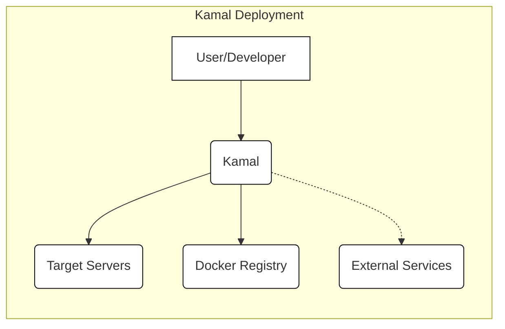
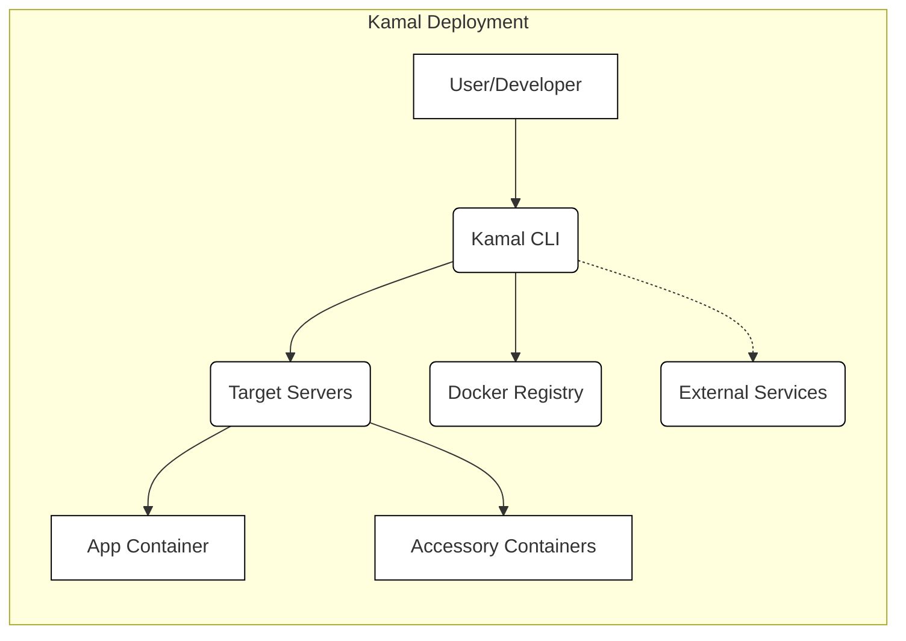
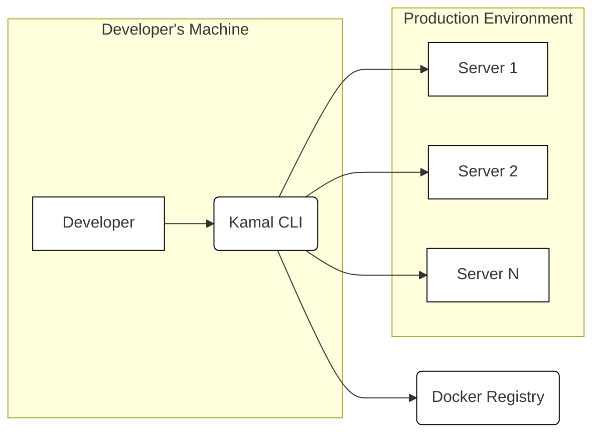
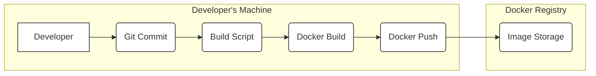

Okay, let's create a design document for Kamal (https://github.com/basecamp/kamal), focusing on aspects relevant to threat modeling.

# BUSINESS POSTURE

Kamal is a deployment tool, and its primary business purpose is to simplify and streamline the deployment of web applications, particularly those built with Ruby on Rails, to various hosting environments.  It aims to bridge the gap between complex container orchestration tools and simpler, less flexible deployment methods.  It prioritizes ease of use and developer productivity.  Given Basecamp's (the creator of Kamal) pragmatic approach, we can assume a moderate risk appetite, balancing security with operational efficiency.

Business Priorities:

*   Reduce deployment complexity and time.
*   Enable developers to deploy applications without deep infrastructure expertise.
*   Support a variety of hosting environments (bare metal, cloud VMs).
*   Maintain application uptime and availability during deployments.
*   Provide a consistent and repeatable deployment process.
*   Minimize the "works on my machine" problem.

Business Goals:

*   Increase developer velocity.
*   Reduce operational overhead.
*   Improve application reliability.
*   Facilitate faster iteration cycles.

Most Important Business Risks:

*   Unauthorized access to servers or deployed applications, leading to data breaches or service disruption.
*   Deployment failures causing application downtime or data loss.
*   Vulnerabilities in the deployed application or its dependencies, exploited by attackers.
*   Misconfiguration of servers or deployment settings, leading to security weaknesses or operational issues.
*   Supply chain attacks targeting Kamal itself or its dependencies.
*   Lack of auditability and traceability of deployments, hindering incident response.

# SECURITY POSTURE

Existing Security Controls (as inferred from the repository and documentation):

*   security control: SSH for secure communication with servers. (Implemented in Kamal's core deployment logic)
*   security control: Docker containers for application isolation and dependency management. (Fundamental to Kamal's design)
*   security control: Environment variables for managing sensitive configuration data (e.g., secrets). (Recommended practice, enforced through Kamal's configuration)
*   security control: Health checks to ensure application availability after deployment. (Built-in feature of Kamal)
*   security control: Rolling deployments to minimize downtime. (Core feature of Kamal)
*   security control: Support for pre- and post-deployment hooks, allowing for custom security checks or actions. (Kamal's hook system)
*   security control: Signed commits. (Best practice, but enforcement depends on developer discipline and repository settings)
*   security control: Use of a dedicated Docker registry (implied, as Kamal uses Docker). (User's responsibility to secure their registry)

Accepted Risks:

*   accepted risk: Relies on the security of the underlying Docker infrastructure and images.
*   accepted risk: Assumes the user has properly secured their SSH keys and server access.
*   accepted risk: Limited built-in protection against application-level vulnerabilities (Kamal is a deployment tool, not a WAF or security scanner).
*   accepted risk: The security of the deployment process depends heavily on the user-provided configuration (e.g., secrets, server settings).
*   accepted risk: Single point of failure in the machine running Kamal.

Recommended Security Controls (High Priority):

*   security control: Implement a robust secrets management solution (e.g., HashiCorp Vault, AWS Secrets Manager, CyberArk Conjur) to securely store and inject secrets into the deployment process, rather than relying solely on environment variables.
*   security control: Integrate static application security testing (SAST) and software composition analysis (SCA) tools into the build pipeline to identify vulnerabilities in the application code and its dependencies.
*   security control: Implement dynamic application security testing (DAST) to scan the running application for vulnerabilities.
*   security control: Enforce multi-factor authentication (MFA) for SSH access to servers.
*   security control: Implement a centralized logging and monitoring solution to track deployments, detect anomalies, and facilitate incident response.
*   security control: Regularly audit server configurations and security settings.
*   security control: Implement network segmentation to isolate the deployed application from other systems.
*   security control: Use a dedicated, hardened machine or container for running Kamal, separate from developer workstations.

Security Requirements:

*   Authentication:
    *   SSH key-based authentication is required for accessing servers.
    *   Strong password policies or MFA should be enforced for any user accounts involved in the deployment process.
    *   Access to the Docker registry should be authenticated and authorized.

*   Authorization:
    *   Principle of least privilege should be applied to all access controls (SSH, Docker registry, server access).
    *   Users should only have the necessary permissions to perform their tasks.
    *   Role-based access control (RBAC) should be considered for managing user permissions.

*   Input Validation:
    *   Kamal should validate user-provided configuration data to prevent injection attacks or misconfigurations.
    *   Input validation should be performed at both the client-side (Kamal CLI) and server-side (where applicable).

*   Cryptography:
    *   SSH is used for secure communication.
    *   TLS should be used for all communication with the Docker registry.
    *   Sensitive data (e.g., secrets) should be encrypted at rest and in transit.
    *   Cryptographic best practices should be followed (e.g., using strong algorithms and key lengths).

# DESIGN

## C4 CONTEXT

Element List:

*   1.  Name: User/Developer
    *   Type: Person
    *   Description: The person initiating the deployment using the Kamal CLI.
    *   Responsibilities:
        *   Configuring Kamal.
        *   Triggering deployments.
        *   Managing application code and dependencies.
    *   Security controls:
        *   Strong passwords/MFA for accounts.
        *   Secure development practices.
        *   Secure storage of SSH keys.

*   2.  Name: Kamal
    *   Type: Software System
    *   Description: The deployment tool that orchestrates the deployment process.
    *   Responsibilities:
        *   Reading configuration files.
        *   Connecting to servers via SSH.
        *   Pulling Docker images from the registry.
        *   Running Docker commands on target servers.
        *   Managing application lifecycles.
    *   Security controls:
        *   Input validation.
        *   Secure communication via SSH.
        *   Secure handling of secrets (ideally via integration with a secrets management solution).

*   3.  Name: Target Servers
    *   Type: Software System
    *   Description: The servers (bare metal or VMs) where the application will be deployed.
    *   Responsibilities:
        *   Running the Docker daemon.
        *   Hosting the application containers.
        *   Serving application traffic.
    *   Security controls:
        *   SSH key-based authentication.
        *   Firewall rules.
        *   Regular security updates.
        *   Intrusion detection/prevention systems.
        *   Hardened operating system configuration.

*   4.  Name: Docker Registry
    *   Type: Software System
    *   Description: The registry where Docker images are stored.
    *   Responsibilities:
        *   Storing and serving Docker images.
        *   Managing image tags and versions.
    *   Security controls:
        *   Authentication and authorization.
        *   TLS encryption.
        *   Image scanning for vulnerabilities.
        *   Access control lists (ACLs).

*   5.  Name: External Services
    *   Type: Software System
    *   Description: Any external services that the application interacts with (e.g., databases, message queues, third-party APIs).
    *   Responsibilities: Varies depending on the service.
    *   Security controls: Varies depending on the service. Should include authentication, authorization, and encryption.

## C4 CONTAINER

Element List:

*   1.  Name: User/Developer
    *   Type: Person
    *   Description: The person initiating the deployment using the Kamal CLI.
    *   Responsibilities:
        *   Configuring Kamal.
        *   Triggering deployments.
        *   Managing application code and dependencies.
    *   Security controls:
        *   Strong passwords/MFA for accounts.
        *   Secure development practices.
        *   Secure storage of SSH keys.

*   2.  Name: Kamal CLI
    *   Type: Application
    *   Description: The command-line interface for interacting with Kamal.
    *   Responsibilities:
        *   Parsing user input.
        *   Validating configuration.
        *   Executing deployment commands.
    *   Security controls:
        *   Input validation.
        *   Secure handling of secrets (ideally via integration with a secrets management solution).

*   3.  Name: Target Servers
    *   Type: Server
    *   Description: The servers (bare metal or VMs) where the application will be deployed.
    *   Responsibilities:
        *   Running the Docker daemon.
        *   Hosting the application containers.
        *   Serving application traffic.
    *   Security controls:
        *   SSH key-based authentication.
        *   Firewall rules.
        *   Regular security updates.
        *   Intrusion detection/prevention systems.
        *   Hardened operating system configuration.

*   4.  Name: App Container
    *   Type: Container
    *   Description: The Docker container running the main application code.
    *   Responsibilities:
        *   Serving application requests.
        *   Processing data.
        *   Interacting with other containers and external services.
    *   Security controls:
        *   Application-level security measures (e.g., input validation, output encoding, authentication, authorization).
        *   Secure coding practices.
        *   Regular security updates.

*   5.  Name: Accessory Containers
    *   Type: Container
    *   Description: Any additional containers used by the application (e.g., databases, caches, background workers).
    *   Responsibilities: Varies depending on the container.
    *   Security controls:
        *   Container-specific security measures.
        *   Secure communication with other containers.
        *   Regular security updates.

*   6.  Name: Docker Registry
    *   Type: Software System
    *   Description: The registry where Docker images are stored.
    *   Responsibilities:
        *   Storing and serving Docker images.
        *   Managing image tags and versions.
    *   Security controls:
        *   Authentication and authorization.
        *   TLS encryption.
        *   Image scanning for vulnerabilities.
        *   Access control lists (ACLs).

*   7.  Name: External Services
    *   Type: Software System
    *   Description: Any external services that the application interacts with (e.g., databases, message queues, third-party APIs).
    *   Responsibilities: Varies depending on the service.
    *   Security controls: Varies depending on the service. Should include authentication, authorization, and encryption.

## DEPLOYMENT

Possible Deployment Solutions:

1.  Developer's Local Machine: Kamal can be run directly from a developer's workstation.
2.  Dedicated Build Server: Kamal can be run from a dedicated build server (e.g., Jenkins, GitLab CI).
3.  Cloud-Based Build Service: Kamal can be integrated with cloud-based build services (e.g., GitHub Actions, CircleCI).

Chosen Solution (for detailed description): Developer's Local Machine

Element List:

*   1.  Name: Developer
    *   Type: Person
    *   Description: The person initiating the deployment.
    *   Responsibilities: Running Kamal commands.
    *   Security controls: Secure workstation, strong passwords, MFA.

*   2.  Name: Kamal CLI
    *   Type: Application
    *   Description: The Kamal command-line tool.
    *   Responsibilities: Executing deployment commands, connecting to servers.
    *   Security controls: Input validation, secure communication (SSH).

*   3.  Name: Server 1, Server 2, Server N
    *   Type: Server
    *   Description: Production servers hosting the application.
    *   Responsibilities: Running Docker containers, serving traffic.
    *   Security controls: SSH access control, firewalls, regular updates.

*   4.  Name: Docker Registry
    *   Type: Software System
    *   Description: Registry storing Docker images.
    *   Responsibilities: Providing images to servers.
    *   Security controls: Authentication, authorization, TLS.

## BUILD

Build Process Description:

1.  Developer commits code changes to a Git repository.
2.  Developer runs a build script (likely locally, but could be on a CI server).
3.  The build script uses `docker build` to create a Docker image. This step should ideally include:
    *   security control: Static Application Security Testing (SAST): Scanning the application code for vulnerabilities.
    *   security control: Software Composition Analysis (SCA): Scanning dependencies for known vulnerabilities.
    *   security control: Linting: Checking code for style and potential errors.
4.  The build script uses `docker push` to push the image to a Docker registry.
    *   security control: Image signing: Digitally signing the image to ensure its integrity.
5.  The Docker registry stores the image.
    *   security control: Vulnerability scanning: Scanning the image for vulnerabilities within the registry.

# RISK ASSESSMENT

Critical Business Processes to Protect:

*   Application deployment process: Ensuring successful and secure deployments.
*   Application uptime and availability: Maintaining continuous service for users.
*   Data integrity and confidentiality: Protecting user data from unauthorized access or modification.

Data to Protect and Sensitivity:

*   Application code: Contains business logic and potentially sensitive algorithms (Medium sensitivity).
*   Configuration files: May contain secrets (e.g., API keys, database credentials) (High sensitivity).
*   Docker images: Contain the application and its dependencies (Medium sensitivity).
*   User data (stored in databases or other external services): Varies in sensitivity depending on the application.  Could range from low to extremely high.
*   Deployment logs: May contain sensitive information about the deployment process (Medium sensitivity).
*   SSH keys: Provide access to servers (High sensitivity).

# QUESTIONS & ASSUMPTIONS

Questions:

*   What specific external services does Basecamp use with Kamal, and what are their security postures?
*   What is Basecamp's internal policy regarding secrets management?
*   What level of logging and monitoring is currently in place for Kamal deployments?
*   What is the process for updating Kamal itself and its dependencies?
*   Are there any existing security audits or penetration tests performed on Kamal or applications deployed with it?
*   What is process to manage SSH keys?
*   What Docker registry is used?

Assumptions:

*   BUSINESS POSTURE: Basecamp has a moderate risk appetite, balancing security with usability.
*   SECURITY POSTURE: Basecamp follows basic security best practices (e.g., using SSH, Docker containers).  However, there's room for improvement in areas like secrets management and vulnerability scanning.
*   DESIGN: The deployment environment consists of servers accessible via SSH and a Docker registry. The application is containerized using Docker. The primary deployment method is via a developer's machine.