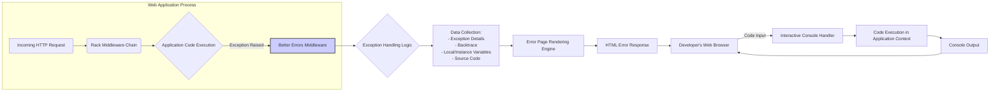

# Project Design Document: Better Errors

**Version:** 1.1
**Date:** October 26, 2023
**Author:** Gemini (AI Language Model)

## 1. Introduction

This document provides an enhanced design overview of the `better_errors` Ruby gem, specifically tailored for threat modeling purposes. It details the gem's functionality, architecture, key components, data flow, and security considerations. This document serves as a foundational resource for identifying potential security vulnerabilities and attack vectors.

### 1.1. Purpose

The primary purpose of the `better_errors` gem is to significantly improve the debugging experience for Ruby on Rails and other Rack-based web application developers during development. It achieves this by providing richer, more interactive error pages compared to the standard error displays. This document aims to provide a clear understanding of its inner workings for security analysis.

### 1.2. Scope

This document focuses on the core mechanisms of the `better_errors` gem as it operates within a development environment. It encompasses the gem's interaction with the web application's request/response cycle, the types of sensitive information it accesses and displays, and the interactive debugging features it offers. The scope explicitly excludes the gem's behavior or presence in production environments, where it should ideally be disabled.

### 1.3. Target Audience

This document is primarily intended for:

*   Security engineers tasked with performing threat modeling and security assessments of applications utilizing `better_errors`.
*   Developers involved in the development, maintenance, and security auditing of the `better_errors` gem itself.
*   Technical stakeholders requiring a comprehensive understanding of the gem's architecture and its potential security implications during development.

## 2. Overview

`better_errors` functions as a Rack middleware component. When an unhandled exception occurs within the application, this middleware intercepts the standard error handling process. Instead of the default error page, `better_errors` generates a detailed and interactive HTML page presented to the developer's browser. This page offers insights into the application's state at the moment of failure, facilitating efficient debugging.

### 2.1. Key Features

*   **Comprehensive Exception Details:** Displays the exception's class name, error message, and the complete backtrace of the call stack leading to the error.
*   **Contextual Source Code Display:** Shows snippets of the source code file where the exception occurred, highlighting the specific line and providing surrounding context.
*   **Variable Inspection:** Allows developers to examine the values of local and instance variables within each frame of the backtrace, providing a snapshot of the application's state.
*   **Interactive Ruby Console (REPL):** Embeds a fully functional Ruby console directly within the error page, enabling developers to execute arbitrary Ruby code within the application's runtime environment at the point of failure.
*   **Seamless Framework Integration:** Designed for easy integration with popular Ruby web frameworks like Rails, Sinatra, and other Rack-based applications.
*   **Customizable Presentation:** Offers limited options for customizing the visual appearance of the error page.

### 2.2. Assumptions

*   `better_errors` is explicitly designed and intended for use exclusively in non-production (development, staging, testing) environments.
*   The gem operates within the standard Rack middleware pipeline of the web application.
*   The underlying application is a Ruby application running on a web server that supports the Rack interface.
*   Developers accessing the `better_errors` interface are assumed to have a certain level of trust and access to the development environment.

## 3. Architecture

The `better_errors` gem operates as a Rack middleware component, intercepting exceptions before they reach the default error handling mechanisms. The following diagram illustrates the key components and their interactions:

### 3.1. Components

*   **Rack Middleware:** The central component that intercepts requests and responses, specifically designed to catch exceptions.
*   **Exception Handling Logic:**  The core logic responsible for receiving the raised exception object and initiating the error reporting process.
*   **Data Collection Module:** This module gathers comprehensive information related to the exception, including:
    *   The specific exception class and its associated error message.
    *   The complete backtrace, detailing the sequence of method calls leading to the exception.
    *   The values of local variables within each frame of the backtrace.
    *   The values of instance variables of the objects involved in the call stack.
    *   Snippets of the source code file surrounding the line where the exception occurred.
    *   Potentially, request parameters, session data, and environment variables available at the time of the exception.
*   **Error Page Rendering Engine:** Responsible for generating the HTML error page that is displayed in the developer's browser. This involves:
    *   Utilizing a templating engine (likely ERB or a similar Ruby templating system).
    *   Structuring and formatting the collected exception data for clear presentation.
    *   Embedding the interactive console interface within the HTML.
*   **Interactive Console Handler:**  Manages the interactive Ruby console functionality. This includes:
    *   Receiving code input from the developer's browser (typically via asynchronous requests like AJAX).
    *   Executing the received Ruby code within the application's existing runtime environment and context.
    *   Capturing the output of the executed code.
    *   Sending the output back to the developer's browser for display in the console.

### 3.2. Data Flow

1. **Incoming Request & Exception:** The web application receives an HTTP request, and during the processing of this request, an unhandled exception is raised within the application code.
2. **Middleware Interception:** The `better_errors` middleware, positioned within the Rack middleware chain, intercepts the raised exception.
3. **Exception Handling Initiation:** The `Exception Handling Logic` component takes control, receiving the exception object.
4. **Data Collection:** The `Data Collection Module` gathers extensive information about the exception, including the backtrace, local and instance variables, and relevant source code.
5. **Error Page Rendering:** The `Error Page Rendering Engine` uses the collected data to dynamically generate the HTML error page.
6. **Response to Browser:** The generated HTML error page is sent back to the developer's web browser as the HTTP response.
7. **Interactive Console Interaction (Optional):** If the developer uses the interactive console:
    *   The developer enters Ruby code into the console within the error page in their browser.
    *   This code is sent to the application (specifically to the `Interactive Console Handler`) via an HTTP request (e.g., AJAX).
    *   The `Interactive Console Handler` executes the received code within the application's runtime environment.
    *   The output of the executed code is captured.
    *   The output is sent back to the developer's browser and displayed in the console on the error page.

## 4. Security Considerations

The features and functionality of `better_errors`, while beneficial for development, introduce several significant security considerations, especially if inadvertently enabled in production environments or if access is not properly controlled.

*   **Critical Information Disclosure:** The error page can expose highly sensitive information, including:
    *   **Application Source Code:** Direct access to potentially proprietary or confidential code.
    *   **Database Credentials:** If stored in environment variables or configuration files accessible during the error.
    *   **API Keys and Secrets:** Exposure of sensitive credentials used for external services.
    *   **User Session Data:** Revealing details of active user sessions, potentially leading to session hijacking.
    *   **Request Parameters and Headers:** Displaying potentially sensitive data submitted by users.
    *   **Internal Application Structure and Logic:** Providing insights into the application's inner workings, aiding potential attackers.
    *   **Environment Variables:** Exposing potentially sensitive configuration details.
*   **Severe Remote Code Execution (RCE) Vulnerability:** The interactive console provides a direct mechanism for executing arbitrary Ruby code within the application's runtime environment. This is a critical vulnerability if accessible to unauthorized individuals, allowing for complete system compromise.
*   **Potential Denial of Service (DoS):** Repeatedly triggering exceptions, especially if the error page generation or console interaction is resource-intensive, could potentially overload the server, leading to a denial of service.
*   **Cross-Site Scripting (XSS) Risks:** If user-provided data (e.g., request parameters) is included in the error page without proper sanitization, it could create opportunities for XSS attacks against developers viewing the error page.
*   **Session Hijacking Facilitation:** If session identifiers or other sensitive session data are displayed on the error page and an attacker gains access, they could potentially hijack legitimate user sessions.
*   **Path Traversal Information Leakage:** Displaying file paths without proper sanitization could reveal sensitive information about the server's file system structure.

## 5. Deployment

`better_errors` is typically deployed by including it as a gem in the application's `Gemfile` and configuring it as Rack middleware. Crucially, its activation should be strictly controlled based on the environment.

### 5.1. Configuration Details

Configuration usually involves adding the `better_errors` gem to the `Gemfile` and then inserting the middleware into the Rack middleware stack. For Rails applications, this is often done in the `config/environments/development.rb` file to ensure it's only active in the development environment. Similar configuration mechanisms exist for other Rack-based frameworks.

### 5.2. Environment-Specific Activation

It is **imperative** that `better_errors` is **disabled** in production environments. This is typically achieved through environment variable checks or conditional logic within the application's configuration. Failure to do so represents a significant security risk.

## 6. Dependencies

`better_errors` relies on other Ruby gems for its functionality, including:

*   **`coderay`:** Used for syntax highlighting of the displayed source code.
*   **A suitable templating engine (e.g., `erubis`, `erb`):**  For rendering the HTML error page.
*   **`rack`:** The fundamental interface between web servers and Ruby web frameworks.

Security vulnerabilities present in these dependencies could potentially be exploited through `better_errors`.

## 7. Future Considerations

Potential future developments or modifications to `better_errors` that could have implications for its design and security include:

*   **Granular Control over Information Display:** Implementing options to selectively control which types of data are included in the error page, allowing for more fine-grained security.
*   **Enhanced Security for the Interactive Console:** Adding authentication or authorization mechanisms to restrict access to the console, even in development environments.
*   **Improved Data Sanitization:** Implementing robust sanitization techniques to prevent XSS vulnerabilities when displaying potentially user-provided data.
*   **Integration with Security Logging:**  Adding capabilities to log access to the error page and console interactions for auditing purposes.
*   **Content Security Policy (CSP) Headers:**  Exploring the use of CSP headers to further mitigate XSS risks.

This enhanced design document provides a more detailed and security-focused overview of the `better_errors` gem. It serves as a valuable resource for conducting thorough threat modeling and identifying potential security vulnerabilities associated with its use. The emphasis on the critical importance of disabling the gem in production environments cannot be overstated.