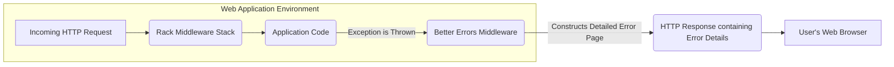
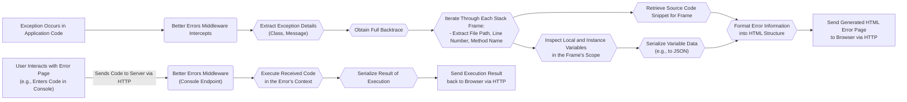

# Project Design Document: Better Errors Gem

**Version:** 1.1
**Date:** October 26, 2023
**Author:** AI Software Architect

## 1. Project Overview

The `better_errors` gem is a Ruby gem designed to significantly enhance the error handling experience in Rack-based Ruby web applications (e.g., Ruby on Rails, Sinatra). It replaces the standard, often less informative, error pages with an interactive debugging interface directly within the web browser. This rich interface provides detailed information about the encountered exception, including a full stack trace, the values of local and instance variables at the point of the error, and an interactive Ruby console (REPL) for executing code within the error's context.

This document provides a detailed architectural overview of the `better_errors` gem, specifically tailored to facilitate thorough threat modeling and security analysis.

## 2. Goals

* To provide a clear and comprehensive description of the `better_errors` gem's architecture and operational mechanisms.
* To meticulously identify the key components of the gem and their interactions within a web application.
* To illustrate the flow of data within the gem during error handling.
* To explicitly highlight potential security vulnerabilities and areas of concern that require careful consideration during threat modeling.

## 3. System Architecture

The `better_errors` gem functions as a piece of Rack middleware within a Ruby web application's request processing pipeline. When an unhandled exception is raised during the processing of an incoming HTTP request, the `better_errors` middleware intercepts this exception. It then takes over the response generation, producing a detailed HTML error page instead of the default error response.

**Key Architectural Aspects:**

* **Rack Middleware Implementation:** `better_errors` is implemented as Rack middleware. This architectural choice allows it to seamlessly integrate into any Rack-compliant Ruby web application. It sits within the middleware stack, intercepting requests and responses.
* **Centralized Exception Handling:** The middleware acts as a centralized point for catching unhandled exceptions that occur within the application.
* **Dynamic Error Page Generation:**  The gem dynamically generates an HTML page containing detailed debugging information. This page is not static but is created on-demand when an error occurs.
* **Direct Browser Presentation:** The generated error page is sent directly to the user's web browser as the HTTP response.

## 4. Component Design

The `better_errors` gem is composed of several distinct components, each with a specific responsibility:

* **Error Handling Middleware:**
    * **Primary Function:**  Serves as the entry point and core of the gem.
    * **Exception Interception:** Detects and intercepts exceptions raised by the application code or other middleware.
    * **Environment Check:** Determines if `better_errors` should be activated for the current environment (typically enabled in development/staging).
    * **Error Page Initiation:**  When an exception is caught and the environment is appropriate, this component initiates the process of generating the detailed error page.
* **Exception Information Extractor:**
    * **Purpose:**  Gathers core details about the intercepted exception.
    * **Data Collected:**  Extracts the exception's class, the error message, and the complete backtrace.
* **Stack Frame Analyzer:**
    * **Role:** Processes the raw backtrace to provide more structured information about each frame in the call stack.
    * **Information Extracted:** For each frame, it identifies the file path, the specific line number where the call occurred, and the name of the method or block being executed.
    * **Source Code Retrieval:** Attempts to locate and retrieve the source code file associated with each stack frame.
* **Variable Inspector and Extractor:**
    * **Functionality:** Examines the execution scope at each frame in the stack trace to identify and extract the values of local and instance variables.
    * **Scope Analysis:**  Navigates the call stack to access the relevant variable scopes.
    * **Value Retrieval:** Retrieves the current values of variables within those scopes. This component needs to handle different object types gracefully and avoid potential infinite recursion when inspecting complex objects.
* **Code Snippet Renderer:**
    * **Responsibility:** Takes a file path and a line number as input and extracts a relevant snippet of the source code surrounding that line.
    * **Contextual Display:** Provides the developer with the immediate code context where the error occurred.
* **Interactive Console (REPL) Component:**
    * **Function:** Provides an interactive Ruby console directly within the error page in the browser.
    * **Code Execution:** Allows developers to execute arbitrary Ruby code within the context of the error, with access to the variables and objects present at the time of the exception.
    * **Server-Side Execution:**  Code entered in the console is sent to the server for execution.
* **Web Interface Renderer:**
    * **Technology:** Primarily uses HTML for structuring the error page content, CSS for styling, and JavaScript for adding interactive elements.
    * **Information Presentation:** Renders the extracted exception details, stack frames, variable values, and the interactive console in a user-friendly format within the browser.

## 5. Data Flow

The process of handling an error and presenting the detailed error page involves the following sequence of data flow:

**Detailed Steps in Data Flow:**

1. **Exception 발생 (Exception Occurs):** An unhandled exception is raised during the execution of the application's code.
2. **Middleware 개입 (Middleware Intercepts):** The `better_errors` middleware intercepts the raised exception.
3. **예외 정보 추출 (Extract Exception Details):** The middleware extracts fundamental information about the exception, such as its class and error message.
4. **백트레이스 획득 (Obtain Full Backtrace):** The complete stack trace associated with the exception is retrieved.
5. **스택 프레임 처리 (Iterate Through Each Stack Frame):** The gem iterates through each frame in the backtrace:
    * The file path, line number, and method name corresponding to that frame are extracted.
6. **소스 코드 스니펫 검색 (Retrieve Source Code Snippet):** For each stack frame, the gem attempts to retrieve a snippet of the source code surrounding the line where the call occurred.
7. **변수 검사 (Inspect Local and Instance Variables):** The gem examines the local and instance variables that were in scope at the point of execution for each stack frame.
8. **변수 데이터 직렬화 (Serialize Variable Data):** The retrieved variable data is serialized into a format suitable for transmission and display in the browser (commonly JSON).
9. **HTML 형식화 (Format Error Information into HTML Structure):** All the collected information (exception details, stack frames, variable values, source code snippets) is formatted into an HTML structure to create the error page.
10. **사용자 상호작용 (User Interacts with Error Page):** If the interactive console is used, the user enters Ruby code in the provided input field.
11. **서버로 코드 전송 (Sends Code to Server via HTTP):** The code entered by the user is sent back to the server via an HTTP request to a specific endpoint provided by `better_errors`.
12. **코드 실행 (Execute Received Code):** The `better_errors` middleware on the server receives the code and executes it within the context of the error that originally occurred. This means the code has access to the same variables and objects that were present at the time of the exception.
13. **결과 직렬화 (Serialize Result of Execution):** The result of the executed code is serialized into a format suitable for transmission back to the browser.
14. **결과 전송 (Send Execution Result back to Browser via HTTP):** The serialized result of the code execution is sent back to the user's browser to be displayed in the interactive console.
15. **에러 페이지 전송 (Send Generated HTML Error Page to Browser via HTTP):** The fully generated HTML error page is sent as the HTTP response to the user's web browser.

## 6. Security Considerations (Crucial for Threat Modeling)

The powerful debugging features of `better_errors` introduce several significant security considerations, particularly if the gem is inadvertently or intentionally left enabled in production environments:

* **Exposure of Sensitive Source Code:**
    * **Risk:** The ability to view source code snippets allows potential attackers to examine the application's internal logic, identify vulnerabilities, and understand security mechanisms.
    * **Example:**  Revealing the implementation of authentication or authorization logic.
* **Disclosure of Sensitive Variable Data:**
    * **Risk:** Displaying the values of local and instance variables can expose sensitive information such as passwords, API keys, session tokens, personal data, and internal system configurations.
    * **Example:**  Displaying a user's password stored in a variable during a login error.
* **Remote Code Execution via Interactive Console:**
    * **Critical Risk:** The interactive console provides a direct mechanism for executing arbitrary Ruby code on the server. This is a severe vulnerability if accessible to unauthorized individuals.
    * **Attack Scenario:** An attacker could use the console to read arbitrary files, modify data in the database, execute system commands, or even gain complete control of the server.
* **Information Leakage through Detailed Error Messages:**
    * **Risk:** While intended for debugging, detailed error messages themselves can sometimes reveal information about the application's internal structure, database schema, or dependencies, which can be valuable to an attacker during reconnaissance.
    * **Example:**  Error messages revealing specific database table names or internal API endpoints.
* **Potential for Cross-Site Scripting (XSS):**
    * **Risk:** If the error page generation process does not properly sanitize variable values or the output of the interactive console, it could be vulnerable to XSS attacks.
    * **Attack Scenario:** Malicious JavaScript could be injected through variable values or console output, potentially allowing attackers to steal cookies or perform actions on behalf of legitimate users.
* **Denial of Service (DoS) Possibilities:**
    * **Risk:**  Repeatedly triggering errors or executing computationally expensive code in the interactive console could potentially consume server resources and lead to a denial of service.
    * **Attack Scenario:** An attacker could intentionally cause errors or run resource-intensive commands in the console to overload the server.
* **Cross-Site Request Forgery (CSRF) on Console Actions:**
    * **Risk:** If actions performed through the interactive console (that might modify server-side state) are not protected against CSRF, an attacker could potentially craft malicious requests that, if executed by an authenticated user, could lead to unintended actions.
* **Path Traversal Vulnerabilities (in Source Code Retrieval):**
    * **Risk:** If the logic for retrieving source code snippets is not carefully implemented and validated, there is a theoretical risk of path traversal vulnerabilities, allowing access to files outside the application's intended directory structure.

## 7. Deployment Considerations

* **Intended Environment:** `better_errors` is primarily designed for use in development and staging environments to aid in debugging.
* **Production Environment Risk:** Enabling `better_errors` in production environments is **strongly discouraged** due to the significant security risks outlined above.
* **Conditional Activation:**  It is crucial to implement mechanisms to conditionally enable `better_errors` based on the application's environment (e.g., using Rails environments or feature flags).
* **Security Best Practices:**  A fundamental security practice is to ensure that `better_errors` is strictly disabled in all production deployments.

## 8. Future Considerations (Potential Enhancements and Security Improvements)

* **Granular Control over Information Display:**  Implement configuration options to allow developers to selectively disable the display of certain types of information (e.g., disabling variable inspection for specific classes or namespaces) to reduce potential information leakage.
* **Enhanced Security Measures for Interactive Console:**
    * **Authentication and Authorization:** Implement authentication mechanisms to restrict access to the interactive console to authorized developers only.
    * **IP Address Whitelisting:** Allow administrators to restrict access to the console based on whitelisted IP addresses.
    * **Command Auditing/Logging:** Log all commands executed through the interactive console for auditing and security monitoring purposes.
    * **Rate Limiting:** Implement rate limiting on console interactions to mitigate potential DoS attacks.
* **Improved Output Sanitization:**  Strengthen the sanitization of output displayed in the error page and the interactive console to prevent XSS vulnerabilities.
* **Integration with Security Monitoring Tools:** Provide options to integrate with security monitoring and logging systems to report potential security incidents or suspicious activity related to error handling.
* **Secure Secrets Management:**  Provide guidance and mechanisms to prevent the accidental disclosure of secrets (API keys, passwords) through variable inspection. This might involve filtering or masking sensitive data.

This revised document provides a more detailed and security-focused design overview of the `better_errors` gem. It emphasizes the potential security implications of its features and is intended to serve as a valuable resource for conducting thorough threat modeling activities.
