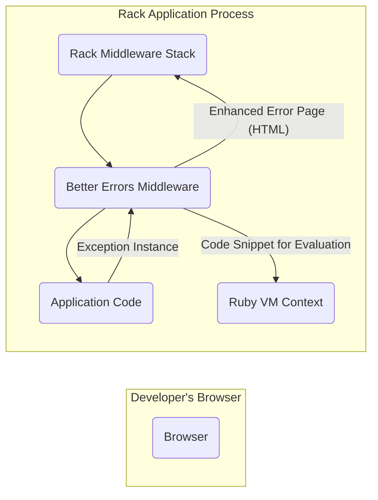
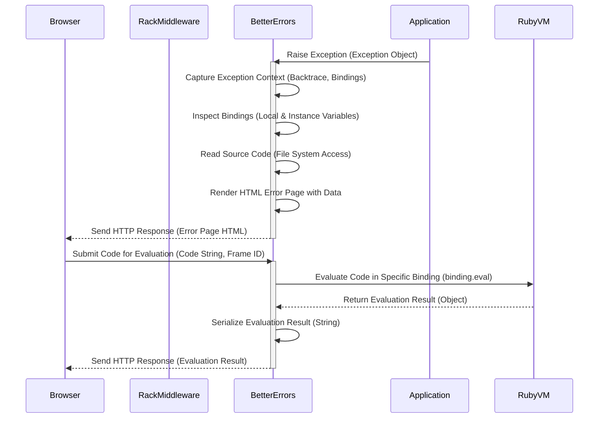

## Project Design Document: Better Errors Gem (Improved)

**Project Name:** Better Errors

**Project Repository:** https://github.com/bettererrors/better_errors

**Document Version:** 1.1

**Date:** October 26, 2023

**Author:** AI Software Architect

### 1. Introduction

This document provides an enhanced design overview of the `better_errors` Ruby gem. Building upon the previous version, this document offers more granular detail regarding the gem's architecture, component interactions, and data flow. The primary goal remains to provide a clear and comprehensive understanding of the system for effective threat modeling. This version includes more specific details about internal processes and potential security implications.

### 2. Goals and Non-Goals

**Goals:**

* Provide developers with a highly informative and interactive error page during development to facilitate debugging.
* Display comprehensive details about exceptions, including the full backtrace, the state of local variables at each frame, and instance variables of relevant objects.
* Enable developers to execute arbitrary Ruby code within the context of a specific error frame for live debugging.
* Offer seamless integration as Rack middleware within Ruby on Rails and other Rack-based applications.
* Allow for straightforward configuration and customization to suit different development workflows.

**Non-Goals:**

* Deployment or use in production environments. The gem's inherent nature and features make it unsuitable and explicitly discouraged for production due to significant security risks.
* Providing robust security features or hardening for production deployments. Security considerations are primarily focused on preventing misuse or accidental exposure in non-production settings.
* Functioning as a comprehensive application monitoring or logging solution beyond the scope of enhanced error display during development.
* Guaranteeing compatibility with every possible Ruby framework or web server without targeted integration efforts or community contributions.

### 3. Architectural Overview

The `better_errors` gem functions as a piece of Rack middleware that intercepts exceptions within a Rack-based Ruby application. When an unhandled exception occurs, this middleware takes control, gathers detailed diagnostic information, and renders an interactive HTML error page. This page is then served back to the developer's browser, providing a rich debugging environment.

### 4. Component Description

*   **Rack Middleware Stack:** The standard request processing pipeline in Rack applications. `better_errors` inserts itself into this stack to intercept exceptions before they reach the default error handling.
*   **Better Errors Middleware:** The central component of the gem, responsible for:
    *   **Exception Interception and Handling:**  Detecting and capturing unhandled exceptions raised by the `Application Code`.
    *   **Contextual Data Collection:** Gathering a wide range of information related to the exception:
        *   The specific exception class and its descriptive message.
        *   A detailed backtrace, outlining the sequence of method calls leading to the exception.
        *   The values of local variables within each frame of the backtrace.
        *   The state of instance variables for objects present in the call stack.
        *   Relevant source code snippets surrounding the line where the exception occurred.
        *   Details about the incoming HTTP request, including parameters, headers, and environment variables.
    *   **Interactive Error Page Generation:**  Dynamically rendering an HTML page that presents the collected exception data in an organized and interactive manner. This includes features like:
        *   Expandable backtrace frames.
        *   Display of local and instance variables.
        *   A code editor for evaluating Ruby code.
    *   **Secure Code Evaluation within Context:**  Providing the functionality for developers to execute arbitrary Ruby code within the specific scope (binding) of a selected frame in the backtrace. This involves:
        *   Receiving code snippets submitted from the browser via HTTP requests.
        *   Executing the provided code within the isolated context of the chosen backtrace frame using Ruby's `binding.eval`.
        *   Returning the result of the code evaluation back to the browser for display.
*   **Application Code:** The developer's application logic where exceptions may originate.
*   **Ruby VM Context:** The running Ruby Virtual Machine where the application code executes. `better_errors` leverages the VM's introspection capabilities to access variable values and execute code within specific contexts.
*   **Developer's Browser:** The web browser used by the developer to access the application and interact with the enhanced error page provided by `better_errors`.

### 5. Data Flow Diagram

This diagram provides a more detailed view of the data flow during an exception and the subsequent interaction with the error page.

**Detailed Data Flow Description:**

1. **Raise Exception:** An unhandled exception is raised within the `Application` code, resulting in an `Exception Object`.
2. **Exception Capture:** The `RackMiddleware` passes the `Exception Object` to the `BetterErrors` middleware.
3. **Context Capture:** `BetterErrors` captures the execution context at the point of the exception, including the backtrace and the associated bindings (local variable scopes).
4. **Binding Inspection:** `BetterErrors` inspects these bindings to retrieve the values of local and instance variables.
5. **Source Code Access:** `BetterErrors` reads relevant source code files from the file system to display code snippets around the error location.
6. **Error Page Rendering:** `BetterErrors` renders the HTML error page, embedding the collected exception data, variable values, and source code.
7. **Error Page Delivery:** The generated HTML error page is sent as an HTTP response to the `Browser`.
8. **Code Evaluation Submission:** The developer interacts with the error page in the `Browser` and submits a code snippet along with the ID of the backtrace frame for evaluation.
9. **Code Evaluation:** `BetterErrors` receives the code and uses the captured binding for the specified frame to execute the code within that context using `binding.eval` in the `RubyVM`.
10. **Evaluation Result Return:** The `RubyVM` returns the result of the code evaluation as a Ruby object.
11. **Result Serialization:** `BetterErrors` serializes the evaluation result (often converting it to a string representation) for transmission.
12. **Result Delivery:** The serialized evaluation result is sent back to the `Browser` as an HTTP response.

### 6. Security Considerations (Detailed)

Given the nature of `better_errors`, security considerations are paramount, especially regarding its intended use in development environments only. Exposure in production can lead to severe vulnerabilities.

*   **Information Disclosure (Critical):** The error page inherently exposes a wealth of sensitive information:
    *   **Source Code Exposure:** Direct display of application source code allows attackers to understand the application's logic, identify vulnerabilities, and potentially extract sensitive credentials or API keys hardcoded in the code.
    *   **Variable Disclosure:** Local and instance variables can contain highly sensitive data such as user credentials, API keys, database connection strings, session tokens, and other confidential information.
    *   **Environment Variable Exposure:** Displaying environment variables can reveal sensitive configuration details, including database passwords, API keys, and internal service locations.
    *   **Request Parameter Disclosure:**  Revealing request parameters can expose sensitive user input or authentication tokens.
    *   **Backtrace Information:** While less directly sensitive, the backtrace reveals the application's internal structure and execution flow, aiding attackers in understanding the system.

*   **Remote Code Execution (Critical):** The code evaluation feature presents a significant Remote Code Execution (RCE) vulnerability if accessible to unauthorized users. An attacker could:
    *   Execute arbitrary system commands on the server.
    *   Read and modify files on the server's file system.
    *   Access and manipulate databases.
    *   Potentially pivot to other systems on the network.
    *   Compromise the entire application and server infrastructure.

*   **Cross-Site Scripting (XSS) (Moderate):** If the error page rendering logic does not properly sanitize output, there is a risk of Cross-Site Scripting (XSS) attacks. Malicious scripts could be injected into the error page and executed in the developer's browser, potentially leading to:
    *   Session hijacking of developer accounts.
    *   Exfiltration of sensitive information from the developer's machine.
    *   Redirection to malicious websites.

*   **Denial of Service (DoS) (Low to Moderate):** While less likely to be a primary attack vector, a malicious actor could potentially trigger exceptions repeatedly to overload the server with error page generation and code evaluation requests, potentially leading to a Denial of Service.

*   **Path Traversal (Moderate):** If the code evaluation feature allows unrestricted access to the file system (e.g., by evaluating code that reads files), an attacker might be able to read arbitrary files on the server, even those outside the application's intended scope.

**Mitigation Strategies (Primarily Focused on Development Environment Best Practices):**

*   **Strictly Development Environment Usage:** The most critical mitigation is to ensure `better_errors` is **never** enabled or deployed in production environments. This should be enforced through configuration management and deployment processes.
*   **Network Segmentation:** Development environments should be isolated from production networks to limit the potential impact of a compromise.
*   **Access Control:** Restrict access to development environments and the applications running within them to authorized developers only.
*   **Secure Development Practices:** Educate developers about the risks associated with `better_errors` and the importance of not exposing it in production.
*   **Code Review:** Review code changes to ensure that `better_errors` is not inadvertently enabled in production configurations.
*   **Configuration Management:** Utilize environment-specific configuration to ensure `better_errors` is only active in development or test environments.
*   **Input Sanitization (for Error Page Rendering):** While the primary input for code evaluation is developer-provided, ensure that any data displayed on the error page is properly sanitized to prevent XSS vulnerabilities.

### 7. Future Considerations

*   **Enhanced Security Warnings and Safeguards:** Implement more robust mechanisms to prevent accidental use in production, such as runtime checks that explicitly disable the gem if a production environment is detected.
*   **Granular Configuration Options:** Provide more fine-grained control over what information is displayed on the error page, allowing developers to selectively disable the display of potentially sensitive data even in development.
*   **Integration with Security Tools (Development Focused):** Explore potential integrations with static analysis tools or IDE plugins to highlight potential security risks associated with the data displayed by `better_errors`.
*   **Auditing and Logging (Development Focused):** Consider adding optional logging of code evaluation requests for auditing purposes in shared development environments.

This improved design document provides a more detailed and nuanced understanding of the `better_errors` gem, specifically focusing on the aspects relevant for comprehensive threat modeling. The enhanced descriptions of components, data flows, and security considerations aim to facilitate a more thorough analysis of potential vulnerabilities and risks associated with this powerful development tool.