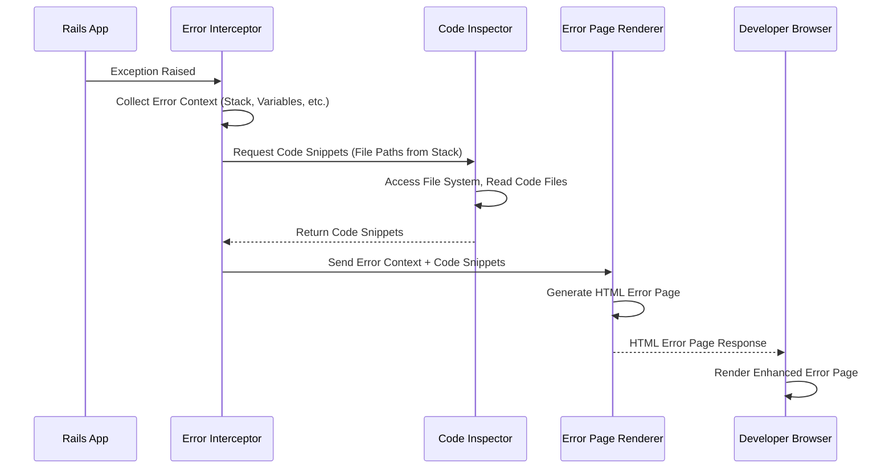

## Deep Security Analysis of Better Errors Gem

### 1. Objective, Scope, and Methodology

**Objective:**

This deep analysis aims to provide a thorough security evaluation of the `better_errors` Ruby gem within the context of Ruby on Rails application development. The primary objective is to identify and analyze potential security vulnerabilities and risks associated with the gem, focusing on information disclosure and supply chain security.  We will delve into the gem's architecture and components to understand how it handles errors and presents debugging information, and assess the security implications of these functionalities, especially concerning its intended use in development and the critical need to disable it in production environments.

**Scope:**

The scope of this analysis is limited to the `better_errors` gem as described in the provided security design review document and its interaction with Ruby on Rails applications.  Specifically, the analysis will cover:

* **Key Components of `better_errors`:** Error Interceptor, Error Page Renderer, and Code Inspector, as identified in the Container Diagram.
* **Data Flow:**  How error information is captured, processed, and displayed by `better_errors`.
* **Deployment Environments:**  Focus on local development, staging, and the critical exclusion of production environments.
* **Build and Distribution Process:**  Briefly consider the supply chain security aspects related to obtaining and using the gem from RubyGems.org.
* **Security Recommendations:**  Provide actionable and tailored mitigation strategies specifically for `better_errors` and its usage within Ruby on Rails applications.

This analysis will *not* cover general Ruby on Rails application security, operating system security, or in-depth code review of the `better_errors` gem itself. It will rely on the information provided in the security design review and publicly available documentation for `better_errors`.

**Methodology:**

This analysis will employ the following methodology:

1. **Document Review:**  Thoroughly review the provided security design review document, including business and security posture, C4 diagrams, deployment details, build process, risk assessment, and questions/assumptions.
2. **Architecture Inference:** Based on the design review and the known purpose of `better_errors`, infer the internal architecture, component interactions, and data flow within the gem.
3. **Component-Based Security Analysis:**  Analyze each key component (Error Interceptor, Error Page Renderer, Code Inspector) identified in the Container Diagram for potential security implications. This will involve considering:
    * **Functionality:** What is the component's purpose and how does it operate?
    * **Data Handling:** What data does the component process and potentially expose?
    * **Potential Threats:** What security threats are relevant to this component (e.g., information disclosure, XSS, path traversal)?
4. **Risk and Mitigation Mapping:**  Map the identified security implications to the business and security risks outlined in the design review. For each identified risk, develop specific and actionable mitigation strategies tailored to `better_errors` and its usage in Ruby on Rails development.
5. **Tailored Recommendations:**  Ensure all recommendations are specific to `better_errors` and avoid generic security advice. Focus on practical steps developers can take to use the gem securely and mitigate identified risks.

### 2. Security Implications of Key Components

Based on the Container Diagram and descriptions, the key components of `better_errors` are: Error Interceptor, Error Page Renderer, and Code Inspector. Let's analyze the security implications of each:

**a) Error Interceptor:**

* **Functionality:** This component's role is to catch exceptions and errors raised by the Ruby on Rails application. It acts as a global exception handler within the development environment when `better_errors` is enabled. It gathers context information about the error, such as stack traces, local variables, and potentially request parameters and session data.
* **Data Handling:** The Error Interceptor captures a wide range of data available at the point of exception. This can include:
    * **Stack Traces:** Revealing application code paths and internal logic.
    * **Local Variables:** Exposing variable names and their values at the point of error, which could contain sensitive data like user inputs, database query parameters, or internal state.
    * **Request Parameters and Session Data:**  Potentially capturing sensitive user-submitted data or session identifiers.
    * **Environment Variables:** In some cases, environment variables might be accessible in the error context.
* **Security Implications:**
    * **Information Disclosure:** The primary risk is the unintentional exposure of sensitive application data within the error page. If `better_errors` is active in production, this component could inadvertently log and display highly sensitive information to unauthorized users.
    * **Over-Exposure in Development/Staging:** Even in development and staging, excessive data capture by the interceptor could lead to accidental disclosure if error pages are not properly secured or if developers inadvertently share error details.
    * **Performance Overhead (Minor Security Impact):** While less of a direct security threat, inefficient error interception could contribute to performance degradation, potentially making the application more vulnerable to denial-of-service attacks, although this is unlikely to be significant in development.

**b) Error Page Renderer:**

* **Functionality:** This component takes the error information gathered by the Error Interceptor and formats it into an HTML page for display in the developer's browser. It's responsible for presenting the stack trace, variable values, code snippets, and interactive elements of the enhanced error page.
* **Data Handling:** The Error Page Renderer processes the error data received from the Interceptor and embeds it into HTML. This involves:
    * **HTML Generation:** Creating HTML structures to display error details.
    * **Data Interpolation:** Inserting variable values, stack trace lines, and code snippets into the HTML.
    * **Interactive Elements:**  Generating interactive elements like collapsible sections, variable inspection tools, and potentially links to code editors.
* **Security Implications:**
    * **Cross-Site Scripting (XSS):** If the Error Page Renderer does not properly sanitize or encode the error data before embedding it into HTML, it could be vulnerable to XSS.  If malicious data is somehow included in error messages (e.g., through user input that triggers an error), the renderer could execute arbitrary JavaScript in the developer's browser.
    * **Information Disclosure (Rendering Logic Bugs):** Bugs in the rendering logic could lead to unintended disclosure of data that was not meant to be displayed, or display data in a way that is more easily exploitable.
    * **Path Traversal (Indirect):** While less direct, if the rendering process involves file system operations based on error data (e.g., to display code snippets), vulnerabilities in path handling could theoretically be exploited, although this is less likely in this component compared to the Code Inspector.

**c) Code Inspector:**

* **Functionality:** The Code Inspector is responsible for accessing and reading application code files to display relevant code snippets in the error page, particularly from the stack trace. This helps developers understand the context of the error within their codebase.
* **Data Handling:** This component interacts directly with the file system to read application code.
    * **File System Access:** Reads files based on paths derived from the stack trace.
    * **Code Snippet Extraction:** Extracts relevant lines of code surrounding the error location.
* **Security Implications:**
    * **Path Traversal:**  A critical potential vulnerability is path traversal. If the Code Inspector does not properly validate or sanitize file paths derived from the stack trace, an attacker who can influence the stack trace (highly unlikely in typical scenarios but theoretically possible through crafted exceptions or vulnerabilities in the application itself) could potentially read arbitrary files on the server's file system. This is a significant information disclosure risk.
    * **Information Disclosure (Source Code Exposure):**  While intended, the very function of displaying code snippets is an information disclosure risk if `better_errors` is enabled in production. Source code can reveal sensitive logic, algorithms, and internal application details to attackers.
    * **File System Access Errors (Minor Security Impact):** Errors in file system access (e.g., permissions issues) could lead to unexpected behavior or denial of service, but are less of a direct security threat compared to path traversal or information disclosure.

### 3. Architecture, Components, and Data Flow Inference

Based on the design review and component analysis, we can infer the following simplified architecture and data flow:

1. **Exception Occurs in Rails Application:**  During the execution of a Ruby on Rails application, an exception or error is raised (e.g., `NameError`, `TypeError`, database error).
2. **Error Interceptor (Better Errors) Catches Exception:** If `better_errors` is enabled (typically in development/staging environments), its Error Interceptor component is triggered. It acts as a custom exception handler, overriding the default Rails error handling in development.
3. **Context Data Collection:** The Error Interceptor gathers relevant context information about the exception. This includes:
    * **Exception Class and Message:** The type of error and its description.
    * **Stack Trace:**  A list of function calls leading to the error, including file paths and line numbers.
    * **Local Variables:**  The values of variables in the scope where the error occurred.
    * **Request and Session Data (Potentially):**  Depending on the configuration and context, request parameters and session data might be captured.
4. **Code Inspector Retrieves Code Snippets:** The Error Interceptor or Error Page Renderer utilizes the Code Inspector component. Based on file paths in the stack trace, the Code Inspector accesses the file system to read the relevant source code files and extract code snippets surrounding the error line.
5. **Error Page Renderer Generates HTML:** The Error Page Renderer takes the collected error context data (including stack trace, variables, code snippets from Code Inspector) and dynamically generates an HTML page. This page is designed to be user-friendly and informative for developers, presenting the error details in an organized and interactive manner.
6. **HTML Error Page Displayed in Browser:** The generated HTML error page is sent as the response to the web request that triggered the error. The developer's web browser renders this page, displaying the enhanced error information.

**Data Flow Diagram (Simplified):**

### 4. Tailored Security Considerations and Recommendations for Better Errors

Given the analysis, here are specific security considerations and tailored recommendations for using `better_errors`:

**Security Considerations Specific to Better Errors:**

* **Production Environment Exposure is Critical:** The most significant security risk is enabling `better_errors` in production. This directly leads to information disclosure of sensitive application internals, source code, and potentially user data.
* **Path Traversal Risk in Code Inspector:** The Code Inspector component, by design, accesses the file system.  Path traversal vulnerabilities in this component could allow unauthorized file access. While less likely in typical usage, it's a potential concern.
* **XSS Risk in Error Page Renderer:** The Error Page Renderer dynamically generates HTML based on error data. Improper sanitization could lead to XSS vulnerabilities, potentially allowing malicious code execution in a developer's browser.
* **Information Overload in Development/Staging:** While intended for debugging, the sheer volume of information displayed by `better_errors` could inadvertently expose sensitive details even in development or staging environments if not handled carefully.
* **Supply Chain Risk:** As an external dependency, `better_errors` introduces a supply chain risk. A compromised gem or lack of maintenance could lead to vulnerabilities in applications using it.

**Tailored Security Recommendations for Better Errors:**

1. **Strictly Disable in Production (Enforcement is Key):**
    * **Recommendation:**  **Mandatory and non-negotiable:** Ensure `better_errors` is absolutely disabled in production environments.
    * **Actionable Mitigation:**
        * **Environment Variable Check:**  Implement robust environment detection in your Rails application (e.g., using `Rails.env.production?`) and conditionally disable `better_errors` based on this check.
        * **Configuration Management:** Use Rails configuration files (e.g., `Gemfile` groups, environment-specific configurations) to ensure `better_errors` is only included in `:development` and `:staging` groups.
        * **Automated Checks in CI/CD:**  Integrate automated checks in your CI/CD pipeline to verify that `better_errors` is not enabled in production deployments. Fail the deployment if it is detected.
        * **Code Reviews:**  Include checks for `better_errors` configuration in code reviews to prevent accidental enabling in production.

2. **Minimize Information Exposure Even in Development/Staging:**
    * **Recommendation:**  Configure `better_errors` (if possible through its configuration options, though limited) and your application to minimize the exposure of highly sensitive data even in non-production environments.
    * **Actionable Mitigation:**
        * **Filter Sensitive Parameters:**  If `better_errors` offers configuration to filter request parameters, use it to redact sensitive data like passwords, API keys, or credit card numbers from being displayed in error pages.
        * **Secure Staging Environment Access:**  Restrict access to staging environments to authorized personnel only. Implement authentication and authorization controls for staging environments.
        * **Developer Awareness Training:** Educate developers about the potential for information disclosure even in development/staging and the importance of not sharing error pages containing sensitive data publicly.

3. **Regularly Update Better Errors Gem:**
    * **Recommendation:** Keep the `better_errors` gem updated to the latest version.
    * **Actionable Mitigation:**
        * **Dependency Management:**  Use a dependency management tool (like Bundler) and regularly run `bundle update better_errors` to get the latest version.
        * **Security Monitoring:** Subscribe to security advisories or vulnerability databases related to Ruby gems to be notified of any reported vulnerabilities in `better_errors`.

4. **Security Review of Better Errors Updates (If Contributing/Maintaining):**
    * **Recommendation:** If your team contributes to or maintains `better_errors` itself, implement security best practices in the development process.
    * **Actionable Mitigation:**
        * **Code Reviews:** Conduct thorough code reviews for all changes to `better_errors`, focusing on security aspects, especially in components like Code Inspector and Error Page Renderer.
        * **Static Analysis Security Testing (SAST):**  Integrate SAST tools into the `better_errors` development pipeline to automatically detect potential vulnerabilities like path traversal, XSS, and code injection.
        * **Vulnerability Disclosure Policy:**  Establish a clear process for reporting and patching security vulnerabilities in `better_errors` if you are a maintainer.

5. **Consider Alternative Debugging Tools (For Specific Scenarios):**
    * **Recommendation:**  For very sensitive applications or environments, consider whether `better_errors` is always necessary. Explore alternative debugging techniques or tools that might offer a lower risk profile in certain situations.
    * **Actionable Mitigation:**
        * **Rails Default Error Pages:**  In some cases, the default Rails error pages might be sufficient for debugging, especially if you are primarily concerned about information disclosure.
        * **Logging and Monitoring:**  Utilize robust logging and monitoring systems to capture error information in a controlled and secure manner, rather than relying solely on enhanced error pages.
        * **Remote Debugging Tools:** Explore remote debugging tools that allow developers to debug applications running in staging or even production-like environments without exposing detailed error pages directly in the browser (though production debugging should be approached with extreme caution).

### 5. Actionable and Tailored Mitigation Strategies

The recommendations above already include actionable mitigation strategies. To summarize and further emphasize the actionable steps:

* **For Production Disablement:**
    * **Action:** Implement environment variable checks in your Rails application to disable `better_errors` in production.
    * **Action:** Configure `Gemfile` to include `better_errors` only in `:development` and `:staging` groups.
    * **Action:** Add automated checks to your CI/CD pipeline to verify `better_errors` is disabled in production deployments.
    * **Action:** Include `better_errors` configuration checks in code reviews.

* **For Minimizing Development/Staging Exposure:**
    * **Action:** Explore and utilize any parameter filtering options offered by `better_errors`.
    * **Action:** Implement strong authentication and authorization for staging environments.
    * **Action:** Conduct developer training on responsible use of debugging tools and data handling.

* **For Dependency Management:**
    * **Action:** Regularly update `better_errors` using Bundler (`bundle update better_errors`).
    * **Action:** Monitor security advisories for `better_errors` and Ruby gems in general.

* **For Development/Maintenance of Better Errors (If Applicable):**
    * **Action:** Implement mandatory code reviews with a security focus.
    * **Action:** Integrate SAST tools into the CI/CD pipeline for `better_errors`.
    * **Action:** Establish a vulnerability disclosure policy for `better_errors`.

By implementing these tailored and actionable mitigation strategies, development teams can effectively leverage the benefits of `better_errors` for enhanced debugging while significantly reducing the associated security risks, particularly the critical risk of information disclosure in production environments. The key takeaway is that **strict enforcement of production disablement is paramount**, and developers should be continuously reminded of the security implications of using development tools in different environments.