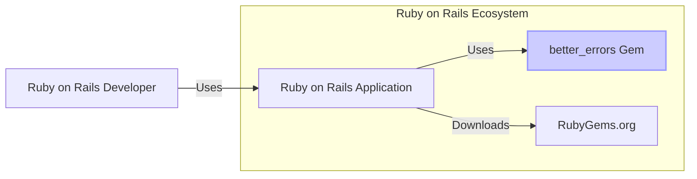
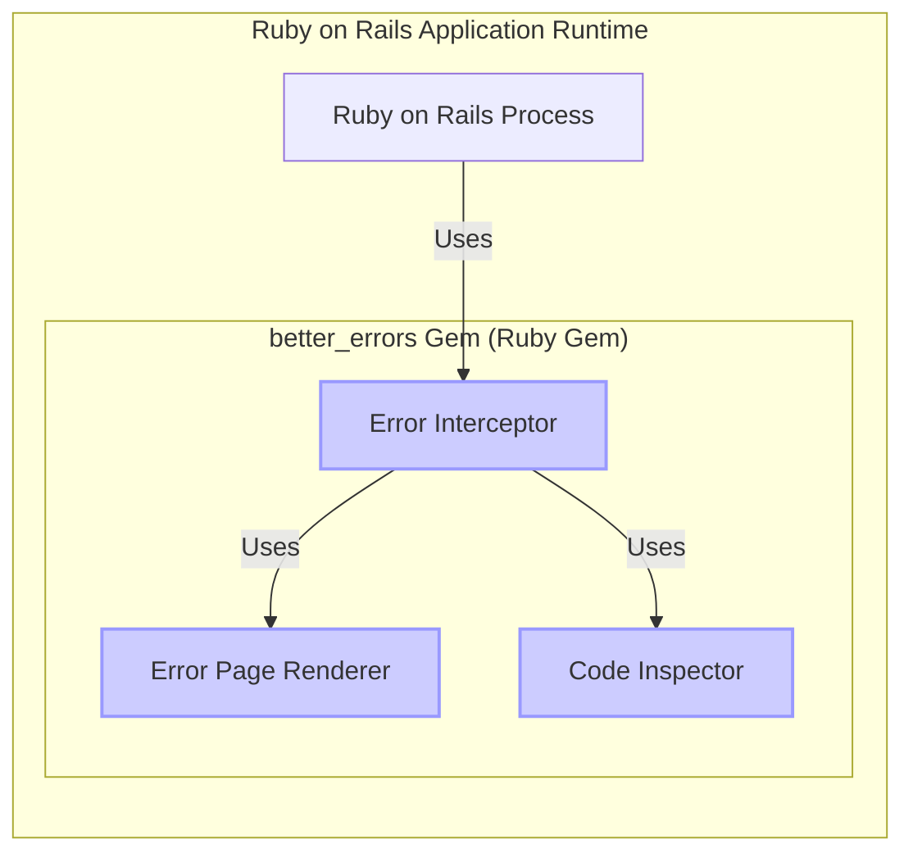
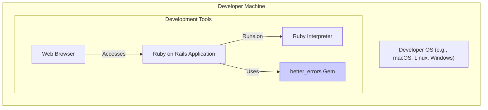
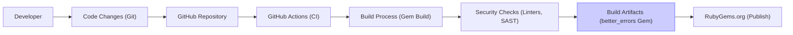

# BUSINESS POSTURE

- Business Priorities and Goals:
  - Improve developer productivity by providing enhanced error reporting and debugging capabilities for Ruby on Rails applications.
  - Reduce debugging time and effort for developers, leading to faster development cycles.
  - Enhance the developer experience by making error messages more informative and actionable.
- Business Risks:
  - Accidental exposure of sensitive application data or internal system details if the gem is enabled in production environments. This could lead to information disclosure vulnerabilities.
  - Potential performance overhead if the gem's error handling mechanisms are not optimized, although this is less of a concern in development environments where it is intended to be used.
  - Dependency on an external open-source gem, which introduces a supply chain risk if the gem itself becomes compromised or is not actively maintained.

# SECURITY POSTURE

- Existing Security Controls:
  - security control: As a development tool, better_errors gem itself does not implement specific security controls. Security is primarily the responsibility of the consuming Ruby on Rails application and its deployment environment.
  - security control: Ruby on Rails applications typically implement security controls such as authentication, authorization, input validation, and protection of sensitive data. These controls are expected to be in place in the applications that utilize better_errors.
  - security control: Development environments are generally considered less secure than production environments, with relaxed security controls to facilitate development and debugging.
- Accepted Risks:
  - accepted risk: Risk of information disclosure in development and staging environments is generally accepted to some extent to aid in debugging. However, care must be taken to prevent accidental exposure of sensitive production data in these environments.
  - accepted risk: Dependency on an external gem is an accepted risk inherent in using open-source libraries. This risk is mitigated by using reputable sources like RubyGems.org and regularly updating dependencies.
- Recommended Security Controls:
  - security control: Ensure that better_errors gem is strictly disabled in production environments. This should be enforced through environment variable checks or configuration settings within the Ruby on Rails application.
  - security control: Implement robust environment detection logic within the application to automatically disable better_errors in production, regardless of configuration settings.
  - security control: Regularly review and update the better_errors gem to the latest version to benefit from bug fixes and potential security patches.
  - security control: Educate developers on the security implications of using debugging tools in different environments and emphasize the importance of disabling better_errors in production.
- Security Requirements:
  - Authentication: Not directly applicable to better_errors gem itself. Authentication is handled by the Ruby on Rails application.
  - Authorization: Not directly applicable to better_errors gem itself. Authorization is handled by the Ruby on Rails application.
  - Input Validation: While better_errors primarily displays error information, it should handle potentially malformed or malicious input gracefully without causing crashes or further vulnerabilities. Input validation is more relevant to the Ruby on Rails application itself.
  - Cryptography: Not applicable to better_errors gem itself. Cryptography is handled by the Ruby on Rails application for securing sensitive data in transit and at rest.

# DESIGN

## C4 CONTEXT

- Context Diagram Elements:
  - - Name: Ruby on Rails Developer
    - Type: Person
    - Description: Software developers who use Ruby on Rails framework to build web applications. They utilize better_errors gem during development to debug errors.
    - Responsibilities: Develop and debug Ruby on Rails applications. Use better_errors to understand and resolve errors during development. Ensure better_errors is disabled in production environments.
    - Security controls: Follow secure coding practices. Properly configure application environments to disable development tools in production.
  - - Name: Ruby on Rails Application
    - Type: Software System
    - Description: Web application built using the Ruby on Rails framework. It integrates the better_errors gem to enhance error handling during development.
    - Responsibilities: Serve web application functionality. Handle user requests. Integrate and utilize better_errors gem in development and staging environments.
    - Security controls: Implements standard web application security controls including authentication, authorization, input validation, output encoding, and protection of sensitive data. Environment configuration to disable better_errors in production.
  - - Name: better_errors Gem
    - Type: Software System
    - Description: Ruby gem that enhances error pages in Ruby on Rails applications, providing more detailed and interactive error information for developers.
    - Responsibilities: Intercept and enhance error handling within Ruby on Rails applications. Display detailed error information including stack traces, variables, and code snippets.
    - Security controls: Should not introduce new vulnerabilities. Focus on displaying error information securely, primarily intended for development environments.
  - - Name: RubyGems.org
    - Type: Software System
    - Description: Public repository for Ruby gems. Developers download better_errors gem from RubyGems.org.
    - Responsibilities: Host and distribute Ruby gems, including better_errors. Ensure the integrity and availability of gems.
    - Security controls: Implements security controls to protect the gem repository from tampering and malware. Provides HTTPS for secure download of gems.

## C4 CONTAINER

- Container Diagram Elements:
  - - Name: Ruby on Rails Process
    - Type: Container
    - Description: The running Ruby on Rails application process. This is where the better_errors gem is loaded and executed.
    - Responsibilities: Execute the Ruby on Rails application code. Handle web requests. Integrate and run the better_errors gem.
    - Security controls: Inherits security controls from the underlying operating system and Ruby runtime environment. Application-level security controls are implemented within the Ruby on Rails application code.
  - - Name: Error Interceptor
    - Type: Component (within better_errors Gem)
    - Description: Component within the better_errors gem that intercepts exceptions and errors raised by the Ruby on Rails application.
    - Responsibilities: Catch exceptions. Gather error context information (stack trace, variables, etc.). Pass error information to other components for rendering.
    - Security controls: Should not introduce new vulnerabilities during error interception. Handle errors gracefully and securely.
  - - Name: Error Page Renderer
    - Type: Component (within better_errors Gem)
    - Description: Component within the better_errors gem responsible for generating the enhanced error page displayed to the developer.
    - Responsibilities: Format and render the error information into an HTML page. Include stack traces, variable values, and code snippets.
    - Security controls: Ensure that sensitive information is displayed only as intended for development and debugging purposes. Avoid rendering malicious content or introducing XSS vulnerabilities.
  - - Name: Code Inspector
    - Type: Component (within better_errors Gem)
    - Description: Component within the better_errors gem that inspects the application code to provide context around the error, such as displaying code snippets from the stack trace.
    - Responsibilities: Access and read application code files to display relevant code snippets in the error page.
    - Security controls: Should only access code files for display purposes and not modify them. Ensure secure file access and prevent any potential path traversal vulnerabilities.

## DEPLOYMENT

- Deployment Architecture Options:
  - Option 1: Local Development Environment (Developer's Machine) - This is the primary intended deployment environment for better_errors.
  - Option 2: Staging Environment - Can be used in staging environments for pre-production testing and debugging, but should be disabled before production deployment.
  - Option 3: Production Environment (Incorrect/Unsafe) - Should NOT be deployed in production due to security risks.

- Detailed Deployment Architecture (Local Development Environment):

- Deployment Diagram Elements (Local Development Environment):
  - - Name: Developer OS (e.g., macOS, Linux, Windows)
    - Type: Infrastructure
    - Description: The operating system running on the developer's local machine. Provides the environment for running development tools and applications.
    - Responsibilities: Provide a secure and stable environment for development. Manage user accounts and permissions.
    - Security controls: Operating system level security controls, such as firewalls, user access controls, and regular security updates.
  - - Name: Ruby Interpreter
    - Type: Container (Runtime Environment)
    - Description: The Ruby runtime environment (e.g., MRI, JRuby) used to execute the Ruby on Rails application and the better_errors gem.
    - Responsibilities: Execute Ruby code. Provide libraries and dependencies for Ruby applications.
    - Security controls: Security controls provided by the Ruby runtime environment. Keeping the Ruby interpreter updated with security patches.
  - - Name: Ruby on Rails Application
    - Type: Container (Application)
    - Description: The Ruby on Rails application being developed. It includes the better_errors gem as a dependency.
    - Responsibilities: Implement application logic. Handle web requests. Utilize better_errors for enhanced error reporting during development.
    - Security controls: Application-level security controls. Environment configuration to ensure better_errors is enabled only in development and staging.
  - - Name: better_errors Gem
    - Type: Container (Library/Dependency)
    - Description: The better_errors Ruby gem, installed as a dependency of the Ruby on Rails application.
    - Responsibilities: Enhance error handling within the Ruby on Rails application during development.
    - Security controls: Gem is obtained from a trusted source (RubyGems.org). Regular updates to the gem.
  - - Name: Web Browser
    - Type: Person (Interface)
    - Description: Web browser used by the developer to access the Ruby on Rails application and view the enhanced error pages generated by better_errors.
    - Responsibilities: Display web pages. Interact with the Ruby on Rails application.
    - Security controls: Browser security controls, such as protection against XSS and other web-based attacks.

## BUILD

- Build Process Description:
  - - Name: Developer
    - Type: Person
    - Description: Software developer who writes and modifies the code for the better_errors gem.
    - Responsibilities: Develop and maintain the gem's code. Write tests. Commit code changes to the Git repository.
    - Security controls: Uses secure development practices. Code reviews.
  - - Name: Code Changes (Git)
    - Type: Data
    - Description: Code changes committed by the developer using Git version control.
    - Responsibilities: Track code changes. Version control.
    - Security controls: Git repository access controls. Code signing (optional).
  - - Name: GitHub Repository
    - Type: Code Repository
    - Description: GitHub repository hosting the source code of the better_errors gem.
    - Responsibilities: Store and manage the source code. Provide access control. Trigger CI/CD pipelines.
    - Security controls: GitHub's security features, including access controls, vulnerability scanning, and audit logs.
  - - Name: GitHub Actions (CI)
    - Type: CI/CD System
    - Description: GitHub Actions workflow configured to automate the build, test, and release process for the better_errors gem.
    - Responsibilities: Automate build process. Run tests. Perform security checks. Publish the gem.
    - Security controls: Secure CI/CD pipeline configuration. Access control to workflows and secrets.
  - - Name: Build Process (Gem Build)
    - Type: Build Tool
    - Description: The process of building the Ruby gem artifact from the source code, typically using `gem build` command.
    - Responsibilities: Compile or package the gem. Create the `.gem` file.
    - Security controls: Ensure build process integrity. Use trusted build tools and environments.
  - - Name: Security Checks (Linters, SAST)
    - Type: Security Tooling
    - Description: Automated security checks integrated into the build process, such as linters and Static Application Security Testing (SAST) tools, to identify potential code quality and security issues.
    - Responsibilities: Analyze code for potential vulnerabilities and code quality issues. Provide feedback to developers.
    - Security controls: Regularly update security scanning tools. Configure tools to detect relevant security issues.
  - - Name: Build Artifacts (better_errors Gem)
    - Type: Software Artifact
    - Description: The resulting `.gem` file, which is the distributable package for the better_errors gem.
    - Responsibilities: Package the gem for distribution.
    - Security controls: Signing of the gem artifact (optional). Secure storage of build artifacts.
  - - Name: RubyGems.org (Publish)
    - Type: Package Registry
    - Description: RubyGems.org, the public repository where the better_errors gem is published for distribution.
    - Responsibilities: Host and distribute the gem. Make the gem available for download by Ruby developers.
    - Security controls: RubyGems.org's security controls to protect the gem repository and ensure the integrity of published gems. Gem signing and verification.

# RISK ASSESSMENT

- Critical Business Processes:
  - Software development and debugging process for Ruby on Rails applications. Ensuring developer productivity and efficiency.
- Data Sensitivity:
  - Potentially sensitive application data (e.g., database credentials, API keys, user data) could be exposed in error pages if better_errors is incorrectly enabled in production environments. The sensitivity level depends on the specific application and the data it handles. In general, exposure of any internal application details in production is considered a security risk.

# QUESTIONS & ASSUMPTIONS

- Questions:
  - Are there any specific configuration options within better_errors that could increase the risk of information disclosure if misconfigured, even in development environments?
  - What is the process for reporting and patching security vulnerabilities in better_errors gem?
  - Are there any known compatibility issues with specific versions of Ruby or Ruby on Rails that could introduce unexpected behavior or security risks?
- Assumptions:
  - It is assumed that better_errors gem is intended and designed for use primarily in development and staging environments, and should be strictly disabled in production.
  - It is assumed that developers using better_errors are aware of the potential security implications of exposing detailed error information and will take necessary precautions to prevent accidental exposure in production.
  - It is assumed that the Ruby on Rails applications using better_errors implement their own security controls for authentication, authorization, and data protection, and that better_errors is used as a supplementary tool for development and debugging without replacing or weakening these application-level security measures.