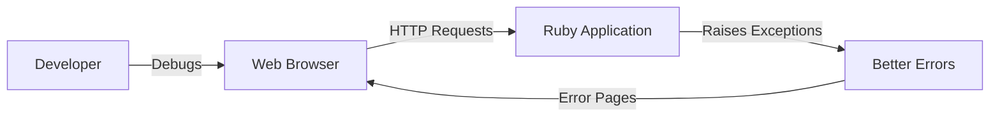
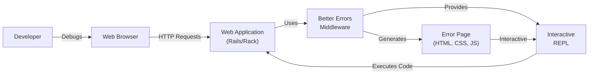
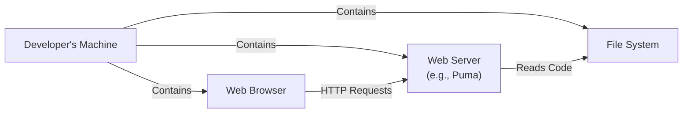
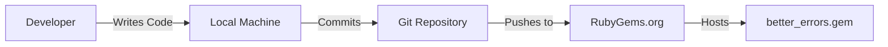

# BUSINESS POSTURE

Business Priorities and Goals:

*   Provide a user-friendly and informative error handling experience for Ruby developers during development.
*   Improve developer productivity by making it easier to diagnose and fix errors.
*   Offer a drop-in replacement for the default Rails error page with enhanced features.
*   Maintain a lightweight and performant solution that doesn't significantly impact application performance.
*   Ensure compatibility with a wide range of Ruby and Rails versions.

Business Risks:

*   Exposure of sensitive information (environment variables, source code snippets, database queries) in error pages if not properly configured.
*   Potential for cross-site scripting (XSS) vulnerabilities if user-supplied data is not properly escaped in the error pages.
*   Denial of service (DoS) if the error handling process itself is vulnerable to resource exhaustion.
*   Compatibility issues with other gems or middleware that interact with the error handling process.
*   Security vulnerabilities introduced by outdated dependencies.

# SECURITY POSTURE

Existing Security Controls:

*   security control: The gem is intended for use in the development environment only, reducing the risk of exposing sensitive information in production. (README.md)
*   security control: The gem provides a mechanism to configure which local variables are visible in the error pages, allowing developers to limit exposure of sensitive data. (README.md, "Hiding Variables")
*   security control: The gem uses `Rack::Protection` to prevent CSRF attacks. (better_errors.gemspec, `s.add_runtime_dependency "rack-protection"`)

Accepted Risks:

*   accepted risk: The gem is designed to expose internal application details, which is acceptable in a development environment but must be disabled in production.
*   accepted risk: The gem's interactive console allows execution of arbitrary Ruby code, which is a powerful feature for debugging but could be exploited if the development server is exposed to untrusted networks.

Recommended Security Controls:

*   security control: Implement robust input validation and output encoding to prevent XSS vulnerabilities, especially when displaying user-supplied data or error messages.
*   security control: Regularly update dependencies to address known security vulnerabilities.
*   security control: Provide clear documentation and warnings about the security implications of using the gem, particularly regarding the interactive console and exposure of sensitive information.
*   security control: Consider implementing a mechanism to restrict access to the error pages based on IP address or other criteria, even in development.
*   security control: Implement Content Security Policy (CSP) to mitigate XSS and other code injection attacks.

Security Requirements:

*   Authentication: Not applicable, as the gem is intended for use in a local development environment.
*   Authorization: Not applicable, as the gem is intended for use in a local development environment.
*   Input Validation:
    *   Validate and sanitize any user-supplied data that is displayed in the error pages to prevent XSS vulnerabilities.
    *   Ensure that file paths and other potentially sensitive data are handled securely.
*   Cryptography: Not directly applicable, but ensure that any sensitive data displayed in error pages (e.g., session tokens, API keys) is not stored or transmitted in plain text.
*   Output Encoding:
    *   Encode all user supplied data before displaying it in HTML to prevent XSS.

# DESIGN

## C4 CONTEXT

Element Descriptions:

*   Element:
    *   Name: Developer
    *   Type: Person
    *   Description: A software developer using Better Errors to debug their application.
    *   Responsibilities: Writes code, triggers errors, interacts with the Better Errors interface.
    *   Security controls: None (external to the system).
*   Element:
    *   Name: Better Errors
    *   Type: Software System
    *   Description: The Better Errors gem, providing enhanced error pages.
    *   Responsibilities: Intercepts unhandled exceptions, generates interactive error pages, provides debugging tools.
    *   Security controls: Rack::Protection for CSRF, configurable variable visibility.
*   Element:
    *   Name: Ruby Application
    *   Type: Software System
    *   Description: The Ruby application being debugged.
    *   Responsibilities: Executes application logic, may raise exceptions.
    *   Security controls: Application-specific security controls.
*   Element:
    *   Name: Web Browser
    *   Type: Software System
    *   Description: A web browser used to interact with the application and view error pages.
    *   Responsibilities: Sends HTTP requests, renders HTML responses.
    *   Security controls: Browser-based security controls (e.g., same-origin policy).

## C4 CONTAINER

Element Descriptions:

*   Element:
    *   Name: Developer
    *   Type: Person
    *   Description: A software developer using Better Errors.
    *   Responsibilities: Writes code, triggers errors, interacts with the Better Errors interface.
    *   Security controls: None (external to the system).
*   Element:
    *   Name: Web Browser
    *   Type: Software System
    *   Description: A web browser.
    *   Responsibilities: Sends HTTP requests, renders HTML.
    *   Security controls: Browser security mechanisms.
*   Element:
    *   Name: Web Application (Rails/Rack)
    *   Type: Web Application
    *   Description: The Ruby application being debugged, running on a Rack-compatible server (e.g., Puma, Unicorn).
    *   Responsibilities: Handles HTTP requests, executes application logic.
    *   Security controls: Application-level security controls.
*   Element:
    *   Name: Better Errors Middleware
    *   Type: Rack Middleware
    *   Description: The core component of Better Errors, intercepting exceptions and generating error pages.
    *   Responsibilities: Catches exceptions, gathers context information, renders the error page, manages the interactive REPL.
    *   Security controls: Configurable variable visibility, Rack::Protection.
*   Element:
    *   Name: Error Page (HTML, CSS, JS)
    *   Type: Web Page
    *   Description: The interactive error page displayed in the browser.
    *   Responsibilities: Presents error information, provides links to the REPL and other tools.
    *   Security controls: Output encoding to prevent XSS.
*   Element:
    *   Name: Interactive REPL
    *   Type: REPL (Read-Eval-Print Loop)
    *   Description: An interactive Ruby console embedded in the error page.
    *   Responsibilities: Allows the developer to execute arbitrary Ruby code in the context of the exception.
    *   Security controls: Should only be accessible in development, potentially restrict access by IP.

## DEPLOYMENT

Possible Deployment Solutions:

1.  Local Development Server (e.g., `rails server`): The simplest and most common deployment scenario for development.
2.  Remote Development Server (accessed via SSH tunnel): Used for debugging on a remote server, but requires careful security considerations.
3.  Docker Container: Provides a consistent and isolated development environment.

Chosen Deployment Solution (Local Development Server):

Element Descriptions:

*   Element:
    *   Name: Developer's Machine
    *   Type: Physical Machine
    *   Description: The developer's local computer.
    *   Responsibilities: Hosts the development environment.
    *   Security controls: Operating system security, firewall.
*   Element:
    *   Name: Web Server (e.g., Puma)
    *   Type: Web Server
    *   Description: The web server that runs the Ruby application (e.g., Puma, Thin, Unicorn).
    *   Responsibilities: Listens for HTTP requests, executes the application code.
    *   Security controls: Web server configuration, limited user privileges.
*   Element:
    *   Name: File System
    *   Type: File System
    *   Description: The local file system where the application code resides.
    *   Responsibilities: Stores the application code, configuration files, and other assets.
    *   Security controls: File system permissions.
*   Element:
    *   Name: Web Browser
    *   Type: Web Browser
    *   Description: Web browser running on developer machine.
    *   Responsibilities: Sends HTTP requests, renders HTML.
    *   Security controls: Browser security mechanisms.

## BUILD

Better Errors is distributed as a Ruby gem. The build process typically involves the following steps:

1.  **Development:** Developers write code and tests locally.
2.  **Testing:** Automated tests (e.g., RSpec) are run to ensure code quality.
3.  **Packaging:** The `gem build` command is used to create a `.gem` file containing the code, metadata, and dependencies.
4.  **Publishing:** The `gem push` command is used to publish the gem to RubyGems.org, making it available for others to install.

Security Controls in Build Process:

*   security control: Code Review: Before merging changes, code should be reviewed by other developers to identify potential security vulnerabilities.
*   security control: Automated Testing: Unit and integration tests help ensure that the code functions as expected and doesn't introduce regressions.
*   security control: Dependency Management: Regularly update dependencies to address known security vulnerabilities. Tools like Bundler and Dependabot can help with this.
*   security control: Secure Credentials: API keys or other credentials used to publish the gem should be stored securely and not committed to the repository.
*   security control: Static Analysis: Consider using static analysis tools (e.g., RuboCop, Brakeman) to identify potential security issues in the code.

# RISK ASSESSMENT

Critical Business Processes:

*   The primary business process is software development. Better Errors aims to improve the efficiency and effectiveness of this process by providing better debugging tools.

Data Protection:

*   Data Sensitivity:
    *   **Source Code:** Potentially sensitive, especially if it contains proprietary algorithms or business logic.
    *   **Environment Variables:** Can contain sensitive information like API keys, database credentials, and secret keys.
    *   **Local Variables:** May contain sensitive data depending on the application's context.
    *   **Database Queries:** Can reveal database schema and potentially sensitive data.
    *   **Stack Traces:** Can expose internal application details and potentially sensitive information.
*   Data to Protect:
    *   The primary goal is to *not* expose sensitive data in production. In development, the focus is on providing developers with the information they need to debug effectively, while still offering mechanisms to limit exposure of sensitive data (e.g., configurable variable visibility).

# QUESTIONS & ASSUMPTIONS

Questions:

*   Are there any specific compliance requirements (e.g., PCI DSS, HIPAA) that the application being debugged must adhere to? This could influence the recommendations for handling sensitive data in error pages.
*   What is the expected level of technical expertise of the developers using Better Errors? This can help tailor the documentation and security recommendations.
*   Are there any existing security tools or practices in place within the development team (e.g., code review guidelines, security training)?

Assumptions:

*   BUSINESS POSTURE: The primary use case is local development, and the gem will not be used in production environments.
*   SECURITY POSTURE: Developers are aware of the basic security risks associated with exposing internal application details.
*   DESIGN: The application being debugged is a Ruby on Rails or Rack-based application. The development environment is relatively standard (e.g., using a local web server, common gems).