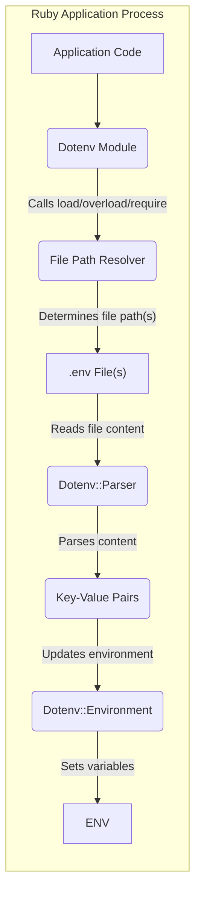
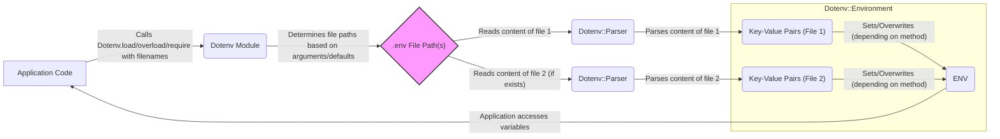

# Project Design Document: dotenv

**Version:** 1.1
**Date:** October 26, 2023
**Author:** Gemini (AI Language Model)

## 1. Introduction

This document provides a detailed design overview of the `dotenv` project, a Ruby gem designed to load environment variables from one or more `.env` files into the `ENV` hash of a Ruby process. This document aims to provide a comprehensive understanding of the project's architecture, components, and data flow, which will be crucial for subsequent threat modeling activities. Understanding how `dotenv` interacts with the file system and the application's environment is key to identifying potential security vulnerabilities.

The target audience for this document includes security engineers, developers, operations personnel, and anyone involved in the security assessment of applications utilizing the `dotenv` gem.

## 2. Goals and Non-Goals

### 2.1. Goals

*   Provide a simple and straightforward mechanism to manage environment variables, primarily for development and testing environments, by loading them from files.
*   Load key-value pairs from one or more `.env` files (following a precedence order) into the system's environment variables (`ENV`).
*   Support customizable `.env` file locations and naming conventions through configuration options.
*   Offer basic error handling for scenarios like file not found or parsing errors, without halting the application by default.
*   Maintain a lightweight footprint with minimal external dependencies to reduce the attack surface.
*   Provide different loading strategies (e.g., `load`, `overload`, `require`) to control how existing environment variables are handled.

### 2.2. Non-Goals

*   Provide advanced configuration management features such as variable interpolation, conditional loading based on environment, or complex merging strategies.
*   Offer secure storage, encryption, or access control mechanisms for environment variables. It relies on the underlying file system's security.
*   Handle complex deployment scenarios involving distributed systems or container orchestration without external tooling.
*   Act as a comprehensive secrets management solution suitable for production environments with strict security requirements.
*   Provide validation, sanitization, or type checking of environment variable values. The loaded values are treated as plain strings.

## 3. System Architecture

The `dotenv` gem operates as a library that is included and invoked within a Ruby application's process. It does not run as a standalone service or daemon. Its core function is to locate, read, and process the contents of one or more `.env` files and update the Ruby process's environment variables (`ENV`). The order in which files are loaded and processed is important for understanding potential overwriting behavior.

### 3.1. Components

*   **`Dotenv` Module:** The primary entry point and orchestrator of the gem's functionality. It provides methods like `load`, `overload`, and `require` to initiate the loading process.
*   **`Dotenv.load(*filenames, &block)`:**  A method within the `Dotenv` module responsible for loading variables from the specified files (or default `.env`). It does not overwrite existing environment variables.
*   **`Dotenv.overload(*filenames, &block)`:** A method that loads variables and overwrites existing environment variables if they conflict with those in the `.env` file.
*   **`Dotenv.require(*filenames)`:** Similar to `load`, but raises an error if the `.env` file is not found.
*   **`Dotenv::Parser`:** Responsible for parsing the content of the `.env` file(s) into key-value pairs. It handles comments, empty lines, and the basic `KEY=VALUE` format, including quoted values.
*   **`Dotenv::Environment`:**  Manages the interaction with the Ruby process's environment (`ENV`). It takes the parsed key-value pairs and sets them in the `ENV` hash. It also handles the logic for overwriting or preserving existing variables based on the loading method used.
*   **`.env` File(s):** Plain text files containing environment variables in the format `KEY=VALUE`. Multiple `.env` files can be loaded, with precedence typically given to files loaded later. Common conventions include `.env`, `.env.local`, `.env.<environment>`.
*   **`ENV` (Ruby's Environment Hash):** The global hash in Ruby that stores environment variables. `dotenv`'s primary purpose is to populate this hash.
*   **Application Code:** The Ruby application that includes and utilizes the `dotenv` gem by calling its methods.

### 3.2. High-Level Architecture Diagram

## 4. Data Flow

The primary data flow within the `dotenv` gem involves locating, reading, and parsing one or more `.env` files and subsequently updating the `ENV` hash. The specific steps can vary slightly depending on the `dotenv` method invoked.

1. **Initialization:** The application code includes the `dotenv` gem using `require 'dotenv/load'` or similar.
2. **Loading Invocation:** The application calls a `Dotenv` method (e.g., `Dotenv.load`, `Dotenv.overload`, `Dotenv.require`), potentially specifying filenames.
3. **File Location Determination:**
    *   `Dotenv` determines the path(s) to the `.env` file(s) to be loaded. This can involve checking for specific filenames in predefined locations (e.g., project root) or using provided filenames.
    *   The order of file loading can be significant, as variables in later loaded files can overwrite those in earlier ones (depending on the method used).
4. **File Reading:** `Dotenv` attempts to read the content of each identified `.env` file sequentially. Error handling might involve skipping a file if it's not found (for `load`) or raising an exception (for `require`).
5. **Parsing:** The `Dotenv::Parser` component processes the content of each file line by line:
    *   Lines starting with `#` are treated as comments and ignored.
    *   Empty lines are ignored.
    *   Key-value pairs are expected in the format `KEY=VALUE`.
    *   Values can be optionally enclosed in single or double quotes. The parser handles unquoting.
    *   Whitespace around keys and values might be trimmed.
6. **Environment Update:** The `Dotenv::Environment` component receives the parsed key-value pairs from each file.
    *   **`Dotenv.load`:**  For each key-value pair, it sets the environment variable in the `ENV` hash *only if it doesn't already exist*. Existing environment variables are preserved.
    *   **`Dotenv.overload`:** For each key-value pair, it sets the environment variable in the `ENV` hash, *overwriting any existing variable with the same key*.
    *   **`Dotenv.require`:** Behaves like `load` but raises an `Errno::ENOENT` exception if any of the specified files are not found.
7. **Application Access:** The application code can subsequently access the loaded environment variables through the standard `ENV` hash in Ruby.

### 4.1. Detailed Data Flow Diagram

## 5. Security Considerations (Detailed for Threat Modeling)

This section expands on the initial security considerations, providing more specific examples and potential attack scenarios.

*   **`.env` File Exposure:**
    *   **Threat:** Accidental inclusion of `.env` files containing sensitive credentials (API keys, database passwords, etc.) in version control systems (like Git) or public repositories.
    *   **Impact:** Public disclosure of sensitive information, leading to unauthorized access to resources or data breaches.
    *   **Mitigation:**  Strictly exclude `.env` files from version control using `.gitignore`. Employ secrets management solutions for sensitive credentials in production.
*   **File Access Permissions on `.env`:**
    *   **Threat:** Incorrect file permissions (e.g., world-readable) on the `.env` file allowing unauthorized users or processes on the same system to read its contents.
    *   **Impact:** Leakage of sensitive environment variables to local attackers.
    *   **Mitigation:** Ensure restrictive file permissions (e.g., `chmod 600 .env`) so only the application's user can read the file.
*   **Malicious `.env` Content:**
    *   **Threat:** A compromised `.env` file (e.g., through a supply chain attack or insider threat) injecting malicious values into environment variables.
    *   **Impact:**
        *   **Application Misconfiguration:**  Setting incorrect database connection strings, API endpoints, or other critical settings, leading to application malfunction or connecting to malicious services.
        *   **Command Injection:** If environment variables are used in shell commands without proper sanitization, malicious values could lead to command injection vulnerabilities.
        *   **Path Manipulation:**  Manipulating paths used by the application, potentially leading to unauthorized file access or execution.
    *   **Mitigation:** Implement integrity checks for `.env` files if possible. Minimize the application's reliance on unsanitized environment variables in security-sensitive contexts.
*   **Overwriting Existing Environment Variables (with `overload`):**
    *   **Threat:** If an attacker can control the contents of a `.env` file that is loaded with `overload`, they can overwrite existing, potentially more secure, environment variables.
    *   **Impact:**  Downgrading security settings, disabling security features, or redirecting the application to malicious resources.
    *   **Mitigation:**  Carefully control access to `.env` files and understand the implications of using `overload`. Consider the order in which `.env` files are loaded.
*   **Information Disclosure through Environment Variables:**
    *   **Threat:** Sensitive information stored in environment variables being inadvertently logged, exposed in error messages, or leaked through other channels (e.g., monitoring systems).
    *   **Impact:**  Exposure of credentials or other sensitive data.
    *   **Mitigation:**  Avoid logging environment variables directly. Implement secure logging practices. Be mindful of error reporting and ensure sensitive data is not included.
*   **Dependency Vulnerabilities:**
    *   **Threat:** Although `dotenv` has minimal dependencies, vulnerabilities in those dependencies could potentially be exploited.
    *   **Impact:**  Indirect security risks depending on the nature of the vulnerability.
    *   **Mitigation:** Regularly update dependencies and monitor for security advisories.
*   **Path Traversal (Less Likely but Possible):**
    *   **Threat:** If the logic for determining the `.env` file path is flawed or allows for user-controlled input (uncommon in typical usage), path traversal vulnerabilities could allow loading arbitrary files.
    *   **Impact:**  Reading sensitive files from the file system.
    *   **Mitigation:** Ensure the file path resolution logic is secure and does not rely on untrusted input.

## 6. Deployment Considerations

The `dotenv` gem is primarily intended for development and testing environments. Its use in production requires careful consideration of security implications.

*   **Development Environment:**  Ideal for managing environment-specific configurations without modifying code. `.env` files are typically used to store local database credentials, API keys for development services, etc.
*   **Testing Environment:**  Facilitates setting up consistent environment variables for automated tests. Different `.env` files can be used for various test scenarios.
*   **Production Environment (Generally Discouraged for Sensitive Credentials):**
    *   **Risk:** Storing sensitive credentials directly in `.env` files in production significantly increases the risk of exposure.
    *   **Alternatives:** For production, consider using more robust secrets management solutions like HashiCorp Vault, AWS Secrets Manager, Azure Key Vault, or environment variables configured directly within the deployment environment (e.g., container orchestration platforms).
    *   **Limited Use Cases:**  `dotenv` might be acceptable in production for non-sensitive configuration values that are environment-specific.
*   **Containerized Environments (Docker, Kubernetes):**
    *   `.env` files can be used during the Docker image build process or mounted as volumes. However, embedding secrets directly in the image is generally discouraged.
    *   Kubernetes offers more secure ways to manage secrets (Secrets objects) that are preferable to relying solely on `.env` files in production deployments.

## 7. Future Considerations (Potential Areas for Change and Security Impact)

These are potential future enhancements that could impact the design and security of the project.

*   **Support for Encrypted `.env` Files:**
    *   **Enhancement:** Adding optional support for encrypting `.env` files, requiring a decryption key to load variables.
    *   **Security Impact:** Could improve the security of storing sensitive information in `.env` files, but the key management would become a critical security concern.
*   **Integration with Secrets Management Tools:**
    *   **Enhancement:** Providing mechanisms to load secrets from external secrets management systems (e.g., via API calls).
    *   **Security Impact:** Could significantly enhance security by leveraging established secrets management practices.
*   **More Granular Control over Overwriting Behavior:**
    *   **Enhancement:** Introducing options to control which specific environment variables can be overwritten.
    *   **Security Impact:** Could mitigate some risks associated with the `overload` functionality.
*   **Validation and Sanitization of Loaded Variables (Careful Consideration Required):**
    *   **Enhancement:**  Potentially adding optional mechanisms to validate or sanitize loaded environment variables.
    *   **Security Impact:** Could reduce the risk of using malicious values, but might introduce complexity and potential for bypasses if not implemented carefully. This goes against the core simplicity of `dotenv`.
*   **Improved Error Handling and Logging with Security Context:**
    *   **Enhancement:** Providing more detailed error messages and logging, potentially with options to redact sensitive information.
    *   **Security Impact:**  Could aid in debugging and security auditing, but care must be taken to avoid logging sensitive data inadvertently.

This document provides a comprehensive design overview of the `dotenv` project, focusing on aspects relevant to threat modeling. The information presented here serves as a foundation for identifying potential security vulnerabilities and developing appropriate mitigation strategies.