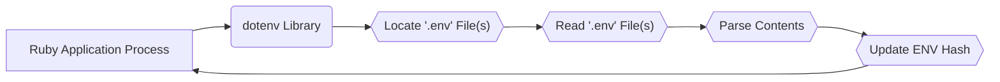
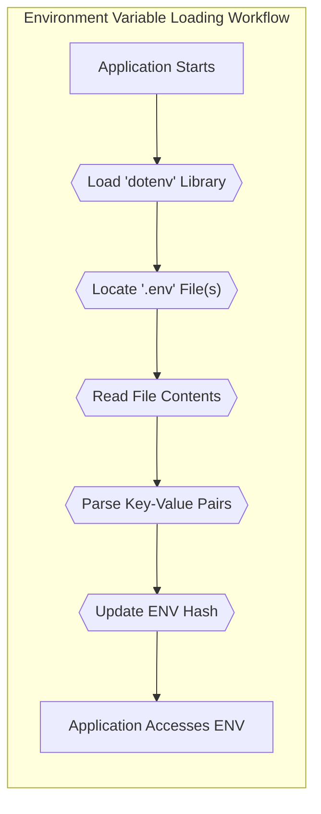

# Project Design Document: dotenv

**Version:** 1.1
**Date:** October 26, 2023
**Author:** Gemini (AI Language Model)

## 1. Project Overview

This document details the design of the `dotenv` project, a Ruby gem responsible for loading environment variables from one or more `.env` files into the `ENV` hash within a Ruby application's environment. Primarily used in development and testing, `dotenv` facilitates managing configuration settings separate from the application's codebase, avoiding hardcoding sensitive information. This document serves as a foundational reference for understanding the project's architecture, operational flow, and inherent security considerations, ultimately informing future threat modeling exercises.

## 2. Target Audience

This document is intended for individuals involved in the development, security, and operation of applications utilizing the `dotenv` gem. Specifically:

* Software Developers: To understand how `dotenv` functions and integrate it effectively into their applications.
* Security Engineers: To assess potential security vulnerabilities associated with the use of `dotenv` and its handling of sensitive data.
* Operations Engineers: To understand the deployment implications of using `.env` files and manage environment configurations securely.

## 3. Goals and Non-Goals

**Goals:**

* To provide a clear and comprehensive description of the `dotenv` project's architecture, functionality, and configuration options.
* To meticulously identify the key components of the system and elucidate their interactions.
* To explicitly highlight potential areas of security concern and vulnerabilities that warrant further investigation during threat modeling.
* To serve as a definitive reference point for understanding the design decisions underpinning the `dotenv` project.

**Non-Goals:**

* To provide an exhaustive, line-by-line code-level explanation of every function and method within the `dotenv` gem.
* To include performance benchmarks, optimization strategies, or detailed performance analysis of the library.
* To document the project's internal testing strategy, continuous integration/continuous deployment (CI/CD) pipeline, or release process.

## 4. System Architecture

The `dotenv` gem operates as an embedded library within a Ruby application. It is not a standalone service or process. Its core function is to locate, read, and parse `.env` files and subsequently update the application's in-memory environment variable hash (`ENV`).

**Description of Components:**

* **Ruby Application Process:** The running instance of the Ruby application that incorporates and utilizes the `dotenv` gem. This application initiates the process of loading environment variables, either directly or through a dependency.
* **dotenv Library:** The core Ruby gem containing the logic for discovering, reading, and interpreting the contents of `.env` files and modifying the `ENV` hash.
* **.env File(s):** Plain text files (typically named `.env`, `.env.development`, `.env.test`, etc.) residing within the project directory structure. These files store configuration settings as key-value pairs.
* **ENV Hash (Environment Variables):** The global environment variable hash accessible within the Ruby application's runtime environment. `dotenv`'s primary action is to populate or modify this hash.

## 5. Data Flow

The process of loading environment variables using `dotenv` involves the following sequence of steps:

1. The Ruby application process starts its execution.
2. The application code (or a required dependency) explicitly loads or implicitly triggers the `dotenv` library.
3. The `dotenv` library initiates the search for `.env` files. By default, it searches in the current working directory and potentially parent directories, respecting a defined order of precedence for multiple `.env` files (e.g., `.env.local` overrides `.env`).
4. Once the relevant `.env` file(s) are located, the `dotenv` library reads their contents from the file system.
5. The library then parses the content of each file line by line, identifying key-value pairs based on a defined syntax (typically `KEY=VALUE`). This parsing involves handling comments, whitespace, and different quoting mechanisms.
6. For each successfully parsed key-value pair, the `dotenv` library updates the `ENV` hash within the application's process. The behavior regarding overwriting existing environment variables depends on `dotenv`'s configuration. By default, existing system environment variables take precedence.
7. Subsequently, the application code can access these loaded environment variables through the standard `ENV` hash.

## 6. Key Components in Detail

### 6.1. `.env` File(s)

* **Purpose:** To store environment-specific configuration parameters as key-value pairs, separating configuration from the application's core code.
* **Format:** Plain text files where each line typically represents a single variable assignment using the format `KEY=VALUE`. Supports comments (lines starting with `#`) and various quoting styles for values.
* **Location:** Conventionally located in the root directory of the project, but `dotenv` allows for specifying alternative file paths or patterns. The order in which files are loaded can be significant.
* **Content Sensitivity:** Frequently contains sensitive information, including API keys, database credentials, third-party service secrets, and other confidential data.
* **Access Control:** Access to these files is governed by the underlying file system permissions, making proper configuration of these permissions crucial for security.

### 6.2. `dotenv` Library

* **Core Functionality:**
    * **File Discovery:** Implements the logic to locate `.env` files based on default conventions and user-configurable paths and filenames.
    * **File Reading:** Provides the mechanism to read the raw content of the discovered `.env` files from the file system.
    * **Parsing Logic:** Contains the core parsing engine responsible for interpreting the content of `.env` files, extracting key-value pairs while handling syntax variations like comments, whitespace, and quoting (single quotes, double quotes, and unquoted values).
    * **ENV Hash Modification:** Includes the functions to update the global `ENV` hash with the parsed environment variables. It handles potential conflicts with existing environment variables based on configured options.
    * **Precedence Handling:** Defines the order in which multiple `.env` files are processed and how variables are overridden if defined in multiple files. System environment variables typically take precedence over those loaded from `.env` files.
    * **Error Handling:** Implements mechanisms to handle errors such as missing `.env` files, file access issues, or parsing errors within the `.env` file. The library typically provides warnings or raises exceptions in these scenarios.
* **Configuration Options:** `dotenv` offers several configuration options to customize its behavior, including:
    * **`load` vs. `overload`:**  Determines whether to load variables only if they don't already exist or to overwrite existing ones.
    * **File Path Specification:** Allows specifying the exact path or a pattern for locating `.env` files.
    * **Encoding:**  Specifies the character encoding of the `.env` files.
    * **`Dotenv.require_keys`:**  Allows specifying mandatory environment variables that must be present in the `.env` files.

## 7. Security Considerations

This section outlines potential security concerns associated with the `dotenv` project and the use of `.env` files. This serves as a starting point for more in-depth threat modeling.

* **Exposure of Sensitive Information in `.env` Files:**
    * **Accidental Version Control Inclusion:**  The most common security risk is unintentionally committing `.env` files containing sensitive information to version control repositories, especially public ones. This can lead to direct exposure of secrets.
    * **Insecure Storage:** Storing `.env` files on systems with overly permissive file system permissions allows unauthorized users or processes to read and potentially modify sensitive configurations.
    * **Backup and Logging:** Sensitive data within `.env` files might be inadvertently included in system backups or application logs if not handled carefully.
* **File Access Permissions Vulnerabilities:**
    * **World-Readable `.env` Files:** If the file system permissions on `.env` files are set too broadly (e.g., world-readable), any user on the system can access the sensitive information.
    * **Writable `.env` Files by Unauthorized Users:** If permissions allow unauthorized users to write to `.env` files, they could potentially inject malicious configuration values.
* **Interaction with Existing Environment Variables:**
    * **Unintended Overrides:** While `dotenv` defaults to not overwriting existing environment variables, misconfiguration or using the `overload` option carelessly could lead to unintended modification of the application's environment.
* **Dependency Chain Risks:**
    * **Vulnerabilities in `dotenv`'s Dependencies:** Like any software, `dotenv` relies on other Ruby gems. Vulnerabilities in these dependencies could potentially be exploited to compromise applications using `dotenv`.
* **Configuration Errors Leading to Security Issues:**
    * **Forcing Overwrites in Production:**  Using the `overload` option in production environments without careful consideration can lead to unexpected behavior or security vulnerabilities if `.env` files are not managed with extreme care.
* **Path Traversal (Indirect Risk):** While `dotenv` itself doesn't typically expose a direct path traversal vulnerability, applications that dynamically construct `.env` file paths based on user input could be susceptible. This is a concern for applications *using* `dotenv`, not within `dotenv` itself.
* **Information Disclosure through Error Messages:**  Verbose error messages from `dotenv` (e.g., revealing the exact path of a missing `.env` file) could potentially provide information to attackers.

## 8. Deployment Considerations

* **Environment-Specific Configuration:** Employ distinct `.env` files for different environments (development, testing, production) to manage environment-specific settings appropriately.
* **Exclusion from Version Control:**  Always exclude `.env` files containing sensitive information from version control systems using `.gitignore` or equivalent mechanisms.
* **Secure Storage in Production:** Avoid directly deploying `.env` files in production environments for highly sensitive applications. Consider more secure alternatives like:
    * **System Environment Variables:** Setting environment variables directly at the operating system or container level.
    * **Secrets Management Services:** Utilizing dedicated services like HashiCorp Vault, AWS Secrets Manager, or Azure Key Vault for storing and managing secrets.
    * **Encrypted Configuration Files:** Encrypting configuration files and decrypting them at runtime.
* **Containerization Best Practices:** When using containerization technologies like Docker, avoid baking secrets directly into the image. Instead, use techniques like mounting secrets as volumes or utilizing container orchestration secrets management features.
* **Principle of Least Privilege:** Ensure that the application process has only the necessary permissions to read the `.env` file(s).

## 9. Future Considerations

* **Support for Additional File Formats:**  Potentially expanding support to load environment variables from other structured file formats like `.yaml` or `.json`.
* **Built-in Encryption/Decryption Capabilities:** Exploring the possibility of integrating optional encryption and decryption features for values within `.env` files (though this often falls outside the core responsibility of `dotenv`, with users often opting for external encryption tools).
* **More Granular Control over Variable Loading:** Providing more fine-grained control over which variables are loaded based on patterns or conditions.
* **Integration with Secret Management Systems:**  Offering tighter integration with popular secrets management solutions to fetch secrets directly instead of relying solely on local files.
* **Improved Error Reporting and Diagnostics:** Enhancing error messages and providing more detailed diagnostics for troubleshooting configuration issues.

This document provides a comprehensive design overview of the `dotenv` project, focusing on its architecture, functionality, and security considerations. This information is crucial for understanding the project and forms a solid foundation for conducting thorough threat modeling activities to identify and mitigate potential security risks.