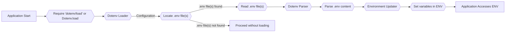

# Project Design Document: dotenv

**Version:** 1.1
**Date:** October 26, 2023
**Author:** AI Software Architect

## 1. Introduction

This document provides an enhanced and more detailed design overview of the `dotenv` project, a Ruby gem designed to load environment variables from a `.env` file into `ENV`. This document is specifically tailored to serve as a robust foundation for subsequent threat modeling activities by providing a clear articulation of the project's architecture, components, and data flow. This document is intended for security professionals and developers involved in assessing the security posture of applications utilizing `dotenv`.

## 2. Goals

*   Provide a comprehensive and detailed architectural overview of the `dotenv` gem, suitable for security analysis.
*   Clearly identify key components and their interactions, including potential trust boundaries.
*   Precisely describe the data flow within the gem, highlighting potential points of interest for security vulnerabilities.
*   Elaborate on potential areas of security concern, providing more specific examples for future threat modeling exercises.

## 3. Overview

The `dotenv` gem offers a straightforward mechanism for managing application configuration, primarily in development and local environments, by loading environment variables from one or more `.env` files. These files, typically located in the project root and not committed to version control, contain key-value pairs representing environment variables. Upon application startup, `dotenv` reads and parses these files, loading the variables into the system's environment variables (`ENV`). This practice promotes the separation of configuration from code, simplifying the management of environment-specific settings.

## 4. System Architecture

The `dotenv` gem's architecture is designed around the core tasks of file access, parsing, and environment manipulation. Understanding the responsibilities of each component is crucial for identifying potential attack vectors.

### 4.1. Components

*   **`.env` File(s):** Plain text files containing environment variables in a `KEY=VALUE` format, with support for comments (lines starting with `#`). Multiple `.env` files can be loaded in a specific order.
*   **`Dotenv` Gem:** The central library responsible for the core functionality.
    *   **Loader:** Responsible for locating and reading one or more `.env` files based on configuration or default locations. This component handles file system interactions.
    *   **Parser:** Responsible for interpreting the content of the `.env` file(s). This involves splitting lines into key-value pairs, handling comments, and potentially dealing with quoted values or escaping.
    *   **Environment Updater:** Responsible for merging the parsed key-value pairs into the system's `ENV`. This component interacts directly with the operating system's environment variable store.
    *   **Railtie (for Rails applications):**  An optional component that automatically integrates `dotenv` into Rails applications, triggering the loading process during application initialization.
*   **Application:** The Ruby application that depends on the `dotenv` gem to load its configuration. This is the consumer of the environment variables.
*   **System Environment (`ENV`):** The global environment variable store accessible by the application and other processes. This is the final destination of the loaded variables.

### 4.2. Interactions

The following diagram illustrates the interaction between the components, highlighting the sequence of operations:

### 4.3. Data Flow

1. The application starts, and the `dotenv` gem is either automatically loaded (e.g., via Railtie) or explicitly required and invoked.
2. The `Dotenv` Loader, based on configuration or default settings, attempts to locate the `.env` file(s) in specified directories (typically the project root and potentially parent directories).
3. If the `.env` file(s) are found, the Loader reads their content from the file system. This involves file system access operations.
4. The raw content of the file(s) is passed to the `Dotenv` Parser.
5. The Parser processes the content line by line. It identifies key-value pairs by splitting lines at the first `=` character. It also handles comments (lines starting with `#`) and may support different quoting mechanisms for values.
6. The extracted key-value pairs are then passed to the Environment Updater.
7. The Environment Updater iterates through the parsed key-value pairs and sets them in the system's `ENV`. By default, `dotenv` typically does not overwrite existing environment variables that are already set before `dotenv` is loaded.
8. The application subsequently accesses these environment variables through the standard `ENV` hash.

## 5. Security Considerations

Understanding the potential security implications of each component and the data flow is crucial for effective threat modeling.

*   **Exposure of Sensitive Information via `.env` Files:**
    *   **Accidental Version Control:** The primary risk is the unintentional inclusion of `.env` files containing sensitive credentials (API keys, database passwords, etc.) in version control systems.
    *   **Insecure Storage:** If `.env` files are not properly secured on the file system, unauthorized users or processes could gain access to sensitive information.
    *   **Backup and Logging:**  Sensitive data in `.env` files might inadvertently end up in backups or logs if not handled carefully.
*   **File Access Vulnerabilities:**
    *   **Insufficient Permissions:** If the application process runs with overly broad file system permissions, malicious actors could potentially read `.env` files they shouldn't have access to.
    *   **Path Traversal:** While less likely in the core `dotenv` functionality, vulnerabilities in how the Loader resolves file paths could potentially lead to reading arbitrary files.
*   **Parsing Vulnerabilities:**
    *   **Injection Attacks:** If the Parser doesn't properly handle special characters or escape sequences in `.env` values, it could potentially lead to environment variable injection attacks if these variables are later used in shell commands or other sensitive contexts. For example, a maliciously crafted value could inject additional commands.
    *   **Denial of Service:**  Malformed `.env` files could potentially cause parsing errors leading to application crashes or resource exhaustion.
*   **Environment Variable Manipulation:**
    *   **Overwriting Existing Variables:** While `dotenv` typically avoids overwriting existing environment variables, misconfigurations or specific usage patterns could lead to unintended modification of the environment.
    *   **Scope of Environment Variables:** Environment variables set by `dotenv` are generally available to the application and its child processes, potentially expanding the attack surface.
*   **Dependency Chain Risks:**
    *   **Vulnerabilities in `dotenv`:**  Security vulnerabilities within the `dotenv` gem itself could be exploited. Keeping the gem updated is crucial.
    *   **Supply Chain Attacks:**  Compromise of the `dotenv` gem's distribution or dependencies could introduce malicious code.
*   **Configuration and Usage Issues:**
    *   **Loading `.env` in Production:**  While convenient, loading `.env` files directly in production environments can be risky if not managed carefully. More robust secret management solutions are generally recommended for production.
    *   **Order of Loading:** If multiple `.env` files are loaded, the order matters, and misconfigurations could lead to unexpected variable values.

## 6. Assumptions and Constraints

*   The `.env` file(s) are expected to adhere to a simple `KEY=VALUE` format.
*   The `dotenv` gem is primarily used within a Ruby environment.
*   The application process has the necessary file system permissions to read the intended `.env` file(s).
*   `dotenv` focuses on loading environment variables from local files and does not inherently provide advanced features for secure storage, encryption, or remote retrieval of secrets.
*   Users are expected to follow best practices regarding the storage and handling of sensitive information in `.env` files.

## 7. Future Considerations

*   **Integration with Secure Secret Management Solutions:** Explore tighter integration with secure secret management systems (e.g., HashiCorp Vault, AWS Secrets Manager, Azure Key Vault) to provide more secure alternatives for managing sensitive configuration in production environments.
*   **Enhanced Parsing Capabilities:** Consider adding options for more sophisticated parsing rules, handling different file formats (e.g., YAML), or supporting more complex value types.
*   **Improved Error Handling and Logging:** Implement more robust error handling for file access issues, parsing errors, and other potential problems, along with more informative logging for debugging and auditing.
*   **Security Audits and Best Practices Documentation:** Regularly conduct security audits of the `dotenv` gem and provide clear documentation on security best practices for its usage, including recommendations for production environments.
*   **Support for Encrypted `.env` Files:** Investigate the possibility of supporting encrypted `.env` files to provide an additional layer of security for sensitive configuration data.

This enhanced design document provides a more detailed and security-focused overview of the `dotenv` project. The information presented here is intended to be a valuable resource for conducting thorough threat modeling and identifying potential security vulnerabilities associated with its use in applications.