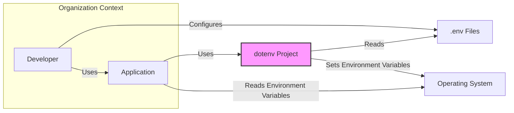
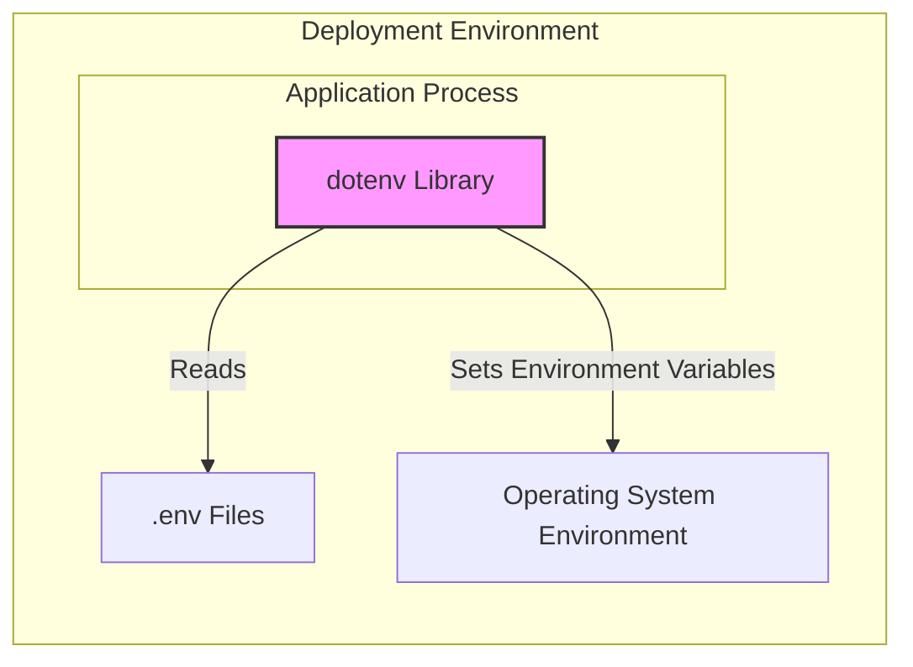
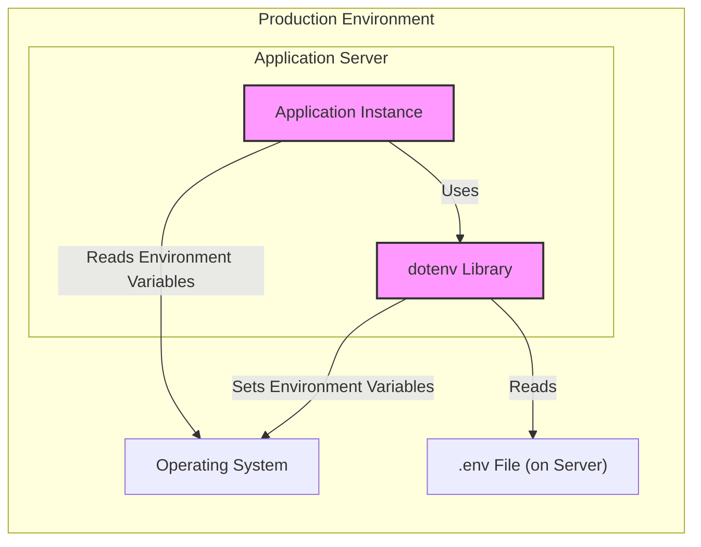
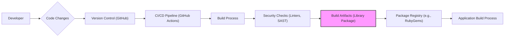

# BUSINESS POSTURE

This project, `dotenv`, aims to simplify the management of environment variables for software applications. It allows developers to load environment variables from a `.env` file into the application's environment at runtime. This is particularly useful for separating configuration from code, especially sensitive information like API keys and database credentials, across different environments (development, staging, production).

Business priorities for using `dotenv` include:
- Simplifying application configuration management across different environments.
- Enhancing developer productivity by providing a consistent way to manage environment variables.
- Reducing the risk of accidentally committing sensitive configuration data into version control.

Key business risks associated with using `dotenv` include:
- Accidental exposure of sensitive information if `.env` files are not properly managed and secured.
- Misconfiguration of applications if `.env` files are not correctly set up or if there are inconsistencies between environments.
- Potential for application downtime or malfunction if environment variables are not loaded correctly or are missing.

# SECURITY POSTURE

Existing security controls:
- security control: Access control to the GitHub repository is managed by GitHub. (Implemented by: GitHub repository settings)
- security control: Version control of the code base using Git. (Implemented by: Git)
- accepted risk: The project itself does not enforce secure storage or handling of secrets within `.env` files. This is the responsibility of the user.
- accepted risk: The project relies on the security of the underlying operating system and file system for access control to `.env` files.

Recommended security controls:
- security control: Implement secret scanning in CI/CD pipelines to detect accidental commits of `.env` files containing secrets.
- security control: Provide clear documentation and best practices for securely managing `.env` files, emphasizing the importance of not committing them to public repositories and using secure file permissions.
- security control: Consider adding warnings or checks within the library to alert users if `.env` files are world-readable or located in insecure locations.

Security requirements:
- Authentication: Not directly applicable to `dotenv` itself, as it is a configuration loading library. Authentication is handled by the applications that use `dotenv`.
- Authorization: Not directly applicable to `dotenv` itself. Authorization is handled by the applications that use `dotenv` based on the loaded environment variables.
- Input validation: `dotenv` should perform basic validation of the `.env` file format to prevent parsing errors and potential vulnerabilities due to malformed input. This includes checking for valid variable names and values.
- Cryptography: Cryptography is not a core requirement for `dotenv` itself. However, applications using `dotenv` might store encrypted secrets in environment variables, and `dotenv` should not interfere with this. If secrets are stored encrypted, the application is responsible for decryption after loading the variables.

# DESIGN

## C4 CONTEXT

- Elements of Context Diagram:
  - - Name: Developer
    - Type: Person
    - Description: Software developers who use `dotenv` to manage application configuration.
    - Responsibilities: Create and manage `.env` files, configure applications using environment variables.
    - Security controls: Access control to development machines, secure coding practices.
  - - Name: Application
    - Type: Software System
    - Description: Applications that use the `dotenv` library to load configuration from environment variables.
    - Responsibilities: Utilize environment variables for configuration, process application logic.
    - Security controls: Application-level security controls (authentication, authorization, input validation, etc.).
  - - Name: dotenv Project
    - Type: Software System
    - Description: The `dotenv` library itself, responsible for loading environment variables from `.env` files.
    - Responsibilities: Read `.env` files, parse environment variables, set environment variables in the operating system environment.
    - Security controls: Input validation on `.env` file format, secure coding practices in the library itself.
  - - Name: Operating System
    - Type: Software System
    - Description: The operating system environment where the application and `dotenv` run. Provides the environment variable storage.
    - Responsibilities: Manage environment variables, provide access to file system.
    - Security controls: Operating system level security controls (user permissions, file system permissions, etc.).
  - - Name: .env Files
    - Type: Data Store
    - Description: Files storing environment variables in a key-value format.
    - Responsibilities: Persist environment variable configurations.
    - Security controls: File system permissions to control access to `.env` files.

## C4 CONTAINER

- Elements of Container Diagram:
  - - Name: dotenv Library
    - Type: Library
    - Description: The `dotenv` library code, which is integrated into the application.
    - Responsibilities: Read and parse `.env` files, set environment variables in the process environment.
    - Security controls: Secure coding practices, input validation.
  - - Name: Operating System Environment
    - Type: Environment
    - Description: The environment variables space provided by the operating system process where the application runs.
    - Responsibilities: Store and provide access to environment variables.
    - Security controls: Operating system level security controls.
  - - Name: .env Files
    - Type: File
    - Description: Files on the file system containing environment variable configurations.
    - Responsibilities: Store environment variable configurations persistently.
    - Security controls: File system permissions.

## DEPLOYMENT

`dotenv` is a library and does not have a separate deployment architecture in the traditional sense. It is deployed as part of the application that uses it. The deployment architecture is determined by the application itself.

Assuming a typical application deployment scenario (e.g., a web application):

- Elements of Deployment Diagram:
  - - Name: Application Instance
    - Type: Software Process
    - Description: An instance of the application running in the production environment.
    - Responsibilities: Execute application logic, utilize environment variables for configuration.
    - Security controls: Application-level security controls, access control to the server.
  - - Name: dotenv Library
    - Type: Software Library (Deployed within Application Instance)
    - Description: The `dotenv` library code running within the application process.
    - Responsibilities: Load environment variables from `.env` file and set them in the application process environment.
    - Security controls: Secure coding practices.
  - - Name: Operating System
    - Type: Operating System (Server OS)
    - Description: The operating system running on the application server.
    - Responsibilities: Provide runtime environment, manage environment variables, file system access.
    - Security controls: Server hardening, OS-level security controls, access management.
  - - Name: .env File (on Server)
    - Type: File (Configuration File)
    - Description: The `.env` file deployed on the application server, containing production environment variables.
    - Responsibilities: Store production environment configurations.
    - Security controls: File system permissions, secure deployment practices to prevent unauthorized access.

## BUILD

- Elements of Build Diagram:
  - - Name: Developer
    - Type: Person
    - Description: Software developer making changes to the `dotenv` codebase.
    - Responsibilities: Write code, commit changes, initiate build process.
    - Security controls: Developer workstation security, secure coding practices, code review.
  - - Name: Code Changes
    - Type: Data
    - Description: Modifications to the `dotenv` source code.
    - Responsibilities: Represent code updates.
    - Security controls: Version control history, code review.
  - - Name: Version Control (GitHub)
    - Type: Software System (Service)
    - Description: GitHub repository hosting the `dotenv` source code.
    - Responsibilities: Store and manage code versions, track changes, facilitate collaboration.
    - Security controls: Access control, branch protection, audit logs.
  - - Name: CI/CD Pipeline (GitHub Actions)
    - Type: Software System (Service)
    - Description: Automated build and deployment pipeline using GitHub Actions.
    - Responsibilities: Automate build, test, and potentially release processes.
    - Security controls: Secure pipeline configuration, access control to secrets and credentials, audit logs.
  - - Name: Build Process
    - Type: Software Process
    - Description: Steps involved in compiling, packaging, and preparing the `dotenv` library for distribution.
    - Responsibilities: Compile code, run tests, package library.
    - Security controls: Controlled build environment, dependency management, build reproducibility.
  - - Name: Security Checks (Linters, SAST)
    - Type: Software Process
    - Description: Automated security checks integrated into the build process, including linters and Static Application Security Testing (SAST) tools.
    - Responsibilities: Identify potential code quality issues and security vulnerabilities.
    - Security controls: Regularly updated security tools, configured security rules.
  - - Name: Build Artifacts (Library Package)
    - Type: Data (Software Package)
    - Description: The packaged `dotenv` library ready for distribution (e.g., a gem file for Ruby).
    - Responsibilities: Distributable software package.
    - Security controls: Integrity checks (checksums, signatures), secure storage.
  - - Name: Package Registry (e.g., RubyGems)
    - Type: Software System (Service)
    - Description: Public or private package registry where the `dotenv` library is published.
    - Responsibilities: Host and distribute software packages.
    - Security controls: Access control, package integrity verification, vulnerability scanning.
  - - Name: Application Build Process
    - Type: Software Process
    - Description: The build process of applications that depend on the `dotenv` library, which will download and include `dotenv` as a dependency.
    - Responsibilities: Integrate `dotenv` library into applications.
    - Security controls: Dependency management, vulnerability scanning of dependencies.

# RISK ASSESSMENT

Critical business process we are trying to protect:
- Secure and reliable application configuration management across different environments.
- Preventing accidental exposure of sensitive configuration data, especially secrets.

Data we are trying to protect and their sensitivity:
- Environment variables stored in `.env` files.
- Sensitivity: Can range from low (non-sensitive configuration settings) to high (API keys, database credentials, encryption keys). The sensitivity level is highly dependent on the specific application and the environment variables being managed.  Secrets within environment variables are considered highly sensitive and require strong protection.

# QUESTIONS & ASSUMPTIONS

Questions:
- What is the target programming language for the `dotenv` library in question? (While the example is Ruby, `dotenv` exists in many languages).
- What are the primary use cases for this `dotenv` library? Is it primarily for web applications, command-line tools, or other types of software?
- What is the intended deployment environment for applications using `dotenv`? (e.g., cloud platforms, on-premises servers, containers).
- Are there any specific compliance requirements that applications using `dotenv` need to adhere to (e.g., PCI DSS, HIPAA, GDPR)?

Assumptions:
- BUSINESS POSTURE: The primary business goal is to simplify configuration management and improve developer experience while minimizing the risk of exposing sensitive information.
- SECURITY POSTURE: Security is a secondary consideration compared to ease of use, but still important. Users are expected to take responsibility for securing their `.env` files and managing secrets appropriately. The library itself should provide basic security best practices guidance and avoid introducing vulnerabilities.
- DESIGN: The `dotenv` library is designed as a lightweight, dependency-free library that can be easily integrated into various types of applications. It focuses on reading `.env` files and setting environment variables, without providing advanced features like secret management or encryption.