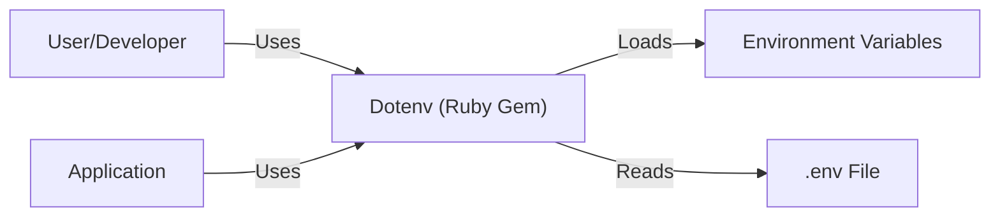
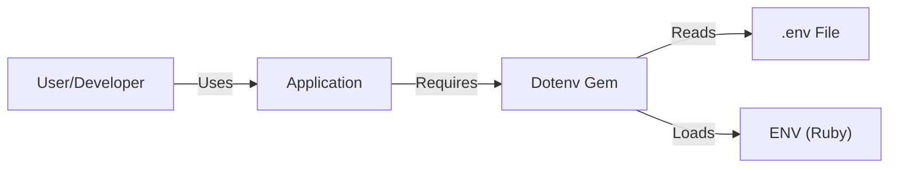
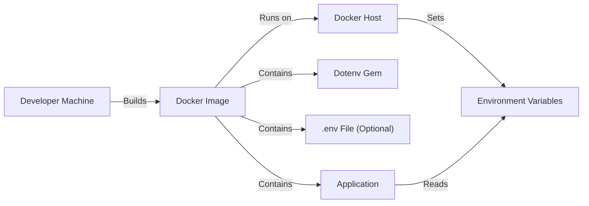
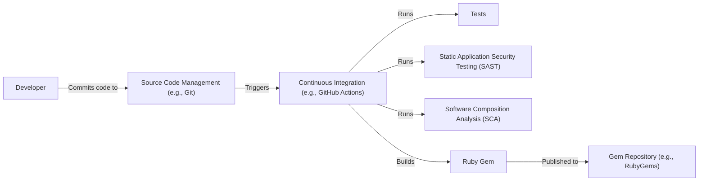

# BUSINESS POSTURE

Dotenv is a popular and widely used project. It's likely that many companies, from startups to large enterprises, depend on it. Given its function of loading environment variables, it's a critical component in many applications' configuration and deployment processes.

Priorities and Goals:

*   Reliability: Ensure that the library consistently and correctly loads environment variables across different platforms and environments.
*   Simplicity: Maintain a straightforward and easy-to-use API.
*   Security: Protect sensitive information that may be stored in environment variables by ensuring the library doesn't inadvertently expose or mishandle them.
*   Compatibility: Support a wide range of Ruby versions and operating systems.
*   Maintainability: Keep the codebase clean, well-documented, and easy to maintain.

Business Risks:

*   Exposure of Sensitive Information: If dotenv fails to load environment variables correctly or has vulnerabilities, it could lead to the exposure of API keys, database credentials, and other sensitive data.
*   Application Failure: If dotenv fails to load, applications dependent on it may fail to start or operate correctly.
*   Configuration Errors: Incorrect usage or misconfiguration of dotenv could lead to applications running with incorrect settings, potentially causing unexpected behavior or security vulnerabilities.
*   Supply Chain Attacks: Given its widespread use, dotenv could be a target for supply chain attacks, where malicious code is injected into the library.

# SECURITY POSTURE

Existing Security Controls:

*   security control: Secure Coding Practices: The project's maintainers likely follow secure coding practices to prevent common vulnerabilities. (Described in contribution guidelines and code review process).
*   security control: Testing: The project has a test suite to ensure functionality and prevent regressions. (Described in the README and test files).
*   security control: Community Scrutiny: Being an open-source project, it benefits from community scrutiny, where users can report bugs and potential security issues. (GitHub Issues and Pull Requests).
*   security control: Dependency Management: The project manages its dependencies to avoid using vulnerable libraries. (Gemfile and Gemfile.lock).

Accepted Risks:

*   accepted risk: User Misconfiguration: Users may incorrectly configure dotenv or store sensitive information insecurely, which is outside the library's control.
*   accepted risk: Environment Variable Exposure: The library deals with environment variables, which, if exposed through other means (e.g., server misconfiguration, process dumps), could lead to sensitive data leakage. This is inherent to the nature of environment variables.
*   accepted risk: Limited Scope: Dotenv's primary function is to load environment variables. It doesn't provide encryption or advanced security features, which is acceptable given its scope.

Recommended Security Controls:

*   security control: Security Audits: Conduct regular security audits to identify potential vulnerabilities.
*   security control: Supply Chain Security: Implement measures to ensure the integrity of the supply chain, such as signing releases and using tools to detect compromised dependencies.
*   security control: Documentation: Enhance documentation with security best practices, such as advising against committing .env files to version control and recommending secure storage of sensitive data.

Security Requirements:

*   Authentication: Not directly applicable, as dotenv doesn't handle authentication.
*   Authorization: Not directly applicable, as dotenv doesn't handle authorization.
*   Input Validation:
    *   Requirement: Validate the format of the .env file to ensure it conforms to expected syntax.
    *   Requirement: Handle unexpected or malformed input gracefully without crashing or exposing sensitive information.
*   Cryptography:
    *   Requirement: Dotenv itself does not require cryptographic functions, as its purpose is to load, not encrypt, environment variables. However, it should clearly document that sensitive values should be encrypted at rest and in transit where appropriate, using other tools.

# DESIGN

## C4 CONTEXT

Element Descriptions:

*   Element:
    *   Name: User/Developer
    *   Type: Person
    *   Description: The developer who uses the dotenv gem in their application.
    *   Responsibilities: Configures the .env file, integrates dotenv into the application, and runs the application.
    *   Security controls: Follows secure coding practices, securely manages .env files.
*   Element:
    *   Name: Dotenv (Ruby Gem)
    *   Type: Software System
    *   Description: The dotenv library, a Ruby gem.
    *   Responsibilities: Reads the .env file, loads environment variables into the application's environment.
    *   Security controls: Input validation, secure coding practices, dependency management.
*   Element:
    *   Name: Environment Variables
    *   Type: System
    *   Description: The environment variables of the operating system.
    *   Responsibilities: Store configuration settings for the application.
    *   Security controls: OS-level permissions, secure storage.
*   Element:
    *   Name: .env File
    *   Type: File
    *   Description: A text file containing key-value pairs representing environment variables.
    *   Responsibilities: Stores configuration settings in a plain text format.
    *   Security controls: Should not be committed to version control, file system permissions.
*   Element:
    *   Name: Application
    *   Type: Software System
    *   Description: Ruby application that is using Dotenv.
    *   Responsibilities: Uses environment variables loaded by dotenv.
    *   Security controls: Secure coding practices, input validation, proper handling of sensitive data.

## C4 CONTAINER

Element Descriptions:

*   Element:
    *   Name: User/Developer
    *   Type: Person
    *   Description: The developer who uses the dotenv gem in their application.
    *   Responsibilities: Configures the .env file, integrates dotenv into the application, and runs the application.
    *   Security controls: Follows secure coding practices, securely manages .env files.
*   Element:
    *   Name: Application
    *   Type: Software System
    *   Description: Ruby application that is using Dotenv.
    *   Responsibilities: Uses environment variables loaded by dotenv.
    *   Security controls: Secure coding practices, input validation, proper handling of sensitive data.
*   Element:
    *   Name: Dotenv Gem
    *   Type: Library
    *   Description: The dotenv library, packaged as a Ruby gem.
    *   Responsibilities: Parses the .env file, loads environment variables into Ruby's ENV hash.
    *   Security controls: Input validation, secure coding practices, dependency management.
*   Element:
    *   Name: .env File
    *   Type: File
    *   Description: A text file containing key-value pairs representing environment variables.
    *   Responsibilities: Stores configuration settings in plain text format.
    *   Security controls: Should not be committed to version control, file system permissions.
*   Element:
    *   Name: ENV (Ruby)
    *   Type: Environment
    *   Description: Ruby's ENV hash, which provides access to environment variables.
    *   Responsibilities: Stores environment variables accessible to the Ruby application.
    *   Security controls: OS-level permissions, secure storage.

## DEPLOYMENT

Possible Deployment Solutions:

1.  Local Development: Developers use dotenv during local development to manage environment variables.
2.  Cloud Platforms (Heroku, AWS, GCP, Azure, etc.): Dotenv can be used to manage environment variables in cloud environments, although these platforms often have their own mechanisms for setting environment variables.
3.  Containerized Environments (Docker): Dotenv can be used within Docker containers, although Docker also provides mechanisms for setting environment variables.
4.  Traditional Server Deployments: Dotenv can be used on traditional servers (VPS, dedicated servers).

Chosen Deployment Solution: Containerized Environment (Docker)

Element Descriptions:

*   Element:
    *   Name: Developer Machine
    *   Type: Infrastructure
    *   Description: The developer's local machine where the application code is written and the Docker image is built.
    *   Responsibilities: Building the Docker image.
    *   Security controls: Secure coding environment, access controls.
*   Element:
    *   Name: Docker Image
    *   Type: Container Image
    *   Description: The packaged application, including its dependencies and potentially a .env file (although it's generally recommended to use Docker's environment variable mechanisms instead).
    *   Responsibilities: Providing a consistent runtime environment for the application.
    *   Security controls: Image signing, vulnerability scanning.
*   Element:
    *   Name: Application
    *   Type: Software System
    *   Description: Ruby application that is using Dotenv.
    *   Responsibilities: Uses environment variables loaded by dotenv.
    *   Security controls: Secure coding practices, input validation, proper handling of sensitive data.
*   Element:
    *   Name: Dotenv Gem
    *   Type: Library
    *   Description: The dotenv library, packaged as a Ruby gem.
    *   Responsibilities: Parses the .env file, loads environment variables into Ruby's ENV hash.
    *   Security controls: Input validation, secure coding practices, dependency management.
*   Element:
    *   Name: .env File (Optional)
    *   Type: File
    *   Description: A text file containing key-value pairs.
    *   Responsibilities: Stores configuration settings.
    *   Security controls: Should not be committed to version control, file system permissions.
*   Element:
    *   Name: Docker Host
    *   Type: Infrastructure
    *   Description: The server or machine where the Docker container runs.
    *   Responsibilities: Running the Docker container.
    *   Security controls: Host security, access controls, network security.
*   Element:
    *   Name: Environment Variables
    *   Type: System
    *   Description: Environment variables set by Docker.
    *   Responsibilities: Storing configuration.
    *   Security controls: Secure storage, access controls.

## BUILD

Build Process Description:

1.  Developer commits code to the Source Code Management system (e.g., Git, GitHub).
2.  The commit triggers the Continuous Integration (CI) system (e.g., GitHub Actions, Jenkins, CircleCI).
3.  The CI system runs automated tests to ensure code quality and functionality.
4.  The CI system runs Static Application Security Testing (SAST) tools to identify potential security vulnerabilities in the code.
5.  The CI system runs Software Composition Analysis (SCA) tools to identify vulnerabilities in dependencies.
6.  If all tests and security checks pass, the CI system builds the Ruby gem.
7.  The built gem is published to a gem repository (e.g., RubyGems).

Security Controls:

*   security control: Source Code Management (SCM): Use a secure SCM system with access controls and audit trails.
*   security control: Continuous Integration (CI): Automate the build and testing process to ensure consistency and repeatability.
*   security control: Tests: Run comprehensive tests to catch bugs and regressions.
*   security control: Static Application Security Testing (SAST): Use SAST tools to identify potential security vulnerabilities in the code.
*   security control: Software Composition Analysis (SCA): Use SCA tools to identify vulnerabilities in dependencies.
*   security control: Gem Repository: Use a reputable gem repository with security measures in place.
*   security control: Signing: Sign releases to ensure their integrity.

# RISK ASSESSMENT

Critical Business Processes:

*   Application Configuration: Dotenv is crucial for configuring applications, especially in development and testing environments.
*   Environment Variable Management: Dotenv simplifies the management of environment variables, which is a critical aspect of application deployment.

Data Sensitivity:

*   Environment Variables: Environment variables often contain sensitive data such as API keys, database credentials, and other secrets. The sensitivity of this data is HIGH.
*   .env Files: .env files contain the same sensitive data as environment variables, but in plain text. The sensitivity of this data is HIGH. It's crucial to emphasize that .env files should never be committed to version control.

# QUESTIONS & ASSUMPTIONS

Questions:

*   Are there any specific compliance requirements (e.g., GDPR, HIPAA, PCI DSS) that the applications using dotenv need to adhere to? This would influence recommendations for handling sensitive data.
*   What is the expected frequency of updates and releases for dotenv? This impacts the recommendations for security audits and vulnerability management.
*   What are the specific target environments where dotenv will be used? This helps tailor the deployment recommendations.

Assumptions:

*   BUSINESS POSTURE: The maintainers of dotenv prioritize security and are willing to invest in security improvements.
*   BUSINESS POSTURE: Users of dotenv are aware of the basic security risks associated with environment variables and .env files.
*   SECURITY POSTURE: The existing test suite provides adequate coverage of the core functionality.
*   SECURITY POSTURE: The project uses a dependency management system (e.g., Bundler) to manage its dependencies.
*   DESIGN: The primary use case for dotenv is in development and testing environments, but it may also be used in production environments.
*   DESIGN: The project is primarily used with Ruby applications.
*   DESIGN: Docker is a common deployment environment for applications using dotenv.