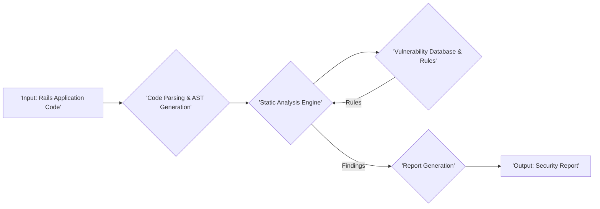
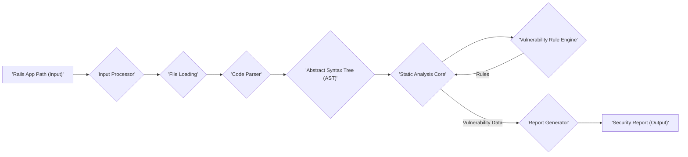

# Project Design Document: Brakeman - Static Analysis Security Scanner

**Version:** 1.1
**Date:** October 26, 2023
**Author:** AI Software Architect

## 1. Introduction

This document provides a detailed design overview of Brakeman, a static analysis security scanner for Ruby on Rails applications. This document is specifically intended to serve as a foundation for threat modeling activities. It provides a comprehensive understanding of the system's architecture, components, and data flow to facilitate the identification of potential security vulnerabilities and attack vectors.

## 2. Goals and Objectives

The primary goal of Brakeman is to automatically detect potential security vulnerabilities in Ruby on Rails applications *before* they are deployed, without requiring code execution. Key objectives include:

*   **Comprehensive Vulnerability Detection:** Identify a wide range of common web application vulnerabilities, including but not limited to SQL injection, cross-site scripting (XSS), cross-site request forgery (CSRF), insecure redirects, and mass assignment issues.
*   **Actionable Remediation Guidance:** Provide developers with clear, concise, and actionable information about identified vulnerabilities, including the location in the code and suggested remediation steps.
*   **Seamless Integration:** Facilitate easy integration into various development workflows, such as local development environments, continuous integration pipelines (e.g., GitHub Actions, GitLab CI), and pre-commit hooks.
*   **Low False Positive Rate:** Minimize the occurrence of false positives to reduce developer fatigue and ensure that reported vulnerabilities are genuine security concerns.
*   **Extensibility and Maintainability:** Design the system to be easily extensible with new security checks and rules, and maintainable through clear code structure and documentation.
*   **Secure Operation:** Ensure the security of Brakeman itself, preventing it from becoming a vulnerability point in the development process.

## 3. Target Audience

This document is intended for the following audiences, with a particular focus on those involved in security analysis:

*   **Security Engineers and Architects:** Responsible for threat modeling, security assessments, and defining security requirements.
*   **Software Developers:** Who contribute to the development of Brakeman or use it to analyze their applications.
*   **DevOps and Platform Engineers:** Involved in deploying, configuring, and maintaining Brakeman within development pipelines.

## 4. Scope

This document covers the core architectural design and functionality of the Brakeman static analysis engine, specifically focusing on aspects relevant to security. It includes:

*   The major components of the Brakeman system and their interactions.
*   The flow of data through the system, highlighting potential transformation and access points.
*   Key configuration options that impact security analysis.
*   The different output formats and how vulnerability information is presented.
*   The typical deployment models and their security implications.

This document does not cover:

*   The specific implementation details of individual vulnerability detection rules or signatures (as these are subject to change).
*   The low-level implementation details of the Ruby code within Brakeman.
*   A detailed history of project development or specific release notes.
*   The user interface or command-line options in exhaustive detail (focus is on the underlying architecture).

## 5. High-Level Architecture

Brakeman operates as a command-line tool that analyzes the source code of a Ruby on Rails application. The following diagram illustrates the high-level architecture, emphasizing the data flow and key processing stages:

**Description of Components:**

*   **'Input: Rails Application Code'**: This represents the source code of the Ruby on Rails application being analyzed. This includes Ruby files (controllers, models, views, etc.), configuration files (e.g., `routes.rb`, database configuration), and potentially view templates (ERB, Haml, etc.). This is the primary data source for Brakeman.
*   **'Code Parsing & AST Generation'**: This component is responsible for taking the raw Ruby code and transforming it into a structured representation known as an Abstract Syntax Tree (AST). The AST represents the code's structure in a hierarchical format, making it easier for programmatic analysis. This typically involves using a Ruby parser library.
*   **'Static Analysis Engine'**: This is the core of Brakeman's functionality. It traverses the generated AST, applying a predefined set of security rules and checks to identify potential vulnerabilities. This engine orchestrates the analysis process and interacts with the vulnerability database.
*   **'Vulnerability Database & Rules'**: This component stores the collection of security rules, patterns, and signatures that Brakeman uses to detect vulnerabilities. These rules are typically based on known vulnerability types, common coding errors, and security best practices for Ruby on Rails applications. The rules are the knowledge base of Brakeman.
*   **'Report Generation'**: This component takes the findings (potential vulnerabilities) identified by the Static Analysis Engine and formats them into a human-readable and machine-parsable report. It organizes the findings and adds contextual information.
*   **'Output: Security Report'**: This is the final output of Brakeman, detailing the identified potential vulnerabilities, their severity, location in the code (file and line number), a description of the issue, and often, suggested remediation advice. The format can vary (text, JSON, HTML, etc.).

## 6. Component Details

This section provides a more detailed description of the key components within Brakeman, focusing on their functionality and potential security implications:

*   **'Input Processor'**:
    *   **Functionality:** Receives the path to the target Rails application as input. Identifies and loads all relevant files for analysis based on file extensions and directory structures. Handles configuration options related to input (e.g., specifying specific files to include or exclude).
    *   **Security Relevance:**  Vulnerable to path traversal if not carefully implemented. Incorrect handling of symbolic links could lead to analyzing unintended files.
*   **'Code Parser (e.g., using Ripper or Parser gem)'**:
    *   **Functionality:** Parses Ruby code into an Abstract Syntax Tree (AST). This involves lexical analysis and syntactic analysis. The AST represents the code's structure in a tree-like format.
    *   **Security Relevance:**  Vulnerabilities in the parser itself could lead to incorrect AST generation, causing the analysis engine to miss vulnerabilities or produce false positives. Handling of malformed or intentionally crafted Ruby code is crucial.
*   **'Static Analysis Core'**:
    *   **Functionality:** Traverses the generated AST. Implements various static analysis techniques, including pattern matching (matching specific code patterns against known vulnerabilities), data flow analysis (tracking the flow of data through the application to identify potential injection points), and taint analysis (tracking potentially untrusted data). Applies the rules from the Vulnerability Database.
    *   **Security Relevance:** The effectiveness of Brakeman heavily relies on the accuracy and completeness of this component. Bugs or limitations in the analysis techniques could lead to missed vulnerabilities. Performance considerations are also important to prevent denial-of-service if analyzing large codebases.
*   **'Vulnerability Rule Engine'**:
    *   **Functionality:** Loads, manages, and executes the collection of security rules. Rules are typically defined based on common vulnerability patterns and security best practices. Provides a mechanism for organizing and categorizing rules (e.g., by vulnerability type, severity).
    *   **Security Relevance:** The integrity of the rules is paramount. Compromised or poorly written rules could lead to incorrect analysis results. The rule engine should be designed to prevent malicious rule injection or modification.
*   **'Configuration Manager'**:
    *   **Functionality:** Handles user-defined configuration options that customize the analysis process. This includes options to ignore specific warnings, adjust severity thresholds, specify custom rules (if supported), and configure output formats.
    *   **Security Relevance:** Improperly secured configuration could allow users to bypass security checks or disable important rules. Default configurations should be secure.
*   **'Report Generator'**:
    *   **Functionality:** Formats the identified vulnerabilities into a report. Supports various output formats (text, JSON, HTML, etc.). Includes details about each vulnerability, such as vulnerability type, file and line number, code snippet, severity level, confidence level, and suggested remediation.
    *   **Security Relevance:**  The report generator must sanitize output, especially for HTML reports, to prevent cross-site scripting (XSS) vulnerabilities in the report itself. Sensitive information in the report should be handled appropriately.

## 7. Data Flow

The following outlines the flow of data through the Brakeman system, highlighting potential security considerations at each stage:

1. **'Input: Rails App Path'**: The user provides the path to the Ruby on Rails application. *Security Consideration: Ensure proper input validation to prevent path traversal attacks.*
2. **'File Loading'**: The Input Processor loads relevant files. *Security Consideration: Protect against following symbolic links to unintended locations.*
3. **'Parsing'**: The Code Parser generates the AST. *Security Consideration: The parser must be robust against malformed or malicious Ruby code to prevent crashes or incorrect AST generation.*
4. **'AST Traversal and Rule Matching'**: The Static Analysis Core traverses the AST and compares it against the rules in the Vulnerability Rule Engine. *Security Consideration: The analysis engine's logic must be sound to accurately identify vulnerabilities without introducing errors.*
5. **'Vulnerability Data'**: When a rule matches, information about the potential vulnerability is recorded. *Security Consideration: Ensure the vulnerability data includes sufficient context for remediation but avoids leaking sensitive information unnecessarily.*
6. **'Report Generation'**: The Report Generator formats the vulnerability data. *Security Consideration: Sanitize output to prevent vulnerabilities like XSS in the generated reports.*
7. **'Output: Security Report'**: The final report is presented to the user. *Security Consideration: Secure storage and transmission of the report if it contains sensitive vulnerability information.*

## 8. Security Considerations (Detailed)

This section expands on the initial security considerations, providing more specific examples of potential threats and vulnerabilities within Brakeman:

*   **Input Validation Vulnerabilities:**
    *   **Path Traversal:** If Brakeman doesn't properly sanitize the input path, an attacker could potentially provide a path that allows access to files outside the intended application directory.
    *   **Malicious Code Injection (Indirect):** While Brakeman doesn't execute the code, vulnerabilities in the parser could be exploited with carefully crafted Ruby code that causes the parser to behave unexpectedly, potentially leading to incorrect analysis.
*   **Rule Integrity and Management:**
    *   **Rule Tampering:** If the vulnerability rules are stored in a location that is writable by unauthorized users, an attacker could modify the rules to disable detection of certain vulnerabilities or introduce false positives.
    *   **Outdated Rules:** Failure to regularly update the vulnerability rules could result in Brakeman missing newly discovered vulnerabilities.
*   **Dependency Vulnerabilities:**
    *   Brakeman relies on external libraries (gems) for parsing and other functionalities. Vulnerabilities in these dependencies could be exploited if not properly managed and updated.
*   **Output Sanitization Issues:**
    *   **Cross-Site Scripting (XSS) in Reports:** If Brakeman generates HTML reports without properly sanitizing the vulnerability data, an attacker could inject malicious scripts into the report, which could then be executed by users viewing the report.
*   **Configuration Security Flaws:**
    *   **Insecure Default Configurations:** If the default configuration settings are not secure, it could weaken the effectiveness of the analysis.
    *   **Configuration Injection:** If Brakeman allows loading configuration from external files, vulnerabilities could arise if these files are not properly validated or are located in insecure locations.
*   **Information Disclosure:**
    *   Vulnerability reports may contain sensitive information about the application's codebase and potential weaknesses. Secure storage and transmission of these reports are crucial.
*   **Denial of Service (DoS):**
    *   Processing extremely large or complex codebases could potentially lead to excessive resource consumption, causing Brakeman to become unresponsive.

## 9. Deployment Model and Security Implications

The way Brakeman is deployed can have implications for its security:

*   **Local Development:**
    *   **Security Implication:** Generally lower risk as it's within a developer's controlled environment. However, if the developer's machine is compromised, Brakeman could be used to analyze and potentially exfiltrate code.
*   **Continuous Integration (CI) Pipelines:**
    *   **Security Implication:** Requires careful configuration of CI/CD secrets and permissions. Access to the Brakeman configuration and the generated reports needs to be controlled. Vulnerabilities found in CI could be exposed if the pipeline is not secured.
*   **Standalone Tool on a Server:**
    *   **Security Implication:** The server hosting Brakeman needs to be secured. Access to the server and the Brakeman installation should be restricted. The storage location of the vulnerability reports needs to be protected.

## 10. Future Considerations (Security Focused)

Future development efforts could focus on enhancing Brakeman's security posture:

*   **Rule Signing and Verification:** Implement a mechanism to digitally sign vulnerability rules to ensure their authenticity and integrity.
*   **Improved Dependency Management:** Employ tools and processes for automated dependency vulnerability scanning and updates.
*   **Enhanced Output Sanitization Techniques:** Continuously improve the sanitization logic for all output formats to prevent injection vulnerabilities.
*   **Secure Configuration Management:** Explore more secure methods for managing Brakeman's configuration, potentially using encrypted configuration files or environment variables.
*   **Sandboxing or Isolation:** Investigate the feasibility of running the analysis engine in a sandboxed environment to limit the potential impact of vulnerabilities within Brakeman itself.
*   **Regular Security Audits:** Conduct periodic security audits of the Brakeman codebase to identify and address potential vulnerabilities.

This improved design document provides a more detailed and security-focused overview of Brakeman, making it more suitable for threat modeling activities. The added details about potential vulnerabilities and security considerations at each stage of the data flow and within each component will be valuable for identifying and mitigating risks.