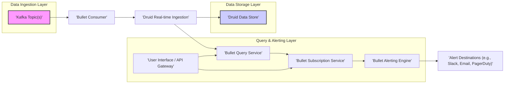

## Project Design Document: Bullet - Real-time Data Query and Alerting System (Improved)

**1. Introduction**

This document provides an enhanced and more detailed design overview of the Bullet project, a real-time data query and alerting system built upon the foundation of Apache Kafka and Druid. This document aims to provide a clear and comprehensive understanding of the system's architecture, individual components, the flow of data, and critical security considerations. This detailed design will serve as a valuable resource for subsequent threat modeling activities.

**2. Project Goals**

* Deliver a low-latency, real-time query interface for analyzing data streams ingested into Apache Kafka.
* Facilitate the definition and continuous execution of standing queries (subscriptions) against incoming data streams.
* Enable the configuration of flexible alert rules based on conditions evaluated against the results of both ad-hoc queries and subscriptions.
* Offer a horizontally scalable and resilient architecture capable of handling high-volume, high-velocity data streams with minimal downtime.
* Provide a user-friendly interface and API for managing queries, subscriptions, and alerts.

**3. High-Level Architecture**

The Bullet system is designed as a distributed system composed of several independent services that communicate with each other.

**4. Component Details**

* **Kafka Topic(s):**
    * **Responsibility:** Serves as the central message broker, holding the raw, real-time data streams that Bullet processes. Multiple topics can be configured for different data sources or types.
    * **Technology:** Apache Kafka.
    * **Key Interactions:** Data is produced by external systems and consumed by the Bullet Consumer.

* **Bullet Consumer:**
    * **Responsibility:**  Acts as a dedicated consumer group within Kafka, responsible for reading and processing data from the configured Kafka topics. It handles deserialization and potential initial transformations.
    * **Technology:** Java, Kafka Client API, potentially a serialization framework like Avro or Protocol Buffers.
    * **Key Interactions:** Continuously polls Kafka for new messages, transforms the data into a format suitable for Druid, and sends it to the Druid Real-time Ingestion service.

* **Druid Real-time Ingestion:**
    * **Responsibility:**  The Druid component responsible for accepting incoming data streams and indexing them in real-time, making the data immediately available for querying.
    * **Technology:** Apache Druid (specifically the indexing service).
    * **Key Interactions:** Receives transformed data from the Bullet Consumer.

* **Druid Data Store:**
    * **Responsibility:** Provides the persistent storage and query engine for the ingested data. Druid's architecture is optimized for analytical queries on large datasets.
    * **Technology:** Apache Druid (including historical nodes, brokers, coordinators, and overlords).
    * **Key Interactions:** Stores ingested data segments and responds to query requests from the Bullet Query Service.

* **Bullet Query Service:**
    * **Responsibility:**  Exposes a RESTful API for executing ad-hoc analytical queries against the data stored in Druid. It handles query parsing, validation, and translation into Druid's native query language.
    * **Technology:** Java (typically Spring Boot or Micronaut), REST framework (e.g., Jersey or Spring WebFlux), Druid client library.
    * **Key Interactions:** Receives query requests from the User Interface/API Gateway, interacts with Druid brokers to execute queries, and returns the results in a structured format (e.g., JSON).

* **Bullet Subscription Service:**
    * **Responsibility:** Manages the lifecycle of continuous queries (subscriptions). This includes storing subscription definitions (query logic, alert conditions, notification settings), scheduling their execution, and managing their state.
    * **Technology:** Java (typically Spring Boot or Micronaut), a persistent data store for subscription definitions (e.g., relational database like PostgreSQL or MySQL), potentially a scheduler library (e.g., Quartz).
    * **Key Interactions:** Receives subscription definitions from the User Interface/API Gateway, periodically executes queries against the Bullet Query Service, and forwards the results to the Alerting Engine.

* **Bullet Alerting Engine:**
    * **Responsibility:** Evaluates the results of subscriptions against predefined alert conditions. When a condition is met, it triggers alert notifications to the configured destinations. It also manages alert silencing and escalation policies.
    * **Technology:** Java (typically Spring Boot or Micronaut), potentially a rules engine or a dedicated alerting library.
    * **Key Interactions:** Receives query results from the Subscription Service, evaluates alert rules, and sends notifications to configured Alert Destinations.

* **User Interface / API Gateway:**
    * **Responsibility:** Provides a unified entry point for users and external systems to interact with Bullet. This includes a web-based user interface for managing queries, subscriptions, and alerts, as well as a programmatic API for automation and integration. The gateway handles authentication, authorization, and request routing to the appropriate backend services.
    * **Technology:**  Could be a combination of a front-end framework (e.g., React, Angular, Vue.js) for the UI, a backend framework (e.g., Node.js with Express, Python with Flask/Django, or Java with Spring Cloud Gateway) for the API gateway functionality.
    * **Key Interactions:** Authenticates and authorizes user requests, routes requests to the Query Service and Subscription Service, and presents data to the user.

* **Alert Destinations (e.g., Slack, Email, PagerDuty):**
    * **Responsibility:**  Represents the various systems and channels where alert notifications are delivered.
    * **Technology:**  Integrations with various messaging platforms (e.g., Slack API), email services (e.g., SMTP), and incident management tools (e.g., PagerDuty API).
    * **Key Interactions:** Receives alert payloads from the Alerting Engine and delivers them to the intended recipients.

**5. Data Flow (Detailed)**

The data flow within the Bullet system can be broken down into distinct stages:

1. **Data Ingestion Phase:**
    * External systems publish raw data events to designated Kafka Topic(s).
    * The Bullet Consumer, acting as a Kafka consumer group, reads these events.
    * The Consumer deserializes the data (e.g., from JSON, Avro) and may perform initial transformations or enrichments.
    * The transformed data is then sent to the Druid Real-time Ingestion service, typically over HTTP.
    * Druid ingests the data, indexes it, and makes it available for querying within seconds.

2. **Ad-hoc Query Execution Phase:**
    * A user formulates a query through the User Interface or sends a query request via the API Gateway.
    * The API Gateway authenticates and authorizes the request and routes it to the Bullet Query Service.
    * The Query Service receives the query, validates its syntax and semantics, and translates it into Druid's native query language.
    * The Query Service sends the Druid query to a Druid Broker node.
    * The Druid Broker distributes the query to the appropriate Historical nodes and gathers the results.
    * The Broker returns the aggregated results to the Bullet Query Service.
    * The Query Service formats the results (e.g., as JSON) and sends them back to the API Gateway, which then presents them to the user.

3. **Subscription and Alerting Phase:**
    * A user defines a subscription (including the query logic, alert conditions, and notification settings) through the User Interface or API Gateway.
    * The API Gateway routes the subscription definition to the Bullet Subscription Service.
    * The Subscription Service persists the subscription definition in its data store.
    * A scheduler within the Subscription Service triggers the execution of the subscription's query at defined intervals.
    * The Subscription Service sends the query to the Bullet Query Service.
    * The Bullet Query Service executes the query against Druid and returns the results to the Subscription Service.
    * The Subscription Service forwards the query results to the Bullet Alerting Engine.
    * The Alerting Engine evaluates the results against the alert conditions defined in the subscription.
    * If an alert condition is met, the Alerting Engine constructs an alert notification payload.
    * The Alerting Engine sends the alert notification to the configured Alert Destinations (e.g., Slack, Email, PagerDuty) using their respective APIs or protocols.

**6. Security Considerations (Detailed for Threat Modeling)**

This section expands on the initial security considerations, providing more detail relevant for threat modeling.

* **Authentication and Authorization:**
    * **Threats:** Unauthorized access to the Bullet UI/API, unauthorized execution of queries, unauthorized creation or modification of subscriptions and alerts, data breaches.
    * **Considerations:**
        * Implement strong authentication mechanisms for the UI/API Gateway (e.g., OAuth 2.0, OpenID Connect).
        * Enforce role-based access control (RBAC) to restrict access to specific functionalities and data based on user roles.
        * Securely store and manage user credentials and API keys.
        * Implement audit logging of all authentication and authorization attempts.

* **Data Security:**
    * **Threats:** Data breaches, eavesdropping on data in transit, unauthorized modification of data.
    * **Considerations:**
        * Encrypt data in transit between all components using TLS/SSL.
        * Consider encryption at rest for sensitive data within the Druid Data Store (Druid supports encryption).
        * Implement data masking or redaction techniques for sensitive data displayed in the UI or returned in query results.
        * Securely manage access to the underlying Kafka topics and Druid cluster.

* **Input Validation:**
    * **Threats:** Druid injection attacks, denial-of-service attacks through overly complex queries, exploitation of vulnerabilities in query parsing.
    * **Considerations:**
        * Implement robust input validation and sanitization for all user-provided queries and subscription definitions.
        * Use parameterized queries or prepared statements to prevent injection attacks.
        * Implement rate limiting and resource quotas to prevent denial-of-service attacks.
        * Regularly update dependencies to patch known vulnerabilities.

* **Communication Security:**
    * **Threats:** Man-in-the-middle attacks, eavesdropping on inter-service communication.
    * **Considerations:**
        * Enforce HTTPS for all communication with the UI/API Gateway.
        * Use mutual TLS (mTLS) for secure communication between internal services.
        * Securely manage and rotate API keys or other secrets used for inter-service authentication.

* **Logging and Auditing:**
    * **Threats:** Lack of visibility into security incidents, difficulty in forensic analysis.
    * **Considerations:**
        * Implement comprehensive logging of all significant events, including authentication attempts, authorization decisions, query executions, subscription modifications, and alert triggers.
        * Securely store audit logs in a centralized and tamper-proof location.
        * Implement monitoring and alerting on suspicious activity detected in the logs.

* **Dependency Management:**
    * **Threats:** Exploitation of vulnerabilities in third-party libraries.
    * **Considerations:**
        * Maintain an inventory of all third-party dependencies.
        * Regularly scan dependencies for known vulnerabilities using tools like OWASP Dependency-Check.
        * Keep dependencies up-to-date with the latest security patches.

* **Alert Security:**
    * **Threats:** Spoofed or tampered alert notifications, unauthorized access to alert information.
    * **Considerations:**
        * Secure communication channels for sending alerts (e.g., encrypted connections to Slack or email servers).
        * Implement mechanisms to verify the authenticity of alert notifications.
        * Control access to alert history and configuration.

* **Infrastructure Security:**
    * **Threats:** Compromise of the underlying infrastructure leading to data breaches or service disruption.
    * **Considerations:**
        * Follow security best practices for securing the underlying infrastructure (e.g., secure operating system configurations, network segmentation, firewalls).
        * Regularly patch and update operating systems and other infrastructure components.
        * Implement intrusion detection and prevention systems.

**7. Deployment Considerations**

* Bullet is designed for deployment in a distributed, containerized environment, typically using Docker and Kubernetes.
* Each component can be deployed as a separate microservice, allowing for independent scaling and fault isolation.
* **Scaling:**
    * The Bullet Consumer can be scaled horizontally by increasing the number of instances within the consumer group.
    * The Bullet Query Service and Subscription Service can be scaled horizontally by adding more instances behind a load balancer.
    * The Bullet Alerting Engine can be scaled based on the volume of alerts being processed.
    * Druid's architecture inherently supports horizontal scaling by adding more historical and broker nodes.
* **High Availability and Fault Tolerance:**
    * Deploy multiple instances of each critical component for redundancy.
    * Utilize Kafka's replication features for data durability.
    * Leverage Druid's built-in fault tolerance mechanisms.
    * Implement health checks and monitoring for each component to enable automated recovery.
* **Monitoring and Alerting:**
    * Implement comprehensive monitoring of key metrics for each component (e.g., CPU usage, memory usage, network traffic, error rates).
    * Set up alerts for critical issues to enable proactive intervention.
    * Utilize centralized logging and monitoring tools.

**8. Non-Functional Requirements**

* **Performance:** Low latency for query execution (target: sub-second for most queries). High throughput for data ingestion.
* **Scalability:** Ability to handle increasing data volumes and query loads by scaling individual components.
* **Reliability:** High availability and fault tolerance to minimize downtime.
* **Security:**  Robust security measures to protect data and prevent unauthorized access.
* **Maintainability:**  Modular design and clear documentation to facilitate maintenance and updates.
* **Observability:** Comprehensive logging, monitoring, and tracing to enable effective troubleshooting and performance analysis.

**9. Future Considerations**

* **Enhanced Alerting Capabilities:**  More sophisticated alert condition logic, anomaly detection, and integration with more incident management platforms.
* **User Interface Improvements:**  More interactive data visualization, advanced query building tools, and improved subscription management features.
* **Integration with other Data Sources:**  Support for ingesting data from other streaming platforms or databases.
* **Advanced Analytics Features:**  Incorporating machine learning models for predictive analytics and anomaly detection directly within the query engine.
* **Stream Processing Enhancements:**  Adding capabilities for more complex stream processing operations before data is ingested into Druid.

This improved design document provides a more detailed and comprehensive understanding of the Bullet project. It elaborates on the architecture, components, data flow, and critically, the security considerations, making it a more effective resource for threat modeling and future development efforts.
