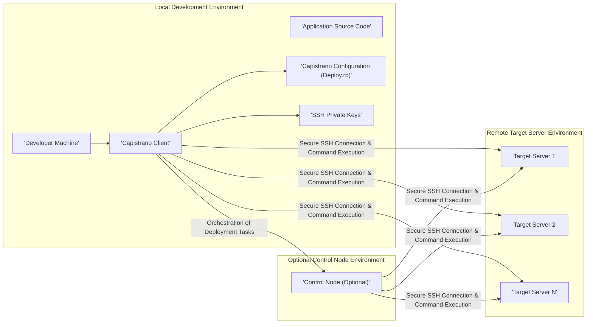
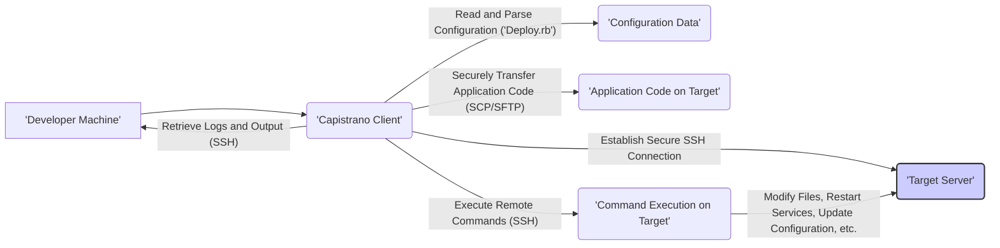

# Project Design Document: Capistrano Deployment Automation Tool

**Version:** 1.1
**Date:** October 26, 2023
**Author:** AI Software Architect

## 1. Introduction

This document provides an enhanced and detailed architectural design of Capistrano, a powerful remote server automation tool primarily utilized for deploying web applications. The purpose of this document is to offer a clear and comprehensive understanding of the system's components, their interactions, and the flow of data, specifically tailored for subsequent threat modeling activities. This revision aims to provide greater clarity and depth compared to the initial version.

## 2. Goals and Objectives

The fundamental goals of Capistrano are:

* **Highly Automated Deployment:** To significantly streamline and automate the complex process of deploying applications to remote servers, reducing manual intervention and potential errors.
* **Guaranteed Repeatable Deployments:** To ensure deployments are consistent and reproducible across various environments (development, staging, production), eliminating inconsistencies and "works on my machine" issues.
* **Efficient Rollback Capabilities:** To provide robust and easily accessible mechanisms for reverting to previously successful deployments in the event of failures or issues, minimizing downtime.
* **Scalable Parallel Execution:** To enable the parallel execution of tasks across multiple target servers simultaneously, drastically reducing deployment times for large-scale applications.
* **Flexible Extensibility:** To offer a modular and adaptable architecture that allows users to customize and extend its core functionality through plugins and custom tasks, catering to diverse deployment needs.

This design document is specifically intended to:

* Clearly and comprehensively define the architecture and individual components of the Capistrano system.
* Accurately illustrate the flow of data and the interactions between these components during the deployment lifecycle.
* Identify and elaborate on key security considerations and potential vulnerabilities within the system's architecture.
* Serve as a robust and informative foundation for conducting thorough and effective threat modeling exercises.

## 3. High-Level Architecture

Capistrano operates on a client-server model, where a local machine (the client) acts as the orchestrator, directing deployment tasks on remote target servers. An optional control node can be introduced for more complex deployments.

**Key Components:**

* **Developer Machine:** The local workstation used by the developer to initiate and manage the deployment process. This machine hosts the Capistrano client and the application codebase.
* **Capistrano Client:** The Ruby gem installed on the developer's machine. It interprets the `Deploy.rb` configuration, manages SSH connections, and orchestrates the execution of deployment tasks on the target servers.
* **Application Source Code:** The complete codebase of the application being deployed, typically managed within a version control system like Git.
* **Capistrano Configuration (`Deploy.rb`):** A Ruby file that defines the entire deployment process. This includes specifying server roles, deployment stages (e.g., staging, production), custom tasks, and various deployment settings.
* **SSH Private Keys:** Cryptographic keys used for secure, passwordless authentication between the Capistrano client and the target servers. These keys are crucial for secure remote command execution.
* **Control Node (Optional):** An intermediary server that can act as a central point for orchestrating deployments, particularly useful in complex environments with numerous target servers or when the developer's machine has restricted network access to the target servers.
* **Target Servers:** The remote servers where the application will be deployed, installed, and ultimately run. These servers host the application's runtime environment.

## 4. Detailed Architecture and Components

The Capistrano deployment process is structured into several distinct stages, each involving specific components and actions:

### 4.1. Initialization Phase

* **Capistrano Client:**  Initiates the deployment process by reading and parsing the `Capfile` and the primary configuration file, `Deploy.rb`.
* **Configuration Loading and Parsing:** The client interprets the configuration, extracting crucial information such as server roles (e.g., web, app, db), deployment stages (e.g., staging, production), and the sequence of tasks to be executed.
* **Establishing SSH Connections:**  The client establishes secure SSH connections to the designated target servers using the provided SSH credentials (typically SSH keys). This involves authentication and the creation of secure communication channels.

### 4.2. Code Transfer Phase

* **Source Code Management (SCM) Integration:** Capistrano seamlessly integrates with popular SCM systems like Git. It can fetch the latest version of the application code from a specified repository, branch, or tag. For example, it might execute `git clone` or `git checkout`.
* **Optional Code Packaging:**  For efficient transfer, Capistrano can optionally package the application code into a compressed archive format, such as `tar.gz`. This reduces the number of files transferred and the overall transfer time.
* **Secure Code Transfer (SCP/SFTP):** The packaged (or unpacked) application code is securely transferred to the target servers using secure protocols like SCP (Secure Copy Protocol) or SFTP (SSH File Transfer Protocol) over the established SSH connections. The destination directory on the target server is typically a designated release directory.

### 4.3. Task Execution Phase

* **Task Definition and Orchestration:** The `Deploy.rb` file defines a series of tasks written in Ruby that need to be executed on the target servers. These tasks are the building blocks of the deployment process. Examples include:
    * **Dependency Management:** Installing application dependencies (e.g., running `bundle install` for Ruby applications, `npm install` for Node.js applications).
    * **Asset Compilation:** Compiling static assets like CSS and JavaScript.
    * **Database Migrations:** Applying database schema changes.
    * **Application Server Management:** Restarting or reloading application servers (e.g., Puma, Unicorn, Passenger).
    * **Cache Clearing:** Invalidating or clearing application caches.
* **Remote Command Execution via SSH:** Capistrano leverages the established SSH connections to execute these defined tasks as shell commands on the target servers. It ensures commands are executed in the correct order and context.
* **Parallel Task Execution:** Capistrano can execute tasks in parallel across multiple servers based on their assigned roles. This significantly speeds up deployments, especially for tasks that can be performed independently on each server.
* **Hooks for Customization:** Capistrano provides a powerful hook system (`before`, `after`) that allows developers to inject custom tasks or scripts at specific points within the deployment lifecycle. This enables highly customized deployment workflows.

### 4.4. Rollback Phase

* **Release Management and Versioning:** Capistrano maintains a history of successfully deployed releases on the target servers. Each deployment is typically placed in a timestamped directory, allowing for easy identification and rollback.
* **Initiating the Rollback Process:** A specific Capistrano command (e.g., `cap deploy:rollback`) triggers the rollback process.
* **Symbolic Link Manipulation:** The core of the rollback mechanism involves switching symbolic links. The `current` symbolic link, which points to the currently active release, is updated to point to the previous successful release directory.
* **Custom Rollback Tasks:** Developers can define custom rollback tasks to revert specific changes made during the failed deployment, such as database changes or configuration updates.

### 4.5. Key Components Breakdown

* **`Capfile`:** A simple Ruby file located at the root of the project that loads the core Capistrano library and any required Capistrano plugins (gems).
* **`Deploy.rb`:** The central configuration file, written in Ruby, that defines the entire deployment process, including server configurations, roles, stages, tasks, and settings.
* **Tasks:** Reusable units of work, written in Ruby, that are executed on the target servers via SSH. Tasks encapsulate specific deployment actions.
* **Roles:** Logical groupings of servers based on their function (e.g., `web`, `app`, `db`). Tasks can be targeted to specific roles.
* **Stages:** Represent different deployment environments (e.g., `staging`, `production`). Each stage can have its own specific server configurations and settings.
* **Recipes:** Pre-built, reusable sets of tasks designed for common deployment scenarios or specific technologies (often provided by Capistrano plugins).
* **Plugins (Gems):** Extend Capistrano's core functionality by providing additional features, integrations with other tools, and support for specific deployment scenarios.

## 5. Data Flow Diagram

This diagram visually represents the flow of data during a typical Capistrano deployment sequence.

**Detailed Data Flow Description:**

1. The developer initiates the deployment process on their local machine by executing a Capistrano command.
2. The Capistrano client on the developer's machine reads and parses the `Deploy.rb` configuration file to understand the deployment plan.
3. The parsed configuration data, including server details, tasks to be executed, and deployment settings, is loaded into the Capistrano client.
4. The Capistrano client establishes secure SSH connections to the designated target servers using the configured credentials (typically SSH keys).
5. The application code (either as a package or individual files) is securely transferred to the target servers using protocols like SCP or SFTP over the established SSH connections.
6. The Capistrano client sends a series of commands via the secure SSH connections to be executed on the target servers. These commands correspond to the tasks defined in `Deploy.rb`.
7. The commands executed on the target servers perform various actions, such as modifying files, restarting services, updating application configurations, installing dependencies, and running database migrations.
8. Logs and output generated from the remote command executions on the target servers are retrieved by the Capistrano client and can be displayed to the developer for monitoring and debugging purposes.

## 6. Security Considerations

Security is paramount when using Capistrano for deployments. Here are critical security considerations:

* **Secure SSH Key Management:**
    * **Potential Risk:** Compromised SSH private keys can grant unauthorized individuals complete access to the target servers, allowing them to execute arbitrary commands and potentially compromise the entire system.
    * **Mitigation Strategies:**
        * **Strong Passphrases:** Always use strong, unique passphrases to protect SSH private keys.
        * **Avoid Storing Keys in Version Control:** Never commit private SSH keys to version control repositories.
        * **Utilize SSH Agents:** Employ SSH agents to securely manage private keys in memory, reducing the risk of them being exposed on disk.
        * **Key Management Tools:** Consider using dedicated key management tools for enhanced security and control over SSH keys.
* **Robust Secrets Management:**
    * **Potential Risk:** Hardcoding sensitive information like database credentials, API keys, and other secrets directly in `Deploy.rb` or within the application codebase exposes them, potentially leading to unauthorized access and data breaches.
    * **Mitigation Strategies:**
        * **Environment Variables:** Utilize environment variables to store sensitive information, keeping them separate from the codebase.
        * **Secure Secrets Management Solutions:** Integrate with dedicated secrets management solutions like HashiCorp Vault, AWS Secrets Manager, or Azure Key Vault.
        * **Ansible Vault or Similar Tools:** For simpler scenarios, consider using tools like Ansible Vault to encrypt sensitive data within configuration files.
        * **Avoid Committing Secrets:** Never commit sensitive information directly to version control.
* **Mitigating Code Injection Vulnerabilities:**
    * **Potential Risk:** Malicious code injected into the application codebase, either intentionally or unintentionally, could be deployed to the target servers, potentially leading to security breaches or system compromise.
    * **Mitigation Strategies:**
        * **Secure Coding Practices:** Adhere to secure coding principles throughout the development lifecycle.
        * **Regular Security Audits:** Conduct regular security audits of the codebase to identify and address potential vulnerabilities.
        * **Static and Dynamic Code Analysis Tools:** Employ static and dynamic code analysis tools to automatically detect potential security flaws.
* **Protection Against Man-in-the-Middle (MITM) Attacks:**
    * **Potential Risk:** An attacker intercepting the communication between the Capistrano client and the target servers could potentially eavesdrop on sensitive data or even manipulate the deployment process.
    * **Mitigation Strategies:**
        * **SSH Encryption:** SSH inherently provides strong encryption for all communication, mitigating the risk of eavesdropping.
        * **Secure SSH Configuration:** Ensure SSH is configured securely, disabling weak ciphers and algorithms.
        * **Host Key Verification:** Verify the host keys of the target servers to prevent initial MITM attacks during the SSH handshake.
        * **Avoid Untrusted Networks:** Refrain from performing deployments over untrusted or public Wi-Fi networks.
* **Strict Permissions on Target Servers:**
    * **Potential Risk:** Incorrect or overly permissive file permissions on the target servers can create security vulnerabilities, allowing unauthorized access or modification of critical files.
    * **Mitigation Strategies:**
        * **Principle of Least Privilege:** Ensure that Capistrano tasks set file permissions based on the principle of least privilege, granting only the necessary access.
        * **Regular Permission Reviews:** Periodically review and adjust file permissions on the target servers.
* **Comprehensive Logging and Auditing:**
    * **Potential Risk:** Insufficient logging makes it difficult to track deployment activities, identify potential security incidents, and perform forensic analysis.
    * **Mitigation Strategies:**
        * **Capistrano Logging:** Configure Capistrano to log all deployment activities, including task execution and command output.
        * **Server-Side Logging:** Ensure that server logs (e.g., application logs, SSH logs, system logs) are enabled and regularly reviewed.
        * **Centralized Logging:** Consider using a centralized logging system to aggregate logs from all servers for easier analysis.
* **Vigilant Dependency Management:**
    * **Potential Risk:** Vulnerabilities in Capistrano's dependencies or the application's dependencies can be exploited by attackers.
    * **Mitigation Strategies:**
        * **Regular Updates:** Keep Capistrano and all its dependencies up-to-date with the latest security patches.
        * **Dependency Scanning Tools:** Utilize dependency scanning tools to identify and address known vulnerabilities in project dependencies.
* **Secure Access Control to Capistrano Configuration:**
    * **Potential Risk:** Unauthorized modification of the `Deploy.rb` configuration file could lead to malicious deployments, potentially compromising the target servers.
    * **Mitigation Strategies:**
        * **Restrict Access:** Limit access to the `Deploy.rb` file and the Capistrano configuration repository to authorized personnel only.
        * **Version Control and Code Reviews:** Utilize version control systems and implement code review processes for all changes to the Capistrano configuration.

## 7. Deployment Considerations

* **Capistrano Installation:** Capistrano is typically installed as a Ruby gem on the developer's machine using `gem install capistrano`.
* **Project Configuration:** Requires setting up the `Capfile` and meticulously configuring the `Deploy.rb` file to define the deployment process specific to the application.
* **SSH Access Requirements:**  Mandates secure SSH access to all target servers involved in the deployment process.
* **User Permissions on Target Servers:** The user account used by Capistrano to connect to the target servers must possess the necessary permissions to execute the required deployment tasks.
* **Network Connectivity:** Reliable network connectivity is essential between the machine running the Capistrano client and all target servers. Firewalls and network configurations must allow SSH traffic.

## 8. Future Considerations

* **Seamless Integration with CI/CD Pipelines:**  Further enhance integration with Continuous Integration/Continuous Delivery (CI/CD) pipelines (e.g., Jenkins, GitLab CI, GitHub Actions) for fully automated deployments triggered by code changes.
* **Native Support for Containerized Deployments (Docker, Kubernetes):** Explore and implement more native support for deploying containerized applications using Docker and orchestrating deployments on Kubernetes clusters.
* **Enhanced Cloud-Native Deployments:**  Deepen integration with cloud platforms (e.g., AWS, Azure, GCP) by leveraging platform-specific tools and services for more efficient and scalable deployments.
* **Advanced Security Feature Integrations:** Investigate and integrate with more advanced security tools and practices, such as automated security scanning during deployments and integration with intrusion detection systems.

## 9. Conclusion

This improved design document provides a more detailed and comprehensive understanding of the Capistrano architecture, emphasizing its components, data flow, and critical security considerations. This enhanced information serves as a robust foundation for conducting thorough and effective threat modeling exercises. By clearly outlining the system's design and potential vulnerabilities, security professionals can better analyze potential attack vectors and recommend appropriate security controls to mitigate risks associated with using Capistrano for application deployments.