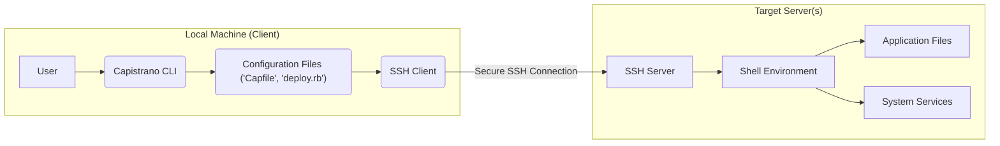
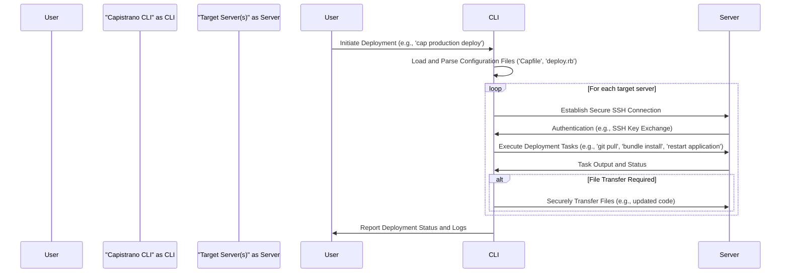

# Project Design Document: Capistrano

**Version:** 1.1
**Date:** October 26, 2023
**Author:** AI Software Architect

## 1. Introduction

This document provides a detailed architectural design of Capistrano, a remote server automation and deployment tool written in Ruby. This document aims to provide a comprehensive understanding of Capistrano's components, interactions, and data flow, which will serve as a robust foundation for subsequent threat modeling activities. This version includes clarifications and expansions based on the initial draft.

## 2. Goals and Objectives

The primary goals of Capistrano are to:

*   Automate the deployment process of web applications and other software, reducing manual effort and potential for errors.
*   Ensure consistent and repeatable deployments across different environments (development, staging, production), promoting reliability.
*   Provide rollback capabilities to efficiently revert to previous known-good deployments in case of issues.
*   Enable parallel execution of deployment tasks across multiple servers, improving deployment speed and efficiency.
*   Support various deployment strategies (e.g., rolling updates, blue/green deployments, canary deployments) to minimize downtime.
*   Be extensible through a well-defined plugin system, allowing users to tailor Capistrano to their specific needs.

This design document aims to clearly articulate the architecture and underlying mechanisms that enable these goals, focusing on aspects relevant to security.

## 3. System Architecture

Capistrano operates on a client-server model where the client (the user's local machine) orchestrates deployment tasks on remote target servers via secure SSH connections.

### 3.1. High-Level Architecture Diagram

### 3.2. Key Components

*   **Capistrano CLI:** The command-line interface application used by developers to initiate, manage, and monitor deployments. It parses configuration files, establishes SSH connections, and executes tasks on remote servers.
*   **Configuration Files ('Capfile', `deploy.rb`):** Ruby files that declaratively define the deployment process.
    *   `Capfile`:  The entry point, responsible for loading the Capistrano core framework and any required plugins (as Ruby gems).
    *   `deploy.rb`: Contains the main deployment configuration, including definitions of target servers (grouped by roles), deployment stages, deployment strategy, and custom deployment tasks.
*   **SSH Client:** The software on the local machine responsible for establishing secure, encrypted communication channels with the target servers' SSH daemons.
*   **SSH Server:** The daemon running on each target server that listens for incoming SSH connections, authenticates clients, and provides a secure channel for executing commands.
*   **Shell Environment:** The command-line interpreter (e.g., Bash, Zsh) running on the target server under the context of the user Capistrano connects as. This environment executes the commands sent by the Capistrano CLI.
*   **Application Files:** The codebase, assets, and any other files that constitute the application being deployed. These are managed and updated by Capistrano during the deployment process.
*   **System Services:** Background processes running on the target server that the application depends on (e.g., web servers like Nginx or Apache, application servers like Puma or Unicorn, database servers). Capistrano often interacts with these services to restart or reload them during deployments.
*   **Plugins (Gems):** Ruby gems that extend Capistrano's core functionality. They provide pre-built tasks, deployment strategies, and integrations with other tools and services (e.g., version control systems, monitoring platforms).

## 4. Detailed Component Description

### 4.1. Capistrano CLI

*   **Functionality:**
    *   Parses command-line arguments provided by the user to determine the desired action (e.g., deploy, rollback).
    *   Loads and interprets the `Capfile` and environment-specific configuration files to understand the deployment setup.
    *   Manages SSH connections to the designated target servers, handling authentication and connection persistence.
    *   Executes Ruby code defined within deployment tasks and configurations, orchestrating the deployment workflow.
    *   Supports parallel execution of tasks across multiple servers to optimize deployment time.
    *   Provides logging and reporting of the deployment process, including status updates and error messages.
*   **Implementation:** A Ruby application built upon the `rake` task runner and leveraging libraries like `net-ssh` for secure communication.

### 4.2. Configuration Files

*   **Functionality:**
    *   Define the infrastructure topology, specifying target servers and their roles within the application architecture.
    *   Configure deployment stages, allowing for different settings and server configurations for various environments.
    *   Specify deployment paths, user permissions, and other environment-specific settings.
    *   Define the sequence of tasks to be executed during a deployment, including custom tasks.
    *   Allow for embedding arbitrary Ruby code to implement complex logic and customizations within the deployment process.
*   **Implementation:** Plain text files written in Ruby syntax, interpreted by the Capistrano CLI at runtime.

### 4.3. SSH Communication

*   **Functionality:**
    *   Establishes secure, encrypted communication channels between the local machine and the target servers, protecting sensitive data in transit.
    *   Authenticates the Capistrano client to the target servers, typically using SSH keys for passwordless authentication.
    *   Executes commands remotely on the target servers within the context of the authenticated user.
    *   Facilitates the secure transfer of files between the local machine and the target servers (e.g., using `scp` or `sftp` implicitly).
*   **Implementation:** Relies on the `net-ssh` Ruby library, providing a robust and well-tested SSH implementation.

### 4.4. Deployment Tasks

*   **Functionality:** Represent individual, atomic steps within the deployment process. Examples include updating code from a repository, installing dependencies, migrating databases, and restarting application servers.
*   **Implementation:** Defined as Ruby blocks within the configuration files or within plugins. They typically involve executing shell commands on the remote servers via the established SSH connection. Tasks can be organized and executed sequentially or in parallel.

### 4.5. Plugins

*   **Functionality:** Extend Capistrano's core capabilities by providing reusable and modular functionalities. This includes support for different deployment strategies (e.g., `capistrano-scm-plugin` for various source control systems), integration with specific application servers (e.g., `capistrano-puma`), and utilities for common deployment tasks.
*   **Implementation:** Distributed as Ruby gems that are declared as dependencies in the `Gemfile` and loaded by Capistrano through the `Capfile`. Plugins can define new tasks, modify existing behavior, and introduce new configuration options.

## 5. Data Flow

The typical data flow during a Capistrano deployment follows these steps:

1. **User initiates deployment:** A developer executes a Capistrano command on their local machine, specifying the target environment (e.g., `cap production deploy`).
2. **Configuration loading and parsing:** The Capistrano CLI loads and parses the `Capfile` and the environment-specific configuration file (e.g., `deploy/production.rb`) to determine the deployment parameters and tasks.
3. **SSH connection establishment:** The CLI uses the SSH client to establish secure connections to each of the target servers defined in the configuration, authenticating using the configured credentials (typically SSH keys).
4. **Task execution orchestration:** The CLI begins executing the defined deployment tasks in the specified order. This involves:
    *   **Command dispatch:** Sending shell commands to the appropriate target servers via the established SSH connections.
    *   **File transfer (if needed):** Transferring necessary files (e.g., updated code, configuration files) to the remote servers using secure file transfer protocols over SSH.
    *   **Output retrieval and logging:** Receiving the output of the executed commands from the remote servers and logging it for monitoring and debugging purposes.
5. **Artifact management (Release Management):** Capistrano typically creates a new release directory on each target server for each deployment. This allows for easy rollback to previous versions.
6. **Rollback mechanism (on failure or user request):** If a deployment fails or a rollback is initiated, Capistrano can execute tasks to revert the application to a previously deployed release by symlinking to the older release directory.

### 5.1. Data Flow Diagram

## 6. Security Considerations

This section details security considerations relevant to Capistrano deployments, providing a basis for identifying potential threats.

*   **Credential Management and Security:**
    *   **Threat:** Compromised SSH private keys on the client machine could allow unauthorized access to all target servers.
    *   **Mitigation:** Securely store SSH private keys with appropriate permissions. Use SSH agents or hardware security keys. Regularly rotate SSH keys. Consider using short-lived certificates.
    *   **Threat:** Storing passwords directly in configuration files exposes them to unauthorized access.
    *   **Mitigation:** Avoid storing passwords in configuration. Utilize SSH key-based authentication. If passwords are necessary, use secure secrets management solutions or environment variables.
*   **SSH Key Security and Management:**
    *   **Threat:** Weak or improperly managed SSH keys can be easily compromised.
    *   **Mitigation:** Generate strong SSH keys. Implement proper key rotation policies. Restrict key usage to specific users and hosts.
    *   **Threat:** Unauthorized access to the client machine could lead to the misuse of stored SSH keys.
    *   **Mitigation:** Secure the client machine with strong passwords and multi-factor authentication.
*   **Man-in-the-Middle (MITM) Attacks:**
    *   **Threat:** An attacker could intercept SSH communication and potentially gain access to sensitive information or manipulate the deployment process.
    *   **Mitigation:** Ensure SSH connections are established securely. Verify host keys to prevent man-in-the-middle attacks during initial connection. Use strong encryption algorithms for SSH.
*   **Code Injection Vulnerabilities:**
    *   **Threat:** Malicious code could be injected into deployment tasks or configuration files, leading to arbitrary command execution on target servers.
    *   **Mitigation:** Carefully review and sanitize any user-provided input or data used within deployment tasks. Avoid constructing shell commands dynamically from untrusted sources. Implement input validation.
    *   **Threat:** Compromised plugins could introduce malicious code into the deployment process.
    *   **Mitigation:** Only use plugins from trusted and reputable sources. Regularly audit plugin code for vulnerabilities. Utilize dependency scanning tools.
*   **Target Server Security:**
    *   **Threat:** Vulnerabilities on target servers could be exploited during or after deployment.
    *   **Mitigation:** Regularly patch and update the operating system and software on target servers. Implement strong access controls and firewall rules. Harden server configurations.
    *   **Threat:** Insufficient file system permissions on target servers could allow unauthorized modification of deployed applications.
    *   **Mitigation:** Implement the principle of least privilege for file system permissions.
*   **Configuration Security:**
    *   **Threat:** Sensitive information (e.g., API keys, database credentials) stored in configuration files could be exposed.
    *   **Mitigation:** Avoid storing sensitive information directly in configuration files. Utilize environment variables, secure secrets management solutions (e.g., HashiCorp Vault, AWS Secrets Manager), or encrypted configuration.
*   **Rollback Security:**
    *   **Threat:** The rollback mechanism could be abused to deploy older, potentially vulnerable versions of the application.
    *   **Mitigation:** Implement access controls for rollback functionalities. Maintain a secure history of deployments.
*   **Plugin Security:**
    *   **Threat:** Malicious or vulnerable plugins can compromise the security of the deployment process and target servers.
    *   **Mitigation:** Only use plugins from trusted sources. Regularly review plugin code and dependencies for vulnerabilities. Keep plugins updated.

## 7. Deployment Considerations

*   Capistrano is typically installed as a Ruby gem on the developer's local machine using `gem install capistrano`.
*   No specific software installation is strictly required on the target servers beyond having an SSH server running and a compatible shell environment (e.g., Bash). However, Ruby may be needed if custom tasks involve Ruby execution on the server.
*   Configuration files (`Capfile`, `deploy.rb`, and environment-specific files) are typically version-controlled alongside the application codebase, ensuring consistency and traceability.
*   Consider using a dedicated deployment user on the target servers with restricted privileges to minimize the impact of potential compromises.

## 8. Assumptions

*   It is assumed that secure SSH communication is the primary method for interaction between the client and target servers.
*   It is assumed that the user initiating the deployment has the necessary permissions on both the local machine and the target servers.
*   It is assumed that the target servers have a functional shell environment capable of executing commands.

## 9. Potential Attack Vectors (Brief Overview)

Based on the architecture and security considerations, potential attack vectors include:

*   **Compromised Client Machine:** An attacker gaining control of a developer's machine could use their SSH keys to access target servers.
*   **Stolen or Weak SSH Keys:**  Compromised SSH keys are a direct path to unauthorized server access.
*   **MITM Attacks on SSH Connections:** Intercepting SSH communication could expose credentials or allow manipulation of deployment commands.
*   **Malicious Plugins:**  Plugins from untrusted sources could introduce backdoors or vulnerabilities.
*   **Code Injection in Deployment Tasks:**  Poorly written tasks could allow attackers to execute arbitrary commands.
*   **Exploiting Vulnerabilities on Target Servers:**  Attackers could leverage known vulnerabilities on the target servers during or after deployment.
*   **Exposure of Sensitive Information in Configuration:**  Storing secrets in plain text in configuration files creates a risk of exposure.

This document provides a more detailed and refined architectural overview of Capistrano, emphasizing security considerations to facilitate thorough threat modeling. The identified components, data flows, and potential vulnerabilities serve as crucial inputs for developing effective security strategies.