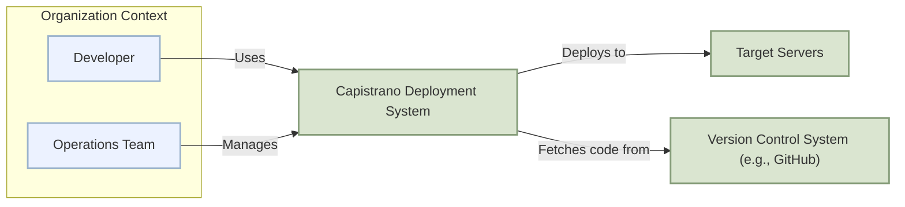
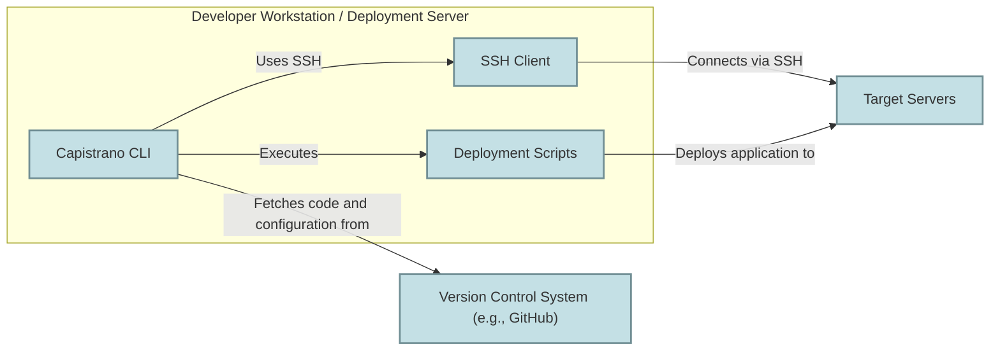
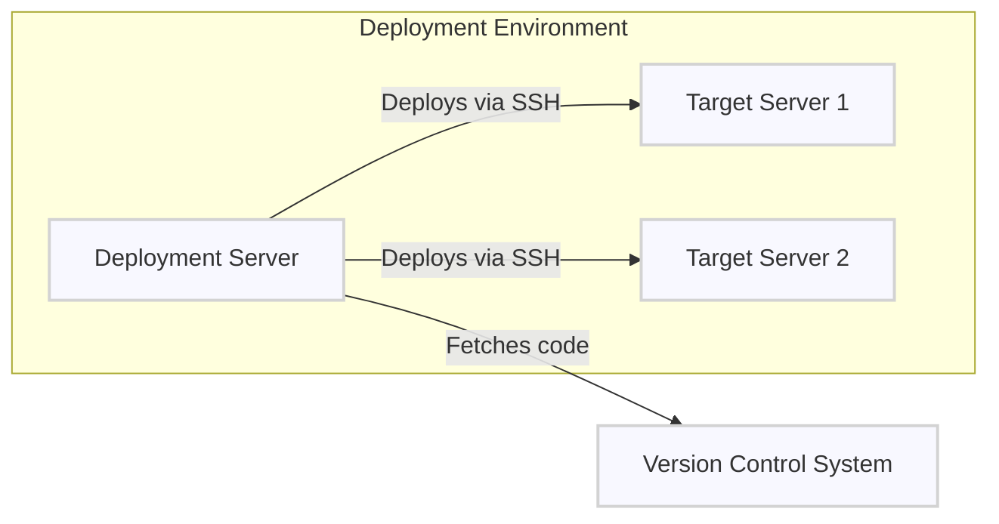
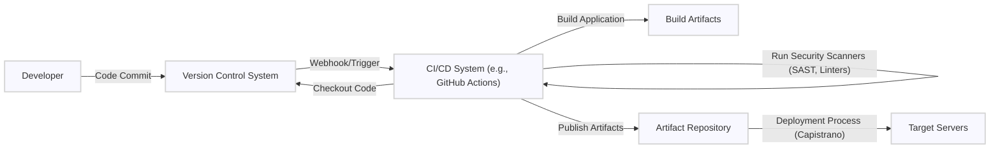

# BUSINESS POSTURE

- Business Priorities and Goals:
  - Automate the deployment of web applications and other software projects to remote servers.
  - Ensure consistent and repeatable deployments across different environments.
  - Reduce manual errors and improve deployment efficiency.
  - Enable faster and more frequent software releases.
- Business Risks:
  - Deployment failures leading to application downtime and service disruption.
  - Security breaches due to compromised deployment processes or misconfigurations.
  - Data loss or corruption during deployment.
  - Inconsistent deployments across environments causing application instability.

# SECURITY POSTURE

- Existing Security Controls:
  - security control: SSH key-based authentication for accessing remote servers. Implemented by SSH protocol and server configurations.
  - security control: User account management on target servers. Implemented by operating system user management.
  - accepted risk: Reliance on SSH security, which can be vulnerable if keys are compromised or mismanaged.
  - accepted risk: Potential for misconfiguration of server permissions and access controls by users.
- Recommended Security Controls:
  - security control: Implement principle of least privilege for deployment user accounts on target servers.
  - security control: Utilize a secrets management solution to securely store and manage sensitive credentials used during deployment (e.g., database passwords, API keys).
  - security control: Implement audit logging for all deployment activities performed by Capistrano.
  - security control: Integrate vulnerability scanning into the deployment pipeline to identify and address security vulnerabilities in application dependencies and server configurations.
  - security control: Enforce multi-factor authentication for access to servers used for deployment and for Capistrano configuration management.
- Security Requirements:
  - Authentication:
    - Requirement: Securely authenticate to target servers.
    - Requirement: Support SSH key-based authentication.
    - Requirement: Consider support for other authentication methods like certificate-based authentication for enhanced security.
  - Authorization:
    - Requirement: Implement role-based access control (RBAC) for deployment tasks.
    - Requirement: Ensure that deployment users have only the necessary permissions on target servers to perform their tasks.
    - Requirement: Restrict access to sensitive deployment configurations and scripts.
  - Input Validation:
    - Requirement: Validate all inputs to Capistrano tasks, including configuration parameters, server names, and deployment scripts.
    - Requirement: Sanitize inputs to prevent command injection vulnerabilities.
    - Requirement: Implement checks to ensure that deployment scripts are from trusted sources.
  - Cryptography:
    - Requirement: Use strong encryption for communication between the Capistrano client and target servers (SSH).
    - Requirement: Securely store and manage cryptographic keys used for authentication and encryption.
    - Requirement: Consider encrypting sensitive data at rest and in transit during deployment processes.

# DESIGN

## C4 CONTEXT

- Context Diagram Elements:
  - - Name: Developer
    - Type: Person
    - Description: Software developers who write code and initiate deployments using Capistrano.
    - Responsibilities: Develop application code, configure Capistrano for deployments, initiate deployment processes.
    - Security controls: Authentication to developer workstations, access control to version control system, code review processes.
  - - Name: Operations Team
    - Type: Person
    - Description: Team responsible for managing infrastructure, servers, and deployment processes. They configure and maintain Capistrano and target servers.
    - Responsibilities: Configure Capistrano, manage target servers, monitor deployments, troubleshoot deployment issues, define deployment workflows.
    - Security controls: Access control to infrastructure management tools, server hardening, security monitoring, incident response procedures.
  - - Name: Capistrano Deployment System
    - Type: Software System
    - Description: The Capistrano application itself, used to automate deployments to target servers. It runs on a developer's machine or a dedicated deployment server.
    - Responsibilities: Orchestrate deployment tasks, connect to target servers via SSH, execute deployment scripts, manage application releases.
    - Security controls: Secure configuration of Capistrano, access control to Capistrano configuration files, secure storage of credentials (if any), audit logging.
  - - Name: Target Servers
    - Type: Software System
    - Description: Remote servers where the application is deployed. These can be physical servers, virtual machines, or cloud instances.
    - Responsibilities: Host the deployed application, run application services, serve application content to users.
    - Security controls: Operating system hardening, firewall configuration, intrusion detection systems, regular security patching, access control, security monitoring.
  - - Name: Version Control System (e.g., GitHub)
    - Type: Software System
    - Description: A system like GitHub, GitLab, or Bitbucket used to store and manage the application's source code. Capistrano fetches code from this system during deployment.
    - Responsibilities: Store application source code, manage code versions, track changes, provide access control to code repository.
    - Security controls: Access control to code repository, authentication and authorization mechanisms, audit logging, branch protection rules, vulnerability scanning of dependencies.

## C4 CONTAINER

- Container Diagram Elements:
  - - Name: Capistrano CLI
    - Type: Container
    - Description: The command-line interface of Capistrano, executed by developers or automation systems to initiate and manage deployments.
    - Responsibilities: Parse user commands, read configuration files, orchestrate deployment tasks, interact with SSH client, log deployment activities.
    - Security controls: Access control to Capistrano CLI (via user accounts), secure storage of configuration files, input validation of commands and parameters, audit logging of commands executed.
  - - Name: SSH Client
    - Type: Container
    - Description: The SSH client used by Capistrano to establish secure connections to target servers and execute commands remotely.
    - Responsibilities: Establish SSH connections, authenticate to target servers using SSH keys, encrypt communication, execute commands on remote servers.
    - Security controls: Secure configuration of SSH client, secure storage and management of SSH private keys, use of strong SSH ciphers and protocols.
  - - Name: Deployment Scripts
    - Type: Container
    - Description: Ruby scripts (or other scripting languages) that define the deployment tasks and workflow for a specific application. These scripts are executed by Capistrano on the target servers.
    - Responsibilities: Define deployment steps (e.g., code checkout, dependency installation, database migrations, application restart), configure application settings, manage application releases.
    - Security controls: Secure development and review of deployment scripts, input validation within scripts, principle of least privilege in script execution, secure storage of any credentials or secrets within scripts (preferably avoided, use secrets management instead).
  - - Name: Target Servers
    - Type: Container
    - Description: Remote servers where the application containers or application processes are deployed and run.
    - Responsibilities: Run application services, host application data, serve application content to users, execute deployment tasks initiated by Capistrano.
    - Security controls: Operating system hardening, application security controls, network security controls (firewalls, intrusion detection), access control, security monitoring, regular patching.
  - - Name: Version Control System (e.g., GitHub)
    - Type: Container
    - Description: System hosting the application's source code repository.
    - Responsibilities: Store and manage application code, provide version control, manage access to the codebase.
    - Security controls: Access control to repository, branch protection, audit logs, vulnerability scanning, secure authentication mechanisms.

## DEPLOYMENT

- Deployment Architecture Options:
  - Option 1: Direct deployment from developer workstation to target servers.
  - Option 2: Deployment from a dedicated deployment server (e.g., CI/CD server) to target servers.
  - Option 3: Deployment to containerized environments (e.g., Kubernetes) using Capistrano to manage container deployments.

- Detailed Deployment Architecture (Option 2 - Deployment from a dedicated deployment server):

- Deployment Diagram Elements:
  - - Name: Deployment Server
    - Type: Node (Server)
    - Description: A dedicated server responsible for running Capistrano and orchestrating deployments to target servers. This could be a CI/CD server or a dedicated deployment machine.
    - Responsibilities: Run Capistrano, execute deployment scripts, manage deployment workflows, connect to target servers via SSH, fetch code from version control.
    - Security controls: Hardened operating system, access control to the server, secure configuration of Capistrano, secure storage of deployment credentials, network security controls (firewall), security monitoring, audit logging.
  - - Name: Target Server 1, Target Server 2, ...
    - Type: Node (Server)
    - Description: Individual target servers where the application is deployed. There can be multiple target servers in different environments (e.g., staging, production).
    - Responsibilities: Host the deployed application, run application services, serve application content, execute deployment tasks initiated by Capistrano.
    - Security controls: Operating system hardening, application security controls, network security controls (firewalls, intrusion detection), access control, security monitoring, regular patching.
  - - Name: Version Control System
    - Type: Node (External System)
    - Description: System hosting the application's source code repository (e.g., GitHub, GitLab).
    - Responsibilities: Store application code, manage versions, provide access to codebase for deployment server.
    - Security controls: Access control, secure authentication, audit logs, branch protection.

## BUILD

- Build Process Description:
  - Developer commits code changes to the Version Control System (e.g., GitHub).
  - A webhook or trigger in the Version Control System initiates a build process in the CI/CD system (e.g., GitHub Actions, Jenkins).
  - The CI/CD system checks out the latest code from the Version Control System.
  - The CI/CD system builds the application, compiles code, packages dependencies, and creates build artifacts (e.g., deployable packages, containers).
  - Security scanners (SAST, linters, dependency vulnerability scanners) are run as part of the build process to identify potential security issues in the code and dependencies.
  - Build artifacts are published to an artifact repository (e.g., package registry, container registry).
  - The deployment process (using Capistrano) retrieves build artifacts from the artifact repository and deploys them to the target servers.

- Build Process Security Controls:
  - security control: Automated build process using CI/CD system to ensure consistency and repeatability.
  - security control: Version control of build scripts and configurations.
  - security control: Static Application Security Testing (SAST) scanners integrated into the build pipeline to detect code vulnerabilities.
  - security control: Dependency vulnerability scanning to identify and manage vulnerable dependencies.
  - security control: Code linters and formatters to enforce code quality and security best practices.
  - security control: Secure artifact repository with access controls to protect build artifacts.
  - security control: Supply chain security measures to verify the integrity and authenticity of build tools and dependencies.
  - security control: Audit logging of build activities in the CI/CD system.

# RISK ASSESSMENT

- Critical Business Processes:
  - Application deployment and release management.
  - Maintaining application availability and uptime.
  - Ensuring consistent application functionality across environments.
- Data to Protect:
  - Application source code (Confidentiality, Integrity). Sensitivity: High.
  - Application configuration data (Confidentiality, Integrity). Sensitivity: High.
  - Deployment credentials (e.g., SSH keys, API keys) (Confidentiality). Sensitivity: Critical.
  - Application data on target servers (Confidentiality, Integrity, Availability). Sensitivity: Depends on application data, potentially High.
  - Build artifacts (Integrity, Availability). Sensitivity: Medium.

# QUESTIONS & ASSUMPTIONS

- Questions:
  - What types of applications are being deployed using Capistrano? (e.g., web applications, microservices, background jobs).
  - What is the scale of deployments (number of servers, frequency of deployments)?
  - What are the specific compliance requirements for the deployed applications and infrastructure?
  - What is the organization's risk appetite regarding deployment security?
  - Are there existing security policies and procedures that need to be considered?
- Assumptions:
  - Capistrano is used to deploy web applications or similar server-based applications.
  - Security is a significant concern for deployments, focusing on confidentiality, integrity, and availability.
  - SSH key-based authentication is the primary method for accessing target servers.
  - A CI/CD pipeline is used for building and deploying applications, or is planned to be implemented.
  - Target servers are assumed to be internet-facing or within a network accessible by developers and deployment systems.