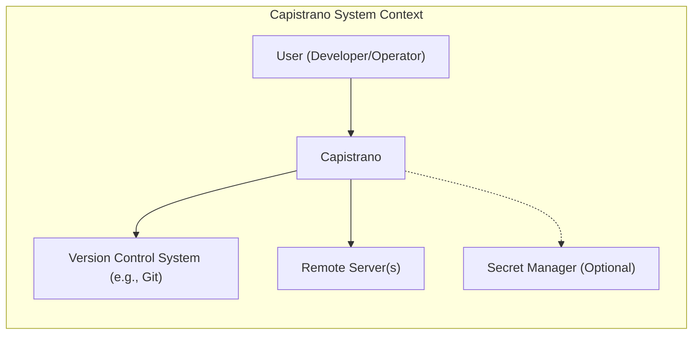
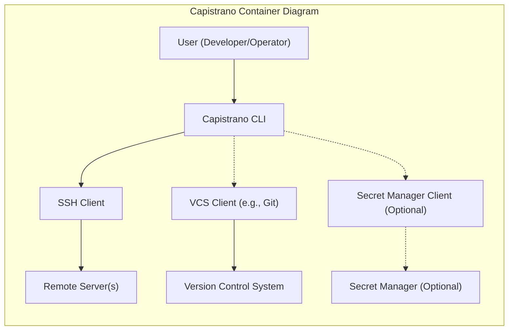
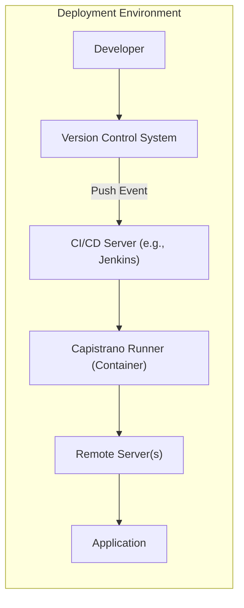
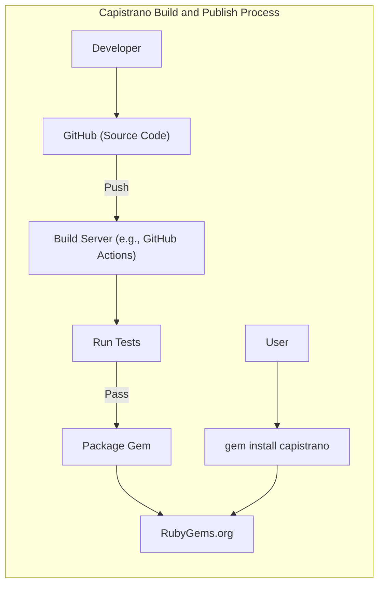

Okay, let's create a design document for the Capistrano project, keeping in mind its purpose and potential security considerations.

# BUSINESS POSTURE

Capistrano is a remote server automation tool. It's primarily used for deploying web applications, automating tasks, and managing servers.  The business priorities and goals revolve around:

*   Reliability:  Ensuring deployments are consistent and repeatable, minimizing downtime.
*   Efficiency:  Automating deployment processes to save developer time and reduce manual errors.
*   Maintainability:  Providing a clear and understandable structure for managing deployments across multiple servers and environments.
*   Extensibility: Allowing users to customize and extend the tool to fit their specific needs and workflows.
*   Security: Protecting sensitive information (like server credentials) and ensuring the integrity of the deployment process.

Business risks that need to be addressed:

*   Unauthorized Access:  Preventing unauthorized users from accessing servers or deploying code.
*   Data Breaches:  Protecting sensitive data (credentials, configuration files) from being exposed.
*   Deployment Failures:  Minimizing the risk of failed deployments that could lead to downtime or data loss.
*   Supply Chain Attacks: Ensuring the integrity of the Capistrano tool itself and its dependencies.
*   Configuration Errors:  Preventing misconfigurations that could lead to security vulnerabilities or operational issues.
*   Lack of Auditability: Ensuring that all deployment actions are logged and traceable.

# SECURITY POSTURE

Existing security controls (based on the GitHub repository and common practices):

*   security control: SSH Key-Based Authentication: Capistrano relies heavily on SSH for secure communication with remote servers. This is typically configured using SSH keys, which are more secure than passwords. Implemented in Capistrano's core SSH handling.
*   security control: Role-Based Access Control (RBAC): Capistrano allows users to define roles (e.g., `web`, `app`, `db`) and assign servers to those roles. This helps limit access based on the principle of least privilege. Implemented through Capistrano's configuration files (e.g., `deploy.rb`).
*   security control: Limited Server Access:  Best practices dictate that servers should only be accessible from specific IP addresses (e.g., a bastion host or VPN). This is an external control, managed at the network level (firewalls, security groups).
*   security control: Encrypted Connections: SSH provides encrypted communication channels, protecting data in transit. Implemented in Capistrano's core SSH handling.
*   security control: Version Control Integration: Capistrano integrates with version control systems (like Git), ensuring that deployments are based on tracked and auditable code changes. Implemented in Capistrano's core deployment logic.

Accepted risks:

*   accepted risk: Dependency Vulnerabilities: Capistrano, like any software, may have dependencies with potential vulnerabilities. Regular updates and vulnerability scanning are crucial.
*   accepted risk: User Configuration Errors:  Capistrano's flexibility means users can introduce security vulnerabilities through misconfiguration.  Proper training and documentation are essential.
*   accepted risk: Limited Built-in Secret Management: Capistrano itself doesn't have robust built-in secret management. It relies on users to securely manage credentials (e.g., using environment variables, SSH agent forwarding, or external secret management tools).

Recommended security controls (high priority):

*   security control: Integrate with a Secrets Management Solution:  Recommend integrating with a dedicated secrets management solution (e.g., HashiCorp Vault, AWS Secrets Manager, Azure Key Vault) to securely store and retrieve credentials.
*   security control: Implement Multi-Factor Authentication (MFA) for SSH:  Encourage users to enable MFA for SSH access to their servers, adding an extra layer of security.
*   security control: Implement robust logging and monitoring: Capture detailed logs of all Capistrano actions, including deployments, rollbacks, and configuration changes. Integrate with a monitoring system to detect and alert on suspicious activity.
*   security control: Regularly audit server configurations: Conduct regular security audits of server configurations to identify and remediate vulnerabilities.

Security Requirements:

*   Authentication:
    *   All connections to remote servers must be authenticated using SSH keys.
    *   Password-based authentication should be disabled on production servers.
    *   Consider recommending or supporting SSH certificates for enhanced security and manageability.

*   Authorization:
    *   Access to servers and deployment tasks should be controlled using the principle of least privilege.
    *   Roles should be defined to restrict access based on job responsibilities.

*   Input Validation:
    *   All user-provided input (e.g., configuration variables, task parameters) should be validated to prevent injection attacks.
    *   Capistrano itself should validate its configuration files to prevent errors.

*   Cryptography:
    *   SSH is used for all remote communication, ensuring data is encrypted in transit.
    *   Sensitive data at rest (e.g., on servers) should be encrypted if required by compliance or security policies.

# DESIGN

## C4 CONTEXT

Element Descriptions:

*   Element:
    *   Name: User (Developer/Operator)
    *   Type: Person
    *   Description: The person initiating deployments and managing servers using Capistrano.
    *   Responsibilities:
        *   Configuring Capistrano.
        *   Initiating deployments.
        *   Managing server access.
        *   Monitoring deployment progress.
    *   Security controls:
        *   Strong passwords or SSH keys for accessing development environments.
        *   Multi-factor authentication for accessing critical systems.

*   Element:
    *   Name: Capistrano
    *   Type: Software System
    *   Description: The remote server automation and deployment tool.
    *   Responsibilities:
        *   Connecting to remote servers via SSH.
        *   Executing commands on remote servers.
        *   Managing deployment workflows.
        *   Fetching code from version control.
    *   Security controls:
        *   SSH key-based authentication.
        *   Role-based access control.
        *   Encrypted communication via SSH.

*   Element:
    *   Name: Version Control System (e.g., Git)
    *   Type: Software System
    *   Description: The system storing the application code and deployment scripts.
    *   Responsibilities:
        *   Storing code history.
        *   Providing access to specific code versions.
        *   Tracking changes to code and configuration.
    *   Security controls:
        *   Access control lists (ACLs) to restrict access to repositories.
        *   Branch protection rules.
        *   Code review processes.

*   Element:
    *   Name: Remote Server(s)
    *   Type: Software System
    *   Description: The servers where the application is deployed and runs.
    *   Responsibilities:
        *   Running the application code.
        *   Serving requests.
        *   Storing application data.
    *   Security controls:
        *   Firewall rules to restrict network access.
        *   Regular security updates and patching.
        *   Intrusion detection and prevention systems.
        *   Secure configuration (e.g., disabling unnecessary services).

*   Element:
    *   Name: Secret Manager (Optional)
    *   Type: Software System
    *   Description: A system for securely storing and managing secrets (e.g., API keys, database credentials).
    *   Responsibilities:
        *   Storing secrets securely.
        *   Providing access to secrets to authorized applications.
        *   Auditing access to secrets.
    *   Security controls:
        *   Encryption of secrets at rest and in transit.
        *   Access control policies.
        *   Audit logging.

## C4 CONTAINER

Since Capistrano is a relatively simple tool from an architectural perspective (it's a command-line tool that executes scripts), the Container diagram is very similar to the Context diagram.  The main "container" is the Capistrano application itself.

Element Descriptions:

*   Element:
    *   Name: User (Developer/Operator)
    *   Type: Person
    *   Description:  Same as in the Context diagram.
    *   Responsibilities: Same as in the Context diagram.
    *   Security controls: Same as in the Context diagram.

*   Element:
    *   Name: Capistrano CLI
    *   Type: Application
    *   Description: The command-line interface for interacting with Capistrano.
    *   Responsibilities:
        *   Parsing user commands and options.
        *   Loading configuration files.
        *   Initiating SSH connections.
        *   Executing deployment tasks.
    *   Security controls:
        *   Input validation.

*   Element:
    *   Name: SSH Client
    *   Type: Library/Component
    *   Description: The library used by Capistrano to establish SSH connections.
    *   Responsibilities:
        *   Establishing secure SSH connections.
        *   Authenticating with remote servers.
        *   Executing commands remotely.
    *   Security controls:
        *   SSH key-based authentication.
        *   Encrypted communication.

*   Element:
    *   Name: Remote Server(s)
    *   Type: Software System
    *   Description: Same as in the Context diagram.
    *   Responsibilities: Same as in the Context diagram.
    *   Security controls: Same as in the Context diagram.

*   Element:
    *   Name: VCS Client (e.g., Git)
    *   Type: Library/Component
    *   Description: The library/tool used to interact with the version control system.
    *   Responsibilities:
        *   Cloning repositories.
        *   Checking out specific branches or tags.
        *   Fetching updates.
    *   Security controls:
        *   Secure communication with the VCS (e.g., HTTPS or SSH).

*   Element:
    *   Name: Version Control System
    *   Type: Software System
    *   Description: Same as in the Context diagram.
    *   Responsibilities: Same as in the Context diagram.
    *   Security controls: Same as in the Context diagram.

*   Element:
    *   Name: Secret Manager Client (Optional)
    *   Type: Library/Component
    *   Description: The library used to interact with the secret manager.
    *   Responsibilities:
        *   Retrieving secrets from the secret manager.
    *   Security controls:
        *   Secure communication with the secret manager.
        *   Authentication with the secret manager.

*   Element:
    *   Name: Secret Manager (Optional)
    *   Type: Software System
    *   Description: Same as in the Context diagram.
    *   Responsibilities: Same as in the Context diagram.
    *   Security controls: Same as in the Context diagram.

## DEPLOYMENT

Capistrano itself is not "deployed" in the traditional sense; it's a tool installed on the user's machine (developer's workstation or a CI/CD server). However, it *manages* the deployment of applications to remote servers.  Here are a few possible deployment architectures:

1.  **Direct Deployment from Developer Machine:** Simplest setup, but least secure. Developer runs Capistrano commands directly from their workstation.
2.  **Deployment from a Bastion Host:**  More secure.  A dedicated, hardened server (bastion host) is used to run Capistrano and access the production servers.
3.  **Deployment from a CI/CD Pipeline:**  Most secure and automated.  Capistrano is integrated into a CI/CD pipeline (e.g., Jenkins, GitLab CI, GitHub Actions) that triggers deployments automatically.

We'll describe the **CI/CD Pipeline** deployment in detail, as it's the recommended approach for production environments:

Element Descriptions:

*   Element:
    *   Name: Developer
    *   Type: Person
    *   Description: Same as in previous diagrams.
    *   Responsibilities: Same as in previous diagrams.
    *   Security controls: Same as in previous diagrams.

*   Element:
    *   Name: VCS (Version Control System)
    *   Type: Software System
    *   Description: Same as in previous diagrams.
    *   Responsibilities: Same as in previous diagrams.
    *   Security controls: Same as in previous diagrams.

*   Element:
    *   Name: CI/CD Server (e.g., Jenkins)
    *   Type: Software System
    *   Description: The server that automates the build, test, and deployment process.
    *   Responsibilities:
        *   Monitoring the VCS for changes.
        *   Running build and test scripts.
        *   Triggering deployments via Capistrano.
    *   Security controls:
        *   Access control to the CI/CD server.
        *   Secure storage of credentials.
        *   Auditing of all CI/CD actions.

*   Element:
    *   Name: Capistrano Runner (Container)
    *   Type: Container
    *   Description: A containerized environment where Capistrano is executed. This provides isolation and consistency.
    *   Responsibilities:
        *   Running Capistrano commands.
        *   Connecting to remote servers.
    *   Security controls:
        *   Minimal base image to reduce attack surface.
        *   Regularly updated container image.
        *   Securely configured SSH client.

*   Element:
    *   Name: Remote Server(s)
    *   Type: Software System
    *   Description: Same as in previous diagrams.
    *   Responsibilities: Same as in previous diagrams.
    *   Security controls: Same as in previous diagrams.

*   Element:
    *   Name: Application
    *   Type: Software System
    *   Description: The application being deployed.
    *   Responsibilities: Serving user requests.
    *   Security controls: Application-specific security controls (e.g., input validation, output encoding, authentication, authorization).

## BUILD

Capistrano itself is a Ruby gem. The build process typically involves:

1.  **Development:** Developers write code and tests for Capistrano.
2.  **Testing:** Automated tests (unit tests, integration tests) are run to ensure code quality.
3.  **Packaging:** The code is packaged into a Ruby gem.
4.  **Publishing:** The gem is published to a gem repository (e.g., RubyGems.org).

From a user's perspective (installing Capistrano), the process is:

1.  **Installation:** The user installs Capistrano using the `gem install capistrano` command. This downloads the gem and its dependencies from RubyGems.org.

Security Controls in the Build Process:

*   security control: Code Review: All code changes should be reviewed by another developer before being merged.
*   security control: Automated Testing: Comprehensive automated tests help prevent vulnerabilities from being introduced.
*   security control: Dependency Management: Regularly update dependencies and scan for known vulnerabilities. Tools like Bundler and Dependabot can help with this.
*   security control: Secure Gem Publishing: Use a secure API key to publish gems to RubyGems.org.
*   security control: Signed Gems: Consider signing the gem to ensure its integrity.

# RISK ASSESSMENT

*   Critical Business Processes:
    *   Application Deployment: The core process is deploying applications reliably and efficiently.
    *   Server Management: Automating server tasks and maintaining server configurations.

*   Data to Protect:
    *   Server Credentials (SSH keys, passwords): Highly sensitive. Compromise could lead to unauthorized access to servers.
    *   Application Code:  Potentially sensitive, depending on the application.  Could contain intellectual property or vulnerabilities.
    *   Configuration Files:  May contain sensitive information like API keys, database credentials, or environment-specific settings.
    *   Deployment Logs:  May contain sensitive information about the deployment process and server configurations.

Data Sensitivity:

*   Server Credentials:  Highest sensitivity.
*   Application Code:  Variable sensitivity, depending on the application.
*   Configuration Files:  High sensitivity.
*   Deployment Logs:  Moderate to high sensitivity.

# QUESTIONS & ASSUMPTIONS

*   Questions:
    *   What specific compliance requirements (e.g., PCI DSS, HIPAA) apply to the applications being deployed with Capistrano?
    *   What is the existing infrastructure for secret management?
    *   What is the level of security expertise of the users who will be configuring and using Capistrano?
    *   What are the specific threat models for the applications being deployed?
    *   Are there any existing security policies or guidelines that need to be followed?

*   Assumptions:
    *   BUSINESS POSTURE: We assume a moderate risk appetite, balancing the need for rapid deployment with the need for security.
    *   SECURITY POSTURE: We assume that basic security practices (like SSH key-based authentication) are already in place. We assume users have some familiarity with security concepts.
    *   DESIGN: We assume a standard deployment architecture (e.g., web servers, application servers, database servers). We assume the use of a version control system like Git. We assume that network-level security controls (firewalls, security groups) are managed separately.