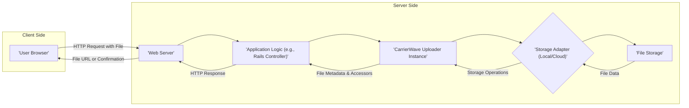
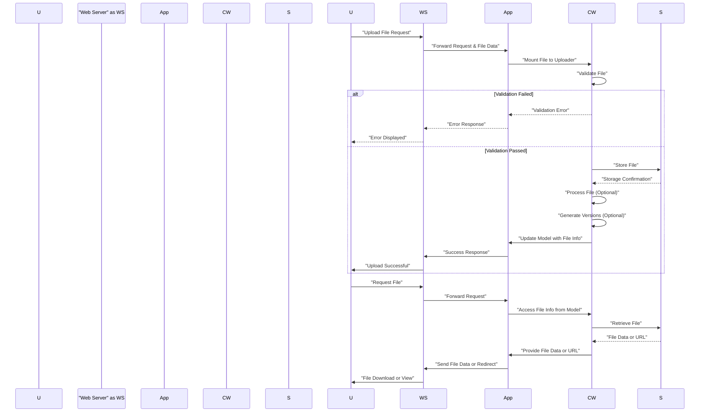

# Project Design Document: CarrierWave File Upload Library

**Version:** 1.1
**Date:** October 26, 2023
**Author:** AI Software Architect

## 1. Introduction

This document provides an enhanced and detailed design overview of the CarrierWave file upload library for Ruby. It aims to clearly articulate the architecture, components, and data flow within the library, providing a robust foundation for subsequent threat modeling activities.

CarrierWave is a versatile and widely-used Ruby gem designed to simplify file uploads in web applications. It offers a clean and intuitive API for managing file storage, processing, and retrieval, supporting a variety of storage backends ranging from local file systems to various cloud storage services.

## 2. Goals

*   Present a comprehensive and easily understandable architectural overview of CarrierWave.
*   Clearly define the roles and interactions of the key components within the library.
*   Illustrate the data flow during both file upload and retrieval processes with enhanced clarity.
*   Pinpoint specific areas of interest for security analysis and targeted threat modeling exercises.
*   Serve as a definitive reference document for developers, security professionals, and anyone seeking a deep understanding of CarrierWave's design.

## 3. Scope

This document encompasses the core functionalities of CarrierWave, including:

*   Handling file uploads originating from web requests.
*   Managing file storage operations across various local and remote systems.
*   Facilitating file processing and manipulation tasks.
*   Enabling efficient file retrieval mechanisms.
*   Providing a range of configuration and customization options.

This document explicitly excludes:

*   In-depth implementation specifics of individual storage adapter gems (e.g., the internal workings of `aws-sdk-s3` or `google-cloud-storage`).
*   The intricate details of the underlying web frameworks that utilize CarrierWave (e.g., the request handling pipeline in Rails or Sinatra).
*   The user interface elements and client-side scripting involved in the file upload process.

## 4. High-Level Architecture

**Description:**

*   The `'User Browser'` initiates the file upload process.
*   The `'Web Server'` receives the incoming HTTP request containing the file data.
*   The `'Application Logic (e.g., Rails Controller)'` processes the request and interacts with CarrierWave.
*   A `'CarrierWave Uploader Instance'` is instantiated to manage the lifecycle of the uploaded file.
*   The `'Storage Adapter (Local/Cloud)'` acts as an intermediary, communicating with the underlying file storage system.
*   `'File Storage'` represents the actual location where the uploaded file is persisted.

## 5. Detailed Design

### 5.1. Key Components

*   **`Uploader Class`**: This is the core component where the application defines how file uploads are handled. It specifies:
    *   `Storage Location`:  Determines where the files will be stored (e.g., local directory, S3 bucket).
    *   `Allowed File Types`: Restricts the types of files that can be uploaded based on MIME type or extension.
    *   `File Size Limits`: Enforces maximum file size constraints to prevent abuse and resource exhaustion.
    *   `Processing Steps`: Defines operations to be performed on the uploaded file after storage (e.g., image resizing, watermarking).
    *   `Version Definitions`: Allows for generating different renditions of the uploaded file (e.g., thumbnails, optimized versions) with their own processing steps.
*   **`Storage Adapters`**: These provide an abstraction layer, enabling CarrierWave to interact with various storage backends without requiring significant code changes. Key examples include:
    *   `CarrierWave::Storage::File`:  For storing files directly on the local file system of the server.
    *   `CarrierWave::Storage::Fog`: A popular adapter that leverages the `fog` gem to support numerous cloud storage providers like AWS S3, Google Cloud Storage, Azure Blob Storage, and more.
    *   Custom Storage Adapters: Developers can create their own adapters to integrate with proprietary or less common storage solutions.
*   **`Mounting`**: CarrierWave is typically "mounted" onto a specific attribute of a model within an Object-Relational Mapper (ORM) like ActiveRecord in Rails or Mongoid in MongoDB. This establishes a clear association between the model's data and the uploaded file.
*   **`Processors`**: These are methods defined within the uploader class that execute specific transformations or manipulations on the uploaded file after it has been successfully stored. Examples include image resizing using gems like `mini_magick` or `ruby-vips`, or format conversions.
*   **`Versions`**: This feature allows developers to define and generate different variations of the original uploaded file. Each version can have its own set of processors applied and can be stored in a different location or with different settings.
*   **`Downloaders`**: This component enables CarrierWave to fetch files from remote URLs instead of relying solely on direct user uploads. This is useful for scenarios where files need to be processed from external sources.
*   **`Configuration`**: CarrierWave offers extensive configuration options, which can be set globally or on a per-uploader basis, to customize its behavior. This includes:
    *   `Storage Directory`:  Specifying the base directory for local file storage.
    *   `Permissions`: Setting file system permissions for uploaded files.
    *   `Filename Sanitization Strategies`: Defining how uploaded filenames are cleaned and normalized to prevent issues.
    *   `Storage Provider Credentials`:  Configuring authentication details for cloud storage services.

### 5.2. File Upload Flow (Detailed)

1. **`User Initiates Upload`**: The user interacts with a web form, selects a file, and submits the form.
2. **`Web Server Receives Request`**: The web server receives the HTTP POST request, which includes the file data encoded in the request body (typically using `multipart/form-data`).
3. **`Application Logic Handles Request`**: The application's controller action receives the request and instantiates or retrieves the relevant model instance.
4. **`CarrierWave Uploader Invoked`**: The uploaded file data is assigned to the model attribute that is mounted with the CarrierWave uploader. This triggers CarrierWave's processing logic.
5. **`File Validation`**: The uploader performs a series of validation checks based on the rules defined in the uploader class (e.g., checking the file's MIME type against the allowed types, verifying the file size against the defined limits).
6. **`Storage Adapter Interaction`**: If the validation passes, the uploader utilizes the configured storage adapter to save the file to the designated storage location. This involves writing the file data to the local file system or uploading it to a cloud storage service.
7. **`File Processing (Optional)`**: If any processors are defined in the uploader class, they are executed sequentially on the newly stored file.
8. **`Version Generation (Optional)`**: If versions are defined, CarrierWave generates each version by applying the specified processors to the original file and storing the resulting versions.
9. **`Model Persistence`**: The model instance is saved to the database. This typically includes storing the path or a unique identifier of the stored file(s) in the mounted attribute.
10. **`Response to User`**: The application sends an HTTP response back to the user's browser, indicating the success or failure of the upload.

### 5.3. File Retrieval Flow (Detailed)

1. **`Application Requests File`**: The application logic needs to access a previously uploaded file, often to display it to a user or process it further.
2. **`Model Access`**: The application retrieves the model instance from the database that contains the CarrierWave-mounted attribute.
3. **`Uploader Access`**: The application accesses the uploader instance associated with the model attribute. This instance holds information about the stored file.
4. **`Storage Adapter Interaction`**: The uploader uses the configured storage adapter to retrieve the file. For local storage, this involves reading the file from the file system. For cloud storage, it involves generating a pre-signed URL or fetching the file data.
5. **`File Served or URL Provided`**: The application can either:
    *   Serve the file data directly in the HTTP response.
    *   Generate and provide a URL that the user's browser can use to directly access the file (this is common for cloud storage where the storage service handles serving the file).

## 6. Data Flow Diagram

## 7. Security Considerations (Actionable for Threat Modeling)

This section outlines specific security considerations that should be thoroughly examined during threat modeling sessions:

*   **File Upload Vulnerabilities:**
    *   **Unrestricted File Type Upload (`STRIDE: Information Disclosure, Denial of Service, Remote Code Execution`)**:  Lack of proper file type validation can allow attackers to upload executable files (e.g., `.php`, `.jsp`, `.py`) which could lead to remote code execution on the server.
        *   **Mitigation:** Implement strict whitelisting of allowed file extensions and MIME types. Verify the file content, not just the extension.
    *   **Filename Manipulation (`STRIDE: Spoofing, Tampering`)**: Attackers might craft malicious filenames (e.g., with directory traversal sequences like `../../`) to overwrite critical system files or bypass access controls.
        *   **Mitigation:** Sanitize filenames by removing or replacing special characters and enforcing a consistent naming convention. Store files using generated, non-predictable names.
    *   **Insufficient File Size Limits (`STRIDE: Denial of Service`)**:  Allowing excessively large file uploads can consume significant server resources (disk space, bandwidth, processing power), leading to denial-of-service.
        *   **Mitigation:** Implement and enforce appropriate file size limits based on application requirements and server capacity.
*   **Storage Security:**
    *   **Publicly Accessible Storage (`STRIDE: Information Disclosure`)**: Misconfigured cloud storage buckets or local storage directories with incorrect permissions can expose uploaded files to unauthorized access.
        *   **Mitigation:**  Implement the principle of least privilege for storage access. Use private buckets and generate pre-signed URLs with limited validity for controlled access. Ensure proper file system permissions are set.
    *   **Insecure Permissions on Stored Files (`STRIDE: Information Disclosure, Tampering, Denial of Service`)**:  Overly permissive file system permissions can allow unauthorized modification or deletion of uploaded files.
        *   **Mitigation:**  Apply restrictive file system permissions, ensuring only the necessary processes have read/write access.
*   **File Processing Vulnerabilities:**
    *   **Image Processing Exploits (`STRIDE: Denial of Service, Remote Code Execution`)**: Vulnerabilities in image processing libraries (e.g., ImageMagick) can be exploited by uploading specially crafted image files.
        *   **Mitigation:** Keep image processing libraries up-to-date with the latest security patches. Consider using safer alternatives or sandboxing the processing environment.
    *   **Command Injection during Processing (`STRIDE: Remote Code Execution`)**: If file processing involves executing external commands, inadequate sanitization of input derived from the uploaded file can lead to command injection vulnerabilities.
        *   **Mitigation:** Avoid executing external commands directly on user-provided data. If necessary, use parameterized commands or secure libraries that prevent injection.
*   **Access Control:**
    *   **Missing Authorization Checks (`STRIDE: Unauthorized Access`)**:  Failing to verify if the current user has the necessary permissions to upload, access, or delete specific files.
        *   **Mitigation:** Implement robust authorization mechanisms to control access to file upload and retrieval functionalities based on user roles and permissions.
    *   **Weak Authentication (`STRIDE: Spoofing, Unauthorized Access`)**:  Compromised user credentials can allow attackers to perform unauthorized file operations.
        *   **Mitigation:** Enforce strong password policies, use multi-factor authentication, and protect user session management.
*   **Data Integrity:**
    *   **File Corruption (`STRIDE: Tampering, Denial of Service`)**: Ensuring that files are not corrupted during the upload, storage, or retrieval process due to network issues or software bugs.
        *   **Mitigation:** Implement checksum verification during upload and download to detect and handle file corruption.
    *   **Tampering (`STRIDE: Tampering`)**: Preventing unauthorized modification of uploaded files after they have been stored.
        *   **Mitigation:** Implement file integrity monitoring and consider using immutable storage solutions where appropriate.
*   **Dependency Vulnerabilities (`STRIDE: Various`)**: Using outdated versions of CarrierWave or its dependencies with known security vulnerabilities.
    *   **Mitigation:** Regularly update CarrierWave and all its dependencies to the latest stable versions. Use dependency scanning tools to identify and address vulnerabilities.
*   **Metadata Security (`STRIDE: Information Disclosure`)**:  Uploaded files often contain metadata (e.g., EXIF data in images) that might reveal sensitive information about the user or the environment.
    *   **Mitigation:**  Implement mechanisms to strip or sanitize metadata from uploaded files before storage or serving.

## 8. Dependencies

*   Ruby (programming language)
*   A web framework (e.g., Rails, Sinatra, Hanami) to handle web requests and application logic.
*   A storage adapter gem (e.g., `fog-aws`, `google-cloud-storage`, `azure-storage-blob`) depending on the chosen storage backend.
*   Optionally, image processing libraries (e.g., `mini_magick`, `ruby-vips`) if image manipulation is required.

## 9. Deployment Considerations

*   **Storage Backend Configuration**:  Securely configure the chosen storage backend, including setting up appropriate access policies, encryption at rest and in transit, and network configurations.
*   **Environment Variables and Secrets Management**:  Store sensitive credentials for storage backends and other services securely using environment variables or dedicated secrets management solutions (e.g., HashiCorp Vault, AWS Secrets Manager). Avoid hardcoding credentials in the application code.
*   **Load Balancing**: For applications with high file upload traffic, utilize load balancers to distribute requests across multiple servers, ensuring scalability and resilience.
*   **CDN Integration**: Integrate with a Content Delivery Network (CDN) to efficiently serve uploaded files to users, improving performance and reducing load on the application servers.
*   **Regular Security Audits**: Conduct regular security audits and penetration testing to identify and address potential vulnerabilities in the file upload and storage infrastructure.

## 10. Future Considerations

*   **Enhanced Error Handling and Logging**: Implement more detailed and informative error handling and logging mechanisms for file upload failures and storage-related issues to aid in debugging and monitoring.
*   **Asynchronous Processing Enhancements**:  Further optimize asynchronous file processing using background job queues (e.g., Sidekiq, Resque) to improve responsiveness and handle resource-intensive tasks efficiently.
*   **Advanced Security Features Integration**: Explore integration with security scanning tools for automated vulnerability detection in uploaded files. Consider implementing more granular access control mechanisms based on file ownership or other attributes.
*   **Pluggable Validation Framework**:  Consider making the validation framework more pluggable, allowing developers to easily integrate custom validation logic.

This improved design document provides a more comprehensive and actionable overview of the CarrierWave library, specifically tailored for effective threat modeling. By understanding the intricacies of its architecture, data flow, and potential security vulnerabilities, development and security teams can collaborate to build more secure and robust applications.